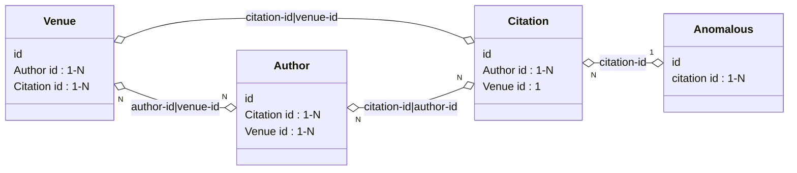
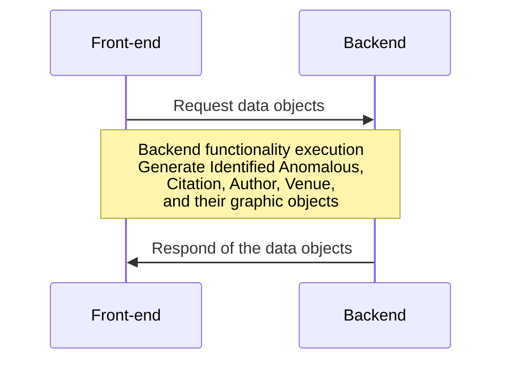

## The Data Objects and API instruction of the Research Reviewer Project

This document describes how the ReviewerAPP front-end interface communicates with the backend services through a series of APIs.

### The main data objects we focus

There are **four** major objects that will be requested from the backend services, all these objects should be wrapped in **JSON** formats:

- **Citation :** contains the **citation objects**, there are 2-hop of citation paper information will be collected:
    - hop-1: Papers under the *Reference Section* in the reviewing paper
    - hop-2: The Citations from the reference sections of the hop-1 papers

- **Author :** each citation has 1~N (N>=1) authors, all the authors information are arranged as the **author objects**

- **Venue :** each citation has been published to a venue which can be a Journal, Conference, or a book. All venues are arranged as the **venue objects**

- **Anomalous :** the **Anomalous objects** contain the detected potential anomalies. There are two types of anomalies with sub-categories:
    - **_Citation anomaly_**:
      - Retracted paper
      - Low citation relevance (two potential causes below)
        - Citation cartel
        - Self-citation (spatial citation ring case)
    - **_Statistical anomaly_**:
      - Statistical testing failure
      - Inconsistant value reference(s) in the content


### The definition of data objects

##### 1. "Detected Anomalous" Json Object List
```json
{
  "identifiedIssue": [ // Array<anomalous-obj>
    {
      "id": "issue-0", // <string> anomalous ID, serves as the primary KEY linked to other objects
      "name": "citation", // <string> citation / statistic / other
      "displayName": "Citation Anomaly", // <string> Citation Anomaly / Statistical Anomaly / Other
      "category": { // <null / Dict> the sub-category of the anomalous, set null if we have "other"
        "name": "lowRelevancy", // <string> If citation: lowRelevancy / retractedPaper. If statistic: testFailure / valueInconsistency
        "displayName": "Low Relevancy", // <string> the readable name on the interface
        "children": { // only for citation lowRelevancy
          "name": "citationRing", // <string> citationRing / selfCitation
          "displayName": "Citation Ring" // <string> the readable name on the interface
        }
      },
      "paper": ["citation-1", "citation-2"], // Array<citation-obj>, external KEY linked to citation id. id(s) for the target citations (the bbox coordinates will be aligned with each citation object)
      "explanation": "some explanations generated by the LLM agent.", // <string> Explanations generated by LLMs
      "page": 1, // <int> the pape on paper PDF for this issue
      "section": "Introduction", // <string> the section in the paper this issue is identified
      "sentence": [ // Array<string> The sentences related to the detected issue, breaked based on lines in the PDF
       {
          "sentence": "neural networks",
          "bbox": {
            "height": 0.011994949494949494,
            "width": 0.41175980392156863,
            "x": 0.0784313725490196,
            "y": 0.6362070707070708
          }
        },
        {
          "sentence": "data, where millions of images are labeled to train the deep",
          "bbox": {
            "height": 0.011994949494949494,
            "width": 0.4117598039215685,
            "x": 0.0784313725490196,
            "y": 0.6216363636363638
          }
        },
        {
          "sentence":  "often hinges on the availability of a large number of labeled",
          "bbox": {
            "height": 0.011994949494949494,
            "width": 0.41175980392156863,
            "x": 0.0784313725490196,
            "y": 0.6070656565656566
          }
        },
        {
          "sentence":  "The success of deep learning",
          "bbox": {
            "height": 0.011994949494949494,
            "width": 0.4117598039215684,
            "x": 0.0784313725490196,
            "y": 0.5924949494949495
          }
        }
      ]
    },
    // Append other detected anomalous object
  ]
}
```

##### 2. "Citation" Json Object List
```json
{
  "citations": [ //Array<citation-obj>
    {
      "id": "citation-1", // <string>, citation ID, serves as the primary KEY linked to other objects
      "cite_number": 1, // <int> citation's reference number
      "author": [ // List<string> external KEY linked to authors' id in Author object list
        "author-0",
        "author-1"
      ],
      "venue": "venue-0", // <string> external KEY linked to venue's id in Venue object list
      "year": 2008, // <int> publish year
      "title": "paper title", // <string> paper title
      "source": "A. Krizhevsky, I. Sutskever, and G. E. Hinton, “Imagenet classification with deep convolutional neural networks,” in Advances in neural information processing systems, 2012, pp. 1097–1105.", // <string> original reference text in the Reference Section of the paper
      "doi": "doi link", // <string> DOI link for the paper
      "hop": 1, // <int> hop 1 for the citations belong to the reviewing paper, hop 2 are citations of the hop-1 papers
      "cite_positions": [ // bounding-box information for the citation position in the paper
        {
          "page": 1, // <int> page of the citation
          "has_issue": true, // <boolean> if there is a detected issue
          "issues": ["issue-0"], // List<anomalous obj> a list of external KEYs linked to the anomolous objects. Usually there will be only one issue in this list
          "bbox": { // the bounding-box coordinates, remember to flip the Y-axis and normalize the coordinates [0 to 1]. Refer to my message in Slack chat on Feb.5
            "x": 0.1952340267073355,
            "y": 0.6368908352322049,
            "width": 0.020587995317247174,
            "height": 0.014705773555871212
          }
        }
      ],
      "has_issue": true, // <boolean> if there is a detected issue
      "citation_graph": [ // a list of citation graph objects id(s) which link to the citation_graph object
        "citation-graph-0"
      ]
    },
    // Append other citation objects
  ]
}
```

##### 3. "Author" Json Object List
```json
{
  "authors": [ //Array<author-obj> 
    {
      "id": "author-0", // <string> author ID, serves as the primary KEY linked to other objects
      "raw_name": "F. Lei", // <string> original author name in the citation
      "standardized_name": "Fan Lei", // <string> the standardized author name
      "openalex_link": "https://openalex.org/authors/A5100373606", // <string|null> openalex link
      "orcid": "https://orcid.org/0000-0003-4244-0971", // <string|null> orcid link
      "citation": ["citation-1"], // <string> external KEY (citation id) linked to the citation object
      "venue": ["venue-0", "venue-3"], // List<string> external KEYs (venue id) linked to the venue object
      "author_graph": ["author-graph-1"] // a list of the author graph objects id(s) as external key linked to the author-graph object
    },
    {
      "id": "author-1",
      "raw_name": "J. Doe",
      "standardized_name": "John Doe",
      "openalex_link": "https://openalex.org/authors/A5100373606",
      "orcid": "https://orcid.org/0000-0003-4244-0971",
      "citation": ["citation-2"],
      "venue": ["venue-1", "venue-3"],
      "author_graph": ["author-graph-1"]
    },
    {
      "id": "author-2",
      "raw_name": "F. Lastname",
      "standardized_name": "Firstname Lastname",
      "openalex_link": "https://openalex.org/authors/A5100373606",
      "orcid": "https://orcid.org/0000-0003-4244-0971",
      "citation": ["citation-3", "citation-2"],
      "venue": ["venue-2", "venue-3"],
      "author_graph": ["author-graph-1"]
    },
    // Append other author objects
  ]
}
```

##### 4. "Venue" Json Object List
```json
{
  "venues": [ // Array<venue-obj>
    {
      "id": "venue-0", // <string> venue ID, serves as the primary KEY linked to other objects
      "type": "Journal", // <string> venue type, Journal | Conference | Book
      "raw_name": ["TVCG", "IEEE Transactions on Visualization and Computer Graphics"], // List<string> venue name appears at the reference list
      "short": "TVCG", // <string> Venue's short name
      "standardized_name": "IEEE Transactions on Visualization and Computer Graphics", // <string> venue's standardized name
      "year": ["2008", "2012", "2023"], // List<string> year(s) of this venue appears in the reference list
      "author": ["author-0"], // List<string> authors published in this venue, external KEY linked to author objects with author IDs
      "citation": ["citation-1"], // List<string> citations published in this venue, external KEY linked to citation objects with citation IDs
      "venue_graph": ["venue-graph-0"] // a list of the venue graph objects id(s) as external key linked to the venue-graph object
    },
    {
      "id": "venue-1",
      "type": "Conference",
      "raw_name": ["CHI", "ACM Conference on Human Factors in Computing Systems"],
      "short": "CHI",
      "standardized_name": "ACM Conference on Human Factors in Computing Systems",
      "year": ["2008", "2012", "2023"],
      "author": ["author-1"],
      "citation": ["citation-2"],
      "venue_graph": ["venue-graph-0"]
    },
     // Append other venue objects
  ]
}
```

### The Relationships between data objects
The four dta objects (**1. Anomalous** **2. Citation** **3. Author** **4. Venue**) are linked with each other by their IDs.
- An Citation may have 1-N author(s) and 1 venue
- An author may have 1-N citation(s) and venue(s)
- A venue may have 1-N citation(s) and author(s)


### The working pipeline



### The API format:
We have two choices for the API requests
1. One API to wrap up all 4 data objects (recommend)
e.g. `\getProcessedData` in a flask server

2. Four APIs, each for one data object
e.g. `\getAnomalous`, `\getAuthor`, `\getCitation`, `\getVenue`, etc.