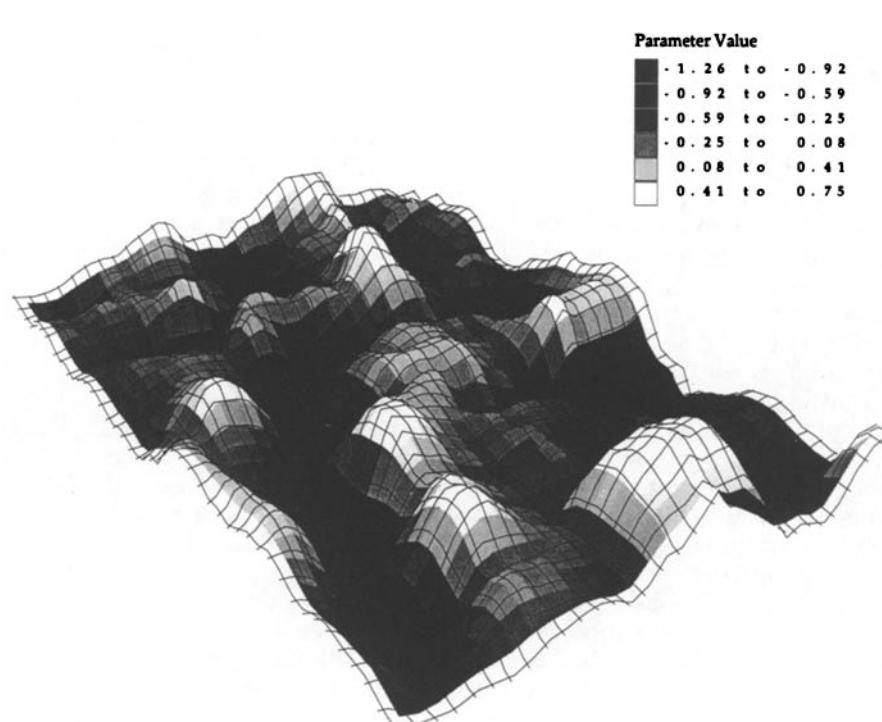
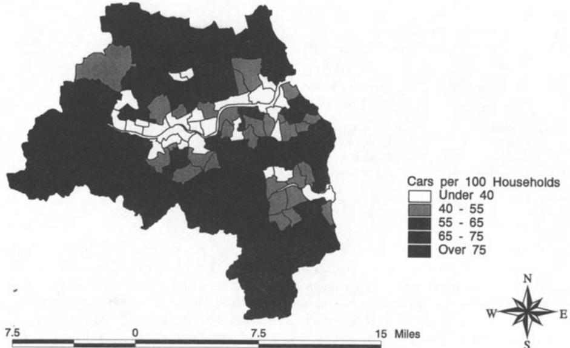
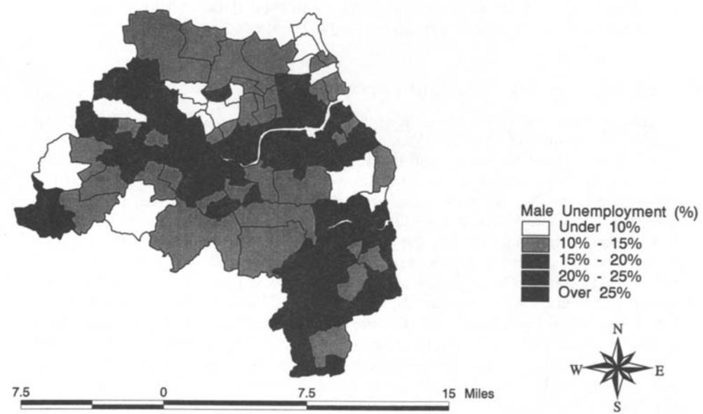
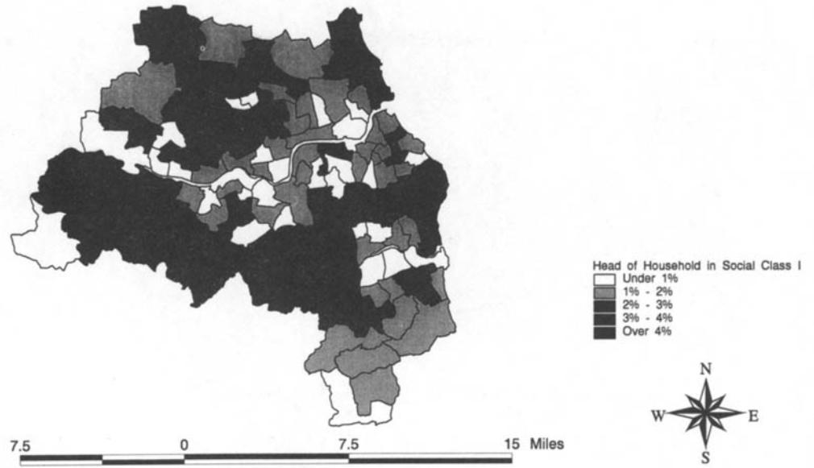
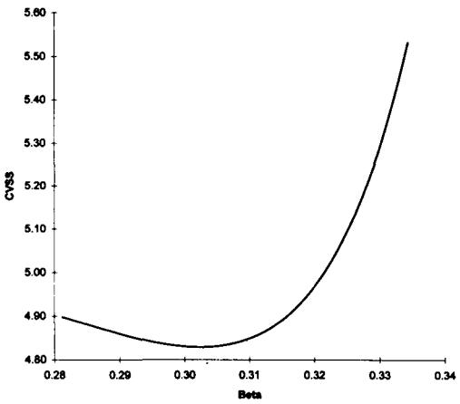
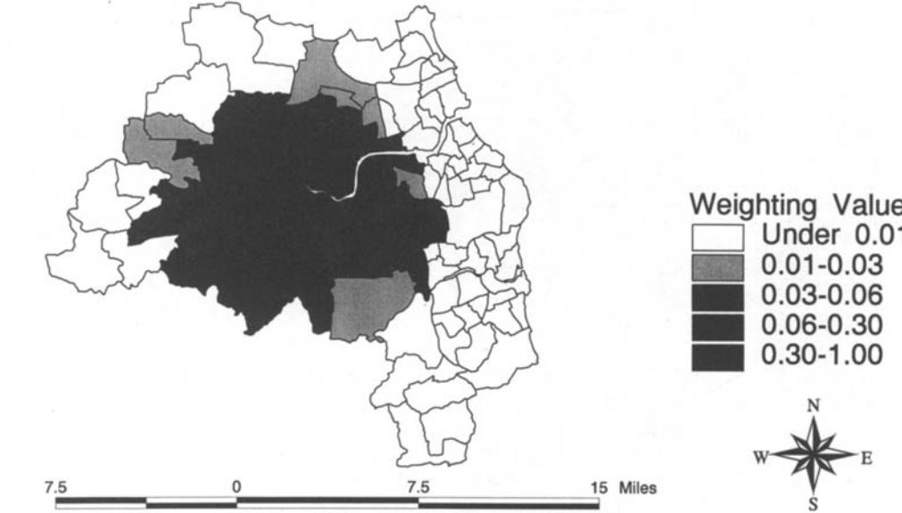
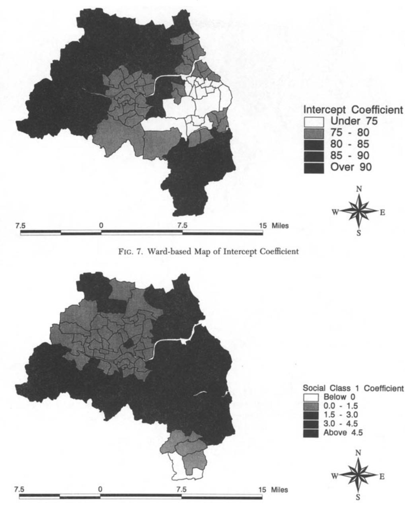
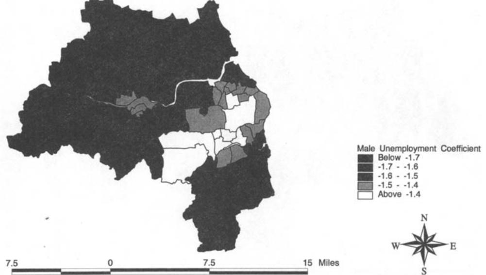
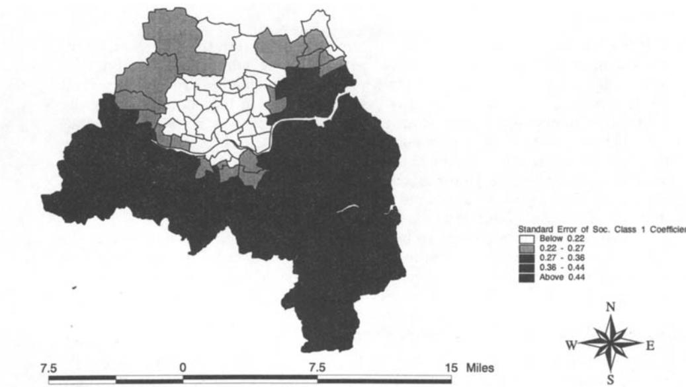

## *Chris Brunsdon,* **A.** *Stewart Fotheringham and Martin E. Charlton*

# *Geographically Weighted Regression:* **A** *Method for Exploring Spatial Nonstationarity*

*Spatial nonstationarity is a condition in which a simple 'global" model cannot explain the relationships between some sets of variables. The nature of the model must alter over space to reflect the structure within the data. In this paper, a technique is developed, termed* geogra hically weighted regression, *model which allows diferent relationships to exist at diferent points in space. This technique is loosely based on kernel regression. The method itself is introduced and related issues such as the choice of a spatial weighting function are discussed. Following this, a series of related statistical tests are considered which can be described generally as tests for spatial nonstationarity. Using Monte Carlo methods, techniques are proposed for investigatin the null non-stationa* **y** *one and also for testing whether individual regression coeficients are stable over geographic space. These techniques are demonstrated on a data set from the 1991 U. K. census relating car ownership rates to social class and mule unemployment. The paper concludes by discussing ways in which the technique can be extended. which attempts to capture this variation by Cali* **E** *rating a multiple regression hypothesis that the data my be described by a global model rat* a *er than a* 

## **1. INTRODUCTION**

-~ ____

One of the main objectives in spatial analysis is to identify the nature of relationships that exist between variables. Typically this is undertaken by calculating statistics or estimating parameters with observations taken from different spatial units across a study area. The resulting statistics or parameter estimates are assumed to be constant across space although this might be a very questionable assumption to make in many circumstances. It seems reasonable to assume that there might be intrinsic differences in relationships over space or that there might be some problem with the specification of the model from which the relationships are being measured and which manifests itself in terms of spatially

*Dr. Chris Brunsdon is lecturer in computer-based methods in the Department of Town and County Planning, A. Stewart Fotheringham* is *Professor of Quantitative Geography, and Martin Charlton* **is** *lecturer in GIS in the Department of Geography, all at Newcastle University.* 

*Geographical Analysis,* **Vol. 28,** *No.* **4 (October 1996)** *0* **1996 Ohio State University Press Submitted 6/7/95. Revised version accepted 2/16/96.** 

varying parameter estimates. In either case it would be useful to have a means of describing and map ing such spatial variations as an exploratory tool for developing a better un **Cf** erstanding of the relationships being studied.

Several techniques already exist for this purpose although we argue that the method we develop in this paper has several important advantages. Perhaps the most well-known framework in which parameter "drift" has been measured is that of Casetti's expansion method (Casetti 1972; Casetti and Jones 1992). In this framework, parameters in a global model can be made functions of geographic space so that *trends* in parameter variation over space can be measured (inter alia, Fotheringham and Pitts 1995; Eldridge and Jones 1991). While this is an important framework in which improved models can be developed, it is a trend-fitting exercise which is of limited use in situations where parameters exhibit complex variation over the space being studied. The method proposed here, that of *geographically weighted regression* (GWR), allows the actual parameters for each location in space to be estimated and mapped **as**  opposed to having a trend surface fitted to them.

The method of spatial adaptive filtering (SAF) has also been proposed to handle spatially varying relationships (Foster and Gorr 1986; Gorr and Olligschlaeger 1994). However, this approach incorporates spatial relationships in a rather ad hoc manner and produces parameter estimates that cannot be tested statistically so that it is of limited applicability.

Two other methods that model spatial variations in parameter estimates are the random coefficients model (Aitken 1996) and multilevel modeling (Goldstein 1987). In both these ap roaches the parameter estimates in regression models are assumed to be ran **dp** om variables. In multilevel modeling, the distribution of the parameter estimates is assumed to be Gaussian, while in the random coefficients model, the parameters are modeled as finite mixture distributions. In either case, by using Bayes' theorem it is possible to obtain an estimate of each parameter although in neither case is any spatial dependency assumed in the parameter estimates which seems unrealistic in models of spatial phenomena. Although geographical variations of multilevel models have been applied (Jones 1991), these rely heavily on an assumed hierarchy of spatial units. While this may be reasonable if the hierarchical nature of the model is reflected well in the process being modeled, in other circumstances a "distance-decay" model of spatial association, such as GWR, may be more appropriate.

#### **2. SPATIAL NONSTATIONARI'N IN A REGRESSION CONTEXT**

A frequently used model in geographical analysis is that of *simple linear regression* (inter aha, Dobson 1990, pp. 68-78). In this technique, a particular variable, the *dependent variable,* is modeled as a linear function of a set of *independent* or *predictor* Variables;

$$y_i \dot{=} a_0 + \sum_{k=1,m} a_k x_{ik} + e_i \tag{1}$$

where *yi* is the ith observation of the dependent variable, *Xik* is the ith observation of the *lcth* independent variable, the **~s** are independent normally distributed error terms with zero means, and each *ak* must be determined from a sample of n observations. Usually the least squares method is used to estimate the *aks.* Using matrix notation this may be expressed **as** 

$$\hat{\mathbf{a}} = (\mathbf{x}^t \mathbf{x})^{-1} \mathbf{x}^t \mathbf{y} \tag{2}$$

where the independent observations are the columns of **x** and the dependent observations are the single column vector *y.** The column vector **ii** contains the coefficient estimates. Each of these estimates can be thought of as a "rate of change" between one of the independent variables and the dependent variable. For example, if *y* were agreed house prices, and **x** contained several variables relating to attributes of the house and its surrounding environment, coefficients could be used to estimate the change in house price for an extra square meter of garden, an extra bedroom, or the house being located one kilometer closer to the nearest school.

It is important to note that these rates of change are assumed to be universal. Wherever a house is located, for example, the mar inal price increase asso-It might be more reasonable to assume that rates of change are determined by local culture or local knowledge, rather than a global utility assumed for each commodity. Returning to the example, the value added for an additional bedroom might be greater in a neighborhood populated by families with children where extra space is likely to be viewed as highly beneficial than in a neighborhood populated by singles or elderly couples, for whom extra space might be viewed as a negative feature. ciated with an additional bedroom is fixed. However, t **a** is may not be the case.

Variations in relationships over space, such as those described above, are referred to as spatial nonstationarity. In a recent paper, Fotheringham, Charlton, and Brunsdon (1996) provide a demonstration of the extent to which regression parameter estimates can vary over space. In their example, a 7 **x** 7 window is placed over every cell in a 50 x 38 matrix which allows placement of the window in such a way that it is completely within the region. At each placement, the data within the window are used to calibrate a regression model so that each cell has a set of parameter estimates associated with it. The parameter estimates can then be mapped to show the extent of spatial variations in estimated relationships. The results show that (a) relationships can vary significantly over space and that a "global" estimate of the relationships may obscure interesting geographical relationships and (b) that the variation over space can be sufficiently complex that it invalidates simple trend-fitting exercises. An example of the type of parameter surface described by Fotheringham, Charlton, and Brunsdon (1996) is shown in Figure 1 for the relationship between population density and elevation in part of northeast Scotland. The surface shows localized parameter estimates obtained from the window regression technique described above in which a multiple linear regression model is calibrated using, in this case, a 7 **x** 7 window. The surface shows a complex surface of parameter values ranging from -1.26 to 0.75. In some parts of the study area, the relationship between population and density and elevation is significantly negative and in other parts it is significantly positive. Although there are interesting "valleys" and "hills" in this parameter surface, it is clearly too complex to be represented by a simple linear or quadratic trend. It does, however, provide interesting insights into how this particular relationship varies over space which can be used to explore aspects of the relationship between the two variables that might not otherwise be investigated.

Although the methodology of Fotheringham, Charlton, and Brunsdon (1996) which is used to generate Figure 1 serves a useful exploratory purpose, it is ad hoc. Hence, it is the purpose of this paper to describe a formal statistical technique, which we term *geographically weighted regression* (GWR), that allows

**For the term a column of 1s must be included in x.** 

**FIG. 1. Elevation Parameter Surface** 

complex spatial variations in parameter estimates to be identified, mapped and modeled.

#### **3. GEOGRAPHICALLY WEIGHTED REGRESSION**

GWR is a relatively simple technique that extends the traditional regression framework of equation (1) by allowing local variations in rates of change so that the coefficients in the model rather than being global estimates are specific to a location *i.* The regression equation is then

$$y_i = a_{i0} + \sum_{k=1,m} a_{ik} x_{ik} + \varepsilon_i \tag{3}$$

where *aik* is the value of the lcth parameter at location *i.* Note that (1) is a special case of (3) in which **all** of the functions are conStants across space. As will be shown below, the point *i* at which estimates of the parameters are obtained is completely generalizable and need not only refer to points at which data are collected. It is very easy with GWR to compute parameter estimates, for instance, for locations that lie between data points, which makes it possible to produce detailed maps of spatial variations in relationships.

Although the model in equation (3) appears to be a simple extension of that in equation **(I),** a problem with calibrating (3) is that the unknown quantities are in fact functions mapping geographical space onto the real line, rather than simple scalars as in **(1).** In a typical data set, samples of the dependent and independent variables are taken at a set of sample points and it is from

these that the parameters must be estimated. In the traditional model, these estimates are constant for all *i* but in equation (3) this is clearly not the case. For model (3), it seems intuitively appealing to base estimates of *aik* on observations taken at sample points close to *i.* If some degree of smoothness of the *aiks* is assumed, then reasonable approximations may be made by considering the relationship between the observed variables in a region geographically close to *i.* 

Using a weighted least squares approach to calibrating regression models, different emphases can be placed on different observations in generating the estimated parameters. In ordinary least squares, the sum of the squared differences of predicted and actual *yis* is minimized by the coefficient estimates. In *weighted* least squares a weighting factor *w,* is applied to each squared difference before minimizing, so that the inaccuracy of some predictions carries more of a penalty than others. If **w** is the diagonal matrix of *wis.* then the estimated coefficients satisfy

$$\tilde{\mathbf{a}} = (\mathbf{x}^t \mathbf{w} \mathbf{x})^{-1} \mathbf{x}^t \mathbf{w} \mathbf{y}. \tag{4}$$

In GWR, weighting an observation in accordance with its proximity to *i* would allow an estimation of *aik* to be made that meets the criterion of "closeness of calibration points" set out above.

Note that usually in weighted regression models the values of *wi* are constant, *so* that only one calibration has to be carried out to obtain a set of coefficient estimates, but in this case **w** varies with **i** so that a different calibration exists for every point in the study area. In this case, the parameter estimation formula could be written more generally as

$$\mathbf{a(i)} = (\mathbf{x}^t \mathbf{w(i)x})^{-1} \mathbf{x}^t \mathbf{w(i)y}.\tag{5}$$

There are parallels between this method and that of *kernel re ression* and 1988; Silverman 1986; Brunsdon 1991, 1995; Wand and Jones 1995, pp. 114- 45). In kernel regression, **y** is modeled as a nonlinear function of **x** by weighted regression, with weights for the ith observation depending on the proximity of **x**  and *x,* for each *i* with the estimator being *kernel density estimation* (Parzen 1962; Cleveland 1979; Clevelan **f** and Devlin

$$\tilde{\mathbf{a}}(\mathbf{x}) = (\mathbf{x}^t \mathbf{w}(\mathbf{x}) \mathbf{x})^{-1} \mathbf{x}^t \mathbf{w}(\mathbf{x}) \mathbf{y}. \tag{6}$$

The essential difference between the two methods is that in (6), kernel regression, the weighting system depends on the location in "attribute space" (Openshaw 1993) of the independent variables, whereas in *(5),* GWR, it depends on location in geographical space. The output from (5) is typically a set of localized parameter estimates in x space so that highly nonlinear and nonmonotonic relationships between **y** and *x* can be modeled. The typical output from (6), however, will be a set of parameter estimates that can be mapped in geographic space to represent nonstationarity or parameter "drift."

## *3.1 Choice of Spatial Weighting Function*

Until this point, it has merely been stated that **w(i)** is a weighting scheme based on the proximity of *i* to the sampling locations around *i* without an

explicit relationship being stated. The choice of such a relationship will be considered here. Firstly, consider the implicit weighting scheme of **(2).** Here

$$w_{ij} = 1 \quad \forall i, j \tag{7}$$

where j represents a specific point in space at which data are observed and *i* represents any point in space for which parameters are estimated. That is, in the global model each observation has a weight of unity. An initial step toward weighting based on locality might be to exclude from the model calibration observations that are further than some distance *d* from the locality. This would be equivalent to setting their weights to zero, giving a weighting function of

$$w_{ij} = 1 \quad \text{if} \quad d_{ij} < d;$$

$$w_{ij} = 0 \quad \text{otherwise.} \tag{8}$$

The use of (8) allows for efficient computation, since for every point for which coefficients are to be computed, only a subset (often quite small) of the sample points need to be included in the regression model. However, the spatial weighting function in (8) suffers the problem of discontinuity. As *i* vanes around the study area, the regression coefficients could change drastically as one sample point moves into or out of the circular buffer around *i* and which defines the data to be included in the calibration for location *i.* Although sudden changes in the parameters over space might genuinely occur, in this case changes in their estimates would be artifacts of the arrangement of sample points, rather than any underlying process in the phenomena under investigation. One way to combat this is to specify *wij* as a continuous function of *&j,*  the distance between *i* and j. In this case, it can be seen from *(5)* that the coefficient estimates would then vary continuously with *i.* One obvious choice might be

$$w_{ij} = \exp(-\beta \, d_{ii}^2) \tag{9}$$

so that if *i* is a point in space at which data are observed, the weighting of that data will be unity and the weighting of other data will decrease according to a Gaussian curve as the distance between *i* and j increases. In the latter case the inclusion of data in the calibration procedure becomes "fractional." For example, in the calibration of a model for point *i,* if *wij* = 0.5, then data at point j contribute only half the weight in the calibration procedure **as** data at point *i* itself. For data a long way from *i* the weighting will fall to virtually zero, effectively excluding these observations from the estimation of parameters for location *i.* 

Compromises between (8) and (9) may be reached, having the computationally desirable property of excluding all data points greater than some distance from *i* and also the analytically desirable property of continuity. One such example is the *bisquare function* defined by

$$w_{ij} = [1 - d_{ij}^2 / d^2]^2 \quad \text{if} \quad d_{ij} < d;$$

$$w_{ij} = 0 \quad \text{otherwise.} \tag{10}$$

This excludes points outside radius *d* but tapers the weighting of points inside the radius, so that *wij* is a continuous and once differentiable function for all points less than *d* units from *i.* 

Whatever the specific weighting function employed, the essential idea of GWR is that for each point *i* there is a "bump of influence" around *i* corresponding to the weighting function in such a way that sampled observations near to *i* have more influence in the estimation of *i's* parameters than do sampled observations farther away. The moving window methodology used to create Figure **1** and described more fully elsewhere (Fotheringham, Charlton, and Brunsdon **1996)** employs a weighting function defined by unity if the points *i* and *j* lie within the square whose vertices are **(-d/2,-d/2), (-d/2,d/2), (d/2,d/2)** and **(42, -d/2),** and zero otherwise. This is essentially a "sudden cut-off' kernel like *(8),* but square rather than circular in shape. In hindsight this appears a to be rather eccentric choice of kernel, although clearly in computational terms this fits the raster framework well.

## *3.2 Calibrating the Weighting Function*

One difficulty with GWR is that the estimated parameters are, in part, functions of the weighting function or kernel selected in the method. In **(8),** for example, as d becomes larger, the closer will be the model solution to that of **OLS** and when d is equal to the maximum distance between points in the system, the two models will be equal. Equivalently, in **(9)** as *B* tends to zero, the weights tend to one for all pairs of points so that the estimated parameters become uniform and GWR becomes equivalent to OLS. Conversely, as the distance-decay becomes greater, the parameter estimates will increasingly depend on observations in close proximity to *i* and hence will have increased variance. The problem is therefore how to select an appropriate decay function in GWR.

Consider the selection of /? in **(9).** One possibility is to choose /3 on a least squares criteria. If the error terms in (3) are assumed to be Gaussian, then this also fulfills a maximum likelihood criterion. Clearly, the way to proceed would be to minimize the quantity

$$\sum_{i=1,n} \left[ y_i - y_i^* (\beta) \right]^2 \tag{11}$$

where \$(/I) is the fitted value of yi using a distance-decay of *B.* In order to find the fitted value of **yi** it is necessary to estimate the *aikS* at each of the sample points and then combine these with the z-values at these points. However, when minimizing the sum of squared errors suggested above, a problem is encountered. Suppose is made very large so that the weighting of **all** points except for *i* itself become negligible. Then the fitted values at the sampled points will tend to the *actual* values, so that the value of **(11)** becomes zero. This suggests that under such an optimizing criterion the value of *B* tends to infinity but clearly this degenerate case is not helpful. First, the parameters of such a model are not defined in this limiting case and second, the estimates will fluctuate wildly throughout space in order to give locally good fitted values at each *i.* 

A solution to this problem is a *cross-validation* (CV) approach suggested for local regression by Cleveland **(1979)** and for kernel density estimation by Bowman **(1984).** Here, a score of the form

$$\sum_{i=1,n} \left[ y_i - y_{\neq i}^* (\boldsymbol{\theta}) \right]^2 \tag{12}$$

is used where *y+f(B)* is the fitted value of *yi* with the observations for point *i*  omitted from the calibration process. This approach has the desirable property of countering the wrap-around effect, since when becomes very large, the model is calibrated only on samples near to *i* and not at *i* itself.

Plotting the CV score against the required arameter of whatever weighting function is selected will therefore provide gui **x** ance on selecting an appropriate value of that parameter. If it is desired to automate this process, then the CV score could be maximized using an optimization technique such as a Golden Section search (Greig 1980).

## *3.3 Testing* **For** *Spatial Nonstationarity*

nantly descriptive. However, two useful questions may be examined: Until this point, the techniques associated with GWR have been predomi-

- Does the GWR model describe the data significantly better than a global regression model?
- Does the set of *aik* parameters exhibit significant spatial variation?

In the first case, the geographically varying regression model as a whole is being tested. In the second case, it is possible to test whether the rate of change for any specific variable alters significantly across the study re on. In ple must be defined. In the first instance this statistic will describe the level of globality in the model. One possible choice here is the weighting arameter the GWR model from a global model. As described above, the value of *B* in the exponential function tend to zero for the global model and deviations of the estimate of /I from zero indicate the degree of difference between the local and global models. order to answer either of these two questions, descriptive statistics for t **f?** e samobtained by the CV procedure which can be used to assess the di *ff* erence of

For the second hypothesis, it is the variability of *Gk* that can be used to describe the plausibility of a constant coefficient. In general terms, this could be thought of as a variance measure. For **a** given *k* suppose is the GWR estimate of *Uik.* Then a possible estimate of variability would be the "roughness" of *a:k,* defined **as** 

$$\frac{\int_{i\in G} (a_{ik}^* - M_G)^2 di}{\int_{i\in G} di} \tag{13}$$

where

$$M_G = \frac{\int_{i\in G} a_{ik}^* \cdot di}{\int_{i\in G} di} \tag{14}$$

and G is the study area. This could be estimated if a gridwise approximation to *ai;,*  were constructed. However, this statistic would be relatively cumbersome to compute, so an alternative is proposed here. Suppose for each of the *n* sample points *i* the parameter estimate *a;* is computed. This would give n estimates of the coefficient under study. One way to proceed would then be to compute the standard deviation of these values. This gives a sampled estimate of (13). This statistic will be referred to as *si.* 

There are now two types of statistic defined, one relating to each of the questions posed above. The next stage is to determine their sampling distributions under the null hypothesis that model (1) holds. Although it is proposed to consider theoretical properties of these distributions in the future, for the time being a Monte Carlo approach will be adopted. Under the null hypothesis, any permutation of *(.i,yi)* pairs among the geographical sampling points *i* are equally likely to occur. Thus, the observed values of /3 or *si* could be compared

| Variables Used in GWR Example |                                                    |                                      |                             |  |
|-------------------------------|----------------------------------------------------|--------------------------------------|-----------------------------|--|
| Variable                      | Numerator                                          | Denominator                          | Dependent or Independent |  |
| Male Unemployment             | Male Population Seeking Work                    | Population Economically Active | I                           |  |
| Social Class I                | Households with Head in Social Class I | Total Households                     | I                           |  |
| Cars per Households           | Number of Cars                                     | Number of Households (100s)       | D                           |  |

| TABLE 1                       |  |  |  |  |
|-------------------------------|--|--|--|--|
| Variables Used in GWR Example |  |  |  |  |

to these randomization distributions in order to perform a significance test. Making use of the Monte Carlo approach, it is also the case that selecting N random permutations of **(.i,yi)** pairs amongst the *i* and computing either **j?** or **si** will also give a significance test when compared with the observed statistics.

When carrying out the test for **j?,** note that computational overheads may be considerable. For each permutation, a CV-optimal must be found using a golden section search. Although this method is time consuming, it is a relatively simple task to compute each of the *si* statistics for each permutation once *B* has been calibrated. One possible time-saving step, if it is not desired to test the significance of *p,* is to optimize **j?** from the observed data, and using this value carry out the remaining permutation-based estimates of **si.** 

#### **4. A CASE STUDY: CAR OWNERSHIP IN TYNE AND WEAR**

In this section, the GWR technique will be applied to ward-level **1991** Census data for the county of Tyne and Wear in the United Kingdom. The county is centered on the city of Newcastle and the River Tyne in northeast England. The relationships to be investigated are those between the rate of car ownership **(as** the dependent variable) and two socioeconomic independent variables, the proportion of male unemployment and the proportion of households in social class I (a U.K. census variable measuring the proportion of households headed by someone in professional or managerial occupation and often used as a surrogate for highincome households). More detail on these variables is given in Table **1** and their spatial distributions are mapped in Figures **2-4.** The spatial distribution of the cars per houszhold data indicate that the wards along the river Tyne, toward the center of the region, generally have lower numbers of car per household than do the suburban areas towards the periphery. High levels of male unemployment are found in the central wards of Newcastle (located towards the centre of the region) and Sunderland (located in the southeast). The distribution of the social class variable exhibits a less obvious pattern but reflects the wealthier areas to the north of Newcastle and some of the coastal areas in the east of the region.

It is hypothesized that as the pro ortion of male unemployment in a ward increases, car ownership rates will **1** ecrease, ceteris paribus, and that as the proportion of households in social class I increases, car ownership rates will increase, ceteris paribus. These hypotheses are strongly supported by the global OLS regression results given in Table **2** where both parameter estimates are significantly different from zero at the **99** percent level and both have the expected signs. The r-squared value for the model is **0.83** indicating a high degree of fit to the data. However, what the results do not indicate is the stabil-

**FIG. 2. Ward-based Map** of **Cars per Hundred Households** 

**FIG. 3. Ward-based Map of Male Unemployment** 

ity of the relationships across the study region and for this we need to apply **GWR.** 

## *4.1 Application of GWR*

**As GWR** is a sample-point-based technique, the variables associated with each ward are assumed to be samples taken at the centroid of that ward so that the point *i* is defined as the centroid of ward *i.* In this way, distance decay

**FIG. 4. Ward-based Map of Heads of Households in Social Class** I

| TABLE 2 Global OLS Regression Results |                 |                |         |  |
|------------------------------------------|-----------------|----------------|---------|--|
| Parameter                                | Estimated Value | Standard Error | t value |  |
| Intercept                                | 88.5            | 2.89           | 30.6    |  |
| Social Class                             | 1.88            | 0.33           | 5.7     |  |
| Unemployment R2 = .83                 | -1.83           | 0.11           | 16.6    |  |

effects will still apply, with the influence of each ward on the estimate of *aik*  being reduced as the distance of the ward centroid from *i* increases. This also provides a useful means of mapping the results of the analysis: if *aik* is estimated for each ward centroid, and that value *is* assigned to the relevant ward, then a choropleth map of the variation in the coefficients may be drawn. These coefficient values may then also be used as a basis for the significance tests described above.

GWR models with the spatial weighting function described in **(9)** with various values of *B* were .applied to the data described in Table **1** and in Figures **2-4.**  The value of the cross-validation sum of squared errors **CVSS** is graphed **as**  a function of *B* in Figure *5.* From this it may be seen that there is a globally optimal value of /3 at around 0.303 which was confirmed by a Golden Section optimization routine. At this value the **CV** score is roughly half that for the global regression case of /? = **0.** The weighting scheme around one of the city center wards for the optimal /3 is illustrated in Figure 6. This pattern shows how the data are weighted spatially for the estimation of the parameters for that one ward. The weighting scheme is centered on each ward to estimate the spatially varying parameter estimates.

The main output from GWR, that of the spatial variation in parameter estimates, is shown in Figures **7-9** for the intercept, social class, and unemployment parameters, respectively. The spatial variations in relationships revealed

**FIG. 5. Calibrating the Spatial Weighting Function** 

**FIG. 6. Ward-based Map** of **the Weighting Function** 

by these distributions are interesting. For instance, the intercept terms show a clear spatial pattern with higher values located in the northwest and southeast parts of the region. These correspond to the less urbanized parts of the region and suggest that, ceteris paribus, higher rates of car ownership are associated with more rural areas. This might be related to reduced levels of public transit in such areas and a greater inaccessibility to services. The relationship between car ownership rates and social class shown in Figure *8* suggests that, ceteris paribus, for a given proportion of households in social class I, the rate of car ownership is higher for wards toward the coast and running in a band near the southern edge of the region. A possible explanation is that car ownership rates are higher in richer wards that are not particularly well served by the region's

FIG. 8. **Ward-based Map of Social Class I Coefficient** 

light railway mass transit system, which has its focus on the city of Newcastle, approximately in the center of the study area. The distribution of the unemployment parameter suggests that the relationship is less negative within the highly urbanized core of the study area and in a band running southwest to northeast across the southern part of the region. The cause of this is not immediately obvious. An important use of GWR is as an exploratory tool for further investigation of questions and findings that might otherwise be missed.

**FIG. 9. Ward-based Map of Male Unemploym lent Coefficient** 

| TABLE 3 Significance Tests for Nonstationarity |      |        |  |  |
|---------------------------------------------------|------|--------|--|--|
| Variable                                          | 8s   | *value |  |  |
| Intercept                                         | 6.34 | 0.40   |  |  |
| Social Class I                                    | 1.66 | 0.04   |  |  |
| Male Unemployment                                 | 0.17 | 0.96   |  |  |

Before discussing these results in further detail, it is useful to assess the significance of the spatial variations in the parameter estimates as determined by computing the **si** statistics using the Monte Carlo method described above. Results of these tests are shown in Table **3.** 

From this it can be seen that the only coefficient to vary significantly over space is that associated with levels of social class I in a ward. This is also corroborated by the fact that the standard deviation of the spatially varying parameter estimates for this variable (1.66) is over five times greater than the standard error of global parameter estimate **(0.33** as shown in Table **2).** One possible interpretation of this is that although unemployed people may value access to transport more in rural areas than in urban areas, practicality dictates that a car may be too expensive to run, *so* that levels of unemployment do not affect car ownership rates in any different way in urban and rural areas. However, for the more affluent, ownership of one or more cars is often a viable option, but this option is taken up more in rural areas, where public transportation provision is often lower and there is perhaps a greater need for car transportation. Clearly, there may be other interpretations to this analysis, but **GWR** appears to be a useful means of exploring the data and identifying underlying geographical patterns which could subsequently be incorporated into a formal modeling procedure.

**FIG. 10. Ward-based Map of the Standard Error of the Social Class I Coefficient** 

#### **5. FURTHER ISSUES IN GWR**

This paper contains a description of a new technique for spatial analysis, one which has the potential to uncover a whole range of interesting questions about the spatial instability of relationships. Here we discuss several issues that might form the basis of future work on this topic.

### *5.1 Variability of Coefficient Estimates*

All types of spatial analysis which produce localized and mappable outputs are subject to edge effects and GWR is no exception. For instance, consider the use of the "sudden cut off" kernel such **as** (8). For points close to the edge of the study area, the number of sample points in a radius of *d* around *i*  will often be relatively small, since part of the sampling circle will lie outside of the study area. As a result, calibration of the regression model for such points will be subject to greater sampling error. Although the effect is more subtle, similar phenomena will occur with other kernels. In these cases, the sum of the weights will act analogously to *n* and this sum will vary according to the location of each point, so that for regions close to only a few sampling points, greater sampling error will occur. It is possible to compute the standard errors of the coefficient estimates for the GWR model and by mapping these, some indication of the reliability of each of the estimates may be obtained. In Figure **10,** for example, the standard error is mapped for the Social Class I coefficient for the example given above. It is interesting to note that this map shows clearly that the standard errors are not uniform and are larger for wards in the southern part of the study area.

The challenge for future research is in finding ways of simultaneously visualizing the coefficient estimates and their reliability measured by this standard error.

## *5.2 Roving Hypothesis Tests*

It is clear from the discussion in the previous subsection that, for each point, a coefficient estimate and a standard error may be computed. Dividing the former by the latter, a pseudo *t* statistic may be calculated. In ordinary least squares regression, this may be used as the basis for a test as to whether the coefficient differs significantly from zero. This is essentially a test for dependency between one of the independent variables and the dependent variable. In the case of **GWR** there would be such a statistic for every point in the study area. It is appealing to think that the test for dependency could be generalized. This would provide a method of determining in which areas one variable influenced another-and in which areas it did not.

Clearly, careful thought has to be iven to this problem, particularly the pitfalls of multiple significance testing, \ ut it would be helpful if some means of investigating the spatial nature of dependencies could be developed of either a formal or informal nature.

## *5.3 Spatial Variations in Weighting Functions*

In the **GWR** methods suggested so far, the weighting function, once calibrated, is assumed to be constant throughout the study area. However, there may be circumstances when this is not a reasonable assumption. For example, in economic applications, pricing structures may be dependent on local markets, but the extent of the notion of locality may vary regionally-the geographical extent of a London market may be spatially broader than that for Newcastle. In such cases, a more reasonable approach to **GWR** might be to have a spatially variable weighting function so that *pi* is estimated rather than /3. Although this will be computationally complex, the results should be informative, not only of the nature of relationships between attributes but also of the nature of how locations interact with each other.

## *5.4 Extensions of GWR*

The idea of using geographically weighted data to produce localized statistics need not only apply to regression techniques. There are several other statistical techniques that allow weights to be attached to each variable, and any one of these could be modified to become geographically adaptive in the way that regression has been with **GWR.** As a simple example, it is possible to calculate the standard deviation of a set of observations with a weight attached to each observation. A **GWSD** (geographically weighted standard deviation) could be defined for a point *i* by applying a kernel weighting scheme around *i* to the computation of the sample SD. This would give a surface spanning the study region indicating the local variability of the variable being mapped. It would also be feasible to produce localized spatial autocorrelation statistics in this manner from a **GWR** version of Ord's model (Ord 1975). Essentially, any model which can be weighted, can be geographically weighted.

#### *6.* **CONCLUSIONS**

One possible interpretation of **GWR** is that it is a discrete transform-such as a Fourier transform. A Fourier transform is often used with time series data to obtain a view of its frequency content. However, the longer the period over which the time series is **observed,** the more lower frequency components of the time series can be observed. As a result, the number of data items in the Fourier series grows with the size of the time series. Thus, rather than using "data reduction" as a paradigm for data description, this is more a case of "data rearrangement," or data transformation. **GWR** may also be viewed in this way. An initial data set having *m* independent variables, one dependent variable and *n* observations contains *(m* + *1)n* data items. Having computed local *ai* values for each coefficient and also for the intercept term at each of the *n* sample points, there will still be *(m* + *1)n* data items in the transformed data set. However, having transformed the data in this way it is now possible to investigate local trends in nonstationarity in regression models, something that would not have been obvious from the raw data. Thus, like the Fourier Transform, it is a data transform that may be used to look at a data set from a different viewpoint.

The technique can also be seen as a response to calls such as Fotheringham (1992, 1994), Fotheringham and Rogerson (1993), and Openshaw (1993) for a move away from whole-map statistics to localized statistics which are more informative and which can be mapped. In this paper we take exception to single statistics, such as a correlation coefficient or a regression parameter being used to describe a relationship over the entire geographical study area. Such a value must be an average taken over all points in the area and might disguise important spatial information on relationships between variables that vary according to locality. It is suggested that significant advances in spatial analysis can only be made if this inconsistency is addressed. It is hoped that **GWR** takes some steps in this direction and will promote interest in more genuinely geographical approaches to the analysis of spatial data.

#### LITERATURE CITED

- Aitken, M. **(1996).** "A General Maximum Likelihood Analysis of Overdispersion in Generalized Linear Models." *Statistics and Computing* (in press).
- Bowman, A. W. **(1984).** "An Alternative Method of Cross-Validation for the Smoothing of Density Estimates" *Siometrika* **71, 353-60.**
- Brunsdon, C. F. **(1991).** "Estimating Probability Surfaces in GIS: An Adaptive Technique." In *Proceedings of the Second European Conference* **on** *Geographical lnfmtion Systems,* edited by J. Harts, H. F. Ottens, and H. J. Scholten, pp. **155-63.** Utrecht: EGIS Foundation.
- **(1995).** "Estimating Probability Surfaces for Geographical Point Data: An Adaptive Kernel Algorithm." *Computers and Geosciences* **21,877-94.**
- Casetti, E. **(1972).** "Generating Models by the Expansion Method: Applications to Geographic Research." *Geographical Analysis* **4, 81-91.**
- Casetti, E., and J. P. Jones 111 **(1992).** *Applications of the Expansion Method.* London: Routledge.
- Cleveland, W. S. **(1979).** "Robust Locally Weighted Regression and Smoothing Scatterplots." *Joud of the American Statistical Association* **74, 829-36.**
- Cleveland, W. S., and S. J. Devlin **(1988).** "Locally Weighted Regression: An Approach to Regression Analysis by **Local** Fitting." *Journal of the American Statistical Association 83,* **596-610.**
- Dobson, A. J. **(1990).** *An Introduction to Generalised Linear Models.* London: Chapman and Hall.
- Eldridge, J. D., and J. P. Jones **111 (1991).** 'Warped Space: **A** Geography of Distance Decay.'' *Profes*sional *Geographer* **43, 500-11.**
- Foster, S. A., and W. L. Gorr **(1986).** "An Adaptive Filter for Estimating Spatially Vayng Parameters: Application to Modeling Police Hours Spent in Response to Calls for Service.'' *Management* **Science 32, 878-89.**
- Fotheringham, A. S. **(1992).** "Exploratory Spatial Data Analysis and GIS." *Enoironment and Planning A*  **25, 156-58.**
- **(1994).** "On the Future of Spatial Analysis: The Role of GIS." *Enoironment and Planning A,*  Anniversary Issue, **30-34.**
- Fotheringham, A. **S.,** and T. C. Pitts **(1995).** "Directional Variation in Distance-Decay.'' *Enoironment and Planning A* **27, 715-29.**
- Fotheringham, A. *S.,* and P. A. Rogerson **(1993).** 'CIS and Spatial Analytical Problems." *International Journal of Geographic lnfonnation Systems* **7, 3-19.**
- Fotheringham, A. S., M. Charlton, and C. F. Brunsdon **(1996).** "The Geography **of** Parameter Space: *An*  Investigation into Spatial Non-Stationarity." *Zntemtional Joumul* of *Geographical* **Znfomtion Sys***tems* (in press).
- Goldstein, H. **(1987).** *Multilevel Models* **in** *Educational and* Sociul *Research.* London: **Oxford** University Press.
- Gorr, W. L., and A. M. Olligschlaeger **(1994).** 'Weighted Spatial Adaptive Filtering: Monte **Carlo**  Studies and Application **to** Illicit Drug Market Modeling." *Geographical* **Analysis 26, 67-87.**

Greig, **D.** M. **(1980).** *Optirnisation.* London: Longman.

- Jones, K. **(1991).** "Specifying and Estimating Multilevel Models for **Geographical** Research." **Trunsuc***tions of the Institute of British Geographers* **16, 148-59.**
- Openshaw, **S. (1993).** "Exploratory Space-Time-Attribute Pattern Analysers." In *Spatid* **Analysis** *and CIS,* edited by A. **S.** Fotheringham, and P. A. Rogerson, pp. **147-63,** London: Taylor and Francis.
- Ord, J. K. **(1975).** "Estimation Methods for Models of Spatial Interaction."]oud *ofthe* **American** *Statistical* As~~ciation **70, 120-26.**
- Parzen, E. **(1962).** "On the Estimation of a Probability Density Function and the Mode." **Annuls** *of Mathical Statistics 33,* **1065-76.**
- Silverman, B. W. **(1986).** Density *Estimafion* **for** *Sfafisfics and Dufa Analysis.* London: Chapman and Hall. Wand, M. P., and M. C. Jones **(1995).** *Kemel Smoothing.* London: Chapman and **Hall.**