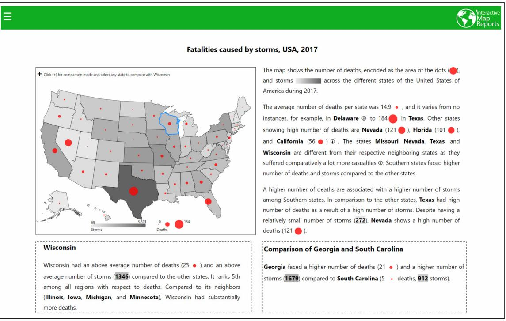
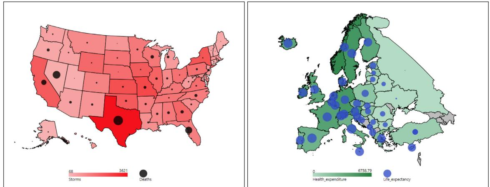
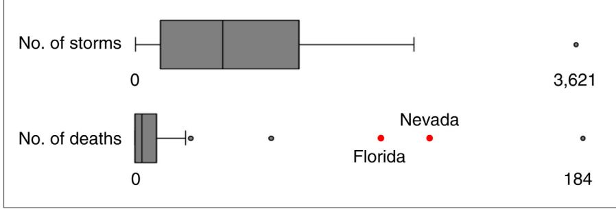
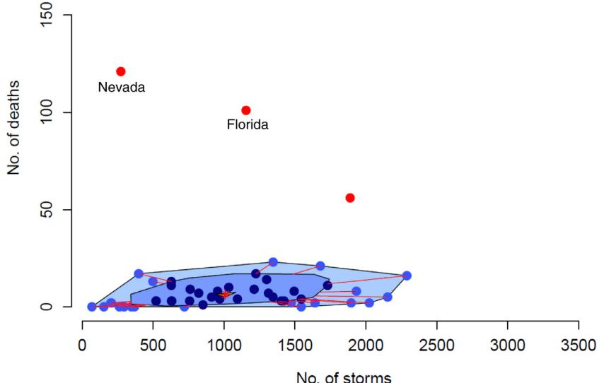
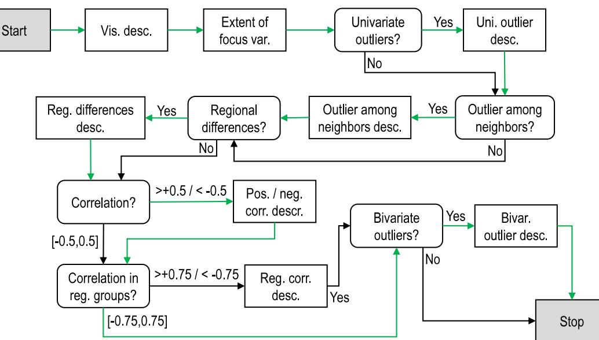
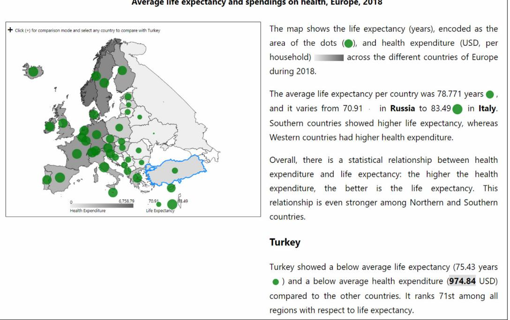
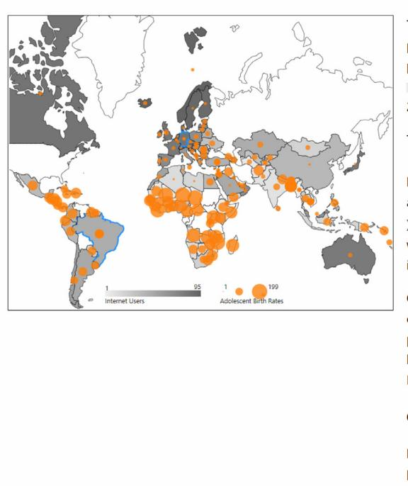
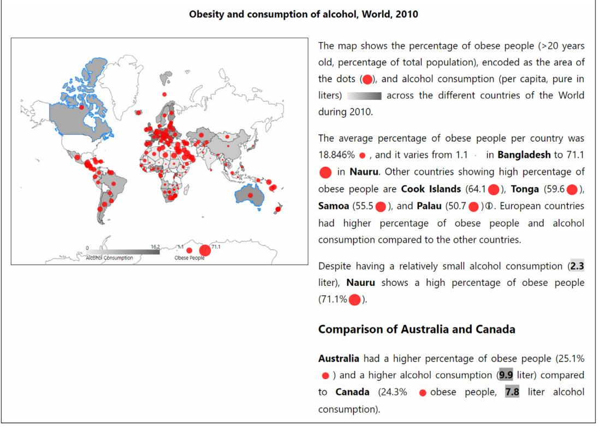

Contents lists available at ScienceDirect

Visual Informatics

journal homepage: www.elsevier.com/locate/visinf

# Interactive map reports summarizing bivariate geographic data

#### Shahid Latif ∗ , Fabian Beck

*University of Duisburg–Essen, paluno – The Ruhr Institute of Software Technology, Germany*

## a r t i c l e i n f o

*Article history:* Received 10 December 2018 Received in revised form 8 February 2019 Available online 21 March 2019

*Keywords:* Geographic visualization Natural language generation Interactive documents

# a b s t r a c t

Bivariate map visualizations use different encodings to visualize two variables but comparison across multiple encodings is challenging. Compared to a univariate visualization, it is significantly harder to read regional differences and spot geographical outliers. Especially targeting inexperienced users of visualizations, we advocate the use of natural language text for augmenting map visualizations and understanding the relationship between two geo-statistical variables. We propose an approach that selects interesting findings from data analysis, generates a respective text and visualization, and integrates both into a single document. The generated reports interactively link the visualization with the textual narrative. Users can get additional explanations and have the ability to compare different regions. The text generation process is flexible and adapts to various geographical and contextual settings based on small sets of parameters. We showcase this flexibility through a number of application examples.

© 2019 Zhejiang University and Zhejiang University Press. Published by Elsevier B.V. This is an open access article under the CC BY-NC-ND license (http://creativecommons.org/licenses/by-nc-nd/4.0/).

### **1. Introduction**

The interplay of two variables reveals how one entity potentially influences the other. In a geographic context, this influence may depend on the geography of the region. For instance, storms might cause more fatalities in densely populated areas. Standard map visualizations such as heatmaps, choropleths, and cartograms are designed to visualize one numerical variable at a time. The visualization of two geo-statistical variables on maps is more challenging. To simultaneously visualize two variables, a combination of two univariate maps can be overlaid, for instance, the first variable shown as a choropleth map and the second variable encoded in sizes of overlaid shapes; alternatively, separate views can be used. However, especially inexperienced users might face problems interpreting the bivariate visualization correctly and effectively. Users with a low visualization literacy might have problems understanding the respective visualization. And even users with more experience might find it hard to detect spatial patterns and spot outliers. Hence, there is a need to make bivariate geo-statistical visualizations more self-explaining and guide users through data analysis.

When a visualization is not fully self-explaining, we can add text in the form of captions and annotations to it. Also, to describe the results of data analysis, textual representations can easily

∗ Corresponding author.

*E-mail addresses:* shahid.latif@paluno.uni-due.de (S. Latif), fabian.beck@paluno.uni-due.de (F. Beck).

guide a reader through important findings. Hence, we believe that augmenting a bivariate map visualization with a textual report and interactively linking both can significantly improve users' abilities to understand the data. Using natural language generation technology, we could easily develop a joint automatic generation of the visualization and an accompanying text for a specific type of applications (e.g., reports of fatalities). However, we want to find more generalizable solutions that can deal with various types of geo-statistical variables (e.g., fatalities, monetary, demographic). Whereas visualizations are usually generalizable to different scenarios already, automatically produced text heavily depends on domain vocabulary and context. In contrast, we propose a text generation process that is flexible and adaptable to different variable types and geographic settings. This flexibility is achieved through a set of parameters providing metadata and context. The parameters also influence the visual encoding. Text and visualization are finally presented together in a linked interactive representation.

We developed *interactive Map Reports* (iMR), a Web-based tool that automatically generates a narrative and visualization to describe the analysis results for bivariate geo-statistical data. The sample shown in Fig. 1 explains fatalities caused by storm events in the USA, 2017. The reports summarize noteworthy patterns and relationships among the variables. In addition, they provide explanations on selected regions and the ability to compare any two regions of interest on demand. The color and shape encodings of variables in the text help establish quick linking of respective regions across both representations. To generate the reports, we combine data analysis techniques with natural language generation and interactive visualization. Our main scientific contributions are:

https://doi.org/10.1016/j.visinf.2019.03.004

2468-502X/© 2019 Zhejiang University and Zhejiang University Press. Published by Elsevier B.V. This is an open access article under the CC BY-NC-ND license (http://creativecommons.org/licenses/by-nc-nd/4.0/).

Peer review under responsibility of Zhejiang University and Zhejiang University Press.

**Fig. 1.** A map report describing the loss of lives due to storms in the USA during 2017. The map visualization uses two different encodings to visualize a *focus* and a *context* variable. The narrative (right column) provides an overview of the data analysis. Graphics in the text help establish linking between the two representations. Users can get additional details on a selected region or on a comparison of two selected regions (dashed rectangles).

- an automatic detection and selection of relevant information from bivariate geo-statistical data (Section 3),
- a versatile template-based text generation technique to produce a narrative adaptable to different contextual scenarios (Section 4),
- an adaptable method to produce map reports for various geographical regions and granularity consisting of interactively linked narrative and visualizations (Section 5), and
- a demonstration of generalizability of the approach in various application scenarios (Section 6).

The interactive system (iMR) is available at https://vis-tools. paluno.uni-due.de/imr and the supplemental material contains an interactive appendix having additional examples.

#### **2. Related work**

We explore the existing literature from two different perspectives—techniques for visualizing bivariate statistical data on maps and the approaches that use a combination of text and visualizations for communicating the results of the analysis.

Thematic maps are used to visualize variations in values of a variable across geographical space. The variable is mostly encoded as colors (Brewer et al., 1997), sizes and shapes of the geographical regions (cartograms), or specific symbols overlaid on top of the map (Flannery, 1971). Although most of the thematic maps are used to visualize a single variable (e.g., choropleths, heatmaps), there exist techniques that generalize this concept to bivariate (Howard and MacEachren, 1996; Brewer and Campbell, 1998) and multivariate data (Kim et al., 2013). A taxonomy of bivariate map types can be found in Elmer's work (Elmer, 2012, Figure 2.1). This classification is based on various combinations of visual variables and is adapted from the work of Nelson (2000), MacEachren (2004). According to (Elmer, 2012), although there are more than eleven different types (identified from six cartography books (Elmer, 2012, Table 2.1)) of bivariate map types, only two (bivariate choropleths and choropleths with overlaid graduated symbols) have been generally used in previous literature. Bivariate map visualizations, by construction, are visually more complex and harder to comprehend in comparison to their univariate counterparts. To facilitate the analysis of relationships among variables in geographical setting, Monmonier (1990) combines spatial representation with visual statistical summaries (scatter plot matrix). In contrast, we advocate textual explanations that make the visualizations self-explaining and provide an anchor point to explore the information specifically to users lacking visualization literacy.

The automatic generation of written narratives from data and other abstracted information falls under the scope of Natural Language Generation (NLG) (Deemter et al., 2005; Reiter et al., 2000; Gatt and Krahmer, 2018). Commercial tools such as *Wordsmith* and *Arria NLG Studio* allow for building customizable templates for text generation and use an advanced grammar model to do the grammar related tasks (e.g., subject–verb agreement). However, in these systems, users have to construct templates for each application or dataset. In contrast, we aim at generalizing the template-based text generation approach to different contexts by using a minimalistic set of parameters.

Most of the existing approaches generate natural language text for non-geographic data; only a few have addressed geographical data. Among these, Dale et al. (2005) generate route descriptions of paths constructed from the Geographical Information System datasets. Ramos-Soto et al. (2015) produce weather forecast reports. Thomas and Sripada (2007) provide (audio) summaries of geo-referenced data for better conveying information to the visually impaired population. Turner et al. (2008) present road ice weather forecasts by taking into account geographic features such as altitude, direction, population, etc. A very recent system, *SafeDrive* (Braun et al., 2018), provides the textual feedback on driving style of drivers to improve driving habits. The work of Molina et al. (2015) is close to ours as they produce descriptions of geographically distributed hydrological sensor data alongside a map. While their system includes a geographical map with the possibility to get temporal distributions of individual sensor readings, the textual and graphical representations are not interactively linked. Furthermore, the major focus of these approaches is on NLG and the text generation process is data dependent which makes them hard to generalize to other datasets.

Among the many other existing text generation approaches (Gatt and Krahmer, 2018), only a few discuss the generation of text in combination with visualizations. They are spread across many different domains, for instance, generation of instruction manuals for simple machines (Wahlster et al., 1993), health care data reporting (Jain and Keller, 2015; Hunter et al., 2008), performance analysis of participants in virtual learning environment (Ramos-Soto et al., 2017), scuba diver's profiling (Sripada and Gao, 2007), and description of the execution behavior of a program (Beck et al., 2017). Other approaches have discussed the automatic technical summarization of already generated graphical content (Mittal et al., 1995; Demir et al., 2012; Hullman et al., 2013). These systems focus on the explanatory aspect of data analysis and do not offer much explorability.

More recent approaches show that the interlinking of text and visualization can facilitate users in the visual exploration of data. For instance, *Voder* (Srinivasan et al., 2019) uses automatically generated textual descriptions about the visualized data as interactive links to suggest other relevant types of visualizations for better understanding. Kwon et al. (2014) suggest animating corresponding parts of a visualization (e.g., parallel coordinates) on interacting with the relevant text. But here the text is written by a human expert and not automatically generated. *VIS Author Profiles* (Latif and Beck, 2019) combines generated text and visualizations in an interactive document offering both explanatory and exploratory aspect of data analysis. However, the focus of *VIS Author Profiles* and other discussed approaches is narrow and they are tailored for specific applications and are not easy to be generalized for different contexts and datasets. In comparison, our focus is broader and the presented approach generalizes to different contextual settings.

Besides the interactive linking of text and visualizations, the use of word-sized graphics or sparklines (Tufte, 2006) has also been suggested for better integrating textual and visual content (Beck and Weiskopf, 2017; Goffin et al., 2014). In this paper, we use filled circles in line with text to better connect it with the map visualization as shown in Fig. 1.

#### **3. Content selection**

Any natural language generation begins with content determination, which decides on what information would be conveyed (Reiter et al., 2000). Before delving into the details of data analysis, we first introduce our target dataset and the results of an explorative study aimed at getting an initial overview of the possible content.

#### *3.1. Bivariate geo-statistical data*

We are focusing on the analysis of bivariate geo-statistical data—measurements of two numerical variables for a geographic region. Particularly relevant are those scenarios where one variable potentially influences the other. For instance, life expectancy might depend on the amount of health expenditure. Similarly, intensity and number of storms can influence the number of lives lost. In the following, we refer to the variable that potentially depends on the other as the *focus* variable and the other as the *context* variable. If a causality can be assumed (e.g., because it is obvious or there exists a reasonable explanation for it), it points from *context* to *focus* variable. In our analysis, we use three levels of geography, namely regions (e.g., USA), groups of subregions (e.g., group of states), and subregions (e.g., individual states). We use the storm–death dataset as our running example.

#### *3.2. Explorative study*

To get an initial overview of what aspects to consider while describing bivariate geo-statistical data, we conducted an explorative study with two participants (P1, P2). Both participants were Ph.D. students working in the field of visualization but were not involved in this project. They were presented with an interactive version of a bivariate map visualization as shown in Fig. 2, similar to the ones later used in our interactive system. In these visualizations, the *focus* variable was encoded in the radius of filled circles placed on top of the choropleth map showing the *context* variable.

The participants were asked to summarize the visualization (Task I), describe one particular subregion (Task II), and provide a comparative view of two given subregions (Task III). They had the possibility to write as much text as they wanted and there was no time limit.

*Task I—Summary:* Both participants began with the description of the subregions having minimum and maximum values of the *focus* variable followed by the explanation of outlying regions. P1 included information on a possible correlation between the variables. P2 described spatial trend of the context variable. Finally, both participants noticed and described abrupt changes of values between neighboring subregions.

*Task II—Region-specific description:* P1 described the values of both variables for the given subregion, followed by naming the other regions that show similar behavior, whereas P2 provided a comparison with the mean values. Further, P2 also highlighted a specific subregion that has higher values of the *context* variable compared to its direct neighbors.

*Task III—Comparison:* Both participants compared the values of each variable for two regions and described them in a single sentence. P1 included more details about one subregion as one of the subregions presented to him for comparison was an outlier.

The results show that the prominent aspects are the reporting of outliers (univariate and bivariate), comparisons of regions with their neighbors, variations of variable values across space, and subregions showing similar behavior. In addition, a correlation and variations of values across different subregional levels (e.g., parts of Europe) might reveal interesting patterns and are worth reporting. For instance, in Fig. 2 (left), the correlation is much stronger in the Southern states (ρ = 0.753) compared to the overall correlation for the country (ρ = 0.400).

#### *3.3. Data analysis*

Next, we discuss statistical approaches to automatically identify the content that will be part of our narrative. In contrast to basic information such as ranges of variable values, correlations among variables, and extreme values, the detection of univariate outliers, bivariate outliers, and regional differences requires more sophisticated data analysis approaches.

#### *3.3.1. Univariate outliers*

The importance of extreme values (minimum and maximum) in a dataset varies depending on the distribution of variables. A Tukey's boxplot (Tukey, 1977) uses measures namely, the first quartile (*Q*1), median (*Q*2), third quartile (*Q*3), and interquartile range (*IQR* = *Q*3 − *Q*1) to describe a univariate distribution. Hoaglin et al. (2000) categorize the observations smaller

**Fig. 2.** Bivariate map visualizations used in the explorative study. (Left, P1) Deaths caused by storms in various states of the USA. (Right, P2) Average life expectancy and health expenditures across Europe.

than *Q*1−1.5·*IQR* or larger than *Q*3+1.5·*IQR* as the potential candidates for outliers. Although somewhat arbitrary, this threshold for detecting outliers works well based on their experience with many datasets.

We analyze each variable individually and identify the univariate outliers i.e., the points lying outside [*Q*1−1.5 ·*IQR*, *Q*3+1.5 · *IQR*] range. Fig. 3 shows the distribution and outliers corresponding to each of the two variables in our exemplary dataset.

#### *3.3.2. Bivariate outliers*

We are also interested in subregions that demonstrate different behavior compared to the rest of the subregions based on the values of both variables. Such a bivariate outlier may not necessarily be an outlier in both of the univariate variables. For instance, although the states of Nevada and Florida in Fig. 3 (marked with red dots) are not outliers in variable *storms*, they are bivariate outliers as shown by the bagplot in Fig. 4. A bagplot (Rousseeuw et al., 1999) is a bivariate generalization of a boxplot and visualizes the distribution, spread, and outliers jointly for both variables. Three main components of a bagplot are: the *bag* containing 50% of the observations, the *fence* usually obtained by inflating the bag by a factor of 3 separating inliers from outliers, and the *loop*, that is the convex hull of the points lying between the bag and the fence.

The detection of bivariate outliers depends on the shape or distribution of the data, which is often characterized by a covariance matrix. For identifying the outliers, we use a well-known distance measure, the Mahalanobis distance, which takes into account the covariance matrix and is defined as the distance between an observation and a multivariate distribution. Mathematically, this distance is specified as:

$$d = \sqrt{\langle \mathbf{x} - \boldsymbol{\mu} \rangle^{\mathsf{T}} \mathbb{S}^{-1} \langle \mathbf{x} - \boldsymbol{\mu} \rangle} \tag{1}$$

where *x* = (*x*1, *x*2) is the vector of variables, µ = (µ1, µ2) is the vector of means and *S* is a two-dimensional symmetric covariance matrix. The resulting value *d* represents the Mahalanobis distance of point *x* from the mean µ of the distribution.

For a constant value of *d*, Eq. (1) defines a two-dimensional ellipsoid centered at µ. The probability of ellipsoid follows a χ 2 distribution with *p* degrees of freedom (Härdle and Simar, 2007). Therefore, the ellipsoid satisfying

$$
\langle \mathbf{x} - \boldsymbol{\mu} \rangle^{\mathsf{T}} \mathbf{S}^{-1} \langle \mathbf{x} - \boldsymbol{\mu} \rangle \leq \chi_p^2(\boldsymbol{\alpha}) \tag{2}
$$

has a probability of 1 − α. Hence, for *p* = 2 (bivariate case) and α = 0.5 ⇒ χ 2 = 5.99. Eq. (2) states that any observation is considered a bivariate outlier for which the squared Mahalanobis distance is greater than 5.99.

### *3.3.3. Geospatial trends*

The behavior of any statistical variable can vary considerably depending on the geographical subregion. For instance, Fig. 1 shows that the coastal states of the USA have experienced a higher number of storms, and as a consequence, more casualties. To identify this behavior, we take a regional subdivision of the overall shown geographic region under consideration. The United Nations (1999) provides a classification of the countries of the world into groups. For instance, European countries are grouped into Eastern, Western, Northern, and Southern countries. Similarly, the regional classification of the USA discerns West, Midwest, Northeast, and South. Using this grouping (or other externally provided groupings), we can look for differences between these groups. In particular, we detect if there is a strong positive or negative correlation between *focus* and *context* variable in one or more of these groups. Besides the bivariate outliers, an identification of subregions that show different behavior compared to the adjacent subregions can be of interest. For instance, Fig. 1 shows that the state of Nevada has different statistics with respect to both variables compared to its neighboring states, Arizona, California, Idaho, Oregon, and Utah. To this end, we compare the values of each variable for every subregion with its neighbors to identify the regions showing different statistics.

#### **4. Text generation**

In contrast to advanced text generation approaches based on a grammar model or machine learning (Gatt and Krahmer, 2018), we use a template-based text generation approach because of its good applicability and sufficient flexibility. Deemter et al. (2005) provide an in-depth comparison of generation approaches.

#### *4.1. Templates to narrative*

Having selected the content, the next step is to transform this information into a written narrative that consists of paragraphs containing interconnected sentences. To this end, we use a similar approach for controlling the sequence of the generated phrases and sentences as described in *Method Execution Reports* (Beck et al., 2017) and *VIS Author Profiles* (Latif and Beck, 2019). Directed acyclic decision graphs guide the generation flow and produce text from pre-written templates. Fig. 5 shows the decision graph that is responsible for generating the main part of our map reports. The process begins with the *Start* node and follows a deterministic path until the *Stop* node is reached. The *decision* nodes (rounded rectangular) lead the path according to the values

**Fig. 3.** Box plots showing the distribution of *deaths* caused by *storms* in the USA during 2017. The dataset contains univariate outliers in both variables.

**Fig. 4.** Bagplot of *deaths* caused by *storms* in the USA during 2017. The *bag* (blue) contains almost 50% of the data points, the *loop* (light blue) including points outside bag but inside the fence. Bivariate outliers are marked as red dots. (For interpretation of the references to color in this figure legend, the reader is referred to the web version of this article.)

of the decision variables. The *text* nodes (rectangular) are responsible for sentence creation and, when visited, add a new sentence or phrase to the narrative. Any traversal from *Start* to *Stop* node results in a meaningful narrative.

#### *4.2. Adaptable templates*

To achieve flexibility in narration and to make the template adaptable to different datasets, we leverage user-defined parameters that describe the meta data about the scenario. Through these parameters, we add semantics and domain-specific vocabulary that cannot be automatically detected from the raw data. The list of parameters along with short descriptions and possible values is shown in Table 1. The parameters *Region* and *Subregion Level* define the name of the region and the name of the level of detail for regions respectively. The parameters *Focus* and *Context Type* define the type of both variables that can be selected from a list of predefined values. The choice of adjectives, quantifiers, and verbs depends on these variable types. For instance, for the type *casualties*, possible phrases are: *''X suffered several casualties"*, *''X reported a large number of deaths"*, or *''X lost many lives"*. Similarly, for the variable type *monetary*, a possible phrase could be *''X spent a large amount on Y"* or *''X spent less on Y"*. Depending on the variable type, we pick verbs from a list of synonymous verbs to make the text more interesting to read.

In addition to the quantifiers and verbs, the choice of adverbs (e.g., better, worst) depends on the context or situation under consideration. We describe three possible *situations:*

- **Positive:** situations where higher values of the *focus* variable are desirable. For instance, higher values of average life expectancy are commonly considered to be desirable.
- **Negative:** situations that favor lower values of the *focus* variable. For example, the cities reporting less number of fatalities occurred in road accidents would be considered as better.
- **Neutral:** situations that do not clearly favor small or large values of the *focus* variable. For instance, only depending on a country's situation (e.g., aging society or unemployment of young people), lower or higher birth rates are desirable.

Combining the variable type with the *situation*, we can now use more expressive and specific phrases to describe the results. For *Focus Type* ← *demographic-indicator* and *Situation* ← *positive*, a possible phrase could be; *''X reports better values of life expectancy compared to Y"*. Similarly, the *Context Type* ← *incidents* but the *situation* ← *negative* could result in; *''X was the safest subregion due to the least number of accidents"*.

Another consideration is the presence of a strong correlation which may wrongly be interpreted as causal. However, correlation does not imply causality and it is not possible to automatically extract causality from the numerical data. The parameter *Causality* helps in avoiding wrong interpretations about causality based on the values of correlations.

**Fig. 5.** Decision graph that shows the text generation process. Round-rectangular decision nodes control the path while rectangular text nodes add a text fragment when visited. The green path marks the narrative generation for the example in Fig. 1.

**Table 1**

| User-defined parameters for configuring the map reports. |                                                            |                                                                                                   |  |  |  |  |
|----------------------------------------------------------|------------------------------------------------------------|---------------------------------------------------------------------------------------------------|--|--|--|--|
| Parameter                                                | Description                                                | Values                                                                                            |  |  |  |  |
| Region                                                   | Name of the region for which map is displayed              | String value, e.g., World, Europe, Germany                                                        |  |  |  |  |
| Subregion Level                                          | Name of the type of regions the map is subdivided in       | String value, e.g., countries, states, cities                                                     |  |  |  |  |
| Focus/Context Type                                       | Variable types according to predefined categories          | incidents, casualties, demographic-indicator, quantitative, percentage, monetary, or indicator |  |  |  |  |
| Situation                                                | Type of situation with respect to focus variable           | positive, negative, or neutral                                                                    |  |  |  |  |
| Causality                                                | If causality can be assumed from context to focus variable | yes or no                                                                                         |  |  |  |  |

#### *4.3. Long lists of items*

During the analysis process, we need to handle long lists of subregions, e.g., a larger number of univariate outliers. Each member of the list is associated with a numerical value of the variable attached. Since our final output is natural language text, the inclusion of long lists makes the text lengthy and boring to read. Therefore, we restrict the size of these lists. However, instead of cutting the list to a fixed size, we use a dynamic selection method that slices the list to have items in a given range (Latif and Beck, 2019, Section 4.4). The list is cut at the point where the difference to the following value is quite large.

#### **5. Interactive map reports**

To implement our approach, we developed *Interactive Map Reports (iMR)*, a Web-based system that generates analysis reports for bivariate geo-statistical data. Fig. 1 shows the interface of our tool and the components of the generated report. A map visualization on the left visualizes two variables using two different encodings. The right column presents the generated narrative consisting of an overview and additional details on the selected subregion or a comparison of any two selected subregions (shown below the map in Fig. 1 for space efficiency). The small info icon indicates the availability of additional explanations—for instance, a complete list of regions with their respective variable values or details on the analysis methods used to phrase the respective sentence. The use of small graphics (circles for the *focus* and color coding for the *context* variable) in the text supports the quick comparison of various regions while reading the text and also makes it easier to find the corresponding subregion on the map. The subregion names are produced in boldface characters and are clickable—when clicked, the system highlights the respective subregion on the map. A tool-tip presents the exact numerical values of both variables when hovering over the subregions.

#### *5.1. Bivariate map visualization*

For visualizing bivariate geo-statistical data on a geographical map, we employed a standard technique that performed well in a user study comparing different bivariate map visualizations (Elmer, 2012). It uses two different encodings, one for each variable. The *context* variable is visualized as a choropleth map based on a single-colored linear brightness gradient. The values of the *focus* variable are encoded in the radii of filled circles and are overlaid on top of the choropleth map. These circles are positioned at the centroid of the respective subregion.

The selection of colors for encoding the *focus* variable depends on the specified *situation*, i.e., *positive* → green, *negative* → red, and *neutral* → orange. This choice is based on the fact that green color is generally associated with positive and safe situations while red is considered to be a sign of warning or danger. However, the choice of orange color for a *neutral* situation is somewhat arbitrary and has been chosen for better visibility as it has to be overlaid on top of black and gray color. For the *context* variable, we always use the same neutral gradient (light gray to dark gray) irrespective of the *situation* as the situation depends only on the *focus* variable.

#### *5.2. Textual summary of analysis*

The first section of the generated narrative is the *overview* that summarizes the results of the data analysis. This section is divided

**Fig. 6.** An interactive map report describing average life expectancy and health expenditure across Europe in 2018.

into three paragraphs. The structure and order of the paragraphs are fixed but the sentences change considerably depending on the dataset and scenario. In Fig. 1, the *overview* is generated by traversing the green path in the decision graph of Fig. 5.

The opening paragraph consists of a single sentence that introduces the dataset and the visual encodings with the help of in-line legends. The second paragraph summarizes the results of the univariate analysis for the *focus* variable. It starts by stating the average values of the *focus* variable, followed by the range of its values accompanied by the subregion names (text node *Vis. desc.*). In the case of multiple subregions having the same minimum (or maximum) value, it names one subregion as an example. The complete list of these regions can be viewed by hovering over the info icon . The next sentence lists the regions that are univariate outliers according to the *focus* variable (text node *Uni. outlier desc.*). This and all other similar lists of subregions are restricted to show only 2 to 4 subregions according to the dynamic selection method (Section 4.3) with the possibility to view the complete list on demand.

Next, in the second paragraph, the text node *Outlier among neighbors desc.* is responsible for describing the regions that exhibit substantially different values compared to their adjacent subregions. We use the method described in Section 3.3.1, Tukey's fences, for identifying local outliers. It works well if the number of adjacent subregions is larger (e.g., for Missouri, Nevada, Texas, and Wisconsin). However, in the case of a few neighboring subregions (e.g., Florida has only two adjacent states), cannot detect meaningful outliers. For this particular case, even Dixon's Q test (Dean and Dixon, 1951)–efficient method for detecting outliers in a small number of observations–failed to identify Florida as an outlier. Since these situations are harder to identify, we take a conservative decision and exclude all the subregions that have less than three neighbors from the analysis.

The last sentence of the second paragraph goes into details of the regional differences found in the values of both variables (text node *Reg. differences desc.*). Depending on the regional classification of the geographical region under consideration, we describe the subregional groups that show distinct behavior compared to the other groups. For example, Fig. 1 depicts that Southern states lost more lives to storms in comparison to other states. The same text node produces another variation of this sentence in Fig. 6 describing that, although countries in Western Europe spend more on health, Southern European countries have higher average life expectancies.

The final paragraph highlights the relationship of the *context* to the *focus* variable followed by a description of bivariate outliers. It begins by describing a positive or negative correlation among the variables (text node *Pos./neg. correlation*). In the case of *Causality* set to *yes*, a different phrasing and vocabulary is used to imply causality. For instance, Fig. 1, third paragraph, it is stated that *''Texas experienced a high number of deaths as a result of a high number of storms''*. The choice of the phrase *''as a result of"* is specific to causality. The first sentence of this paragraph is not available in Fig. 1 as the overall value of correlation is below the threshold value (shown in Fig. 5); Fig. 6 gives an example of this sentence. The presence of a strong positive or negative correlation among one or more subregional groups is highlighted in the next sentence (text node *Reg. corr. desc.*). Then follows the description of regions that show bivariate outliers. For instance, Fig. 1 highlights that the states of Texas and Nevada are bivariate outliers—Texas having maximum values for both variables whereas Nevada suffered a very high number of casualties in a relatively small number of storms.

#### *5.3. On-demand explanations*

The *overview* section provides a high-level summary of the analysis and does not include descriptions of every subregion. Therefore, in addition to the tool-tips showing the values of the *focus* and *context* variables, we present additional descriptions on every subregion. Users can click any subregion to acquire additional details that are displayed below the *overview* section as shown in Fig. 1. The generation process for the on-demand explanations follows a similar decision graph to the one shown in Fig. 5; the generated text consists of a single paragraph.

| Table 2 |                                             |  |  |
|---------|---------------------------------------------|--|--|
|         | Parameter configuration for shown examples. |  |  |

|   | Fig. Title                                                          |       | Region Subregion Level Focus Type |                           | Context Type Focus Name |                            | Context Name        | Situation Causality |     |  |  |
|---|---------------------------------------------------------------------|-------|-----------------------------------|---------------------------|-------------------------|----------------------------|---------------------|---------------------|-----|--|--|
| 1 | Fatalities caused by storms, USA, 2017                           | USA   | states                            | casualties                | incidents               | deaths                     | storms              | negative            | yes |  |  |
| 6 | Average life expectancy and spendings on health, Europe, 2018 |       | Europe countries                  | demographic indicators | monetary                | average life expectancy | health expenditure  | positive            | no  |  |  |
| 7 | Adolescent birth rates and use of Internet, World, 2015       | World | countries                         | demographic indicators | percentage              | adolescent birth rate   | Internet users      | neutral             | no  |  |  |
| 8 | Obesity and consumption of alcohol, World, 2010                  | World | countries                         | percentage                | indicator               | obese people               | alcohol consumption | negative            | no  |  |  |

The first sentence compares the values of the *focus* and *context* variables for the selected subregion with the respective average values across all subregions. If the selected subregion is among one of the extreme cases, it is stated by using quantifiers such as *highest*, *lowest*, *most*, etc. For instance, in case of Texas, this sentence reads: *''Texas experienced the highest number of deaths (184) and highest number of storms (3621) among all states of the United States of America''.* The next sentence states the statistical ranking of the selected subregion with respect to the *focus* variable. The last sentence provides a comparison of the selected subregion with its neighboring regions for highlighting similar or dissimilar statistics. For instance, the state of Utah is the only state among its neighboring states that does not report any casualties.

Besides the explanations on one subregion, it is also possible to compare any two subregions by simultaneously selecting them. Here, the generated text consists of a single sentence that contrasts both regions based on the values of both variables. For instance, Figs. 7 and 8 present two different instances of comparison texts.

#### **6. Results**

We present a number of examples to demonstrate the usefulness of our approach and support our claims that the *iMR* (i) detects outliers, regional differences, and prominent patterns reliably for various datasets, (ii) produces meaningful textual descriptions about the analysis results, and (iii) adapts to different variable types and different levels of subregional granularity. In addition to the examples presented in this section, readers can explore more examples by running the *iMR* system in any modern Web browser.

In what follows, we demonstrate map reports for three different *Regions*: world (Figs. 7 and 8), continent (Fig. 6), and country (Fig. 1) and two different *Subregional Levels*: countries and states. Table 2 shows the values of the user-defined parameters for the examples. At *world* level, the report describes the group of countries showing distinct behavior. For instance, the European countries have higher numbers of Internet users and lower adolescent birth rates in comparison to the rest of the world. On the continent level, Fig. 6 reports the differences among various parts of Europe—countries in Southern Europe have better average life expectancies despite spending less on health. At the country level, in addition to describing the differences across various states of the country, the report also highlights the states showing dissimilar behavior in contrast to their adjacent states. For instance, Fig. 1 shows that the states Missouri, Nevada, and Wisconsin suffered a lot more deaths than their neighbors.

To show the adaptability of the generated text to various situations, we showcase examples for each type of *situation*. Fig. 7 highlights the relationship between adolescent birth rates—the annual number of live births per women aged 15–19, and the number of people who have access to the Internet. The adolescent birth rate (*focus*) is neither clearly positive nor negative, this report is generated according to the *neutral* situation.

The map reports shown in Figs. 1 and 8 are produced with the *negative* value of the *Situation*. For instance, the phrase *''suffered a lot more casualties"* (Fig. 1). Although both examples share the same value of the *situation*, the narrative differs considerably based on the variable types and the presence of correlations. The former example highlights the presence of a positive correlation among Southern states while there was not considerable correlation for the entire USA. In contrast, there is no paragraph about correlations between variables in Fig. 8 as the value is not large enough.

Fig. 6 presents the average life expectancy and the money per household spent on health. Here, higher values of life expectancy are favorable so the *situation* is *positive*. The phrase *''better is the life expectancy"*, reflects the positive character of the situation while describing the higher values of the *focus* variable.

Mostly, the choice of quantifiers and verbs depends on the variable type. For instance, Fig. 1 uses the *casualties* as the type of the *focus* variable and hence the phrase *''number of"* is used. Similar is the case with variable type *percentage* in Fig. 7 (*''percentage of Internet users''*) and Fig. 8 (*''percentage of obese people''*). Referring to Fig. 6, the choice of quantifier *''values of"* for the variable *health expenditure* is based on the variable type *monetary*. However, the variable type *demographic-indicators* does not need any phrase as seen in the examples of Fig. 6 and Fig. 7 (*''African countries showed higher adolescent birth rates''*). In Fig. 1, the verbs *''suffered"*, *''experienced"*, and *''faced"* correspond to *Focus Type* ← *casualties*.

#### **7. Discussion and conclusion**

We demonstrated an approach to create bivariate geostatistical data analysis reports consisting of generated narrative accompanying a map visualization. The reports guide through the analysis results and provide additional explanations for interpreting the data. Through a number of examples, we have shown the flexibility of our approach and that it produces meaningful interactive reports for different variable types, geographic regions, and scenarios.

The scope of our work is limited to bivariate geo-statistical (i.e., numeric) data where one variable potentially influences the other. While we chose a specific geographic visualization to encode the bivariate data, it would be relatively easy to replace the visualization by a different one or even make it customizable. An option to achieve it could be the use of a comprehensive declarative model for producing visualizations as described by Jo et al. (2019). We have coverage for a number of variable types, but cannot claim that every variable can be classified as one of the mentioned categories. However, the generic category *quantitative* results in a less tailored but still meaningful narrative. Interesting future work includes extending the approach to categorical variables, multivariate data (i.e., more than two variables), and

**Fig. 7.** An interactive map report showing the possible relationship between adolescent birth rates and the percentage of Internet users across countries of the world in 2015.

**Fig. 8.** An interactive map report describing the percentage of obese people and alcohol consumption in the world during 2010.

spatiotemporal information. While the first extension is estimated to require only smaller changes, the two latter scenarios will likely require substantially different data analysis, narration, and visualization techniques. In contrast to most previous systems that generate combined visual and textual descriptions, our focus is comparatively broad and covers different scenarios. The use of a small set of parameters gives sufficient flexibility to tailor the same text generation process for different datasets. Hence, our approach can be considered as lying between the fully automated text generation systems (which are tailored to a narrow scenario) and tools that allow for building fully customizable templates. However, our approach does not support manual refining or extending the reports beyond the configurations that can be specified through the parameters.

Since our map reports contain text and visualizations, as two different parts of the report, one might argue that this introduces a split-attention effect. However, this is true for any representation of data that includes multiple views. The available interactions in our reports counterbalance this effect by providing an easier and quicker way of cross-referencing the two representations. Furthermore, the use of word-sized graphics also helps better integrating textual and visual information (Beck and Weiskopf, 2017).

One problem with the auto-generated reports like ours is that the possibility of incorrect information being generated cannot be excluded. One might argue that the said problem endangers visualizations to some extent as well especially when the mapping between data and visual elements is complex. However, the problem is more severe with auto-generated text as it is more explicit. Like for any complex software system, one possible countermeasure is to apply thorough testing.

At the moment our reports are generated based on pre-defined settings and do not take into account user interactions in the generation process. It would be interesting to consider exploration histories, and even relative user characteristics (as found in Toker et al.'s work (Toker et al., 2018)). In addition to the ondemand textual explanations, the use of summary visualizations as discussed by Monmonier (1990) to reveal relationships among variables on a sub-selection of regions can further enrich the documents.

Although it is obvious that both visual and textual data descriptions have their advantages, it remains a largely open research question which information is better represented in which modality. Some existing works have already provided evidence that a bimodal (i.e., text and visualization) representation can be beneficial for understanding and interpreting the information. Gkatzia et al. (2017) demonstrate better decision making under uncertainty using a task-based study. Similarly, Sripada and Gao (2007) claim that divers find the bimodal representation more comprehensive while judging the safety of a deep dive. However, their results are based on specific datasets and cannot be generalized. Our approach assumes that a bivariate map visualization is given; the narration only accompanies the visual representation, but is not considered to live without the visualization. As a next step, it would be interesting to perform user studies to investigate if especially users rather inexperienced with visualization will profit from the additional text as expected.

#### **Acknowledgment**

Fabian Beck is indebted to the Baden-Württemberg Stiftung for the financial support of this research project within the Postdoctoral Fellowship for Leading Early Career Researchers.

#### **Appendix A. Supplementary data**

Supplementary material related to this article can be found online at https://doi.org/10.1016/j.visinf.2019.03.004.

#### **References**

- Beck, F., Siddiqui, H.A., Bergel, A., Weiskopf, D., 2017. Method execution reports: Generating text and visualization to describe program behavior. In: Proceedings of the 5th IEEE Working Conference on Software Visualization. IEEE, pp. 1–10. http://dx.doi.org/10.1109/VISSOFT.2017.11.
- Beck, F., Weiskopf, D., 2017. Word-sized graphics for scientific texts. IEEE Trans. Vis. Comput. Graphics 23 (6), 1576–1587. http://dx.doi.org/10.1109/TVCG. 2017.2674958.
- Braun, D., Reiter, E., Siddharthan, A., 2018. Saferdrive: An NLG-based behaviour change support system for drivers. Nat. Lang. Eng. 1–38. http://dx.doi.org/ 10.1017/S1351324918000050.
- Brewer, C., Campbell, A.J., 1998. Beyond graduated circles: varied point symbols for representing quantitative data on maps. Cartogr. Perspect. (29), 6–25. http://dx.doi.org/10.14714/CP29.672.
- Brewer, C.A., MacEachren, A.M., Pickle, L.W., Herrmann, D., 1997. Mapping mortality: Evaluating color schemes for choropleth maps. Ann. Assoc. Am. Geogr. 87 (3), 411–438. http://dx.doi.org/10.1111/1467-8306.00061.
- Dale, R., Geldof, S., Prost, J.-P., 2005. Using natural language generation in automatic route description. J. Res. Pract. Inf. Technol. 37 (1), 89.
- Dean, R.B., Dixon, W., 1951. Simplified statistics for small numbers of observations. Anal. Chem. 23 (4), 636–638. http://dx.doi.org/10.1021/ ac60052a025.
- Deemter, K.V., Theune, M., Krahmer, E., 2005. Real versus template-based natural language generation: A false opposition? Comput. Linguist. 31 (1), 15–24. http://dx.doi.org/10.1162/0891201053630291.
- Demir, S., Carberry, S., McCoy, K.F., 2012. Summarizing information graphics textually. Comput. Linguist. 38 (3), 527–574. http://dx.doi.org/10.1162/COLI_ a_00091.
- Elmer, M.E., 2012. Symbol Considerations for Bivariate Thematic Mapping (Ph.D thesis), University of Wisconsin–Madison.
- Flannery, J.J., 1971. The relative effectiveness of some common graduated point symbols in the presentation of quantitative data. Cartographica 8 (2), 96–109. http://dx.doi.org/10.3138/J647-1776-745H-3667.
- Gatt, A., Krahmer, E., 2018. Survey of the state of the art in natural language generation: Core tasks, applications and evaluation. J. Artificial Intelligence Res. 61, 65–170. http://dx.doi.org/10.1613/jair.5477.
- Gkatzia, D., Lemon, O., Rieser, V., 2017. Data-to-text generation improves decision-making under uncertainty. IEEE Comput. Intell. Mag. 12 (3), 10–17. http://dx.doi.org/10.1109/MCI.2017.2708998.
- Goffin, P., Willett, W., Fekete, J.-D., Isenberg, P., 2014. Exploring the placement and design of word-scale visualizations. IEEE Trans. Vis. Comput. Graphics 20 (12), 2291–2300. http://dx.doi.org/10.1109/TVCG.2014.2346435.
- Härdle, W., Simar, L., 2007. Applied Multivariate Statistical Analysis, vol. 22007. Springer.
- Hoaglin, D.C., Mosteller, F., Tukey, J.W., 2000. Understanding Robust and Exploratory Data Analysis, vol. 1. Wiley Classic Library.
- Howard, D., MacEachren, A.M., 1996. Interface design for geographic visualization: Tools for representing reliability. Cartogr. Geogr. Inf. Syst. 23 (2), 59–77. http://dx.doi.org/10.1559/152304096782562109.
- Hullman, J., Diakopoulos, N., Adar, E., 2013. Contextifier: automatic generation of annotated stock visualizations. In: Proceedings of the SIGCHI Conference on Human Factors in Computing Systems. CHI, ACM, pp. 2707–2716. http: //dx.doi.org/10.1145/2470654.2481374.
- Hunter, J., Gatt, A., Portet, F., Reiter, E., Sripada, S., 2008. Using natural language generation technology to improve information flows in intensive care units. In: ECAI, pp. 678–682. http://dx.doi.org/10.3233/978-1-58603-891-5-678.
- Jain, A., Keller, J.M., 2015. Textual summarization of events leading to health alerts. In: Engineering in Medicine and Biology Society, 37th Annual International Conference of the IEEE. EMBC '15, pp. 7634–7637. http://dx.doi.org/ 10.1109/EMBC.2015.7320160.
- Jo, J., Vernier, F., Dragicevic, P., Fekete, J.-D., 2019. A declarative rendering model for multiclass density maps. IEEE Trans. Vis. Comput. Graphics 25 (1), 470–480. http://dx.doi.org/10.1109/TVCG.2018.2865141.
- Kim, S., Maciejewski, R., Malik, A., Jang, Y., Ebert, D.S., Isenberg, T., 2013. Bristle maps: A multivariate abstraction technique for geovisualization. IEEE Trans. Vis. Comput. Graphics 19 (9), 1438–1454. http://dx.doi.org/10.1109/TVCG. 2013.66.
- Kwon, B.C., Stoffel, F., Jäckle, D., Lee, B., Keim, D., 2014. VisJockey: Enriching data stories through orchestrated interactive visualization. In: Computation+Journalism Symposium 2014.
- Latif, S., Beck, F., 2019. VIS Author profiles: Interactive descriptions of publication records combining text and visualization. IEEE Trans. Vis. Comput. Graphics 25 (1), 152–161. http://dx.doi.org/10.1109/TVCG.2018.2865022.
- MacEachren, A.M., 2004. How Maps Work: Representation, Visualization, and Design. Guilford Press.
- Mittal, V.O., Roth, S.F., Moore, J.D., Mattis, J., Carenini, G., 1995. Generating explanatory captions for information graphics. In: Proceedings of the 14th International Joint Conference on Artificial Intelligence. IJCAI, Morgan Kaufmann Publishers Inc., pp. 1276–1283.
- Molina, M., Sanchez-Soriano, J., Corcho, O., 2015. Using open geographic data to generate natural language descriptions for hydrological sensor networks. Sensors 15 (7), 16009–16026. http://dx.doi.org/10.3390/s150716009.
- Monmonier, M., 1990. Strategies for the visualization of geographic time-series data. Cartographica 27 (1), 30–45. http://dx.doi.org/10.3138/U558-H737- 6577-8U31.
- Nelson, E., 2000. The impact of bivariate symbol design on task performance in a map setting. Cartographica 37 (4), 61–78. http://dx.doi.org/10.3138/V743- K505-5510-66Q5.
- Ramos-Soto, A., Bugarin, A.J., Barro, S., Taboada, J., 2015. Linguistic descriptions for automatic generation of textual short-term weather forecasts on real prediction data. IEEE Trans. Fuzzy Syst. 23 (1), 44–57. http://dx.doi.org/10. 1109/TFUZZ.2014.2328011.
- Ramos-Soto, A., Vazquez-Barreiros, B., Bugarín, A., Gewerc, A., Barro, S., 2017. Evaluation of a data-to-text system for verbalizing a learning analytics dashboard. Int. J. Intell. Syst. 32 (2), 177–193. http://dx.doi.org/10.1002/int. 21835.

Reiter, E., Dale, R., Feng, Z., 2000. Building Natural Language Generation Systems. MIT Press.

- Rousseeuw, P.J., Ruts, I., Tukey, J.W., 1999. The bagplot: A bivariate boxplot. Amer. Statist. 53 (4), 382–387. http://dx.doi.org/10.1080/00031305.1999. 10474494.
- Srinivasan, A., Drucker, S.M., Endert, A., Stasko, J., 2019. Augmenting visualizations with interactive data facts to facilitate interpretation and communication. IEEE Trans. Vis. Comput. Graphics 25 (1), 672–681. http: //dx.doi.org/10.1109/TVCG.2018.2865145.
- Sripada, S.G., Gao, F., 2007. Summarizing dive computer data: A case study in integrating textual and graphical presentations of numerical data. In: Workshop on Multimodal Output Generation. MOG '07, p. 149.
- Thomas, K., Sripada, S., 2007. Atlas.txt: Linking geo-referenced data to text for NLG. In: Proceedings of the Eleventh European Workshop on Natural Language Generation. ENLG '07, pp. 163–166.
- Toker, D., Conati, C., Carenini, G., 2018. User-adaptive support for processing magazine style narrative visualizations: Identifying user characteristics that matter. In: 23rd International Conference on Intelligent User Interfaces. ACM, pp. 199–204. http://dx.doi.org/10.1145/3172944.3173009.
- Tufte, E.R., 2006. Beautiful Evidence, first ed. Graphics Press.

Tukey, J.W., 1977. Exploratory Data Analysis, vol. 2. Reading, Mass.

- Turner, R., Sripada, S., Reiter, E., Davy, I.P., 2008. Using spatial reference frames to generate grounded textual summaries of georeferenced data. In: Proceedings of the Fifth International Natural Language Generation Conference. INLG '08, Association for Computational Linguistics, Stroudsburg, PA, USA, pp. 16–24. http://dx.doi.org/10.3115/1708322.1708328.
- United Nations, 1999. Statistical Division, Countries or areas / geographical regions. https://unstats.un.org/unsd/methodology/m49.
- Wahlster, W., André, E., Finkler, W., Profitlich, H.J., Rist, T., 1993. Plan-based integration of natural language and graphics generation. Artificial Intelligence 63 (1–2), 387–427. http://dx.doi.org/10.1016/0004-3702(93)90022-4.