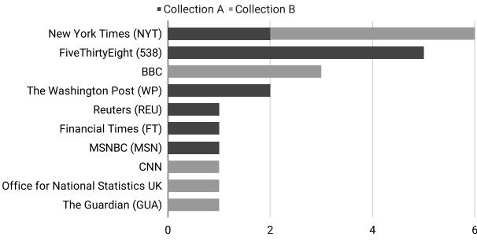
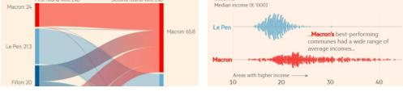
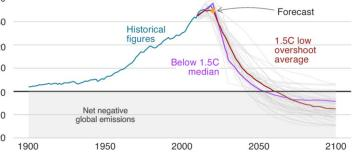
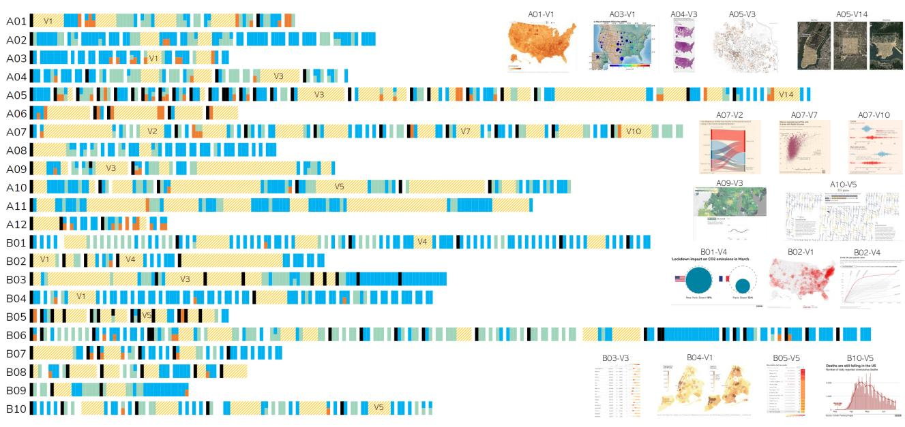
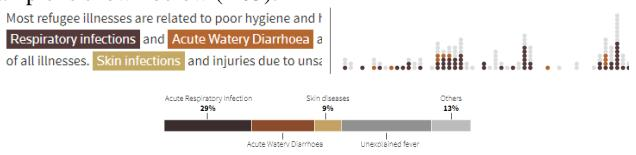

# A Deeper Understanding of Visualization–Text Interplay in Geographic Data-driven Stories

Shahid Latif†1 , Siming Chen‡2 , and Fabian Beck§1

1paluno, University of Duisburg-Essen, Germany 2School of Data Science, Fudan University, Shanghai, China

## Abstract

*Data-driven stories comprise of visualizations and a textual narrative. The two representations coexist and complement each other. Although existing research has explored the design strategies and structure of such stories, it remains an open research question how the two representations play together on a detailed level and how they are linked with each other. In this paper, we aim at understanding the fine-grained interplay of text and visualizations in geographic data-driven stories. We focus on geographic content as it often includes complex spatiotemporal data presented as versatile visualizations and rich textual descriptions. We conduct a qualitative empirical study on 22 stories collected from a variety of news media outlets; 10 of the stories report the COVID-19 pandemic, the others cover diverse topics. We investigate the role of every sentence and visualization within the narrative to reveal how they reference each other and interact. Moreover, we explore the positioning and sequence of various parts of the narrative to find patterns that further consolidate the stories. Drawing from the findings, we discuss study implications with respect to best practices and possibilities to automate the report generation.*

## 1. Introduction

Data-driven stories presented in online articles combine the expressive power of visualizations with a textual narrative. In these stories, visualizations provide an overview of the data while the accompanying text highlights insights and blends in the backdrop of the story. Both representations—visualization and text—are closely related and complement each other. It is found that the spatial arrangement and interactive linking of both representations influence the readers' engagement, comprehension, and recall of information [OKCP19, ZOM19]. Existing research has already explored the design space of distinct design strategies, overall structuring, and interactivity within such stories [SH10]. However, the focus stays rather broad and we lack an in-depth classification of the textual content according to its role in the story and how different parts of the text connects with the visualization. Better understanding of this fine-grained interplay between visualization and textual narration can reveal best practices of such stories and inform research supporting their creation.

Stories relating to geographic data are particularly interesting to study as the spatiotemporal nature of data makes the reporting challenging. Unlike reporting plain time series (e.g., the revenue of a company) or results of public-opinion polls, it usually requires multiple visualizations to show different aspects of the spatiotemporal data; some with a geographic focus and others with a temporal one. We find examples of geographic narratives across diverse journalistic branches such as politics, economics, science, and health. The current COVID-19 pandemic further provided the unique opportunity to collect various polished examples from the same context.

The main objective of this research is to achieve a more accessible and self-explanatory data reporting and to support journalists and visualization experts with a set of best practices to make their stories adaptable to the interests of the individual readers. To do so, we aim at understanding the fine-grained interplay of geographic visualizations and textual narration through an empirical analysis of a selection of data-driven stories. We investigate the role of every sentence within each of the narrative categories and how sentences are interwoven with the visual representation. Besides, we explore the positioning and sequential patterns among various parts of the stories. In particular, we seek to answer the following research questions:

- Q1: What are the reported analysis insights and how is the related data visually communicated?
	- Q1.1: What are the analysis insights presented in the textual narrative and how is context blended with these insights?
	- Q1.2: How are geographic and non-geographic visualizations used as a complement to communicate the data?
- Q2: How do textual narration and visualization interplay?

c 2021 The Author(s)

Computer Graphics Forum c 2021 The Eurographics Association and John Wiley & Sons Ltd. Published by John Wiley & Sons Ltd.

† shahid.latif@paluno.uni-due.de

‡ simingchen@fudan.edu.cn

§ fabian.beck@paluno.uni-due.de

- Q2.1: What links exist between the two media?
- Q2.2: How and in what sequence are visualizations embedded into the narrative?

We perform a qualitative analysis of 22 stories collected from a variety of well-known news media outlets. We analyzed 1,203 sentences and 118 visualizations contained in these stories and structured them according to a detailed coding scheme. Based on the assigned codes, we are able to answer the above research questions. To provide actionable insights, we discuss the implication of the results along best practices for authoring such stories as well as options for their personalization and automatic generation. To ease re-usability and extension, we make all study data available as supplemental material, along with our interactive visualization (presented in Figure 3) for exploration.

#### 2. Related Work

We review existing literature in regard to similar empirical studies for understanding various aspects of narrative visualization, support and authoring tools for story generation, and techniques to link the textual and visual representations.

#### 2.1. Narrative Visualization

Narrative visualization—also known as data-driven storytelling combines a textual narrative with visualizations to communicate analysis results [RHDC18]. Tong et al.'s [TRB∗ 18] extended survey provides a comprehensive overview of storytelling techniques in visualization. Studying existing stories can inform effective presentation strategies and the design of authoring tools for narrative visualizations. Researchers have already explored stories regarding various storytelling scenarios [KM13], the design space of distinct genres and role of interactivity in data stories [SH10, BWF∗ 18], structure and sequencing [HDH∗ 13], and even immersion [ILQC18]. Several researchers have performed empirical qualitative research. Among these, Segel and Heer [SH10] analyzed design strategies and interactivity in narrative visualizations that were published in news media. Hullman et al. [HDH∗ 13] investigated 42 professional narrative visualization examples to understand the sequences in these stories and inform the design of an authoring tool for identifying effective sequencing of visualizations. Hullman et al. [HKL17] explored different structuring strategies people followed to arrange a set of given related visualizations into a sequence as part of a user study. Similarly, McKenna et al. [MHRL∗ 17] systematically examined the characteristic factors—relating to story layout, navigation, role of visualizations, and level of control—of narrative visualization that play an important role in how users read and interact with the stories.

Existing research also addresses the authoring of data-driven stories. The corresponding approaches can be broadly classified into two types. First are the ones that support manual creation of data stories. Among these, *DataClips* [AHRL∗ 17] provides an authoring interface for data videos with different templates that users can customize. *Data Illustrator* [LTW∗ 18] supports data binding to expressive charts for making data stories memorable. Ren et al. [RBL∗ 17] discuss the design space of annotations and present an interactive tool to create such annotations. Brehmer et al. [BLHR∗ 19] facilitate the authoring of timeline narratives. In contrast, the second type of authoring approaches provide automatic support. Among these, *Datashot* [WSZ∗ 19] automatically derives data facts from tabular data and generate infographics to provide an overview. *Calliope* [SXS∗ 21] supports automatic generation of a story sequence directly from a given dataset. Metoyer et al.'s [MZJS18] approach automatically integrates short textual annotations at various points on the visualization when users highlight a passage of text.

Although text is a vital part of narrative visualizations, we still lack an in-depth understanding of what different roles it plays and how it interacts with the visualizations; existing research focuses less on characterizing the textual narrative in a story.

#### 2.2. Linking of Visualization and Text

Researchers have explored different ways to better connect the text and visualization. Goffin et al. [GBWI17] investigated the design and usage of word-scale graphics and micro visualizations that can be embedded in text documents. Latif and Beck [LB18] presented further possibilities to extend word-scale graphics to represent spatiotemporal data. Beck and Weiskopf [BW17] proposed the idea of a two-way interactive linking between text and (wordscale and regular) visualizations—hovering a text fragment highlights the relevant part of a visualization and vice versa—, also suggesting that this might support multiple reading strategies. Mumtaz et al. [MLBW20] developed a visual analytics solution for describing the code quality of a software, where generated text is regarded as a representation in a multi-view system that can be brushed and linked like any other visualization. In their system, visualization captions adapt while interacting with the visualizations. Other systems link generated textual explanations with visualizations in different context, for instance, to report analysis findings (e.g., *Vis Author Profiles* [LB19b]) or to explain causality visualizations (e.g., *CauseWorks* [CSC∗ 21]).

Existing research has also studied the impact of document layout and interactive linking on readability and comprehension. Ottley et al. [OKCP19] found that people often have a hard time consolidating the information that is presented across the two media and suggested the need of a more effective representation. In a controlled experiment, Zhi et al. [ZOM19] discovered that participants recall information better when it is interactively linked across the two media. Barrel et al. [BLC20] studied the impact of adaptive guidance on the readability. The guidance is provided, for instance, by visually highlighted bars of a bar chart based on participants' eye fixation to a sentence in the narrative. It was found that this adaptive guidance helps improve comprehension particularly among participants with low visualization literacy.

As the linking of text and visualization influence how readers consume information, we believe that a deeper investigation of the visualization–text interplay can inform design strategies for achieving an even better integration of the two media.

#### 3. Methodology

To answer the research questions (Q1 and Q2 in Section 1), we adopt a similar approach as applied in several existing

Figure 1: *Sources of stories in our data collection.*

works [SH10, HDH∗ 13, MHRL∗ 17]. We performed a qualitative analysis on 22 geographic data-driven stories. We decided to follow a qualitative approach focusing on fewer examples but a finegrained and deep analysis because we were more interested in finding possibilities and best practices. This is also why the stories should have high quality, both with respect to its textual narration and visual data representation. Going down to sentence-level analysis of the text and fine-grained characteristics of the visualizations allows us to reason about the details of spatiotemporal data representation as well as linking and referencing between text and visualizations.

## 3.1. Data Collection

The 22 stories were collected from 10 well-known digital journalistic sources including New York Times (NYT), FiveThirtyEight (538), and BBC; the full list of sources is shown in Figure 1. The stories are published between 2016 and 2020. Our story selection criteria involved the presence of at least one geographic visualization and a comparable proportion (in terms of screen real estate) of textual and visual narrative. Another but less strictly applied criterion was the presence of interactivity. We began with searching for stories that contained visualization–text interactions (e.g., interacting with text visually highlights the relevant part of the visualization or vice versa). Having found only 3 such stories, we loosened the criterion of interactivity to visualizations alone in the story. Later, we also included 7 stories that did not offer interactivity. In our sample collection, fifteen out of 22 stories offer some form of interactivity.

In the first phase, we picked 12 stories (Collection A) on a variety of themes such as culture, economics, politics, science, and health to maximize the diversity of topics. In the second phase, we chose another 10 stories (Collection B) on a single topic: the COVID-19 pandemic. These 10 stories have the same context yet covering various aspects of the pandemic. The two collections complement each other; one embraces diversity while the other focuses on certain comparability.

### 3.2. Qualitative Analysis

Every story was divided into individual sentences and visualizations. This resulted in 1,203 sentences and 118 visualizations for 22 stories (638/66 for Collection A and 565/52 for Collection B).

 c 2021 The Author(s) Computer Graphics Forum c 2021 The Eurographics Association and John Wiley & Sons Ltd. We followed an open coding approach. The coding (i.e., labeling the sentences and visualizations) proceeded as follows: two coders (both coauthors of this paper) used 4 stories from Collection A as seeds and independently assigned descriptive codes to sentences as well as visualizations. In a follow-up meeting, the codes were discussed; similar codes were merged and conflicting code assignments were resolved. This initial coding scheme was then rolled out to the rest of the eight data stories in Collection A. For this, we followed a sequential process: one coder did the coding first, and then the other coder checked and refined the first coding. The analysis of Collection A provided us with a code taxonomy that was then verified and further fine-tuned with its application on Collection B. We followed the same process to analyze stories in Collection B. Over the course of several meetings, we kept on resolving and consolidating the codes and categories, ultimately resulting in 45 distinct codes across 4 categories and 12 subcategories.

Overall, this resulted in 25 codes for sentences and 20 codes for visualizations (cf. Figure 2). In total, there are 1,812 code assignments for sentences and 569 for visualizations. Our coding scheme allowed for multiple code assignments to a sentence or visualization. We group these codes along the categories *data-driven* text and *embedding* for textual narrative (sentences), *visualization* for visualization-specific codes, and *visualization–text linking* for the interplay between the two media (e.g., a sentence that references a visualization or a visualization that has a textual annotation). As shown in Figure 2 (leftmost column), the colored coding categories have further subcategories that will be discussed along reporting of the results. All codes and code categories are always underlined with the respective color in the following for an improved readability and figure–text linking, while categories and subcategories are printed in bold font to discern them from codes.

#### 4. Results: Insights and Visual Communication (Q1)

First, we study the ingredients of the stories, namely the individual sentences and visualizations. Figure 2 gives a qualitative overview of what these ingredients are, but also reports related quantities (i.e., how frequently a certain code is assigned). These quantities are not meant to generalize beyond a specific story but help us judge the general character of a story (e.g., working a lot with direct quotes) and find interesting outliers (e.g., a unique style of reporting). In the following, we systematically discuss these ingredients along the code categories and subcategories, clarifying their meaning as well as describing their typical use and remarkable examples.

## 4.1. Analysis Insights and Context (Q1.1)

Generally, we observe two main categories of textual narrative in the data-driven stories: the actual *data-driven* text and the text that serves as the *embedding* in the story, for instance, structuring text like headings or contextual information like dataset descriptions. *Data-driven* text does not just list the raw numbers but summarizes analysis findings at a higher level as *insights*. Although there seems to be no agreed definition of an *insight* in visualization community [CZGR09], it may be defined as *"complex, deep, qualitative, unexpected, and relevant"* [Nor06] or *"an individual observation about the data [...], a unit of discovery"* [SND05]. In the following, we define an *insight* as non-trivial, qualitative, and relevant 0 1 2 3 4 5 6 7 8 9 10 11 12 13 14 15 16 17 18 19 20 21 22

|             |                                         |             |                                                                 |        |                                        |                   |             |                                                     |        |           |        | As Climate Changes, Southern States Will Suffer More Than Others                                                      |                                     |        |                                                           |                                                |        |           |        |                                                            |        |                                                         |                                                                                                                               |                                                         |
|-------------|-----------------------------------------|-------------|-----------------------------------------------------------------|--------|----------------------------------------|-------------------|-------------|-----------------------------------------------------|--------|-----------|--------|-----------------------------------------------------------------------------------------------------------------------|-------------------------------------|--------|-----------------------------------------------------------|------------------------------------------------|--------|-----------|--------|------------------------------------------------------------|--------|---------------------------------------------------------|-------------------------------------------------------------------------------------------------------------------------------|---------------------------------------------------------|
|             |                                         |             | Our Organ Donation System Is Unfair - The Solution Might Be Too |        |                                        |                   |             |                                                     |        |           |        |                                                                                                                       |                                     |        |                                                           |                                                |        |           |        | Coronavirus Shutdowns: Economists Look for Better Answers. |        |                                                         | Coronavirus and the social impacts on Great Britain: 5 June 2020 43% of US Coronavirus Deaths Are Linked to Nursing Homes. |                                                         |
|             |                                         |             |                                                                 |        |                                        |                   |             |                                                     |        |           |        | America's great housing divide: Are you a winner or loser? The terrible numbers that grow with each mass shooting. |                                     |        | Climate change and coronavirus: The biggest carbon crash. |                                                |        |           |        |                                                            |        | Five Ways to Monitor the Coronavirus Outbreak in the US |                                                                                                                               | Coronavirus: What are the numbers out of Latin America? |
|             |                                         |             |                                                                 |        |                                        |                   |             |                                                     |        |           |        |                                                                                                                       |                                     |        |                                                           |                                                |        |           |        |                                                            |        |                                                         |                                                                                                                               |                                                         |
|             |                                         |             |                                                                 |        |                                        |                   |             |                                                     |        |           |        |                                                                                                                       |                                     |        |                                                           |                                                |        |           |        |                                                            |        |                                                         |                                                                                                                               |                                                         |
|             |                                         |             |                                                                 |        | Where Blue-Collar America Is Strongest |                   |             | French election results: Macron's victory in charts |        |           |        |                                                                                                                       |                                     |        |                                                           | Coronavirus Map: Tracking the Global Outbreak. |        |           |        |                                                            |        |                                                         | How is the coronavirus affecting global air traffic?                                                                          | Coronavirus: Is the pandemic getting worse in the US?   |
|             |                                         |             |                                                                 |        | The Loudest Places You Can't Hear      |                   |             |                                                     |        |           |        |                                                                                                                       | Tracking the Oil Spill in the Gulf. |        | Tracking Covid-19 cases in the US.                        |                                                |        |           |        |                                                            |        |                                                         |                                                                                                                               |                                                         |
|             |                                         |             | 35 Years Of American Death                                      |        |                                        |                   |             | The Atlas Of Redistricting                          |        |           |        |                                                                                                                       |                                     |        |                                                           |                                                |        |           |        |                                                            |        |                                                         |                                                                                                                               |                                                         |
|             |                                         |             |                                                                 |        |                                        |                   |             |                                                     |        |           |        | Geography of Poverty.                                                                                                 |                                     |        |                                                           |                                                |        |           |        |                                                            |        |                                                         |                                                                                                                               |                                                         |
|             |                                         |             |                                                                 |        |                                        | Life in the camps |             |                                                     |        |           |        |                                                                                                                       |                                     |        |                                                           |                                                |        |           |        |                                                            |        |                                                         |                                                                                                                               |                                                         |
|             |                                         |             |                                                                 |        |                                        |                   |             |                                                     |        |           |        |                                                                                                                       |                                     |        |                                                           |                                                |        |           |        |                                                            |        |                                                         |                                                                                                                               |                                                         |
|             |                                         |             |                                                                 |        |                                        |                   |             |                                                     |        |           |        |                                                                                                                       |                                     |        |                                                           |                                                |        |           |        |                                                            |        |                                                         |                                                                                                                               | Total                                                   |
|             |                                         |             |                                                                 |        |                                        |                   |             |                                                     |        |           |        | A01 A02 A03 A04 A05 A06 A07 A08 A09 A10 A11 A12                                                                       |                                     |        |                                                           |                                                |        |           |        |                                                            |        | B01 B02 B03 B04 B05 B06 B07 B08 B09 B10                 |                                                                                                                               |                                                         |
|             | Source                                  |             |                                                                 |        |                                        |                   |             |                                                     |        |           |        | 538 538 538 538 REU 538 FT NYT WP WP MSN NYT                                                                          |                                     |        |                                                           |                                                |        |           |        |                                                            |        | BBC CNN NYT NYT NYT ONS GUA NYT BBC BBC                 |                                                                                                                               |                                                         |
|             | Textual Narrative: Data-driven          |             |                                                                 |        |                                        |                   |             |                                                     |        |           | 1-9    | 10-20                                                                                                                 |                                     | >20    |                                                           |                                                |        |           |        |                                                            |        |                                                         |                                                                                                                               |                                                         |
|             | No. of Sentences (total per story)      |             | 42 77 38 53 111 16 76 42 31 70 59 23                            |        |                                        |                   |             |                                                     |        |           |        |                                                                                                                       |                                     |        | 85 27 62 69 24 152 35 27 33 51                            |                                                |        |           |        |                                                            |        |                                                         |                                                                                                                               | 1,203                                                   |
| geote.      | location                                |             | 15 18 4 13 19 -                                                 |        |                                        |                   | 2           | 4                                                   |        | 1 15 5    |        | 1                                                                                                                     | 2                                   | -      |                                                           | 11 5                                           | 1      | 6         | 2      |                                                            | 1 11 8 |                                                         |                                                                                                                               | 144                                                     |
|             | time                                    | 6           | 1 -                                                          |        | 6 11 1                                 |                   | 1           | 5                                                   |        | 7 11 2    |        | 2                                                                                                                     | 1                                   | -      | 2                                                         | 2                                              | -      | 2         | -      | 1                                                          | -      | -                                                       |                                                                                                                               | 61                                                      |
|             | outlier                                 | 4           | 7 1                                                          | 3      | 2                                      | -                 | 1           | 2                                                   | -      | 3         | 1      | -                                                                                                                     | -                                   | -      | 2                                                         | -                                              | -      | 1         | -      | -                                                          | 1      | -                                                       |                                                                                                                               | 28                                                      |
| identify    | extrema                                 | 4           | 1 -                                                          |        | 5 12 -                                 |                   | 2           | -                                                   | 1      | 6         | 5      | 1                                                                                                                     | -                                   | 1      | 4                                                         | 1                                              | -      | 4         | -      | 2                                                          | 3      | 4                                                       |                                                                                                                               | 56                                                      |
|             | cluster                                 | 7           | 2 1                                                          | 4      | 5                                      | -                 | 3           | 1                                                   | 2      | 7         | 6      | -                                                                                                                     | 1                                   | 1      | 3                                                         | 1                                              | 1      | 6         | -      | 2                                                          | 5      | 3                                                       |                                                                                                                               | 61                                                      |
|             | geographical variation                  | 8           | 5 1                                                          | 9      | 1                                      | -                 |             | 12 5                                                | 7      | 1         | 5      | -                                                                                                                     | 2                                   | 1      | 5                                                         | 1                                              | 2      | 3         | -      | -                                                          | 2      | 2                                                       |                                                                                                                               | 72                                                      |
| summar.     | average                                 | 1           | 2 -                                                          | 2      | -                                      | -                 | 4           | -                                                   | 3      | -         | 1      | -                                                                                                                     | -                                   | -      | 1                                                         | -                                              | -      | 3         | -      | 1                                                          | -      | -                                                       |                                                                                                                               | 18                                                      |
|             | temporal variation                      | 2 -      | -                                                               | 1      | 1                                      | -                 | -           | -                                                   | 3      | 1         | -      | -                                                                                                                     |                                     | 13 -   | 6                                                         | 2                                              |        | 4 10 6    |        | -                                                          | 1      | 9                                                       |                                                                                                                               | 59                                                      |
|             | part-to-whole                           | 1           | 2 -                                                          | 8      | 4                                      | -                 | 6           | -                                                   | 1      | 3         | 3      | 1                                                                                                                     | 2                                   | 1      | -                                                         | -                                              | -      | 48 -      |        | 2                                                          | -      | 2                                                       |                                                                                                                               | 84                                                      |
| compare     | correlation                             | 1           | 2 -                                                          | -      | -                                      | -                 |             | 14 1                                                | -      | -         | 1      | -                                                                                                                     | -                                   | -      | -                                                         | -                                              | -      | 1         | -      | -                                                          | -      | 1                                                       |                                                                                                                               | 21                                                      |
|             | rank                                    | 1           | 1 -                                                          | 6      | 2                                      | -                 | -           | 2                                                   | 1      | -         | -      | -                                                                                                                     | 3                                   | -      | 1                                                         | 2                                              | -      | 2         | -      | -                                                          | -      | -                                                       |                                                                                                                               | 21                                                      |
|             | Textual Narrative: Embedding            |             |                                                                 |        |                                        |                   |             |                                                     |        |           |        |                                                                                                                       |                                     |        |                                                           |                                                |        |           |        |                                                            |        |                                                         |                                                                                                                               |                                                         |
|             | No. of Sentences (total per story)      |             | 42 77 38 53 111 16 76 42 31 70 59 23                            |        |                                        |                   |             |                                                     |        |           |        |                                                                                                                       |                                     |        | 85 27 62 69 24 152 35 27 33 51                            |                                                |        |           |        |                                                            |        |                                                         |                                                                                                                               | 1,203                                                   |
|             | heading                                 | 2           | 1 1                                                          |        | 4 25 5 11 1                            |                   |             |                                                     | 3      | 6         | 1      | 3                                                                                                                     | 6                                   | 5      | 9                                                         |                                                |        | 2 13 20 6 |        | 6                                                          | 3      | 5                                                       |                                                                                                                               | 138                                                     |
| structure   | transition                              | 3 -      | -                                                               | 4      | 1                                      | -                 | 2           | -                                                   | 3      | 7         | 4      | -                                                                                                                     | 5                                   | 1      | 3                                                         | 3                                              | -      | 6         | 5      | -                                                          | -      | 3                                                       |                                                                                                                               | 50                                                      |
|             | driving question                        | 2           | 3 1                                                          | 2      | -                                      | 3                 | 2           | 1                                                   | 3      | -         | 3      | -                                                                                                                     | 3                                   | -      | -                                                         | -                                              | -      | -         | -      | -                                                          | -      | 2                                                       |                                                                                                                               | 25                                                      |
|             | interpretation                          |             | 5 10 3 10 15 -                                                  |        |                                        |                   |             | 21 13 8                                             |        | 5         | 7      | 2                                                                                                                     |                                     | 10 -   | 4                                                         | 8                                              | 3      | 3         | 7      | 1                                                          | 3      | 6                                                       |                                                                                                                               | 144                                                     |
|             | judgement                               | -           | 2 -                                                          |        | 9 11 -                                 |                   | -           | 5                                                   | 5      |           | 1 11 - |                                                                                                                       |                                     | 12 -   | 1                                                         | 5                                              | -      | -         | 1      | -                                                          | -      | 2                                                       |                                                                                                                               | 65                                                      |
|             | background                              |             | 7 30 19 7                                                       |        | 5                                      |                   | 4 11 9      |                                                     |        | 2 14 17 5 |        |                                                                                                                       |                                     |        | 18 13 18 41 2 63 11 12 16 12                              |                                                |        |           |        |                                                            |        |                                                         |                                                                                                                               | 336                                                     |
| context     | domain knowledge                        |             | 2 18 12 3 16 -                                                  |        |                                        |                   | 6           | 5                                                   | 2      | 8         | 7      | 4                                                                                                                     | -                                   | -      | -                                                         | -                                              | -      | -         | -      | 1                                                          | -      | -                                                       |                                                                                                                               | 84                                                      |
|             | dataset description                     | 7           | 2 7                                                          | 1      | 5                                      | 2                 | 2           | -                                                   | 1      | 2         |        | 1 10                                                                                                                  | -                                   | 1      | -                                                         | 3                                              | 1      | 5         | 2      | 2                                                          | 1      | 2                                                       |                                                                                                                               | 57                                                      |
|             | quote                                   |             | 1 16 12 4 18 -                                                  |        |                                        |                   |             | 1 12 2                                              |        |           |        | 5 11 2                                                                                                                |                                     | 18 4   | -                                                         | 18 -                                           |        | -         | 4      | 1                                                          | 2      | 9                                                       |                                                                                                                               | 140                                                     |
|             | external reference                      | 1 -      | -                                                               | 1      | -                                      | 1                 | 1           | -                                                   | -      | -         | -      | 4                                                                                                                     | 1                                   | -      | 2                                                         | -                                              | 1      | 3         | -      | 1                                                          | 1      | 2                                                       |                                                                                                                               | 19                                                      |
|             | conclusion                              | 1           | 5 1                                                          | 1      | 2                                      | -                 | 3           | 3                                                   | -      | 4         | -      | 2                                                                                                                     | 6                                   |        | 1 11 2                                                    |                                                | -      | 2         | -      | -                                                          | -      | 1                                                       |                                                                                                                               | 45                                                      |
|             | Visualization                           |             |                                                                 |        |                                        |                   |             |                                                     |        |           | 1-4    | 5-9                                                                                                                   |                                     | >10    |                                                           |                                                |        |           |        |                                                            |        |                                                         |                                                                                                                               |                                                         |
|             | No. of Visualizations (total per story) | 4           | 2 2                                                          |        | 3 14 4 10 2                            |                   |             |                                                     | 7      | 7         | 9      | 2                                                                                                                     | 5                                   | 5      | 8                                                         | 2                                              | 9      | 7         | 3      | 6                                                          | 2      | 5                                                       |                                                                                                                               | 118                                                     |
|             | map                                     | 1           | 1 2                                                          | 3      | 7                                      | 1                 | 1           | 1                                                   | 5      | 1         | 2      | 1                                                                                                                     | -                                   | 2      | 1                                                         | 2                                              | -      | -         | 1      | 2                                                          | 1      | 1                                                       |                                                                                                                               | 36                                                      |
|             | table                                   | 3 -      | -                                                               | -      | -                                      | 3                 | -           | -                                                   | -      | -         | -      | -                                                                                                                     | -                                   | 1      | -                                                         | -                                              | 6      | 1         | -      | 2                                                          | -      | -                                                       |                                                                                                                               | 16                                                      |
|             | line                                    | 1 -      | -                                                               | -      | -                                      | -                 | 3           | -                                                   | 2      | -         | 1      | -                                                                                                                     | 4                                   | 1      | -                                                         | -                                              | -      | 1         | 2      | -                                                          | -      | -                                                       |                                                                                                                               | 15                                                      |
| type        | area                                    | - -      | -                                                               | -      | 1                                      | -                 | -           | -                                                   | -      | 1         | -      | -                                                                                                                     | 1                                   | -      | -                                                         | -                                              | -      | -         | -      | -                                                          | -      | -                                                       |                                                                                                                               | 3                                                       |
|             | bar                                     | -           | 1 -                                                          | -      | 3                                      | -                 | 2           | -                                                   | -      | 1         | -      | 1                                                                                                                     | -                                   | 1      | -                                                         | -                                              | -      | 5         | -      | 1                                                          | -      | 1                                                       |                                                                                                                               | 16                                                      |
|             | distribution                            | 2 -      | -                                                               | -      | 1                                      | -                 | 1           | 1                                                   | -      | -         | -      | -                                                                                                                     | -                                   | -      | 7                                                         | -                                              | 3      | -         | -      | 1                                                          | 1      | 3                                                       |                                                                                                                               | 20                                                      |
|             | diagram                                 | - -      | -                                                               | -      | -                                      | -                 | 1           | -                                                   | -      | 4         | -      | -                                                                                                                     | -                                   | -      | -                                                         | -                                              | -      | -         | -      | -                                                          | -      | -                                                       |                                                                                                                               | 5                                                       |
|             | point                                   | - -      | -                                                               | -      | -                                      | -                 | 2           | -                                                   | -      | -         | -      | -                                                                                                                     | -                                   | -      | -                                                         | -                                              | -      | -         | -      | -                                                          | -      | -                                                       |                                                                                                                               | 2                                                       |
| purpose     | overview detail                      | 2 - - | 1 1 -                                                     | 2 - | 2 6                                 | 1                 | 1 2 10 - | 2                                                   | 3 1 | 7 1    | 2 - | 2 1                                                                                                                | 1 1                              | 3 2 | 8 1                                                    | 2 -                                         | 2 6 | 1 2    | 2 - | 3 2                                                     | 2 - | 3 -                                                  |                                                                                                                               | 53 35                                                |
|             | comparison                              | 2           | 1 1                                                          | 1      | 5                                      |                   | 2 10 1      |                                                     | 3      | 3         | 1      | 1                                                                                                                     | 4                                   | 3      | 4                                                         | 2                                              | 7      | 5         | 3      | 1                                                          | 1      | 3                                                       |                                                                                                                               | 64                                                      |
|             | interactivity                           | 1           | 1 1                                                          | -      | 2                                      | 2                 | -           | -                                                   | 2      | 5         | 4      | 1                                                                                                                     | -                                   | 3      | 5                                                         | -                                              | 9      | 6         | 1      | 2                                                          | -      | -                                                       |                                                                                                                               | 45                                                      |
|             | multiple scale zooming                  | 1 -      | 1                                                               | -      | 1                                      | 2                 | -           | -                                                   | -      | -         | -      | 1                                                                                                                     | -                                   | -      | 1                                                         | -                                              | -      | -         | 1      | -                                                          | -      | -                                                       |                                                                                                                               | 8                                                       |
| exploration | data selection control                  | 1           | 1 -                                                          | -      | -                                      | 2                 | -           | -                                                   | 1      | 1         | 1      | 1                                                                                                                     | -                                   | 2      | 2                                                         | -                                              | 7      | -         | -      | 1                                                          | -      | -                                                       |                                                                                                                               | 20                                                      |
|             | time slider                             | 2 -      | -                                                               | -      | -                                      | -                 | -           | -                                                   | -      | 1         | 1      | 1                                                                                                                     | -                                   | -      | -                                                         | -                                              | -      | -         | -      | -                                                          | -      | -                                                       |                                                                                                                               | 5                                                       |
|             | visual annotation                       | 1 -      | 1                                                               | -      | 6                                      | -                 | 1           | -                                                   | -      | -         | 1      | -                                                                                                                     | 1                                   | 1      | -                                                         | -                                              | -      | -         | -      | 2                                                          | -      | 1                                                       |                                                                                                                               | 15                                                      |
| prop.       | legend                                  | 1 -      | 1                                                               | 3      | 3                                      | 1                 | 6           | 2                                                   | 6      | -         | 2      | 1                                                                                                                     | 3                                   | 1      | 2                                                         | 2                                              | 6      | 4         | 1      | 2                                                          | 1      | 1                                                       |                                                                                                                               | 49                                                      |
|             | Visualization–Text Linking              |             |                                                                 |        |                                        |                   |             |                                                     |        |           |        |                                                                                                                       |                                     |        |                                                           |                                                |        |           |        |                                                            |        |                                                         |                                                                                                                               |                                                         |
|             | No. of Visualizations (total per story) | 4           | 2 2                                                          |        | 3 14 4 10 2                            |                   |             |                                                     | 7      | 7         | 9      | 2                                                                                                                     | 5                                   | 5      | 8                                                         | 2                                              | 9      | 7         | 3      | 6                                                          | 2      | 5                                                       |                                                                                                                               | 118                                                     |
|             |                                         |             |                                                                 |        |                                        |                   |             |                                                     |        |           |        |                                                                                                                       |                                     |        |                                                           |                                                |        |           |        |                                                            |        |                                                         |                                                                                                                               |                                                         |
|             | caption                                 | 4           | 2 1                                                          | 3      | 3                                      | 2                 | 9           | 2                                                   | 4      | 6         | 5      | 2                                                                                                                     | 5                                   | 4      | 7                                                         | 2                                              | 9      | 7         | 3      | 4                                                          | 2      | 5                                                       |                                                                                                                               | 91                                                      |
| text-in-vi. | textual annotation tooltip           | 2 1 - | 1 1 -                                                     | -      | 1 11 1 1                            | 1                 | 7 -      | - -                                              | 2 2 | 2 5    | 2 3 | 2 1                                                                                                                | 2 -                              | 1 1 | 6 1                                                    | 2 -                                         | 3 - | - -    | 1 - | 3 -                                                     | 1 - | 4 -                                                  |                                                                                                                               | 55 16                                                |
|             |                                         |             |                                                                 |        |                                        |                   |             |                                                     |        |           |        |                                                                                                                       |                                     |        |                                                           |                                                |        |           |        |                                                            |        |                                                         |                                                                                                                               |                                                         |
|             | No. of Sentences (total per story)      |             | 42 77 38 53 111 16 76 42 31 70 59 23                            |        |                                        |                   |             |                                                     |        |           |        |                                                                                                                       |                                     |        | 85 27 62 69 24 152 35 27 33 51                            |                                                |        |           |        |                                                            |        |                                                         |                                                                                                                               | 1,203                                                   |
|             | visualization introduction              | 4           | 2 2                                                          |        | 2 17 6                                 |                   | 5           | -                                                   | 2      | -         | -      | 2                                                                                                                     | 1                                   | -      | -                                                         | -                                              | 1      | 1         | 2      | -                                                          | -      | -                                                       |                                                                                                                               | 47                                                      |
| text-to-vi. | color linking                           | - -      | -                                                               | -      | 1                                      | -                 | -           | -                                                   | -      | 4         | -      | -                                                                                                                     | -                                   | -      | -                                                         | -                                              | -      | -         | -      | -                                                          | -      | -                                                       |                                                                                                                               | 5                                                       |
|             | cross-reference                         | 2 -      | 2                                                               | 3      | 7                                      | 2                 | -           | 5                                                   | 1      | -         | 2      | 1                                                                                                                     | 3                                   | -      | -                                                         | -                                              | -      | 2         | 1      | -                                                          | -      | 1                                                       |                                                                                                                               | 32                                                      |

Figure 2: *Frequencies of codes for 22 stories on sentence- and visualization-level, structured by code categories and subcategories. Grayblue background encodes the frequency of sentences, yellow background the frequency of visualizations. Multiple codes can be assigned to a single sentence/visualization, hence, per story, the total count of sentences and visualizations does not correspond to the total number of assigned codes.*

> c 2021 The Author(s) Computer Graphics Forum c 2021 The Eurographics Association and John Wiley & Sons Ltd.

observation about the data. An example of an insight from A02 is: *"[i]n some states, like Montana and Alaska, nearly the entire adult population is registered [as organ donors]."*

In geographic stories, *geotemporal* entities—*location* and *time*—are usually key terms of the textual description of the insights. Almost all stories contain (20 of 22; see Figure 2) identifiers of *locations*. While most locations are referenced by their specific names (e.g., *"Boston"* – A09, *"Massachusetts"* – A02, *"USA"* – B09), a variety of collective terms according to geopolitical, geographic, or administrative units are also used. For instance, A01 describes counties suffering high casualties as: *"[r]ural Appalachia stands out; nine counties in Kentucky and three in West Virginia make the list."* Appalachia is a region in the eastern US and is not marked on the map visualization; reader's knowledge is presumed. Other variations include *"Dakotas"*, *"among the peaks of Rocky Mountains"* (A01), and *"Midwest"* (A02). The directional phrases such as *"west of the Mississippi"* (A01) and *"southern tip of Bangladesh"* (A05) are another way of referencing location. *Time* identifiers are also frequent in our examples, but not as frequent as location identifiers (contained in 16 vs 20 stories; 61 vs. 144 occurrences). Depending on the data, time may be identified at various levels of granularity (e.g., day, month, year, decade, or even century). Time identifiers include fix dates (e.g., *"on April 30"* – A02), longer events (e.g., *"Hurricane Katrina along the Gulf Coast in 2005"* – A04), or time intervals (e.g., *"since 1980"* – A01, *"from 2000–2016"* – A04, *"past decade"* – A09, *"1970s"* – B01). Consecutive sequences of timely events may span across multiple sentences. For instance, *"By Nov 8, [...] By mid-October, [...] As of Nov 26, [...]"* – A05).

A specific type of insights *identifies* interesting data items as *outliers*, *extrema*, and *clusters*. We observe locations that are local or global *outliers*. The former compares a location with its neighbors while the latter characterizes it with a much larger geographical region. For instance, A04 states a local outlier as: *"Only two rural counties in the entire area that stretches from Mississippi across to Florida [...] even crack the list [...]."* A temporal outlier highlights unique temporal behavior: *"[f]or the first time in more than 50 years, the majority of America's public school children are living in poverty"* (A11). An example of a geotemporal and global outlier in A10 is *"California has had more of these public mass shootings than any other state." Extrema* correspond to the locations assuming the maximum or minimum values of a data variable. They are closely related to outliers. In most cases, outliers are extrema having specific importance with respect to a geotemporal variable. A *cluster* refers to a group of locations showing similar values for one or multiple data variables. Clusters include a list of two or more locations (*"North and South Dakota"* – A01) or refer to higher level of grouping (e.g., *"Dakotas"* – A01, *"Midwest"* – A02). Clusters are described with the metric on the basis of which they are identified. For instance, *"counties with the lowest mortality rates, 18 out of 20 fall west of the Mississippi"* (A01) refer to a cluster of counties showing specific values of mortality rates.

*Summarize* insights report *geographical variation*, *average* (i.e., mean, median, or mode), or *temporal variation*. A *geographic variation* reports the varying value of a variable across a geographic region. For instance, *"[t]he South and West of the country [...] seen*

 c 2021 The Author(s) Computer Graphics Forum c 2021 The Eurographics Association and John Wiley & Sons Ltd. *a big rise in the number of infections"* (B10). It mostly summarizes those variations that are peculiar. To describe the *average*, less technical words such as *"average values"*, or *"on average"* (e.g., *"[e]ach year, about 8,000 people will get that chance"* – A02) are widely used. Statistical terms like *"median"* or *"mean"* were also observed. It was surprising to see that some stories describe even the statistical significance: *"What is more, unemployment, while being statistically significant across the country, was not associated with the Le Pen vote in urban areas"* (A07). *Temporal variations* correspond to the reporting of a time series. We observed more instances of the reporting of peaks, nadirs, and steep inclination or declination, for instance, *"[...] demand for energy globally has fallen off a cliff"* (B01). Long term trends are also noted like *"[...] trend in demand has been downhill ever since"* (B01). Portions of a time series are compared with other portions specifically the ones that are recurrent and show seasonal patterns: *"[t]his compares with 73% last week and a peak of 85% between 3 April and 13 April 2020"* (B06).

*Compare* insights deal with *part-to-whole* comparisons, report *correlation*, and *rank*. *Part-to-whole* insights refer to a proportion of a total (e.g., 20% of the counties). These proportions are reported as exact percentages (e.g., *"23.5 percent"* – A11) or rounded (e.g., *"more than half"* – B08, *"one-third"* – B06). While reporting a countable variable—for instance, number of participants of a survey in B06—we observed the use of a reference of ten (e.g., *"4 in 10"* to describe 41 percent of participants). The use of quantifiers like *"vast majority of the counties"* (A01) is another way of describing proportions without giving exact numbers. More than half of the part-to-whole comparisons are in B06—it communicates the results of a survey to gauge the social impact of COVID-19 in Great Britain. The *correlation* insights refer to the reporting of relationships between multiple variables. They include descriptions of positive or negative relationships and discuss causality. For instance, A07 discusses the impact of various socio-economic parameters (e.g., education, income) that played a role in French elections. It goes beyond comparing two variables and discusses intersection effects: *"[w]hile areas with higher median annual income were more likely to vote disproportionately for the centrist candidate, the effect of income is negated when education is taken into account."*. Moreover, *rank* insights report the order of data entities with respect to a variable, for instance, *"Brazil reported more than 32,000 new cases on Wednesday, the most in the world, and the United States was second [...]"* (B03). These insights may not always reflect the numeric ranks but may also use comparative words, for instance, *"[...] black workers seem to be struggling far more than white or Hispanic workers"* (A04).

A considerably large portion of the textual narrative integrates different types of *embedding* (see Figure 2). A part of this embedding are the sentences that *structure* the story. All stories begin with a title (a type of *heading*; here, colored differently as black is later used to better discern sections in Figure 3). In 11 stories, the title serves as the main driving question of the story (e.g., A02, A04, B04). Five of the stories have a title that conveys the main takeaway (A02, A03, A07, A08, B08). Thirteen stories also contain additional *driving questions* (25 in total and 20/25 for stories of Collection A) at various positions in the narrative. *Transitional* sentences or *headings* are a way to switch between different topics.

*Context* is another form of embedding and provides additional information and opinion. All stories include *background* that may help readers better understand the story and data. For instance, before reporting how organ donation system works, A02 first describe the causes and symptoms of liver cancer. In rather technical stories like A02 or A03, the specific technical terminology and other related concepts are explained as *domain knowledge*. For instance, A03 uses a third of the narrative to explain the concepts of production and audibility of seismic waves. Stories in Collection B describe the impact of COVID-19 where only a few sentences introduce domain knowledge. *Dataset descriptions* include information on who gathered the data, how it was collected, and whether it was preprocessed or filtered for a specific reason (e.g., *"[a]reas with very low populations were removed to limit their potential to skew the analysis"* – A07). Almost 80% (18/22) of the stories include direct (40) and indirect (100) *quotes*. We observed two main sources of these quotes. One source is researchers who worked on the problem and gathered the data (e.g., in A03, A08, A12, B05). In such quotes, they share the methodology, insights, eureka moments of their research, or describe the findings. The second source of the quotes is the policy makers (e.g., in A02, B10). These quotes included their opinions or implications. Eleven of the stories include *external references*, for instance, to the full dataset, a research paper, or another story. *Interpretations* connect insights with historical facts: *"American Indian populations have historically suffered from poor health outcomes and challenges in health care access, contributing to high mortality rates."* (A01). Or they infer and deduce other insights: *"[i]f you're a New Yorker, that doesn't seem very fair"* (A02). Authors also attach their personal *judgment*: *"[o]rgan donation is good and kind, but it isn't fair"* (A02).

#### 4.2. Visual Communication (Q1.2)

While the textual narrative explicitly explains the analysis insights, visualizations complement the text by showing relevant data. In our collection, 45 visualizations offer interactive exploration capabilities in 13 out of 22 stories. We found, that unless annotations are made, it stays up to the reader to find insights. Still, the authors of a story select a certain way to visually communicate the data. The visualization category in Figure 2 shows the codes regarding *type*, *purpose*, and *exploration* of the visualizations, as well as whether they carry a *legend* or *visual annotation* (*properties*). In our collection of 118 visualizations, we identified 8 distinct types of visualizations and 4 main modes of exploration.

First, we try to identify for what main *purpose* a visualization was included in the story. Although we do not know the original intentions of the authors, we were able to roughly categorize the visualizations into *overview*, *detail* (with respect to certain aspects), and *comparison* visualizations. One visualization can share two or more purposes, for instance, provide overview as well as facilitate comparison. We do not discuss the purposes separately, but mixed with the following discussion of visualization *types*, as both coding subcategories interact.

We observe that every story includes an *overview* visualization as the first visual data representation. A *map* visualization is a straightforward way of providing an overview of geographical data which more than half of the stories (13/22) contain as the first visualization. We classify these *maps* as statistical (31) and geographical maps (5). Statistical maps are either thematic maps encoding data as colored regions (18)—also known as choropleths—or encode data in glyphs (e.g., circles, rectangles, or other markers) overlaid on the map (13). Geographical maps, on the other hand do not encode any additional data. Satellite images or a street view are examples of such maps. Maps, particularly choropleths are mostly restrictive to a single variable and may not allow for comparisons across multiple variables. However, multiple versions of choropleth maps (5 in Collection A, 2 in Collection B) placed next to each other (or side by side) allow for *comparisons* of multiple variables.

*Tabular* visualizations (13) provide both *comparison* and *overview*. All tables in our collection either use visual encoding as font color or cell backgrounds—or embed micro visualizations. Often, they communicate variation or uncertainty (e.g., distribution) in addition to, for instance, sum or average values. See two such tables from A01 below:

|                               |              | 1.2k 1.3 1.4 1.5 1.6 1.7 1.8 |  | CAUSE OF DEATH          | 1980                                                                                                                                                                           | TREND | 2014     |
|-------------------------------|--------------|------------------------------|--|-------------------------|--------------------------------------------------------------------------------------------------------------------------------------------------------------------------------|-------|----------|
| COUNTY                        | STATE        |                              |  | Cardiovascular diseases | 507. 4                                                                                                                                                                         |       | 252.7    |
| Union                         | Florida      | Uncertainty                  |  |                         |                                                                                                                                                                                |       |          |
|                               | South Dakota |                              |  | Cancers                 | 240.2 -                                                                                                                                                                        |       | - 192.0  |
| Buffalo                       |              |                              |  |                         |                                                                                                                                                                                |       |          |
| Oglala Lakota    South Dakota |              |                              |  | Neurological diseases   | 80.3 ------------------------------------------------------------------------------------------------------------------------------------------------------------------------- |       | - 95 . 4 |
|                               |              |                              |  |                         |                                                                                                                                                                                |       |          |

Besides the overview and comparison of aggregated geographical data, another aspect is the communication of geotemporal variations. Animating the map visualization is one way of accomplishing it; we observed five such instances. In tables, micro line plots show the temporal variations of geographic entities that have been arranged in rows of the table (see the right table above). Beyond maps and tables, small multiples are another way of providing geotemporal overview and comparison. We mostly observed the use of *line* and *area* charts in small multiples. For instance, three such examples are shown below (taken from B01, B03, and B07 respectively):

| 40 30 - 20 10 11 | 0 1 - 20 AVI www |  | 18 -2014             | 100 10% -50% | China                                                                                                                                                                          |
|---------------------------|------------------------|--|-------------------------|--------------------|--------------------------------------------------------------------------------------------------------------------------------------------------------------------------------|
|                           |                        |  | -2000%                  | -100%              | ------------------------------------------------------------------------------------------------------------------------------------------------------------------------------ |
| 1 Jan                     | 1 May 1 May 1 Jan   |  | Mar 30 Jan 20 Jan 20 | Mar 20 Jan 20      | Mar 30                                                                                                                                                                         |

Including a time series next to a map visualization is yet another way to simultaneously communicate both geographical and temporal aspects. In such cases, the map displays the aggregated values for a certain time span while the line plot shows temporal variations across that time span. Multiline plots (e.g., B02-V4 in Figure 3) can also provide comparisons across geotemporal data. Each geographic region (e.g., a city, state, or country) is denoted by a separate line and a specific region can be highlight—on hover—to allow comparisons with all other regions (B02). We also observe the use of a rather non-standard (overlapped) *area* plot for showing a temporal overview (A10); the below timeline visualization shows the lives lost during various mass shootings in the US. Purple semi circles denote the number of people killed compared to the ones injured shown as light gray semi circles.

*Bar* plots offer comparisons across different categorical variables and include simple bar plots (6), group bar charts (2), and stacked bar charts (8). Stacked bar charts can provide part-to-whole comparisons as well. For instance, B06 uses many bar charts to report the results of a survey on the social impact of the COVID-19 pandemic in Great Britain.

The *detail* visualizations go deeper with respect to certain aspects of the data analysis. In our collection, we observe the use of *point* plots (e.g., scatter plots), *distribution* plots, and *diagrams*. Distribution plots are limited to univariate data and include histograms (15), dot plots (2), and range plots (3). Comparatively, many more detail visualizations are observed in A05, A07, and B06. For instance, A07 reports the French presidential election results; the story begins with a spatial overview and comparison of votes for both candidates (one choropleth for each candidates placed side by side). The story, then, discusses various predictors that played a role in the election. A Sanky *diagram* illustrates the shift of allegiances of voters between the first and second round of the election. Similarly, Beeswarm distribution—a type of dot plot compares the distribution of voters for the candidates across multiple social parameters (e.g., education, income, etc.).

Furthermore, scatter plots with trend lines show the correlation of votes with respect to education level and income of voters.

We observed the use of infographics in some visualizations especially in A10 and B01. A10 uses gun icons to give an impression of the kind of weapons used in mass shootings. Similarly, avatars of 1,204 victims and 183 shooters visually communicate their age (e.g., child or adult) and gender; users can hover to get details about each victim or shooter. Similarly, flags of two countries (US and France) serve as intuitive labels in a comparison area plot in B01.

About a third of the visualizations (44/118) allow for interactive *exploration*. The simplest form of exploration is to offer details-ondemand as a *tooltip* (16/44). Eight visualizations (all maps) offer *multiple scale zooming* allowing readers to explore the data at various levels of geographical granularity; for instance, first provide an overview on the state level and then the city or county level. Almost half of the interactive visualizations (20/45) offer a *data selection control*. It lets readers choose a data dimension of their interest. The visualizations in A06, A10, and B05 are attached to a single central data selection control. While B05 just highlights the selected data object (e.g., a city) in all linked tabular visualizations, A06 and A10 include multiple views showing different aspects of the data. Five visualizations (all maps) include a *time slider* to play or pause an animation.

#### 5. Results: Interplay of Text and Visualization (Q2)

Based on the ingredients discussed above, we can now study the interplay between visualizations and text, more specifically, the various ways of linking the textual and visual representation as well as their joint organization in one story.

# 5.1. Linking the Two Media (Q2.1)

Links between visualization and text can be explicit or implicit. This section focuses on reporting the explicit links that can be unambiguously identified. We also noticed various ways of implicit

 c 2021 The Author(s) Computer Graphics Forum c 2021 The Eurographics Association and John Wiley & Sons Ltd. links during our analysis, but they are vaguer and more ambiguous, hence, we could not include them into our coding scheme. For instance, just co-referencing the same identifier or any data insights from the visualization and the text creates such implicit links. Moreover, positioning the visualization close to the related text, the two are likely perceived as belonging together (the positional interplay of the two media is discussed in more detail for Q2.2). With respect to the explicit links, we discern two subcategories of codes as described in the following and summarized in Figure 2.

First, *text-in-vis* linking blends in textual content inside a visualization and includes *captions* (also comprising visualization titles), *annotations*, and *tooltips*. Almost 86% of the visualizations in our collection include a descriptive caption. The length of a caption may vary with the complexity of a visualization. We also observed that captions are more expressive in complex and non-standard visualizations, for example, Sankey diagram, and beeswarm plot in A07. In 26 visualizations, captions communicate the main insight or takeaway from the visual. Ten of these 26 visualizations belong to A07. An example of a caption describing main takeaway in a choropleth map (A04) reads: *"[m]any rural counties are doing OK"*, followed by a subcaption *"[p]ercentage change in per capita personal income, 2000–2016"* which explains what data is displayed on the map. In most of the stories that begin with an *interactive* overview visualization (e.g., A01, A08, A09, B02), the title of the story also serves as the caption of the first visualization, thereby serving as a connection between the two media. *Textual annotations* are another way of blending textual explanations or labels in a visualization. They may include data labels—labels of states in a choropleth map or dots in a scatterplot—(in 45/118 visualizations) or explanations (in 10/118 visualizations). While most of the annotated points or regions are picked up and explained in the textual narrative, a few stories include longer explanations inside the visualization (A04, A07, A09). For instance, textual annotations may explain every region of the chart (B01):

Almost half (46%) of the visualizations in our collection contain some variant of a textual annotation. *Tooltips* are another way of incorporating short on-demand textual explanations for interactive visualizations. One choropleth in A11 offers a tooltip that is always activated, and it gets updated on selection of regions.

Second, *text-to-vis* linking references visualizations as the users read through the text. Before reporting *insights*, visualizations are often first introduced in the textual narrative (*visualization introduction*). This part of the narrative may include explanation of visual encoding (e.g., *"[t]he red, blue, black and white colors reflect the cheap plastic sheeting available to make shelters at the time"* – A05) or a certain specificity of a visualization that is not obvious (e.g., *"map is drawn to maximize the number of districts that usually vote Republican [...]"* – A06). We observed fewer introductory sentences for visualizations in Collection B. It may be because visualizations are mostly standard and relate to a rather well-known COVID-19 data. Visualizations in our collection did not carry iden-

Figure 3: *Flow and structure of stories. Each story is represented by a series of rectangles encoding the type of sentences (heading, datadriven, embedding, and visualization–text linking) and visualizations. The width of each rectangle encodes the size of a sentence (word count) or a visualization (estimated word count equivalent). White gaps indicate paragraph spacing. Rectangles are vertically (equally) divided in case a sentence has multiple codes assigned to it. The thumbnails on the right show 17 visualizations from our sample collection.*

tifiers, so they may not be referenced like in a scientific document (e.g., *"Figure X"*). Instead, they are *cross-referenced* by the name of the visualization (e.g., *"see the scatter plot"*) or by directional phrases (e.g., *"the map below"*) in case there are multiple visualizations of the same type close by. We observed 36 instances of named or directional cross-references. We also observed *color-linking* in two stories (A05, A10). Various parts of textual narrative are formatted (e.g., font colors or colored highlighting) to match and connect them with visual marks on the visualization. One such example is shown below (A05):

318

Hovering over these text blocks highlight the relevant segments of the charts. The 5 instances of color linking, we observed, were all interactive.

#### 5.2. Embedding of Visualizations into the Narration (Q2.2)

Visualization are embedded at various points in the story. Figure 3 shows the flow (left to right) and the structure of the stories in our collection. Every rectangle corresponds to either a sentence or a visualization and is scaled according to the space it consumes. To get a comparable scale for space consumption across both representations, we converted sizes of visualizations (in pixels) to number of words that would fit in the same space. We use a web browser's developer tools to inspect the sizes of paragraphs and visualizations. Dividing the pixels of a paragraph by the word count of that paragraph resulted in pixel density per word. We averaged this pixel density across all stories resulting in a value of 1,469.57. We computed the word count for each visualization through dividing the size of the visualization by the average pixel density. This provided us an estimate to analyze the spatial importance and arrangement of content across the two media. Since our mapping is a rough estimate—diverse font styles, editorial guidelines, and story genres were not accounted for—we have only used it to do a coarsegrained analysis and refrained from inferring fine-grained patterns.

The proportion of textual narrative varies from 8% in B03 to 76% in A02 (Figure 3). We classify all stories into three groups according to the varying proportion of text and visualizations. Fourteen stories are *visualization-dominant* where visualization occupy more than 60% of the total content. Five stories (A02, A03, A04, B06, B08) are *text-dominant* and include more than 60 percent of textual content. Only three stories (A01, A04, B01) are *balanced* as they contain textual content in the range of 40–60%.

Figure 3 allows us to study the arrangement and sequence of content. All stories begin with a title (*heading*) and are mostly (18 of 22) organized in multiple sections as indicated by further *headings*. As we can observe from the blank spaces in Figure 3, which map to the spacing between paragraphs, most stories also make use of paragraphs for further text structuring. However, the diversity is obvious—from no use of sections and paragraphs (except for text breaks for adding the visualizations) in A11 to a fine-grained section structuring in A05 and mostly single-sentence paragraphs in B01.

Nine out of 22 stories include an *overview* visualization right below the title to begin with the story. While six (A01, A08, A09, A12, B02, B07) of these contain a map as an opening visual—A1 and A12 have animated maps—, others include a line plot (B03) or a small dashboard (B08, containing two stacked bar charts). Overall, thirteen out of 22 stories have map as their first visualization. *Detail* and *comparison* visualizations usually appear after the overview visualization and are often placed in different sections of the story following a semantic grouping (A04, A07, B01, B05, B07, B09, B10). Figure 3 shows few characteristic examples of detail and comparison visualizations for A04, A07, B01, B03, and B05 along with their positions in the stories.

#### 6. Study Limitations

In every empirical study, the sampling of subjects (here, the stories) can substantially influence the results. We intentionally sampled the examples from sources of high-quality, both with respect to text and visualizations. This is not a representative sample of all such stories but provides a better basis for observing latest trends and extracting best practices. Besides, 50% (11/22) of the stories were taken from just two sources New York Times (NYT) and FiveThirtyEight (538). The particular style of their reporting may have biased the results. The limited size of the sample is counterbalanced by a fine-grained sentence-level analysis of the text and a detailed classification of the visualizations. The diversity of the examples in Collection A of the sample is broad, however, it may not fully cover the possible design space; like every sample taken from realworld examples, it just reflects the space of practices. More than research prototypes and design studies, these examples might be limited by technical constraints that need to be considered for their wide availability (e.g., browser performance, cross-platform compatibility, choice of visualizations).

Another threat to validity is how much we, as authors, might have biased the results. The authors are from the visualization community and might tentatively overestimate the role of the visual content presentation. Our motivation to investigate the interplay of text and visualization might interfere with a neutral and objective interpretation of this interplay (Q2). In general, assigning codes is always subjective. We counterbalanced this by partly redundant coding of two coders and joint discussions of potentially ambiguous and conflicting code assignment.

### 7. Study Implications

While the empirical results reflect the detailed findings that address the initial research questions, we also want to highlight what can be learned from this study regarding a broader perspective. This perspective takes into consideration the practical aspects of authoring visual (geographic) stories and implementing systems to support an eased creation of such stories.

#### 7.1. Best Practices of Story Design

Important lessons from our study are the good practices we observed in the sampled stories. They can provide helpful guidelines for designers of similar stories and might inspire hypotheses of

 c 2021 The Author(s) Computer Graphics Forum c 2021 The Eurographics Association and John Wiley & Sons Ltd. follow-up empirical studies. Please note, however, that we are interpreting the above empirical results, condense them beyond a purely observatory view, and judge which practices we consider as being positive. Hence, the following practices should not be treated as empirical findings, but as informed, yet still preliminary suggestions being open for debate within the community.

*Use vernacular geographic language.* Besides precise and exact *location* identifiers, we observed that the use of vernacular language is common while describing geographic regions (e.g., southern tip of Bangladesh, downtown Los Angeles). Vernacular language helps in abstracting geographic entities beyond regions having clear boundaries and is understood by the target audience. This aligns with the findings of Hollenstein et al. [HP10] that people use vernacular terminology to describe locations while tagging images on the image sharing platform *Flickr*.

*Summarize common fate.* We observe that results are described along *clusters* (Q1.1) to summarize certain joint properties. This goes beyond just identifying data similarities of any entities and takes into account geographic or demographic properties that are not necessarily contained in the data. *Overview* visualizations (Q1.2) complement this textual description by showing entities with similar data values and value changes.

*Different is interesting. Outliers* and *extrema* (Q1.1) hint at interesting exceptional cases worthwhile to report. Explicit textual *comparison*—such as *part-to-whole* comparisons, *correlations*, and *ranking* (Q1.1)—specifically contrast two or more entities. Besides, *comparison* visualizations (Q1.2) stress noteworthy differences between various entities. Through these means, authors can build an interesting contrast to the summarized similarities discussed above or combine the two approaches to, for instance, provide a comparison of clusters.

*Provide sufficient background.* A substantial amount of text in the stories does not report the data but some form of *background* that is necessary to understand the data and the story. Also, introducing additional *domain knowledge* and *dataset descriptions* can be helpful. Hence, authors should always consider these categories to provide sufficient context for the reader to follow.

*Quotes and opinion make it personal.* We have observed many *quotes* from experts and politicians, which provide background and opinion. Further opinion is shared by the authors through *judgment*. While these more subjective views should be clearly discerned from the objective data reporting, such elements can make the text more personal and interesting for the readers, also receiving support in forming their own opinion about the subject matter.

*Add text in visualizations. Captions*, *annotations*, and *tooltips* blend in textual explanations next to or on top of a visualization (Q2.1, *text-in-vis*). We observed that 86% (91/118) of the visualizations include captions and, in about 29% (26/91) of the cases, these captions convey the main takeaway. These kinds of text elements can make the visualization self-explanatory and can hint at specific insights. Longer explanatory annotations make it possible to even include non-standard visualization (e.g., Sanky diagrams, beeswarm plots) in a story. Generally, informative captions can reduce the mental effort to process a data visualization [WAJS21].

*Describe what you visualize.* In 77% (17/22) of the stories, we observe that visualizations are explicitly referenced in the text (Q2.1, *text-to-vis*). It is important to describe *what* is visualized and *how* it is visualized (e.g., explain non-intuitive encoding), especially if the visualization might not be familiar for every reader (*visualization introduction*). This also contributes toward an improved linking of the two media. Another, rather less frequent but, interesting way of visualization–text linking is the use of consistent colors that can make the visualization-related parts of the text stand out.

*Position matters.* Almost all visualizations were placed very close to the text that describes or references them (Q2.2). The visualization put next to the text helps readers better understand the descriptions. Besides, it avoids unnecessary scrolling or similar interactions for connecting the visual with text. In one story (A05), an overview map visualization is placed as a background that keeps on updating while other detail visualizations and textual content is blended in on top as the reader scrolls through the story.

*Overview first.* Once more, Shneiderman's Visual Information Seeking Mantra seems to apply (*"Overview first, zoom and filter, then details-on-demand"*) [Shn96]. However, here, it does not refer to a sequence of user interactions but can be mapped to the sequence of visualizations in the story. As discussed for Q2.2., the first visual representation is often an *overview* visualization, followed by *detail* and *comparison* (a kind of zoomed or filtered representation) visualizations later in the story. Not necessarily the same, but different *types* of visualizations might best fit these different purposes (Q1.2).

## 7.2. Automatic Report Generation

Another possible application of our findings relates to the automatic generation of analysis reports. Some efforts have already been made in this regard, for instance, with respect to weather forecasts [RSBBT15] or bivariate geographic data [LB19a]. These examples usually follow a certain pre-defined structure and are not yet flexible in telling different stories.

First, the content for presentation needs to be selected. While, for visualizations, often the raw data can be shown, the textual content requires significant selection and prioritization. Some of the data-driven findings are easy to compute, such as *extrema*, *clusters*, and *correlations* (Q1.1). However, additional background on geography might be necessary to group these entities that form natural clusters in the eye of a human reader (see discussion on *locations*). Moreover, content prioritization might be necessary because otherwise too many findings will be reported. Regarding the *context* that the narration provides, *background* can be filled in with information from encyclopedias and knowledge graphs. *Quotes* are harder to select, but still realistic if there exists a collection of quotes that can be tried to match to a certain finding in the data. However, anything relating to opinion (*interpretation*, *judgment*, *conclusion*) should be avoided in an automatic approach—ethical issues might arise if a machine provides "subjective" data interpretation.

With respect to text generation technologies [GK18] for *datadriven* text, template-based approaches can be used but require larger manual efforts to consider all cases. While machine learning approaches are more flexible but are harder to train and control. It might be hard to seamlessly interlace data-driven text generated from the data and text providing *context* as observed for the studied examples (Q2.2). Hence, an automatic solution might clearly discern between different types of textual explanations, for instance, *data-driven explanations*, *educational explanations*, and *methodological explanations* [MLBW20].

We have observed that multiple visualizations can be combined into one story where text often serves as glue between the visualizations (Q2.2). For automatic approaches, it might be easier to focus on visualization-dominated stories (Q2.2) instead of telling a complex narrative through text. Particularly, *text-in-vis* elements are easier to generate and mix with existing interactive visualization approaches. We assume that automated approaches would profit from interactions to link the text and visualization. For instance, it would be easier in an automated approach to make every implicit co-referencing link between a text and visualization explicit by highlighting the linked textual and visual content on hover.

## 8. Conclusion

With this qualitative and fine-grained analysis of geographic datadriven stories, we aimed at getting a deeper understanding of the interplay of textual narration and visualization. We observed various patterns and relevant examples of how data-driven insights are reported in the text and how these are embedded with diverse contextual information. Visualizations of different kinds complement the narration with overview, details, and comparison. The text and visualizations play together through explicit links like textual annotations of the visualizations and, more implicitly, through data co-references and placement. Together, they form stories that seamlessly blend textual and visual content. We hope that the identified best practices will help authors of data stories to follow the stateof-the-art in visual storytelling and can be used for teaching professionals in visual data reporting. Learning from these examples and results, we also want to inform the design of visual data reporting solutions and story authoring tools. With this, we contribute to the vision of a widely accessible visual data analysis. We also believe that the identified qualitative codes are valuable addition. Going forward, it would be interesting to evaluate the usefulness of our codes to a larger collection of geographic data stories and even extend them to include other types of stories.

#### Acknowledgments

We wish to thank Denis Artjuch for his support in collecting, prepossessing, and coding of the data. We thank the anonymous reviewers for their constructive feedback. The project is funded by the Deutsche Forschungsgemeinschaft (DFG, German Research Foundation) – 424960846. The project is also supported by Shanghai Municipal Science and Technology Major Project 2021SHZDZX0103, 2018SHZDZX01 and ZJLab.

# References

- [AHRL∗17] AMINI F., HENRY RICHE N., LEE B., MONROY-HERNÁNDEZ A., IRANI P.: Authoring data-driven videos with dataclips. *IEEE Transactions on Visualization and Computer Graphics 23*, 1 (2017), 501–510. doi:10.1109/TVCG.2016.2598647. 2
- [BLC20] BARRAL O., LALLÉ S., CONATI C.: Understanding the effectiveness of adaptive guidance for narrative visualization: a gaze-based analysis. In *Proceedings of the 25th International Conference on Intelligent User Interfaces* (2020), pp. 1–9. doi:10.1145/3377325. 3377517. 2
- [BLHR∗19] BREHMER M., LEE B., HENRY RICHE N., TITTSWORTH D., LYTVYNETS K., EDGE D., WHITE C.: Timeline Storyteller: The design & deployment of an interactive authoring tool for expressive timeline narratives. In *Proceedings of the Computation + Journalism Symposium.* (2019). 2
- [BW17] BECK F., WEISKOPF D.: Word-sized graphics for scientific texts. *IEEE Transactions on Visualization and Computer Graphics 23*, 6 (2017), 1576–1587. doi:10.1109/TVCG.2017.2674958. 2
- [BWF∗18] BACH B., WANG Z., FARINELLA M., MURRAY-RUST D., HENRY RICHE N.: Design patterns for data comics. In *Proceedings of the 2018 CHI Conference on Human Factors in Computing Systems* (2018), ACM, pp. 1–12. doi:10.1145/3173574.3173612. 2
- [CSC∗21] CHOUDHRY A., SHARMA M., CHUNDURY P., KAPLER T., GRAY D. W., RAMAKRISHNAN N., ELMQVIST N.: Once upon a time in visualization: Understanding the use of textual narratives for causality. *IEEE Transactions on Visualization and Computer Graphics 27*, 2 (2021), 1332–1342. doi:10.1109/TVCG.2020.3030358. 2
- [CZGR09] CHANG R., ZIEMKIEWICZ C., GREEN T. M., RIBARSKY W.: Defining insight for visual analytics. *IEEE Computer Graphics and Applications 29*, 2 (2009), 14–17. doi:10.1109/MCG.2009.22. 3
- [GBWI17] GOFFIN P., BOY J., WILLETT W., ISENBERG P.: An exploratory study of word-scale graphics in data-rich text documents. *IEEE Transactions on Visualization and Computer Graphics 23*, 10 (2017), 2275–2287. doi:10.1109/TVCG.2016.2618797. 2
- [GK18] GATT A., KRAHMER E.: Survey of the state of the art in natural language generation: Core tasks, applications and evaluation. *Journal of Artificial Intelligence Research 61* (2018), 65–170. doi:10.1613/ jair.5477. 10
- [HDH∗13] HULLMAN J., DRUCKER S., HENRY RICHE N., LEE B., FISHER D., ADAR E.: A deeper understanding of sequence in narrative visualization. *IEEE Transactions on Visualization and Computer Graphics 19*, 12 (2013), 2406–2415. doi:10.1109/TVCG.2013.119. 2, 3
- [HKL17] HULLMAN J., KOSARA R., LAM H.: Finding a clear path: Structuring strategies for visualization sequences. In *Computer Graphics Forum* (2017), vol. 36, pp. 365–375. doi:doi.org/10.1111/cgf. 13194. 2
- [HP10] HOLLENSTEIN L., PURVES R.: Exploring place through usergenerated content: Using flickr tags to describe city cores. *Journal of Spatial Information Science 2010*, 1 (2010), 21–48. doi:10.5311/ JOSIS.2010.1.3. 9
- [ILQC18] ISENBERG P., LEE B., QU H., CORDEIL M.: Immersive visual data stories. In *Immersive Analytics*. Springer, 2018, pp. 165–184. 2
- [KM13] KOSARA R., MACKINLAY J.: Storytelling: The next step for visualization. *Computer 46*, 5 (2013), 44–50. doi:10.1109/MC. 2013.36. 2
- [LB18] LATIF S., BECK F.: Visually augmenting documents with data. *Computing in Science Engineering 20*, 6 (2018), 96–103. doi:10. 1109/MCSE.2018.2875316. 2
- [LB19a] LATIF S., BECK F.: Interactive map reports summarizing bivariate geographic data. *Visual Informatics 3*, 1 (2019), 27–37. Proceedings of PacificVAST 2019. doi:10.1016/j.visinf.2019.03.004. 10
- [LB19b] LATIF S., BECK F.: VIS Author Profiles: Interactive descriptions of publication records combining text and visualization. *IEEE Transactions on Visualization and Computer Graphics 25*, 1 (2019), 152–161. doi:10.1109/TVCG.2018.2865022. 2

c 2021 The Author(s)

Computer Graphics Forum c 2021 The Eurographics Association and John Wiley & Sons Ltd.

- [LTW∗18] LIU Z., THOMPSON J., WILSON A., DONTCHEVA M., DE-LOREY J., GRIGG S., KERR B., STASKO J.: Data Illustrator: Augmenting vector design tools with lazy data binding for expressive visualization authoring. In *Proceedings of the 2018 CHI Conference on Human Factors in Computing Systems* (2018), ACM, pp. 123:1–123:13. doi:10.1145/3173574.3173697. 2
- [MHRL∗17] MCKENNA S., HENRY RICHE N., LEE B., BOY J., MEYER M.: Visual narrative flow: Exploring factors shaping data visualization story reading experiences. In *Computer Graphics Forum* (2017), vol. 36, Wiley Online Library, pp. 377–387. 2, 3
- [MLBW20] MUMTAZ H., LATIF S., BECK F., WEISKOPF D.: Exploranative code quality documents. *IEEE Transactions on Visualization and Computer Graphics 26*, 1 (2020), 1129–1139. doi:10.1109/ TVCG.2019.2934669. 2, 10
- [MZJS18] METOYER R., ZHI Q., JANCZUK B., SCHEIRER W.: Coupling story to visualization: Using textual analysis as a bridge between data and interpretation. In *23rd International Conference on Intelligent User Interfaces* (2018), ACM, p. 503–507. doi:10.1145/ 3172944.3173007. 2
- [Nor06] NORTH C.: Toward measuring visualization insight. *IEEE Computer Graphics and Applications 26*, 3 (2006), 6–9. doi:10.1109/ MCG.2006.70. 3
- [OKCP19] OTTLEY A., KASZOWSKA A., CROUSER R. J., PECK E. M.: The Curious Case of Combining Text and Visualization. In *EuroVis 2019 - Short Papers* (2019), The Eurographics Association. doi:10.2312/ evs.20191181. 1, 2
- [RBL∗17] REN D., BREHMER M., LEE B., HÖLLERER T., CHOE E. K.: ChartAccent: Annotation for data-driven storytelling. In *2017 IEEE Pacific Visualization Symposium* (2017), pp. 230–239. doi: 10.1109/PACIFICVIS.2017.8031599. 2
- [RHDC18] RICHE N. H., HURTER C., DIAKOPOULOS N., CARPEN-DALE S.: *Data-driven storytelling*. CRC Press, 2018. 2
- [RSBBT15] RAMOS-SOTO A., BUGARIN A. J., BARRO S., TABOADA J.: Linguistic descriptions for automatic generation of textual shortterm weather forecasts on real prediction data. *IEEE Transactions on Fuzzy Systems 23*, 1 (2015), 44–57. doi:10.1109/TFUZZ.2014. 2328011. 10
- [SH10] SEGEL E., HEER J.: Narrative visualization: Telling stories with data. *IEEE Transactions on Visualizations and Computer Graphics 16*, 6 (2010), 1139–1148. doi:10.1109/TVCG.2010.179. 1, 2, 3
- [Shn96] SHNEIDERMAN B.: The eyes have it: A task by data type taxonomy for information visualizations. In *Proceedings of the 1996 IEEE Symposium on Visual Languages* (1996), IEEE Computer Society, pp. 336–343. doi:10.1109/VL.1996.545307. 10
- [SND05] SARAIYA P., NORTH C., DUCA K.: An insight-based methodology for evaluating bioinformatics visualizations. *IEEE Transactions on Visualization and Computer Graphics 11*, 4 (2005), 443–456. doi: 10.1109/TVCG.2005.53. 3
- [SXS∗21] SHI D., XU X., SUN F., SHI Y., CAO N.: Calliope: Automatic visual data story generation from a spreadsheet. *IEEE Transactions on Visualization and Computer Graphics 27*, 2 (2021), 453–463. doi:10. 1109/TVCG.2020.3030403. 2
- [TRB∗18] TONG C., ROBERTS R., BORGO R., WALTON S., LARAMEE R. S., WEGBA K., LU A., WANG Y., QU H., LUO Q., ET AL.: Storytelling and visualization: An extended survey. *Information 9*, 3 (2018), 65. doi:10.3390/info9030065. 2
- [WAJS21] WANZER D. L., AZZAM T., JONES N. D., SKOUSEN D.: The role of titles in enhancing data visualization. *Evaluation and Program Planning 84* (2021), 101896. doi:10.1016/j.evalprogplan. 2020.101896. 9
- [WSZ∗19] WANG Y., SUN Z., ZHANG H., CUI W., XU K., MA X., ZHANG D.: Datashot: Automatic generation of fact sheets from tabular data. *IEEE Transactions on Visualization and Computer Graphics 26*, 1 (2019), 895–905. doi:10.1109/TVCG.2019.2934398. 2

- [ZOM19] ZHI Q., OTTLEY A., METOYER R.: Linking and layout: Exploring the integration of text and visualization in storytelling. In *Computer Graphics Forum* (2019), vol. 38, pp. 675–685. doi:10.1111/ cgf.13719. 1, 2