EuroVis 2017 M. Meyer, S. Takahashi, A. Vilanova (Guest Editors)

# The State-of-the-Art in Predictive Visual Analytics

Yafeng Lu1, Rolando Garcia1, Brett Hansen1, Michael Gleicher2, and Ross Maciejewski1,

1School of Computing, Informatics, and Decision Systems Engineering, Arizona State University, Tempe, AZ, USA 2Department of Computer Sciences, University of Wisconsin, Madison, WI, USA

# Abstract

*Predictive analytics embraces an extensive range of techniques including statistical modeling, machine learning, and data mining and is applied in business intelligence, public health, disaster management and response, and many other fields. To date, visualization has been broadly used to support tasks in the predictive analytics pipeline. Primary uses have been in data cleaning, exploratory analysis, and diagnostics. For example, scatterplots and bar charts are used to illustrate class distributions and responses. More recently, extensive visual analytics systems for feature selection, incremental learning, and various prediction tasks have been proposed to support the growing use of complex models, agent-specific optimization, and comprehensive model comparison and result exploration. Such work is being driven by advances in interactive machine learning and the desire of end-users to understand and engage with the modeling process. In this state-of-the-art report, we catalogue recent advances in the visualization community for supporting predictive analytics. First, we define the scope of predictive analytics discussed in this article and describe how visual analytics can support predictive analytics tasks in a predictive visual analytics (PVA) pipeline. We then survey the literature and categorize the research with respect to the proposed PVA pipeline. Systems and techniques are evaluated in terms of their supported interactions, and interactions specific to predictive analytics are discussed. We end this report with a discussion of challenges and opportunities for future research in predictive visual analytics.*

# 1. Introduction

Predictive analytics is the practice of identifying patterns within data to predict future outcomes and trends. Such work is relevant across all scientific disciplines as data is constantly being collected to explain phenomena. In the big data era, increasing amounts of data have accelerated the need for predictive analytics methods as our ability to collect data has outstripped the pace of analysis. This has led to the rapid development of novel predictive analytics algorithms, predominantly black-box methods, where data is given as an input and prediction results are returned as output. As predictive analytics methods have been refined, we have seen prediction models achieve high levels of accuracy in many applications. One success story is Kroger's grocery stores, which have seen revenue growth coming from behavioral models of individuals, using big data to move from coarse demographic targeting to individualized coupons and customized loyalty rewards [Gro13]. However, as the models become more complex and the size of the data grows, new challenges in predictive analytics have arisen.

One well-documented example of the complexities in predictive analytics is Google Flu Trends [LKKV14]. Launched in 2008, Google had developed a linear model that touted a 97% accuracy rate for predicting cases of influenza-like-illness based on word search frequencies. However, in February 2013, Nature reported that Google Flu Trends was predicting more than double

 c 2017 The Author(s) Computer Graphics Forum c 2017 The Eurographics Association and John Wiley & Sons Ltd. Published by John Wiley & Sons Ltd.

the cases of influenza-like-illness than reported by the Centers for Disease Control [But13]. Such failures in predictive analytics applications have led to a demand for methods that can incorporate human-in-the-loop intelligence as part of the predictive analytics pipeline [Cra08]. Users report issues in data reliability, a desire to understand the inner workings of a model, and a need to update portions of the model to apply domain-specific content [DSM16]. To facilitate this, visualization has been used as a method to overview the data, illustrate the model rationale, present the prediction result, and validate the model response. In addition, visual analytics has been developed to integrate human knowledge and machine learning for predictions.

Given the highly specialized nature of many predictive analytics tasks, research in the visualization community has focused on developing systems for explicit predictive analytics methods including regression (e.g. [PBK10]), classification (e.g. [CLKP10]), clustering (e.g. [TMF∗12]), and decision making (e.g. [AME11]). One goal of such systems is to improve model comprehension [Gle16], and improving comprehensibility of various phases of the predictive modeling process can lead to desirable outcomes including optimized predictions. We refer to visual analytics methods in predictive analytics domain as predictive visual analytics (PVA). Here, we see PVA methods as a complement to the traditional predictive analytics pipeline where PVA focuses on utilizing visualization techniques to improve users' performance, perception, and externalization of insights.

In this state-of-the-art report, we catalogue recent advances in the visualization community for supporting predictive analytics. First, we define the scope of predictive analytics as used in this article and describe how visual analytics can support predictive analytics tasks in a predictive visual analytics pipeline. We then describe our method of surveying the literature and explain our categorization of the research with respect to the proposed PVA pipeline. Systems and techniques are then evaluated in terms of their interactions supported, and predictive analytics specific interactions are discussed. We end this report with a discussion of challenges and opportunities for future research in predictive visual analytics. The main contributions of this article include:

- A definition of the PVA pipeline and its relationship with predictive analytics,
- A categorization of PVA methods as they relate to stages of the proposed pipeline,
- A categorization of the interaction techniques used in PVA systems,
- An analysis of existing trends and relationships upon analyzing the proposed categories of the PVA pipeline and the interactions, and
- A discussion of future challenges and opportunities in PVA.

In order to guide other researchers interested in predictive visual analytics, we have also developed an interactive web-based browser available at *http://vader.lab.asu.edu/pva_browser* where surveyed papers can be explored and filtered by the categories proposed in this article.

In this survey, we have limited our study to works focusing on enabling predictive analysis that were published by the visual analytics community. The papers we have collected explicitly relate to at least one step in the PVA pipeline (Section 4) and cover a variety of predictive analytics techniques ranging from general methods (including regression, classification, and clustering) to data specific methods (including methods for text, time and spatial data). While there are a variety of papers in the visualization community that cover topics on the periphery of predictive analytics, such as uncertainty analysis (e.g. [BHJ∗14]) and ensemble visualization (e.g. [OJ14]), we consider these papers to be out of the scope of this survey as the emphasis is on interactive analytics for prediction.

# 2. Background

Predictive analytics is a core research topic with roots in statistics, machine learning, data mining, and artificial intelligence. Starting with an informal survey of predictive analytics researchers, we captured a variety of definitions of predictive analytics. Definitions ranged from broad—every machine learning technique is predictive analytics—to narrow—making empirical predictions for the future [SK10]. In this section, we provide our definition of predictive analytics that serves to bound the scope of this paper. We present brief definitions of basic concepts related to predictive analytics and introduce how visualization can be used to augment the predictive analytics process.

# 2.1. Predictive Analytics

Predictive analytics covers the practice of identifying patterns within data to predict future outcomes and trends. With respect to analytics, three common terms are descriptive, prescriptive, and predictive analytics. Descriptive analytics focuses on illustrating what has happened and what the current status of a system is. Prescriptive analytics uses data to populate decision models that produce optimal (or near-optimal) decisions of what should be done, and predictive analytics applies algorithms to extrapolate and model the future based on available data. In this sense, we can think of descriptive as a passive, historical analysis, prescriptive as active analysis suggesting how to exploit new opportunities, and predictive as an intersecting medium where historical data is used to produce knowledge of what is likely to happen as a means of driving decisions. Arguably, the main tasks in predictive analytics are relevant to numerical predictions (where the most common predictive analytics methods are regressions), and categorical predictions (where the most common methods focus on classification and clustering) [KJ13]. As an introduction to predictive analytics techniques, we provide a brief definition of regression, classification, and clustering.

*Regression analysis* is a statistical technique for modeling the relationships between variables [MPV15]. Specifically, regression analysis focuses on understanding how a dependent variable changes when a predictor (or independent variable) is changed. Linear regression is perhaps one of the most common predictive analytics techniques available to analysts with implementations in many common software packages such as Excel, SAS [Ins13], and JMP [SAS12]. Much of its power comes from the interpretability of the model, where relationships tend to be readily explorable by end users. For different relationships between variables, regression models can be linear and non-linear and to explore local patterns, segmented or piecewise regression models can be used. Challenges include data transformation, feature selection, model comparison, and avoiding over-fitting , and widely used techniques to address these challenges include stepwise feature screening and comparing models through performance measures, such as the *p*-value and *R*2.

*Classification* broadly covers the problem of identifying which category a new observation belongs to based on information from a training data set in which observations have known category memberships. Classifiers learn patterns using the data attribute features from the training set and these patterns can be applied to unknown instances to predict their categories. Well-known classification methods include Bayesian classification, logistic regression, decision trees, support vector machines (SVM), and artificial neural networks (ANN). Challenges with classification include learning large and/or streaming data (e.g., real-time security classification [Sut14]), defining proper cost functions in model optimization for domain specific tasks where the error cost varies on instances, obtaining enough labeled data samples, understanding what characteristics the models have learned, and avoiding over-fitting.

Similar to classification, *clustering* also attempts to categorize a new observation into a class membership. However, clustering is an unsupervised method that discovers the natural groupings of a data set with unknown class labels. Clustering has been widely used in pattern recognition, information retrieval, and bioinformatics, and popular applications include gene sequence analysis, image segmentation, document summarization, and recommender systems. Challenges with clustering include feature extraction due to the high dimensionality and unequal length of feature vectors, metric learning, and clustering evaluation due to unknown ground truth. We consider clustering as a prediction task given the current use of clustering for prediction [TPH15, KPJ04] along with a variety of work in visualization focused on clustering analysis.

For the purposes of this report, we consider predictive analytics to be the method of analysis in the process of prediction modeling which consists of building and assessing a model aimed at making empirical predictions [SK10]. Predictive analytics overlaps with the process of knowledge discovery, but the emphasis is on predictions, specifically forecasts of the future, unknown, and 'what if' scenarios [Eck07, Sie13]. The goal of prediction modeling is to make statements about an unknown or uncertain event, which can be numerical (prediction), categorical (classification), or ordinal (ranking) [SK10]. In our context, we consider a paper to fall into the scope of predictive analytics if it satisfies the following conditions:

- 1. The analysis process has a clear prediction goal. While openended explorations and exploratory data analysis play a role in predictive analysis, the task must be to ultimately make a statement about an unknown event.
- 2. The analysis process uses quantitative algorithms, such as statistical methods, machine learning models, and data mining techniques to make grounded and reasonable predictions. Our focus is data-driven, as opposed to theory-driven models.
- 3. The prediction results and the prediction model itself have a means of being evaluated.

Finally, if the model developed only extracts or explains features, patterns, correlations, and causalities but does not make reference to future predictions or 'what if' scenarios, it is not considered to fall under our scope of predictive analytics. The reason for our chosen scope is that in order to make a prediction, the model needs to be applied to unknowns.

# 2.2. Predictive Visual Analytics

Predictive analytics approaches primarily rely on a four-step process of data cleaning, feature selection, modeling, and validation [HPK11, PC05]. We broadly consider predictive visual analytics to cover the domain of visualization methods and techniques that have been used to support these predictive analytics process steps. For the purposes of this report, we consider a paper to fall into the scope of predictive visual analytics if the paper satisfies the following conditions:

- 1. The predictive visual analytics method is specific to prediction problems, not only confirmatory or explanatory problems. This means the task of the predictive visual analytics system, method, or technique, is to support analysts in making predictions.
- 2. The predictive visual analytics method enables the user to interact with at least one step in the predictive analytics process through exploratory visualization (as opposed to traditional interactions in user interfaces such as save and undo).

 c 2017 The Author(s) Computer Graphics Forum c 2017 The Eurographics Association and John Wiley & Sons Ltd.

- 3. The predictive visual analytics method supports both prediction and visual explanation, which allows analysts either to improve model performance with respect to the general accuracy or to improve an analyst's understanding of the modeling process and output.
Moreover, predictive visual analytics methods should share the same goal as predictive analytics methods, which is to make accurate predictions. In addition, predictive visual analytics could also focus on improving users' satisfaction and confidence in the resulting predictions. While decision-making systems overlap with this definition, we do not specifically survey such tools as this falls more in the realm of prescriptive analytics. If a system supports decision making, this decision has to be made directly from predictive algorithms to be categorized in our survey.

To further clarify the scope of predictive visual analytics in this paper, it is important to note that there are visual analytics papers that are related to predictive analytics but are considered to be out of the scope of this paper. Specifically, visual analytics works that use predictive analysis methods for guiding the design of a visualization (e.g., placing a flow field [AKK∗13]) are not part of our definition as the goal of such papers is not to make a prediction but to use prediction to help improve the rendering process. Another example of a related, but excluded, work is the work by Tzeng and Ma [TM05] which proposed a visualization method to explain the behavior of artificial neural networks (ANNs). This paper focused on the design of a visualization but provided (to our knowledge) no interactive analytics for the classification using the ANN. Such methods that do not provide interactivity are also considered to be outside of the scope of our definition of predictive visual analytics. Similarly, uncertainty visualization [BHJ∗14] is also excluded from this article. While uncertainty analysis is a critical part of predictive analytics, the addition of such a topic would prove too broad.

# 3. Methodology

There are many visual analytics techniques and systems focused on modeling, prediction, and decision making that integrate machine learning, data mining, and statistics. The increasing coverage indicates the importance of this topic. To begin our survey, we first performed a preliminary literature review comprised of expertrecommended papers [Sie13,Eck07,SK10,Shm10] in the field and established the definitions and scope of our survey as defined in Section 2. Once our scope and definition were clear, we collected papers from digital archives, which we filtered by keywords to produce a more manageable sample set. We manually searched for relevant papers in this sample set, which we then read and classified. This procedure is illustrated in Figure 1.

# 3.1. Paper Collection & Sample Set Extraction

We collected 6,144 papers published in major visualization journals and proceedings (specifically, IEEE VIS, EuroVis, Pacific Vis, ACM CHI, IEEE Transactions on Visualization and Computer Graphics, and Computer Graphics Forum) from 2010 to the present. Next, we filtered our sample set to retain only papers containing keywords including *forecast* or *predict* and *visual* in their title or abstract (422 papers). Then, we added to our sample set

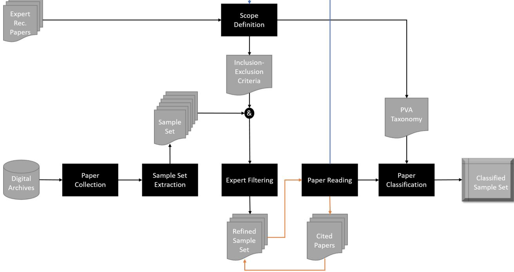

*Yafeng Lu, Rolando Garcia, Brett Hansen, Michael Gleicher & Ross Maciejewski / The State-of-the-Art in Predictive Visual Analytics* 542

Figure 1: *Flowchart illustrating our survey method. Papers and paper sources are colored gray; processes are colored black. Two important cycles exist in this diagram. First is the "read – follow citation link – read" cycle (marked in orange). This cycle illustrates the iterative process by which we collected relevant papers for the literature review. Second is the scope redefinition and paper re-classification cycle (marked in blue). This cycle represents the incremental process by which we delineated the scope of predictive visual analytics for the survey and improved our classification. By "sample set," we refer to the sample set of papers collected during this process.*

any paper published in IEEE VAST on or after the year 2010, if the paper was not already in our selection (158 papers). Thus, we reduced our sample set to a more manageable size of 580 papers which formed our long list for manual classification. Then, to further refine our sample, we pulled the abstracts for these papers and assigned them for reading and filtering to three of the authors, each. During the literature review process, we added new and relevant papers to our sample set by following citation links.

# 3.2. Expert Filtering & Sample Set Refinement

Three of the authors read each of the 580 abstracts. After reading an abstract, we marked whether the corresponding paper was in the scope of predictive visual analytics. We achieved an average pairwise percent agreement score of 90.66%. We collectively inspected any paper that caused a disagreement and found that the primary source of disagreement was that one author considered *risk assessment* to lie in the scope of predictive visual analytics. After discussion, we concluded that *risk assessment* would be too broad for our scope of predictive visual analytics. After we resolved our disagreements, we were left with a sample set of 57 papers. The sample set was distributed in equal parts among the three authors, where 6 of the papers assigned to a reader overlapped with another reader. As such, each author read 25 papers and coding results were collected and discussed to minimize the disagreements. As papers were categorized, citations were also explored to expand our coverage. The final sample in this survey consists of 72 PVA papers. To support the coding results, most of the papers are discussed as examples in corresponding sections in this paper.

# 3.3. Paper Reading & Sample Set Classification

During the literature review process, each author was instructed to classify each paper from three aspects: the type of the model integrated in the PVA work, the predictive analytics step involved in the PVA work, and the interaction techniques supported for predictive analytics. For paper categorization, we utilized quantitative content analysis [RLF14]. We began by classifying papers using the proposed PVA pipeline defined by Lu et al. [LCM∗16] and the interaction categorization defined by Yi et al. [YaKSJ07].

An initial categorization focused on model types including numerical and categorical, supervised and unsupervised, regression, classification, and clustering; however, many of these techniques proved to be sparsely represented in the literature and were grouped into an "other" category. Furthermore, the predictive visual analytics pipeline considered initially had only four steps (data preprocessing, feature engineering, modeling, and model selection and validation). As we discussed and refined our PVA definitions, model selection and validation was expanded into two different pieces of our PVA pipeline (result exploration & model selection

Table 1: *Predictive Visual Analytics Papers Coding Scheme*

| Aspect          | Category                             |  |  |  |  |  |  |  |  |  |
|-----------------|--------------------------------------|--|--|--|--|--|--|--|--|--|
|                 | Data Preprocessing                   |  |  |  |  |  |  |  |  |  |
| PVA Pipeline    | Feature Engineering                  |  |  |  |  |  |  |  |  |  |
|                 | Modeling                             |  |  |  |  |  |  |  |  |  |
|                 | Result Exploration & Model Selection |  |  |  |  |  |  |  |  |  |
|                 | Validation                           |  |  |  |  |  |  |  |  |  |
|                 | Select                               |  |  |  |  |  |  |  |  |  |
|                 | Explore                              |  |  |  |  |  |  |  |  |  |
|                 | Reconfigure                          |  |  |  |  |  |  |  |  |  |
| Interaction     | Encode                               |  |  |  |  |  |  |  |  |  |
|                 | Abstract/Elaborate                   |  |  |  |  |  |  |  |  |  |
|                 | Filter                               |  |  |  |  |  |  |  |  |  |
|                 | Connect                              |  |  |  |  |  |  |  |  |  |
|                 | Shepherd                             |  |  |  |  |  |  |  |  |  |
|                 | Regression                           |  |  |  |  |  |  |  |  |  |
| Prediction Task | Classification                       |  |  |  |  |  |  |  |  |  |
|                 | Clustering                           |  |  |  |  |  |  |  |  |  |
|                 | Other                                |  |  |  |  |  |  |  |  |  |
|                 |                                      |  |  |  |  |  |  |  |  |  |
|                 |                                      |  |  |  |  |  |  |  |  |  |

Figure 2: *The predictive visual analytics pipeline has two parts where the left components are interactively connected by visual analytics and the right component is a further validation step. Visual Analytics is added between Data Preprocessing, Feature Engineering, Modeling, and Result Exploration and Model Selection where the order of interaction is left to the system design or end-user.*

and validation). Similarly, the seven interaction types we started our categorization with were select, explore, reconfigure, encode, abstract/elaborate, filter, and connect [YaKSJ07]. After the reading and discussion, the final categories were expanded to include shepherd. The final paper coding scheme is shown in Table 1. The detailed coding results, together with prediction tasks of regression, classification, and clustering, are provided for each paper in Table 3 (see Appendix A). Additionally, we specified the model types compatible with each paper (e.g. agglomerative hierarchical clustering [BDB15]), and the visualization techniques used.

# 4. PVA Pipeline

We consider predictive visual analytics to fall squarely under the umbrella of human-machine integration and believe that a key as-

 c 2017 The Author(s) Computer Graphics Forum c 2017 The Eurographics Association and John Wiley & Sons Ltd. pect of such work should be supporting model comprehensibility [Gle16]. We define predictive visual analytics as visualization techniques that are directly coupled (through user interaction) to the predictive analytics process. The four steps of the predictive analytics pipeline (data preprocessing, feature engineering, model building, and model selection and validation) serve as a basis for defining the PVA pipeline (Figure 2). Our definition of the PVA pipeline is further informed by the knowledge discovery process of Pirolli and Card [PC05] and a variety of recent surveys on topics ranging from visual analytics pipelines and frameworks [CT05, KMS∗08, WZM∗16] to human-centered machine learning [BL09,SSZ∗16,TKC17] to knowledge discovery.

As a starting point for defining the PVA pipeline, we began with the four step pipeline of predictive analytics and general data mining [HPK11] consisting of: *Data Preprocessing*, *Feature Engineering*, *Model Building*, and *Model Selection and Validation*. Chen et al. [LCM∗16] extended this pipeline by adding an *Adjustment Loop* and a *Visualization* step allowing for the application of different visual analytics methods within the general data mining framework. Similar to previously proposed frameworks, our PVA pipeline is also built on top of the typical process of knowledge discovery. In this paper, we extend and modify Chen et al.'s pipeline, splitting the process into five steps: *Data Preprocessing*, *Feature Engineering*, *Modeling*, *Result Exploration and Model Selection*, and *Validation*, as shown in Figure 2. We separate the step *Model Selection and Validation* into two distinct steps, *Result Exploration and Model Selection* and *Validation*, and we represent the interactive analytics loop by bidirectionally connecting the first four steps with *Visual Analytics*. Our proposed pipeline highlights two specific aspects of PVA systems:

- Visual Analytics can be integrated into any of the first four steps iteratively so that these steps need not proceed in a specific order in every iteration.
- In the validation step, model testing can be applied. Model testing can use statistical tests or visual analytics approaches. If visual analytics is used, users are able to go back to the first four steps after validation, but the integration level must be shallow to prevent overfitting and conflation of testing and training data.

Given the tight coupling of interaction in the pipeline, we also provide a detailed categorization of interactions found in the predictive visual analytics literature, building off of Yi et al.'s interaction taxonomy [YaKSJ07]. To illustrate the difference between PVA and the general predictive modeling process, we summarize the goals of predictive analytics and compare those to what we see as the goals of predictive visual analytics in Table 2.

To date, few visual analytics systems have been developed to support the entire PVA pipeline. Some examples of the most comprehensive PVA systems are presented in Figure 3. Heimerl et al. [HKBE12] discussed three text document classification methods covering the first four steps in the PVA pipeline and used statistical model validation on the test dataset to demonstrate the effectiveness of the interactive visual analytics method (Figure 3a). iVis-Classifier [CLKP10] (Figure 3b) proposed a classification system based on linear discriminant analysis (LDA). This system emphasizes the data preprocessing step by providing parallel coordinates plots, heat maps, and reconstructed images for the user to explore

#### *Yafeng Lu, Rolando Garcia, Brett Hansen, Michael Gleicher & Ross Maciejewski / The State-of-the-Art in Predictive Visual Analytics* 544

|                                  | PA                           | PVA Exclusive                                       |
|----------------------------------|------------------------------|-----------------------------------------------------|
| Overall Goal                     | Make Prediction              | Support Explanation                                 |
| Data Preprocessing               | Clean and format data        | Summarize and overview the training data            |
| Feature Selection and Generation | Optimize prediction accuracy | Support reasoning and domain knowledge integration  |
| Modeling                         | Optimize prediction accuracy | Support reasoning and domain knowledge integration  |
| Result Exploration and Model Se  | Model quality analysis       | Get insights; Select the proper model; Feedback for |
| lection                          |                              | model updates                                       |
| Validation                       | Test for overfitting         | Get insights from other datasets                    |

Table 2: *The goal of each step in the PVA pipeline and the general predictive analytics procedure.*

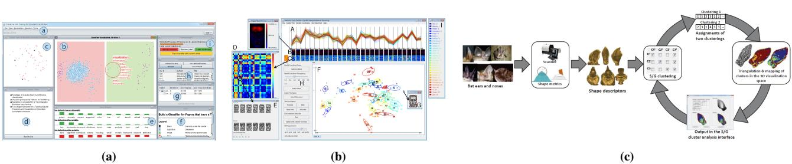

Figure 3: *Examples of PVA systems representing the entire PVA pipeline. (a) A document classifier training system [HKBE12] which includes document preprocessing, classification feature engineering, visual analytics supported active learning, result analysis after each iteration, and testing and validation. (b) iVisClassifier [CLKP10] supports data encoding and other optional preprocessing steps, visualizes reduced dimensions and cluster structures from linear discriminant analysis (LDA), but lacks the validation step. (c) Scatter/Gather Clustering [HOG*∗*12] has predefined data preprocessing and feature extraction steps and supports an interactive clustering process by updating the model with the expected number of clusters controlled by the user.*

the data structure with reduced dimensions. iVisClassifier's feature engineering and modeling steps are embedded in the classification process and involve significant manual work where users need to label the unknown data and trigger a new round of LDA by removing/adding labeled instances. However, iVisClassifier has only been demonstrated using case studies without a well-established testing and validation step. Scatter/gather clustering [HOG∗12] (Figure 3c) supports interactive clustering as part of the modeling phase where users can set soft constraints on the clustering method and compare results. However, its data preprocessing and feature extraction steps, although included in the system, is transparent to the user.

Other representative examples that cover the complete PVA process include a visual analytics framework for box office prediction [LKT∗14] allowing users to iterate through each step; a predictive policing visual analytics framework [MMT∗14]; Peak-Preserving [HJM∗11] time series prediction; and iVisClustering [LKC∗12] which implements a document clustering system based on latent Dirichlet allocation topic modeling (distinct from the LDA used in iVisClassifier). iVisClustering enables the user to control the parameters and update the clustering model via a Term-Weight view. It also supports relations analysis between clusters and documents by using multiple views to visualize the results.

Our analysis of papers indicates that visual analytics developers tend to focus only on portions of the PVA pipeline. Even in cases when all of the steps of the pipeline are found within a single system, several steps will often lack a direct connection to any visualization. Instead, many steps are often left as black-boxes to the user in order to focus on a subset of steps within the PVA pipeline. The most commonly neglected step tends to be the data preprocessing step and the formal validation step that utilizes testing of the prediction model. The formal validation step is quite rare in visual analytics papers, though simple performance measures are often reported. Given the lack of full pipeline support, we categorized the surveyed papers according to which of the PVA pipeline steps are supported.

# 4.1. Data Preprocessing

Data Preprocessing has two objectives. The first objective is to understand the data, and the second objective is to prepare the data for analysis. Typical preparation approaches include data cleaning, encoding, and transformation. Examples of systems where data preprocessing is firmly integrated into the predictive analysis loop include the work by Krause et al. [KPS16] which presents a visual analytics system, COQUITO, focusing on cohort construction by iteratively updating queries through a visual interface (Figure 4). The usability of this system has been demonstrated in diabetes diagnosis and social media pattern analysis. Other examples include the Peak-Preserving time series predictions by Hao et al. [HJM∗11] which supports noise removal prior to building prediction models for seasonal time series data. Lu et al. [LWM14] propose a system for predicting box-office revenue from social media data. Their system allows users to refine features by deleting noisy Twitter data which then updates the feature values. Other systems, such as iVisClustering [LKC∗12] and iVisClassifier [CLKP10], mention the data encoding process (i.e., given a text document, iVisClustering encodes the document set as a term-document matrix using a

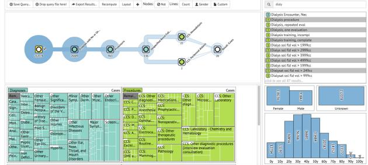

Figure 4: *An example of PVA work on data preprocessing. CO-QUITO [KPS16] is a visual analytics system supporting cohort construction with visual temporal queries for predictive analytics.*

bag-of-words model with stemming and stop words removal) but offer no visual analytics support in preprocessing.

What we find is that in predictive visual analytics, the data preprocessing step is commonly removed from the main analytic workflow. This is likely due to the time-consuming nature of data cleaning, and the fact that specific visualizations and interactions may be used for data preprocessing but are unlikely to be returned to during analysis. As such, visual analytics systems that focus solely on supporting the preprocessing step (e.g., Wrangler [KPHH11]) are often preferred to implement data preprocessing, and we should consider how to better integrate these tools to support a full predictive analytics pipeline.

# 4.2. Feature Engineering

Once data is ready for analysis, the second phase of the PVA pipeline is feature engineering. Feature engineering covers both feature generation and feature selection techniques, and has become a key focus in many visual analytics systems (e.g., Dim-Stiller [IMI∗10], rank-by-feature framework [SS05]) due to the complexity of feature engineering in large, high-dimensional datasets. A recent survey by Sacha et al. [SZS∗16] further documents the role of visualization in feature engineering, specifically dimensionality reduction.

In PVA systems, feature selection has been supported by parallel coordinates [TFA∗11,LKT∗14], scatter plots [BvLBS11], and matrix views [KLTH10]. For example, INFUSE [KPB14] (Figure 5a) supports feature selection by comparing different measures in classification. INFUSE proposes a visual feature glyph which displays the performance of the feature during cross-validation, and users can select a feature subset for classification modeling. Mühlbacher et al. [MP13] proposed a visual analytics system for segmented linear regression which supports feature selection and segmentation on single features as well as pairwise feature interactions (Figure 5b). SmartStripes [MBD∗11] helps experts identify the most useful subset of features by enabling the investigation of dependencies and interdependencies between different feature and entity subsets (Figure 5c).

Other relevant works have focused on feature space exploration coupled with visual interfaces to adjust feature metrics. For example, Guo et al. [GWR09] developed a visual analytics system to

 c 2017 The Author(s) Computer Graphics Forum c 2017 The Eurographics Association and John Wiley & Sons Ltd. support the exploration of local linear relationships among features in multivariate datasets. Dis-Function [BLBC12] allows the user to interact directly with a visual representation of the data to define an appropriate distance function. Dis-Function projects data points into a 2D scatter plot. The user may drag points to the region of the scatterplot that they consider more appropriate, and the system adjusts the distance function accordingly. The weights of the learned distance function provide a human-interpretable measure of feature importance. Krause et al. [KPN16] proposed an interactive partial dependence diagnostics tool for users to understand how features affect classification. Users can drill-down and understand the local effect with detail inspections. "What if" questions are also supported: users can change feature values to explore possible outcomes, which is useful for medical treatment.

In surveying PVA papers, we noticed that data transformation is under-served even though many predictive analytics algorithms require data inputs to have certain statistical distribution properties [MPK∗13]. Instead, the majority of techniques focus on dimension reduction, reconstruction (e.g., [ZLH∗16]), and feature space exploration. Currently, few systems provide support for feature generation. Examples of systems that support feature generation include FeatureInsight [BAL∗15], which supports building new dictionary features for a binary text classification problem by visualizing summaries of errors and sets of errors. Another example is Prospect [PDF∗11], which uses a scatterplot and a confusion matrix to visualize model performance and the agreement of multiple models. Users can remove label noise, select models, and generate new features to differentiate samples.

# 4.3. Modeling

Once features are selected by the analyst, we enter the modeling stage of the PVA pipeline. In this stage, machine learning and statistical models are typically applied to the data. The underlying goal is to fit a representation onto known data to predict unknown data. We observe that PVA methods often focus on applying a specific type of modeling process to the data (e.g., decision trees, support vector machines, hierarchical clustering, linear regression). From our survey analysis, PVA tools use three primary model types, *regression*, *classification*, and *clustering*. What our survey reveals is that model building is not usually separated from feature selection and result exploration, and interactions are often designed to support the iterative refinement of the model while exploring the data space, the feature space, and the results.

In predictive visual analytics, regression modeling has been used for a variety of applications, such as box office prediction [LKT∗14], epidemic diffusion analysis [AME11], and ocean forecasts [HMC∗13]. In these systems, visual analytics methods have focused on data subspace exploration, training set modification, outlier removal, model parameter tuning, and modeling with different targets and different optimization functions. For example, Guo et al. [GWR09] present a visual analytics system that helps analysts discover linear patterns and extract subsets of data following the patterns. They integrate automatic linear trend discovery and the interactive exploration of the multidimensional attribute space to support model refinement and data subset selection. Other work includes the system by Mühlbacher et al. [MP13] which enables

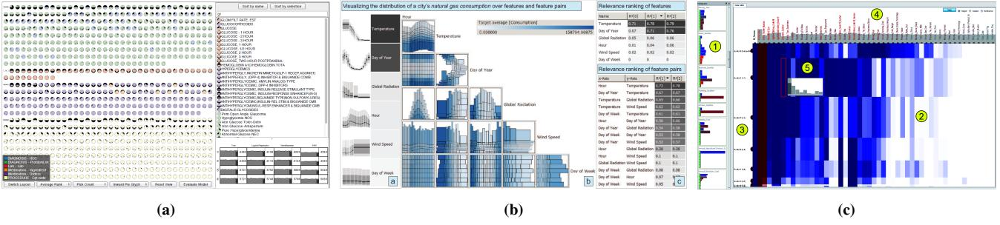

Figure 5: *Examples of feature engineering in the PVA pipeline. (a) INFUSE [KPB14] presented a novel feature glyph to visualize different measures of a feature as part of classification's cross-validation. This system supports reordering and other measure inspection for feature selection. (b) Segmented linear regression [MP13] is supported in this visual analytics system with 1D and 2D views of regression performance on simple features and pairwise feature interactions. (c) May et al. [MBD*∗*11] use dependencies and interdependencies between feature space and data space to guide feature selection.*

segmented linear regression model building by supporting feature selection and local model exploration.

Clustering is a common prediction task in many applications where labeled data is unavailable. Clustering challenges include choosing an appropriate similarity metric and validation due to the fact that models generated by clustering may not generalize. In clustering, visual analytics has been used for clustering manipulation, exploration, and evaluation. For example, ClusterSculptor [NHM∗07] utilizes a fine-grained bottom-up pre-clustering to reduce the data size and allows the user to apply a top-down clustering strategy with visual regroup. Rules can be learned from the clustering built by the user and used on more data points. Following a similar strategy, Andrienko et al. [AAR∗09] propose a visual analytics clustering method which starts by clustering a small set of data and then assigning new data to existing clusters. Clustering results are presented to the users, and users are able to interactively define new clusters and revise results to boost performance. Scatter/Gather Clustering [HOG∗12] allows the users to set indirect constraints on the number of clusters, and the system will perform scatter (changing from *N* clusters to *N* +1 clusters) or gather (changing from *N* clusters to *N* −1 clusters) iterations to update the clustering result. Dis-Function [BLBC12] allows the user to move data points on a 2D projected view and the system will learn and update its underlying distance function in the clustering method.

For classification, visual analytics has been used extensively to support active and incremental learning models where users interactively label a subset of the data to train the model. Heimerl et al. [HKBE12] presented a user-driven method that incorporates active learning for document classification. Visual cues are overlaid on unlabeled text documents representing their distance to the classification boundary and users can decide which data to include for the next model iteration. As shown in Figure 3a, the documents near the decision boundary are being inspected in the lens. Users can also manually assign the class label as part of the incremental modeling approach, and the system will highlight the data points whose prediction will change based on this update. Paiva et al. [PSPM15] used a Neighbor Joining tree and a similarity layout view for interpreting misclassified instances to support the labeling and training set selection as part of an incremental learning pro-

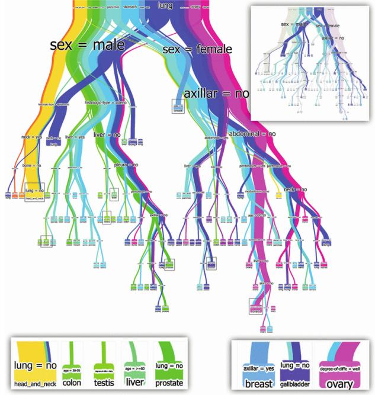

Figure 6: *An example of modeling with visual analytics. BaobabView [VDEvW11] uses a tree-like interactive view to support a manually controlled decision tree construction process.*

cedure. We find that this concept of interactively labeling data as part of a model learning process is also supported by other PVA works [BO13,HNH∗12,ZLH∗16].

Another focus of classification modeling in predictive visual analytics is decision tree construction. Work here has been demonstrated to improve both model accuracy and model comprehensibility. For example, Ankerst et al. [AEEK99] presented a visual classification approach on decision tree construction where circle segments are used to visualize the data attributes and clustering results. Users can manually select features, split nodes, and change

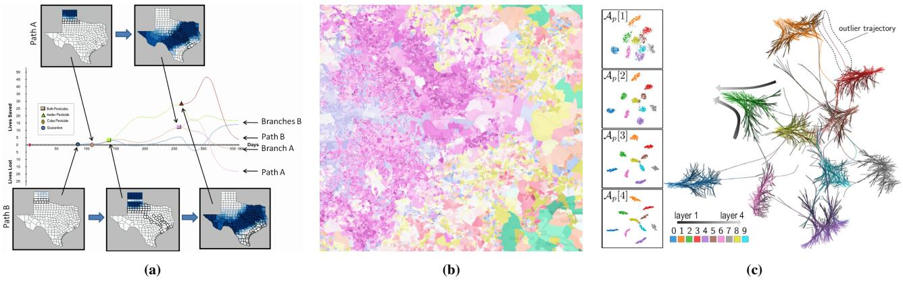

Figure 7: *Examples of result exploration for predictive analytics. (a) Afzal et al. [AME11] presented a decision history tree view to show prediction models' results as a branching time path. Users were allowed to add/remove mitigation measures for epidemic modeling. (b) Slingsby et al. [SDW11] present interactive graphics with color coded maps and parallel coordinates to explore uncertainty in area classification results from the Output Area Classification (OAC). (c) Rauber et al. [RFFT17] use projections to visualize the similarities between artificial neurons and reveal the inter-layer evolution of hidden layers after training.*

data labels while constructing the tree. Backtracking in the tree construction phase is also supported. More recent work includes BaobabView [VDEvW11] (Figure 6) which supports manual decision tree construction through visual analytics. BaobabView enables the model developer to grow the tree, prune branches, split and merge nodes, and tune parameters as part of the tree construction process. As shown in Figure 6, the color and the width of each branch represent the class and the sample size, respectively. Users are able to manually choose the splitting attributes and the value on the nodes. Additionally, neural networks and support vector machines have also been incorporated into predictive visual analytics works where the focus is on enabling users to understand the black-box modeling process of these algorithms [LSL∗16,TM05,CCWH08].

What we find in the modeling stage of the PVA pipeline is that a major focus is on both model configuration and model comprehensibility. Currently, some of the most popular classification algorithms are inherently black-box in nature, which has led to researchers asking questions about how and why certain algorithms come to their conclusions. Challenges here include how much of the model should be open and configurable to the user and what the best sets of views and interactions are for supporting modeling. Again, we see a relatively tight coupling of this stage in the PVA pipeline with the feature engineering stage. This is likely due to the iterative nature of the knowledge foraging process [PC05].

# 4.4. Result Exploration and Model Selection

Once a model is generated, the next step in the PVA pipeline is to explore the results and compare the performance among several model candidates (if more than one model is generated). In this step, scatterplots, line charts, and other diagnostic statistical graphics are often the primary means of visualization, and many variations of these statistical graphics have been proposed, e.g., the line chart with confidence ranges and future projections [BZS∗16], node-link layout for hierarchical clustering results [BvLH∗11], etc. In this phase, systems tend to support connect interactions to highlight and link relationships to explore and compare the outputs of the modeling process under different feature inputs.

Examples of result exploration in PVA include Afzal et al. [AME11] who present a decision history tree view to analyze disease mitigation measures. Users can analyze the future course of epidemic outbreaks and evaluate potential mitigation strategies by flexibly exploring the simulation results and analyzing the local effects in the map view (Figure 7a). Different paths can be displayed revealing prediction outcomes under different settings by deploying selected strategies. In this way, the user can explore model results and decide which strategy to use while comparing multiple cases. Slingsby et al. [SDW11] present geodemographic classification results using a map view, parallel coordinates, and a hierarchical rectangular cartogram. The parallel coordinates view is used to drive the Output Area Classification model and compare classification results given different parameterizations. The classification results and the uncertainty are also visualized on a map view, as shown in Figure 7b. Color is used to indicate the class and lightness is used to represent the uncertainty on the map. Lighter areas tend to be less typical of their allocated class. Rauber et al. [RFFT17] use dimension reduction techniques to project data instances and neurons in multilayer perceptrons and convolutional neural networks to present both the classification results and the relationships between artificial neurons (Figure 7c). Dendrogramix [BDB15] interactively visualizes clustering results and data patterns from accumulated hierarchical clustering (AHC) by combining a dendrogram and similarity matrix. iVisClustering [LKC∗12] visualizes the output of Latent Dirichlet allocation by displaying cluster relationships based on keyword similarity in a node-link cluster tree view. Users can explore the model results, and interactions support model refinement. Alsallakh et al. propose the confusion wheel [AHH∗14] and visualize true positive, false positive, false negative, and false positive classification results.

Along with result exploration, model selection methods have

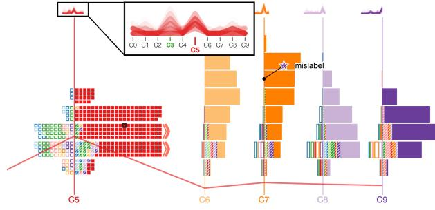

Figure 8: *An example of model selection. Squares [RAL*∗*17] uses small multiples composed of grids of different colors and visual textures to display the distribution of probabilities in classification.*

been employed to compare prediction results and model quality under different parameterizations. For example, Squares [RAL∗17] is a visual analytics technique to visualize the performance of the results of multiclass classification at both the instance level and the class level (Figure 8). Squares uses small multiples to support the analysis of the probability distribution of each class label in a classification, and it uses squares to visualize the prediction result and error type for each instance. Pilhöfer et al. [PGU12] use Bertin's Classification Criterion to optimize the display order of nominal variables and better interpret and compare clustering results from different models. Other techniques have explored methods for visually comparing clustering results under different parameters [MMT∗14,ZLMM16,ZM17] in geographical displays.

From our survey, we observe that there are many PVA works supporting result exploration and model selection. However, one under-supported topic is model comparison, i.e., comparing the results of two different classifiers such as a decision tree and a support vector machine. Furthermore, we note that many systems also have a distinct lack of provenance and history support. Result exploration often gets tied into the feature engineering process as many systems have been developed for feature steering and selection. As features are modified, results from the model are presented. Without the ability to save results, however, comparison can be difficult even within a model.

# 4.5. Validation

Finally, once a model is generated and the results are explored, validation is performed to test model quality. After training, heldout data (i.e. data that has not been used in the first four stages of the PVA pipeline) can be used to evaluate the performance of the model. This step is critical to verify the adequate of the model and that the model generalizes well to future or unknown data. Statistical measures such as accuracy, precision, recall, mean square error (MSE), and *R*2 *predicted* are commonly used to evaluate model performance. Currently, we do not consider the user's enjoyment measurement [BAL∗15] as part of the validation step in the PVA pipeline, but we argue that such measures should be an integral part of a PVA system. Similarly, efficiency and scalability are also not considered.

Common visualizations used in machine learning and data min-

ing for model validation include residual plots, the receiver operating characteristic (ROC) curve, and the auto-correlation function (ACF) plot. Hao et al. [HJM∗11] present a visual analytics approach for peak-preserving predictions where they visualize the certainty of the model on future data using a line chart with a certainty band. This work explores model accuracy on the training time series data by using color codes. K-fold cross-validation is used in INFUSE [KPB14] for feature selection, and Andrienko et al. [AAR∗09] apply the classifier to a new set of large-scale trajectories and calculate the mean distance of the class members to the prototype for validation.

Validations in PVA systems are also often done through case studies. An example case study was the 2013 VAST Challenge on box office predictions [KBT∗13, LWM13] where participating teams submitted predictions of future box-office revenues and ratings of upcoming movies using their visual analytics system (over the course of 23 weeks). The performance of these tools has been reported in follow-up papers [LWM14,EAJS∗14] and provides insights into the current design space of PVA. Other works include statistical tests for validating their PVA approaches. For example, BaobabView [VDEvW11] compares its classification accuracy to the automatic implementation of C4.5 [Qui14] on an evaluation set. Heimer et al. [HKBE12] separate training and test data and provide a detailed performance comparison of the three models they discussed to illustrate that the user-driven classification model outperforms others. Similar examples can be found in works from Ankerst et al. [AEEK99], Kapoor et al. [KLTH12], and Seifert and Granitzer [SG10].

What we observe in the survey is that validation is perhaps the most under-served stage in the PVA pipeline. In many PVA systems, the user is allowed to interact until the model outputs match their expectation; however, such a process is dangerous as it allows the user to inject their own biases into the process. More research should be done to explore the extent to which humans should be involved in the predictive analytics loop. This requires validation on the user side and methods for measuring a user's model comprehension. Insight generation should also be considered alongside measures of the predictive accuracy of the model.

# 5. Interactions in PVA

In addition to sorting papers by the stages that they support in the PVA pipeline, we also want to consider the type of interactions that are supported. We recognize that the types of interaction being supported can have both exploratory and explanatory value to the user while promoting the broader goal of making accurate predictions. We sort the PVA papers based on the interaction categories proposed by Yi et al. [YaKSJ07] and propose an additional interaction category, *Shepherd*. By *Shepherd*, we mean that the interactions could enable the user to guide the modeling process either directly or indirectly. This interaction type partially includes the annotation and labeling interaction type proposed by Sacha et al. [SZS∗16] (excepting those for information enrichment). During our classification, we also considered categorizing papers based on the use of semantic interaction [EFN12]. Given that semantic interaction intersects with multiple interaction types (e.g. searching, highlighting, annotating, and rearranging) we have chosen not to add this

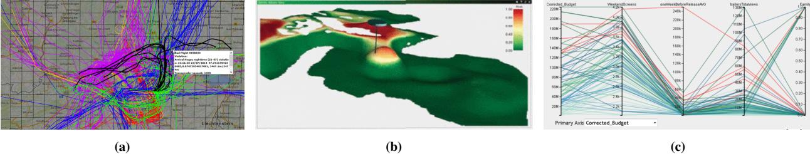

Figure 9: *User-interaction examples in PVA systems. (a) An example of select and elaborate: A map view shows selected flight trajectories in black. Details are displayed in a textbox-overlay. The user can select flight trajectories and view them in a different color at the forefront [BJA*∗*15]. (b) An example of explore: Here, a panel displays a simulated ocean surface in 3D. The user can explore the surface by panning [HMC*∗*13]. (c) An example of reconfigure: A Parallel Coordinates Plot shows the five most similar objects highlighted in red. The user can reconfigure the display by selecting the primary axis from the drop-down menu [LKT*∗*14].*

as a separate category. However, we mention semantic interaction since key applications have driven an underlying modeling process.

# 5.1. Select

Select interactions involve tagging items of interest so the user can track or easily discern them. As described by Yi et al. [YaKSJ07], select interactions are often the precursors to other interaction techniques, such as abstract/elaborate, connect, and shepherd. As such, select interactions are very common in the literature. Examples of select in the PVA pipeline includes work by Buchmüller et al. [BJA∗15] where the user is able to select flight trajectories. As shown in Figure 9a, the selected trajectories are colored in black and detail information for those trajectories are displayed in a textbox. This enables the user to find unusual flight behaviors and remove outliers from the training data. Raidou et al. [RCMM∗16] propose a visual analytics system for understanding Tumor Control Probability (TCP) models. This work supports the exploration of uncertainty and its effects on the model while facilitating parameter sensitivity with respect to user assumptions. Their system allows the user to select the TCP response or dosage in order to identify inter-patient variability to treatment response. In effect, the user selects or constrains the range of values an attribute can take, and the model and visualization are automatically updated. Thus, select is a precursor to explore and shepherd interactions. Brown et al. [BLBC12] present a system that allows an expert to interact directly with a multidimensional scaling (MDS) scatter plot to define an appropriate distance function. Their visual analytics system supports two kinds of selection. First, the user can select and highlight a data point in any one of the four coordinated views, and then the visual representation for that same point is highlighted across the other views. In this way, the user connects different visual representations, and select acts as a precursor to connect. Second, the user can tag and track data points when adjusting the distance function and re-drawing the MDS scatterplot. Thus, the user can see how tagged data points changed after the distance function was reweighted and the visual representation (the MDS scatterplot) was altered. In this sense, select is a precursor to shepherd and encode.

# 5.2. Explore (Browse)

Explore interactions enable the user to bring new items into view, usually by removing other items. This class of interaction changes the subset of data items that are displayed and is necessary when a data set is large or the size of the display is limited. This is useful for predictive visual analytics as explorations of highdimensional feature spaces often require bringing new items into view. Explore enables the user to examine and identify interesting data subsets, and this function can be critical in modeling. In predictive visual analytics, explore interactions are especially common in weather forecasting [DPD∗15,HMC∗13], environmental management [MBH∗12], and epidemic simulation [BWMM15] where large, high-dimensional data is being modeled. Höllt et al. [HMC∗13] present a system for interactive visual analysis in ocean forecasting where panning is used to explore the ocean surface (Figure 9b). Berger et al. [BPFG11] implement a focal point based exploration prediction method where the explore interaction is supported when the user updates the focal point. Updates to the focal point show the predicted values of the model that correspond to the focal point and allow the user to explore different modeling outcomes. Barlow et al. [BYJ∗13] enable the exploration of neighboring protein flexibility subspaces with a slider overlaid on a color-coded 2D flexibility plot. The size of the slider is adjustable by the user, and it can be moved vertically or horizontally to scan any region. Their system allows experts to understand what causes proteins to change shape under varying empirical parameters.

# 5.3. Reconfigure

Reconfigure interactions enable the user to change the spatial arrangement of a visual representation. By sorting, rearranging, or realigning visualization elements, the user is able to change their perspective and gain new insights. Reconfigure interactions are also used to remove occlusions and, in this capacity, reconfigure interactions share characteristics with explore interactions. For example, reordering the axes of a parallel coordinates plot is a reconfigure interaction. Algorithms for finding informative joint orders, such as the one presented by Pilhöfer et al. [PGU12], are promising for supporting reconfigure interactions in PVA systems. We have seen a variety of PVA methods that project and reorder visual elements to help users identify patterns and correlations that may further inform

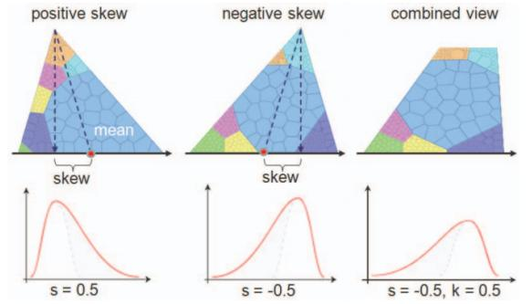

Figure 10: *An example of the encode interaction. An icon-based visualization of multidimensional clusters [CGSQ11] shows how the icon encodes skewness information for different values of s. The icon on the right encodes both kurtosis and skewness information. The user can interact with the visualization to enable or disable position and shape encoding of skewness and kurtosis.*

predictions. For example, Lu et al. [LKT∗14] present an interactive PVA system for social media data. Given the unstructured nature of social media data, this framework integrates curated and structured data from other sources to support a more robust analysis. Their system incorporates reconfigure in both the feature selection list layout (i.e. the user can sort columns based on their correlation to the response) and the parallel coordinates plot. As shown in Figure 9c, the user can reconfigure the display by selecting the primary axis from the drop-down menu and the color scheme of the lines will change. Other examples of reconfigure can be seen in SmartStripes [MBD∗11], an interactive system for the refinement of feature subsets. The feature partition view allows the user to understand the entity frequency with respect to some range of values (for ordinal features) or with respect to a distinct value (for nominal features). The user can reconfigure this view by re-ordering the stripes associated with the features.

# 5.4. Encode

Encode interactions fundamentally alter the visual representation of the data. Changing the number of dimensions in a visualization is a case of encode (e.g., introducing color to encode a person's weight in a height histogram). Whenever the user changes the visualization (e.g. from node-link diagram to adjacency matrix), or requests to see many visualizations of the data, the user is said to encode the data. Encode interactions enable the user to leverage the strengths of various visualization techniques to gain a clearer and deeper understanding of the properties and relationships in the data. Ideally, a PVA system could anticipate the user's interaction goals and display information pertinent to the modeling process.

An example of encode in predictive visual analytics is DI-CON [CGSQ11], an icon-based cluster visualization for users to evaluate multidimensional clustering results and their semantics. DICON allows the user to encode high-level statistical information (skewness and kurtosis) into the icon to aid in the evaluation of cluster quality (Figure 10). The embedding of statistical informa-

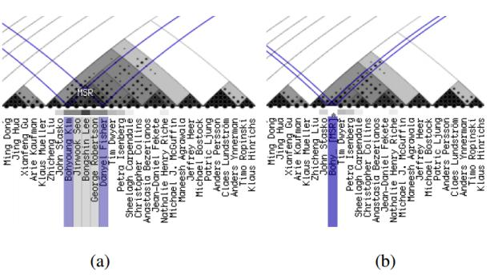

Figure 11: *A hybrid visualization of hierarchical clustering results demonstrating the cluster-folding feature of Dendrogramix [BDB15]. The folding interaction is an instance of abstraction.*

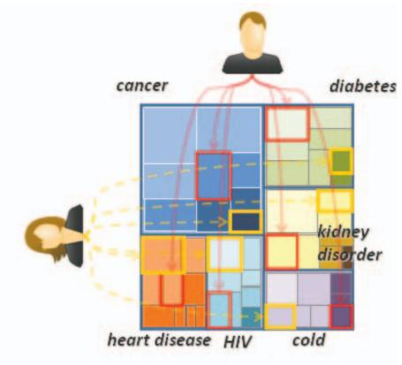

Figure 12: *An example of connect. An icon-based visualization of multidimensional clusters which connects multiple data features that correspond to the same entity through highlighting [CGSQ11].*

tion can be enabled or disabled through user-interactions depending on the analyst's information needs.

# 5.5. Filter (Query)

Filter interactions remove data items failing a user-specified condition from the display. Like explore, filter interactions change the subset of data items that are displayed. Filter and explore differ in that filter removes items of a different kind because they fail a condition, and explore removes items of the same kind because they do not fit in the display. Filter interactions enable the user to inject prior knowledge about what is relevant into the prediction process and can serve as a key interaction for domain knowledge integration (i.e., removing unimportant information). The filter interaction has been used extensively across the PVA pipeline. For example, May et al. [MBD∗11] incorporate filter interactions for feature subset selection by enabling users to select subsets of data entities. They argue that the most appropriate feature subset may change for different data subsets. Lu et al. [LKT∗14] also support

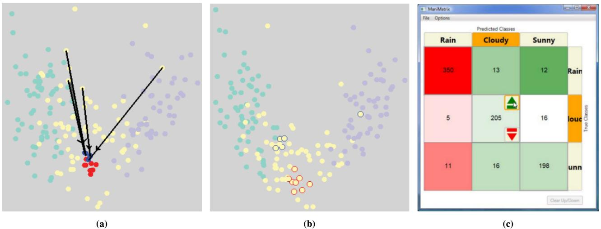

Figure 13: *Examples of shepherd interactions. (a) A multidimensional scaling scatterplot. The user can manipulate the visualization to reweight the distance function so that it better reflects her mental model [BLBC12]. (b) After the distance function is adjusted, the same red and blue points marked on the left figure now appear on the right figure with red and blue halos. (c) ManiMatrix, an interactive system that allows users to directly manipulate the confusion matrix to specify preferences and explore the classification space [KLTH10].*

filter interaction on both feature selection and data sample selection in model building. To be specific, users can brush on the axis shown in Figure 9c to filter out movies with a feature value out of the brushed range.

# 5.6. Abstract/Elaborate

Abstract/Elaborate interactions enable the user to view the data representation at various levels of granularity. As data sets become larger, methods for aggregating and abstracting the data become critical to provide an overview at different stages in the PVA pipeline. An example of Abstract/Elaborate in the PVA pipeline is Dendrogramix [BDB15], a hybrid tree-matrix visualization that superimposes the relationship between individual objects onto the hierarchy of clusters. Dendrogramix enables users to explain why particular objects belong to a particular cluster and blend information from both clusters and individual objects, which was not well supported by previous cluster visualization techniques. As shown in Figure 11, users can label clusters to generate a folded cluster containing these sub-classes, and we consider this interaction an instance of abstract. Users are also allowed to unfold the cluster by clicking on it, and we consider this interaction as instance of elaborate.

# 5.7. Connect

Connect interactions highlight links and relationships between entities or bring related items into view. Additionally, connect can be used to highlight features of the same entity distributed throughout a visualization grouped by features, such as a treemap [CGSQ11], or to highlight the same item across multiple coordinated views [BWMM15]. As shown in Figure 12, the treemap displays the multidimensional clusters of people based on their risk of having different disease. User can click on a region in the treemap to highlight other regions associating to the same person. Other examples of connect in PVA include the co-cluster analysis of bipartite graphs [XCQS16]. In this system, the user clicks on a record to select all related records and highlight all selected records across multiple views. This type of interaction is also commonly used in feature and data subspace search to help users understand clustering results. Work by Tatu et al. [TMF∗12] enables the connect interaction when selected clusters of objects are highlighted by colors among other subspaces and coordinated views for comparative exploration of their grouping structures.

# 5.8. Shepherd

The final interaction category is shepherd, which enables the user to guide the modeling process. Such a guide can be direct or indirect. Direct shepherding includes choosing model parameter settings (such as choosing the number of clusters in k-means) and model type selection (such as switching from k-means to hierarchical clustering). Indirect shepherding includes strong constraints (e.g., setting distance thresholds [AAR∗09], redefining distance functions interactively as in Figure 13a, and Figure 13b [BLBC12], or manipulating the confusion matrix as in Figure 13c) and soft constraints (e.g., model changing direction such as the expected classification distribution [KLTH12]) from the visual interface. While our definition of this category is broad enough to encompass *annotation* interactions, such as the expert-labeling of automatically misclassified data points, and other interactions that re-draw decision boundaries [MvGW11], we feel this needed to be a distinct category as the act of directing a model is unique to our context. For example, changing a feature value to update the model is one intuitive way of exploring "what if" questions in predictive analytics. We think there is a meaningful difference, as far as interaction is concerned, between changing the value of a target feature (class) or any other feature. Furthermore, if we are willing to concede that *annotation*

*Yafeng Lu, Rolando Garcia, Brett Hansen, Michael Gleicher & Ross Maciejewski / The State-of-the-Art in Predictive Visual Analytics* 552

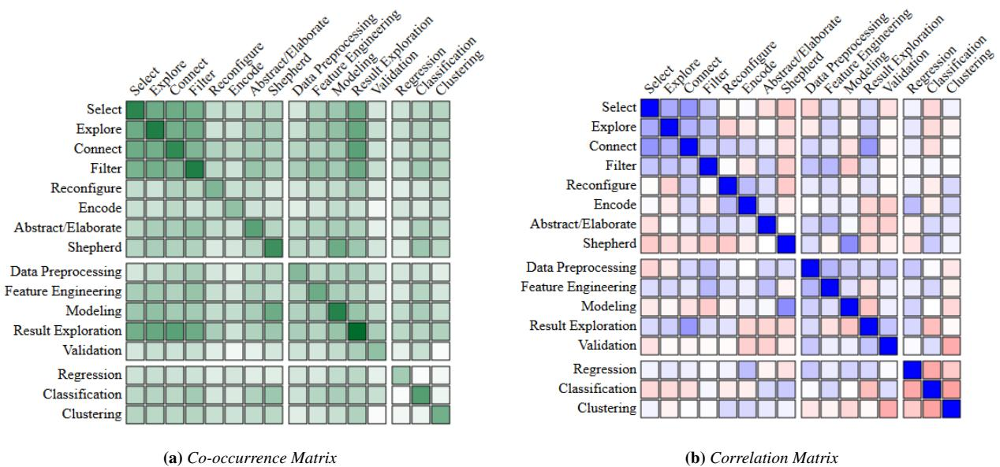

Figure 14: *Visual summary of the co-occurrence and correlation analysis of categories. (a) The co-occurrence matrix shows how often categories of interactions, model types used, and stages of the predictive visual analytics pipeline overlapped in our classification. (b) The correlation matrix shows the relationship between categorization terms. Blue indicates positive correlation, red indicates negative correlation, and white indicates no correlation. Note that* Result Exploration *refers to the* Result Exploration and Model Selection *step of the PVA pipeline due to the space limitations of the graph.*

or *class labeling* (in specific instances) is a *shepherd* interaction, then it follows that tweaking the features of a data point to gain a deeper understanding of the effect that particular feature has on prediction is also an instance of *shepherd*.

For illustrating this kind of interaction, consider *Prospector*, a visual analytics system for inspecting black-box machine learning models [KPN16]. *Prospector* enables the user to change the feature values of any data point to explore how that point's probability of belonging to some class is affected. Another example of shepherd can be found in Xu et al. [XCQS16] which proposes an interactive co-clustering visualization to facilitate the identification of node clusters formed in a bipartite graph. Their system allows the user to adjust the node grouping to incorporate their prior knowledge of the domain and supports both direct and indirect *shepherd*. Directly, the user can split and merge the clusters. Indirectly, the user can provide explicit feedback on the cluster quality, and the system will use the feedback to learn a parameterization of the co-clustering algorithm that aligns with the user's mental model.

# 6. Discussion

After several iterations of paper selection and refinement, we have been able to summarize the state-of-the-art in predictive visual analytics. In doing so, we have defined a pipeline for predictive visual analytics and described user interactions with different roles in terms of predictive modeling. In addition, we have investigated how the prediction tasks and interactions correlate with stages in the predictive visual analytics pipeline. Specifically, we have counted the number of times that categories co-occurred in our classification scheme and calculated a Pearson correlation coefficient for the pairwise categories based on our 72 labeled papers. Figure 14 provides a visual summary of the co-occurrence and correlation analysis with a symmetric matrix view. In summary, some interesting patterns found from these two analyses include:

- Function related interactions, such as select, filter, connect, and shepherd, are more fundamental to PVA and have been implemented more than encode and reconfigure.
- PVA stages are not often jointly supported and the modeling stage is relatively uncorrelated to all other stages.
- The data preprocessing and validation stages are less supported than other stages.

Co-Occurrence Between Categories: In Figure 14a, each cell describes the number of co-occurrences between two categories, where the top left block represents interaction co-occurrence, the middle block represents PVA pipeline stage co-occurrence, and the lower left block represents co-occurrence between the types of prediction tasks. The colors on the diagonal provide insight into the frequency at which a category is likely to be encountered in our data.

With respect to the interactions, we find that select, explore, connect, and filter, are the most widely used types of interaction and show strong co-occurrence in the data. They together cover 59 out of 72 papers. We see relatively fewer PVA methods that take advantage of *reconfigure*, *encode*, and *abstract/elaborate* interactions. Finally, given the modeling nature of PVA, we see strong support for *shepherd* interactions as well with 32 papers. The co-occurrence of shepherd with other interaction types is evenly distributed across all

*Yafeng Lu, Rolando Garcia, Brett Hansen, Michael Gleicher & Ross Maciejewski / The State-of-the-Art in Predictive Visual Analytics* 553

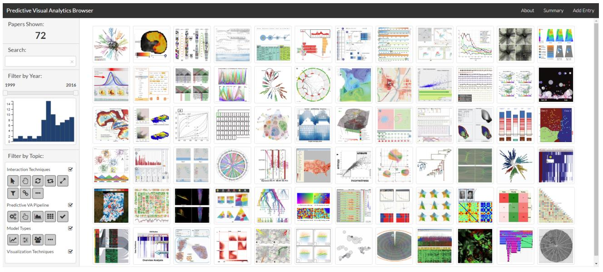

Figure 15: *Our web-based Predictive Visual Analytics Browser supports PVA paper organization, categorization, quick search, and filtering.*

other interaction types. We note that some interaction types are represented much more than others in the survey. This may be due to the fact that functions related to data exploration and model building (which requires a lot of select, filter, connect and shepherd interactions) are more fundamental to the PVA pipeline. Interactions that drastically modify the underlying visualization (*reconfigure* and *encode*) are supported far less often in the papers surveyed.

The co-occurrence matrix also confirms that current PVA works have tended to focus on modeling and result exploration. These stages of the pipeline are represented in 60 out of 72 papers. We also note that the validation stage is rarely covered. This may indicate that, much like data preprocessing, the steps that go into model validation require interactions and views that are disjoint from other steps in the PVA pipeline. We also note that there is very little strong co-occurrence between different stages in the PVA pipeline. This indicates that a strong coupling between steps in the PVA pipeline is still an ongoing research challenge.

Finally, observations on the modeling types indicate little cooccurrence between the models. This is unsurprising as different models tend to require different visualization approaches within the PVA pipeline and individual PVA systems usually utilize just one type of model (with very few exceptions). We also note that there are no overly dominant interaction type associations with the various model categories.

Correlation Between Categories: In Figure 14b, each cell represents the correlation between two categories. Blue indicates positive correlation, red indicates negative correlation, and white indicates no correlation. Darker shades of blue and red correspond to larger positive and negative correlations, respectively. As in the cooccurrence matrix, we order the correlation matrix by interactions, PVA pipeline stages, and the model types.

 c 2017 The Author(s) Computer Graphics Forum c 2017 The Eurographics Association and John Wiley & Sons Ltd.

From this analysis, we find that the four interaction types, select, explore, connect, and filter, are highly correlated, indicating that if one of these interactions is supported, the other three interactions are also likely to be supported. Positive correlations between select, explore, connect, and filter and the PVA pipeline stage result exploration and model selection—can also be observed, indicating that these interactions are highly relevant to these stages of the pipeline. Among other stages in the PVA pipeline, positive correlations can be observed between data preprocessing and feature engineering (0.29) as well as between result exploration and model selection and validation (0.23). Surprisingly, the modeling stage is found to be relatively uncorrelated to all other stages in the PVA pipeline indicating that more support is needed. Among the 18 papers having validation, 14 of them co-occur with result exploration and model selection. Similarly, among the 20 papers on data preprocessing, 12 also include feature engineering. This pattern conforms with the typical knowledge discovery process where feature engineering could be intertwined with data preprocessing (e.g., feature extraction in image processing and text analysis). The negative correlation between modeling and result exploration and model selection (-0.23) indicates that the current stages of the PVA pipeline are supported rather disjointly.

The shepherd interaction category has a positive correlation with the modeling stage, 24 out of the 32 shepherd papers co-occur with modeling. One example of the exceptions is Prospector [KPN16], where shepherd is used to tweak the features for "what if" analysis and understanding the effect of the features on the predictions. The connect interaction is positively correlated to the result exploration and model selection stage (0.40). Shepherd interactions are mostly used for modeling with a positive correlation (0.45). Feature engineering tends to use more filter and abstract/elaborate interactions. The interaction categories and pipeline steps are generally not correlated to prediction tasks (regression, classification, or clustering). A negative correlation can be observed between validation and clustering (-0.33). This indicates that validating clustering results is nontrivial and only one paper [AAR∗09] on clustering has validation among the papers we have surveyed.

PVA Browser: To support researchers interested in predictive visual analytics, we have developed a web-based, interactive browser similar to the TextVis Browser [KK15] showcasing the papers discussed in this survey (Figure 16). In the main panel, each paper is represented as a thumbnail chosen to be representative of the work. Clicking on a thumbnail reveals a popup that shows the metadata and a permanent link to the work as well as a list of which PVA pipeline categories are applicable to the paper according to our survey. The control panel allows users to search using the metadata of the papers, restrict papers by their year of publication, and select any combination of categories. Changes made in the control panel are simultaneously reflected in which thumbnails are shown. Categories are represented by an appropriate icon and reveal their full category name in a tooltip on hover. Initially, all categories are selected; a user may deselect or select any combination of categories and only those papers that use at least one of the selected categories will be shown.

# 7. Future Directions in PVA

Our analysis of the predictive visual analytics literature identified a number of trends in the current state-of-the-art. Here, we use that analysis to identify some key challenges for future work.

# 7.1. Knowledge Generation and Integration in PVA

Our definition of predictive analytics (Section 1) focuses on the use of data-centric methods for modeling. However, such modeling is rarely purely data-driven: human knowledge is valuable in both directions. First, human knowledge can be put into the models to improve their performance. Second, constructed models can be used for stakeholders to gain knowledge, although by our definition the goal of knowledge generation always occurs with the primary goal of making predictions. Predictive visual analytics offers the opportunity to help with knowledge transfer in both directions.

*Knowledge acquisition in modeling:* Visual analytics owes its success, in part, to its ability to integrate expert knowledge and tacit assumptions into the analysis process. The interaction techniques of visual analytics systems form an interface between the expert's mental ontology and the computer. Thus, the expert is able to supply missing information. We found four knowledge types that are generally well-supported by interactive systems: *taxonomic*, *relational*, *germane*, and *hazy*—listed in decreasing order of exactitude (Figure 16). In what follows, we provide PVA system examples for each knowledge type.

*Taxonomic knowledge* is the most exact, and is sufficient for assigning the relevant class or classes at the desired level of granularity to the known data point. The expert is thus able to rely on a mental concept hierarchy. This type of knowledge enables the expert to generate training data for a supervised model [SG10, HNH∗12, HKBE12], correct model classification errors [BTRD15, MW10],

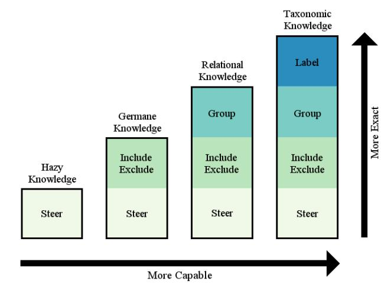

Figure 16: *The Knowledge Hierarchy. There are four types of knowledge: taxonomic, relational, germane, and hazy—listed in decreasing order of exactitude. The set of analyses an expert can perform by the type of her knowledge increases monotonically from hazy to taxonomic.*

and create more or fewer class labels as needed for the prediction task [AEK00].

Less exact, *relational knowledge* is sufficient for grouping data points [DDJB13, BO13, GRM10, BAL∗15], merging or splitting clusters [XCQS16], validating point-to-point proximity [BLBC12], and making queries about similar points [LKT∗14]. It is a knowledge about what is similar or different, what is near or far, and what is closely related. *Relational knowledge* is the most common type of knowledge integrated in PVA systems and is especially useful for unsupervised learning.

*Germane knowledge* results from experience-based intuition. It is informal and either impossible to articulate, or hard to articulate without deep reflection. Broadly, it is knowledge about what is relevant. Germane knowledge forms a basis for setting good model hyper-parameters, choosing appropriate thresholds or cut-offs, selecting relevant ranges or data subsets [BJA∗15,MBD∗11], and excluding outliers from the analysis process [BWMM15].

*Hazy knowledge*, as the name suggests, is the least exact type of knowledge. It enables the expert to feel satisfied or dissatisfied with the direction and progress of the analysis [HOG∗12], hint at error tolerance levels [KLTH10], and provide feedback about the interestingness of different models or visualizations through systemusage patterns [SSZ∗16].

Providing human knowledge in the predictive model construction process is clearly valuable. However, opening the black-box of predictive models for human intervention is not without issues. By giving users the option to integrate their domain knowledge, we have also allowed them to inject bias into the model. What's the point of using technology to learn something new when you're bending it to fit your pre-existing notions? More seriously, how can we regulate or constrain knowledge integration so that we get the benefits of domain knowledge, social and emotional intuition, and minimize the costs of introducing bias? How much human-in-theloop is the right amount? A recent study [DSM16] ran experiments on incentivized forecasting tasks where participants could choose to use forecasting outputs from an algorithm or provide their own inputs. The study found that letting people adjust an imperfect algorithm's forecasts would increase both their chances of using the algorithm and their satisfaction with the results. However, the authors also found that participants in the study often worsened the algorithm's forecasts when given the ability to adjust them. This further brings into question how much interaction should be provided in the PVA pipeline. Results from the forecasting study also indicated that people were insensitive to the amount that they could adjust the forecasts, which may indicate that interaction as a placebo could be an option. Given these results, it is clear that more studies are needed to provide clear guidelines for predictive visual analytics methodologies.

*Gaining Knowledge from Models:* Predictive visual analytics approaches can also help users gain knowledge from the constructed models. Ideally, a good PVA system should enable the expert to climb the knowledge hierarchy introduced above. For example, suppose Darcy is analyzing a database of peoples' names [GRM10]. She views a visual cluster layout and begins grouping names together based on her *relational knowledge*. Darcy knows that *Charlie* is more like *Matthew* and less like *Yao*; moreover, she sees that the clustering algorithm positions *Charlie* and *Matthew* near each other and away from *Yao*, but *Yao* appears near *Liu*. Soon, she realizes that the clustering algorithm is grouping people's names by nationality. If Darcy is able to identify the nationality of each cluster of names, she has gained *taxonomic knowledge*.

The set of analyses an expert can perform by the type of her knowledge increases monotonically from *hazy* to *taxonomic* (Figure 16); that is, an expert who has *taxonomic knowledge* can also group points together (*relational*), exclude outliers (*germane*), and feel satisfied or dissatisfied with the progress and direction of the analysis (*hazy*). Of course, an expert can at once have different levels of knowledge about different things: for example, a forensic analyst can have taxonomic knowledge about the different establishments a suspect entered, but only germane knowledge about the suspect's behavioral patterns.

Looking at recent work in the visual analytics community, we identify two main roles that PVA techniques generally play in extracting human knowledge from predictive models.

- 1. PVA methods provide multiple exploration views and models to enable data exploration and hypothesis generation. The injection of the domain knowledge is carried out indirectly through the exploration as interesting patterns or discoveries are found. We would classify these interactions as supporting hazy and germane knowledge. Here, analysts can reflect about the model and choose appropriate data ranges.
- 2. PVA methods focus on opening the black box of prediction models. The goal is to improve understandability of the modeling process and to enable domain knowledge injection into the modeling process. We would classify this as supporting relational knowledge and taxonomic knowledge where analysts

 c 2017 The Author(s) Computer Graphics Forum c 2017 The Eurographics Association and John Wiley & Sons Ltd. merge and split clusters, query about similar points and can correct classification errors or add labels to the data.

# 7.2. User Types Supported in PVA

While knowledge generation and integration are critical, the ability to climb the knowledge hierarchy may also be directly related to the type of user interacting with the system. Different users/analysts have different knowledge to contribute to the predictive analytics process, and also they have different demands from the system. As such, an ongoing challenge in predictive visual analytics is how to tailor systems for certain classes of users and what interactions within the PVA pipeline should be instantiated or hidden to reduce the potential for incorrect modeling. We identify three types of users to consider when developing PVA methods, based on their knowledge:

- End-users are experts in neither the domain nor the prediction methodology. They usually lack the necessary knowledge to understand advanced prediction models, and they may not be interested in mastering the technical knowledge that is auxiliary or accidental to the analysis. Examples of PVA systems to support end users include the works by Lee et al. [LKC∗12] and Elzen et al. [vdEHBvW16]. Heimerl et al.'s work [HKBE12] has a low demand for the user's knowledge as long as they have experience using web search engines.
- Domain experts master the knowledge in a particular field but generally are not experts in predictive modeling. Examples of PVA systems to support domain experts include the works by Zhang et al. [ZYZ∗16], Jean et al. [JWG16] and Migut and Worring [MW10].
- Modeling experts are the analysts that know the general process and reasoning behind predictive modeling but lack the specialized knowledge for specific applications. Examples of PVA applications that support modeling experts include the works by Elzen and Wijik [VDEvW11] and Mühlbacher et al. [MPG∗14].

Our survey found that the majority of PVA methods being developed focused on domain users. Given that a major goal of predictive visual analytics is to increase algorithmic performance via domain knowledge injection by the user, this is not surprising. However, systems that are useful for domain experts may not be useful for others. There is a need for explainability in science not only to experts, but also to the general public. As such, further research into how users with different backgrounds and goals interact with such systems is also an open area for exploration. Should all knowledge injection techniques be open for normal users or should there be techniques specific to domain users? Is there a hierarchy of which stages in the PVA pipeline to open based on user type? Does the importance of explainability vary for different users as well? These questions require further research in predictive visual analytics.

# 7.3. XAI and PVA

Data and computational resources are rapidly becoming more widely available. A central trend in modeling has been to employ increasingly large and sophisticated models that exploit these. This trend is typified by "deep learning" approaches that apply large scale network models to modeling problems such as prediction. Such approaches are often able to leverage large data to achieve impressive performance. However, this performance is not without a cost: such models are large, complex, and constructed automatically (especially in terms of feature engineering), making them difficult to interpret. While the predictive results may be accurate, if the generated model lacks interpretable meaning, then its predictive power is hampered [Pea03]. Interpretability is an important concern whenever AI techniques are utilized, and this problem is exacerbated with the emergence of deep models. The challenges of interpreting complex models are often referred to as *explainable AI* (or XAI for short). Interpretable models can serve many goals for a variety of stakeholders [Gle16].

An example in the requirement of explainable AI is the selfdriving car. Google's self-driving car project utilizes machine learning in order to generate models that can accurately process and respond to input from its sensors [Gui11]. The self-driving cars have now logged over 2 million miles on public roads with only a couple dozen accidents, only one of which was caused by the autonomous vehicle [Hig16]. This is an impressive safety record, but given the complexity of input and response the cars need to handle, it cannot be known if the cars will respond well in every situation. This is a prime example of an accurate predictive model that lacks interpretability in a domain where the interpretability of the model is of grave importance.

There has been a perceived trade-off between model interpretability and performance, however there may be other pathways to improving interpretability besides using simpler models with poorer performance. In terms of self-driving cars, it is conceivable that a better safety record would be traded for a simpler model that makes it easier to draft legislation and comply to regulations concerning autonomous vehicles [Sch16], however it is preferable to have both safety and comprehensibility. Research in explainable AI has explored approaches including generating descriptions of complex models and for interpreting complex models through a series of simpler ones (e.g., LIME [HAR∗16]).

Predictive visual analytics is currently being used to make complex models generated by black-box AI techniques simpler to interpret thus allowing for more accuracy. PVA systems can provide tools that aid in supervised learning to generate interpretable classification models [HKBE12, AHH∗14] or to allow the injection of domain knowledge during the construction of decision trees [VDEvW11]. However, PVA must find ways to scale to the increasingly large and complex models that are in use for emerging applications. This will require integration of the analysis methods emerging from XAI research, as well as developing more scalable interaction and visual paradigms. One source of ideas in this direction is to consider the entirety of the modeling process, not just examining the internals of the constructed models.

# 7.4. A Summary of Challenges in PVA

From our survey analysis and internal discussions, we have identified some key themes for future PVA research:

Integrating User Knowledge: With the integration of user's knowledge, bias may also be imported. As such, predictive visual analytics needs to capture and communicate not only data biases but also somehow capture and communicate human interaction biases within the system. For real-world predictions, factors such as human sympathy and social knowledge are critical for predictions such as stock market performance, security attacks, and elections. The challenge is in adapting predictive visual analytics methods to include these factors which are difficult to digitize and use in automatic models but may be critical in helping people make use of predictions.

Scaling to Larger and More Complex Models: As modeling is applied to more complex situations, new challenges emerge. For example, the arsenal of modeling techniques to address the wide range of needs is growing rapidly, making choosing proper model types challenging for analysts. Predictive visual analytics should enable users to not only compare different parameterizations of one model type but also enable between-model comparison.

Historically, PVA systems have focused on simpler model types, such as decision trees, but are currently evolving to consider more complex models, such as neural networks. PVA systems must not only meet the user needs in model complexity, but help in determining how to balance between the model complexity for better performance and the amount of knowledge users can add through more comprehension.

As models grow larger and more complex, efficiency also becomes an issue. Much of the power of PVA comes from interactivity which can be difficult to maintain as the modeling computations become more time consuming. Similarly, the visual approaches employed in PVA systems must be made to scale: modern data sets quickly grow beyond what can be presented directly in a visualization.

Better Model Validation Support: Model validation is a key part of predictive modeling, but it is not well-supported by current PVA tools. Cross validation and other introductory methods need further visual support, and as the validation experiments become increasingly complex (e.g., monte carlo bootstrapping approaches), support for understanding these validations will become a key challenge. In addition, predictive visual analytics must also be concerned with validating the visualizations and interactions proposed.

Improving the User Experience: Users have difficulty understanding complex prediction models, and they also could have difficulty understanding and using complex PVA systems. While complex tasks are usually supported comprehensively by complex systems, new approaches must make this functionality available to a broad spectrum of users. A key aspect of improving usability of PVA approaches will be to better consider and support both the analysis workflow and cooperation amongst analysts.

# 8. Acknowledgement

Some of the material presented here was supported by the NSF under Grant No. 1350573 and IIS-1162037 and in part by the U.S. Department of Homeland Security's VACCINE Center under Award Number 2009-ST-061-CI0001.

# References

- [AAR∗09] ANDRIENKO G., ANDRIENKO N., RINZIVILLO S., NANNI M., PEDRESCHI D., GIANNOTTI F.: Interactive Visual Clustering of
Large Collections of Trajectories. In *IEEE Symposium on Visual Analytics Science and Technology* (2009), IEEE, pp. 3–10. 8, 10, 13, 16, 23

- [AEEK99] ANKERST M., ELSEN C., ESTER M., KRIEGEL H.-P.: Visual Classification: An Interactive Approach to Decision Tree Construction. In *Proceedings of the fifth ACM SIGKDD international conference on Knowledge discovery and data mining* (1999), ACM, pp. 392–396. 8, 10, 23
- [AEK00] ANKERST M., ESTER M., KRIEGEL H.-P.: Towards an Effective Cooperation of the User and the Computer for Classification. In *Proceedings of the Sixth ACM SIGKDD International Conference on Knowledge Discovery and Data Mining* (New York, NY, USA, 2000), KDD '00, ACM, pp. 179–188. 16, 23
- [AHH∗14] ALSALLAKH B., HANBURY A., HAUSER H., MIKSCH S., RAUBER A.: Visual Methods for Analyzing Probabilistic Classification Data. *IEEE transactions on visualization and computer graphics 20*, 12 (2014), 1703–1712. 9, 18, 23
- [AKK∗13] AUER C., KASTEN J., KRATZ A., ZHANG E., HOTZ I.: Automatic, Tensor-Guided Illustrative Vector Field Visualization. In *IEEE Pacific Visualization Symposium* (2013), IEEE, pp. 265–272. 3
- [AKMS07] ASSENT I., KRIEGER R., MÜLLER E., SEIDL T.: VISA: Visual Subspace Clustering Analysis. *ACM SIGKDD Explorations Newsletter 9*, 2 (2007), 5–12. 23
- [AME11] AFZAL S., MACIEJEWSKI R., EBERT D. S.: Visual Analytics Decision Support Environment for Epidemic Modeling and Response Evaluation. In *IEEE Conference on Visual Analytics Science and Technology* (2011), IEEE, pp. 191–200. 1, 7, 9, 23
- [BAL∗15] BROOKS M., AMERSHI S., LEE B., DRUCKER S. M., KAPOOR A., SIMARD P.: FeatureInsight: Visual Support for Error-Driven Feature Ideation in Text Classification. In *IEEE Symposium on Visual Analytics Science and Technology* (2015), IEEE, pp. 105–112. 7, 10, 16, 23
- [BDB15] BLANCH R., DAUTRICHE R., BISSON G.: Dendrogramix: A Hybrid Tree-Matrix Visualization Technique to Support Interactive Exploration of Dendrograms. In *IEEE Pacific Visualization Symposium* (2015), IEEE, pp. 31–38. 5, 9, 12, 13, 23
- [BHJ∗14] BONNEAU G.-P., HEGE H.-C., JOHNSON C. R., OLIVEIRA M. M., POTTER K., RHEINGANS P., SCHULTZ T.: Overview and State-Of-The-Art of Uncertainty Visualization. In *Scientific Visualization*. Springer, 2014, pp. 3–27. 2, 3
- [BJA∗15] BUCHMÜLLER J., JANETZKO H., ANDRIENKO G., AN-DRIENKO N., FUCHS G., KEIM D. A.: Visual Analytics for Exploring Local Impact of Air Traffic. In *Computer Graphics Forum* (2015), vol. 34, Wiley Online Library, pp. 181–190. 11, 16, 23
- [BL09] BERTINI E., LALANNE D.: Surveying the Complementary Role of Automatic Data Analysis and Visualization in Knowledge Discovery. In *Proceedings of the ACM SIGKDD Workshop on Visual Analytics and Knowledge Discovery: Integrating Automated Analysis with Interactive Exploration* (2009), ACM, pp. 12–20. 5
- [BLBC12] BROWN E. T., LIU J., BRODLEY C. E., CHANG R.: Dis-Function: Learning Distance Functions Interactively. In *IEEE Symposium on Visual Analytics Science and Technology* (2012), IEEE, pp. 83– 92. 7, 8, 11, 13, 16, 23
- [BO13] BRUNEAU P., OTJACQUES B.: An Interactive, Example-Based, Visual Clustering System. In *17th International Conference on Information Visualization* (July 2013), pp. 168–173. 8, 16, 23
- [BPFG11] BERGER W., PIRINGER H., FILZMOSER P., GRÖLLER E.: Uncertainty-Aware Exploration of Continuous Parameter Spaces Using Multivariate Prediction. In *Computer Graphics Forum* (2011), vol. 30, Wiley Online Library, pp. 911–920. 11, 23
- [BTRD15] BABAEE M., TSOUKALAS S., RIGOLL G., DATCU M.: Visualization-Based Active Learning for the Annotation of SAR Images. *IEEE Journal of Selected Topics in Applied Earth Observations and Remote Sensing 8*, 10 (2015), 4687–4698. 16, 23

c 2017 The Author(s)

Computer Graphics Forum c 2017 The Eurographics Association and John Wiley & Sons Ltd.

- [But13] BUTLER D.: When Google Got Flu Wrong. *Nature 494*, 7436 (2013), 155. 1
- [BvLBS11] BREMM S., VON LANDESBERGER T., BERNARD J., SCHRECK T.: Assisted Descriptor Selection Based on Visual Comparative Data Analysis. In *Computer Graphics Forum* (2011), vol. 30, Wiley Online Library, pp. 891–900. 7, 23
- [BvLH∗11] BREMM S., VON LANDESBERGER T., HESS M., SCHRECK T., WEIL P., HAMACHER K.: Interactive Visual Comparison of Multiple Trees. In *IEEE Conference on Visual Analytics Science and Technology* (2011), IEEE, pp. 31–40. 9, 23
- [BWMM15] BRYAN C., WU X., MNISZEWSKI S., MA K.-L.: Integrating Predictive Analytics Into a Spatiotemporal Epidemic Simulation. In *IEEE Symposium on Visual Analytics Science and Technology* (2015), IEEE, pp. 17–24. 11, 13, 16, 23
- [BYJ∗13] BARLOWE S., YANG J., JACOBS D. J., LIVESAY D. R., AL-SAKRAN J., ZHAO Y., VERMA D., MOTTONEN J.: A Visual Analytics Approach to Exploring Protein Flexibility Subspaces. In *IEEE Pacific Visualization Symposium* (2013), IEEE, pp. 193–200. 11
- [BZS∗16] BADAM S. K., ZHAO J., SEN S., ELMQVIST N., EBERT D.: TimeFork: Interactive Prediction of Time Series. In *Proceedings of the 2016 CHI Conference on Human Factors in Computing Systems* (2016), ACM, pp. 5409–5420. 9, 23
- [CCWH08] CARAGEA D., COOK D., WICKHAM H., HONAVAR V.: Visual Methods for Examining SVM Classifiers. In *Visual Data Mining*. Springer, 2008, pp. 136–153. 9, 23
- [CGSQ11] CAO N., GOTZ D., SUN J., QU H.: DICON: Interactive Visual Analysis of Multidimensional Clusters. *IEEE transactions on visualization and computer graphics 17*, 12 (2011), 2581–2590. 12, 13, 23
- [CLKP10] CHOO J., LEE H., KIHM J., PARK H.: iVisClassifier: An Interactive Visual Analytics System for Classification Based on Supervised Dimension Reduction. In *IEEE Symposium on Visual Analytics Science and Technology* (Oct 2010), pp. 27–34. 1, 5, 6, 23
- [Cra08] CRANOR L. F.: A Framework for Reasoning About the Human in the Loop. *UPSEC 8* (2008), 1–15. 1
- [CT05] COOK K. A., THOMAS J. J.: *Illuminating the Path: The Research and Development Agenda for Visual Analytics*. Tech. rep., Pacific Northwest National Laboratory (PNNL), Richland, WA (US), 2005. 5
- [DDJB13] DUDAS P. M., DE JONGH M., BRUSILOVSKY P.: A Semi-Supervised Approach to Visualizing and Manipulating Overlapping Communities. In *17th International Conference on Information Visualisation* (2013), University of Pittsburgh. 16, 23
- [DPD∗15] DIEHL A., PELOROSSO L., DELRIEUX C., SAULO C., RUIZ J., GRÖLLER M., BRUCKNER S.: Visual Analysis of Spatio-Temporal Data: Applications in Weather Forecasting. In *Computer Graphics Forum* (2015), vol. 34, Wiley Online Library, pp. 381–390. 11, 23
- [DSM16] DIETVORST B. J., SIMMONS J. P., MASSEY C.: Overcoming Algorithm Aversion: People Will Use Imperfect Algorithms If They Can (Even Slightly) Modify Them. *Management Science* (2016). 1, 17
- [EAJS∗14] EL-ASSADY M., JENTNER W., STEIN M., FISCHER F., SCHRECK T., KEIM D.: Predictive Visual Analytics: Approaches for Movie Ratings and Discussion of Open Research Challenges. In *An IEEE VIS 2014 Workshop: Visualization for Predictive Analytics* (2014). 10
- [Eck07] ECKERSON W. W.: Predictive Analytics: Extending the Value of Your Data Warehousing Investment. *TDWI Best Practices Report. Q 1* (2007), 2007. 3
- [EFN12] ENDERT A., FIAUX P., NORTH C.: Semantic Interaction for Visual Text Analytics. In *SIGCHI Conference on Human Factors in Computing Systems* (2012), ACM, pp. 473–482. 10
- [GBP∗13] GOSINK L., BENSEMA K., PULSIPHER T., OBERMAIER H., HENRY M., CHILDS H., JOY K. I.: Characterizing and Visualizing Predictive Uncertainty in Numerical Ensembles Through Bayesian Model

Averaging. *IEEE transactions on visualization and computer graphics 19*, 12 (2013), 2703–2712. 23

- [Gle16] GLEICHER M.: A Framework for Considering Comprehensibility in Modeling. *Big Data* (2016). 1, 5, 18
- [GRM10] GARG S., RAMAKRISHNAN I. V., MUELLER K.: A Visual Analytics Approach to Model Learning. In *IEEE Symposium on Visual Analytics Science and Technology* (Oct 2010), pp. 67–74. 16, 17, 23
- [Gro13] GROENFELDT T.: Kroger Knows Your Shopping Patterns Better Than You Do, October 2013. [Online; posted 27-October-2013]. 1
- [Gui11] GUIZZO E.: How Google's Self-Driving Car Works. *IEEE Spectrum Online, October 18* (2011). 18
- [GWR09] GUO Z., WARD M. O., RUNDENSTEINER E. A.: Model Space Visualization for Multivariate Linear Trend Discovery. In *IEEE Symposium on Visual Analytics Science and Technology* (2009), IEEE, pp. 75–82. 7, 23
- [HAR∗16] HENDRICKS L. A., AKATA Z., ROHRBACH M., DONAHUE J., SCHIELE B., DARRELL T.: Generating Visual Explanations. In *European Conference on Computer Vision* (2016), Springer, pp. 3–19. 18
- [Hig16] HIGGINS T.: Google's Self-Driving Car Program Odometer Reaches 2 Million Miles. *The Wall Street Journal* (2016). 18
- [HJM∗11] HAO M. C., JANETZKO H., MITTELSTÄDT S., HILL W., DAYAL U., KEIM D. A., MARWAH M., SHARMA R. K.: A Visual Analytics Approach for Peak-Preserving Prediction of Large Seasonal Time Series. In *Computer Graphics Forum* (2011), vol. 30, Wiley Online Library, pp. 691–700. 6, 10, 23
- [HKBE12] HEIMERL F., KOCH S., BOSCH H., ERTL T.: Visual Classifier Training for Text Document Retrieval. *IEEE Transactions on Visualization and Computer Graphics 18*, 12 (2012), 2839–2848. 5, 6, 8, 10, 16, 17, 18, 23
- [HMC∗13] HÖLLT T., MAGDY A., CHEN G., GOPALAKRISHNAN G., HOTEIT I., HANSEN C. D., HADWIGER M.: Visual Analysis of Uncertainties in Ocean Forecasts for Planning and Operation of Off-Shore Structures. In *IEEE Pacific Visualization Symposium* (2013), IEEE, pp. 185–192. 7, 11, 23
- [HNH∗12] HÖFERLIN B., NETZEL R., HÖFERLIN M., WEISKOPF D., HEIDEMANN G.: Inter-Active Learning of Ad-Hoc Classifiers for Video Visual Analytics. In *IEEE Symposium on Visual Analytics Science and Technology* (2012), IEEE, pp. 23–32. 8, 16, 23
- [HOG∗12] HOSSAIN M. S., OJILI P. K. R., GRIMM C., MÜLLER R., WATSON L. T., RAMAKRISHNAN N.: Scatter/Gather Clustering: Flexibly Incorporating User Feedback to Steer Clustering Results. *IEEE Transactions on Visualization and Computer Graphics 18*, 12 (Dec 2012), 2829–2838. 6, 8, 16, 23
- [HPK11] HAN J., PEI J., KAMBER M.: *Data Mining: Concepts and Techniques*. Elsevier, 2011. 3, 5
- [IMI∗10] INGRAM S., MUNZNER T., IRVINE V., TORY M., BERGNER S., MÖLLER T.: DimStiller: Workflows for Dimensional Analysis and Reduction. In *IEEE Symposium on Visual Analytics Science and Technology* (2010), IEEE, pp. 3–10. 7, 23
- [Ins13] INSTITUTE S.: SAS 9.4 Language Reference Concepts, 2013. 2
- [JKM12] JANKOWSKA M., KEŠELJ V., MILIOS E.: Relative N-Gram Signatures: Document Visualization at the Level of Character N-Grams. In *IEEE Symposium on Visual Analytics Science and Technology* (2012), IEEE, pp. 103–112. 23
- [JWG16] JEAN C. S., WARE C., GAMBLE R.: Dynamic Change Arcs to Explore Model Forecasts. In *Computer Graphics Forum* (2016), vol. 35, Wiley Online Library, pp. 311–320. 17
- [KBT∗13] KRÜGER R., BOSCH H., THOM D., PÜTTMANN E., HAN Q., KOCH S., HEIMERL F., ERTL T.: Prolix-Visual Prediction Analysis for Box Office Success. In *IEEE Conference on Visual Analytics Science and Technology* (2013). 10
- [KJ13] KUHN M., JOHNSON K.: *Applied Predictive Modeling*. Springer, 2013. 2
- [KK15] KUCHER K., KERREN A.: Text Visualization Techniques: Taxonomy, Visual Survey, and Community Insights. In *IEEE Pacific Visualization Symposium* (April 2015), IEEE, pp. 117–121. 16
- [KLTH10] KAPOOR A., LEE B., TAN D., HORVITZ E.: Interactive Optimization for Steering Machine Classification. In *Proceedings of the SIGCHI Conference on Human Factors in Computing Systems* (2010), ACM, pp. 1343–1352. 7, 13, 16, 23
- [KLTH12] KAPOOR A., LEE B., TAN D. S., HORVITZ E.: Performance and Preferences: Interactive Refinement of Machine Learning Procedures. In *AAAI* (2012), Citeseer. 10, 13, 23
- [KMS∗08] KEIM D. A., MANSMANN F., SCHNEIDEWIND J., THOMAS J., ZIEGLER H.: Visual Analytics: Scope and Challenges. In *Visual data mining*. Springer, 2008, pp. 76–90. 5
- [KPB14] KRAUSE J., PERER A., BERTINI E.: INFUSE: Interactive Feature Selection for Predictive Modeling of High Dimensional Data. *IEEE transactions on visualization and computer graphics 20*, 12 (2014), 1614–1623. 7, 8, 10, 23
- [KPHH11] KANDEL S., PAEPCKE A., HELLERSTEIN J., HEER J.: Wrangler: Interactive Visual Specification of Data Transformation Scripts. In *Proceedings of the SIGCHI Conference on Human Factors in Computing Systems* (2011), ACM, pp. 3363–3372. 7
- [KPJ04] KING A. D., PRŽULJ N., JURISICA I.: Protein Complex Prediction via Cost-Based Clustering. *Bioinformatics 20*, 17 (2004), 3013– 3020. 3, 23
- [KPN16] KRAUSE J., PERER A., NG K.: Interacting With Predictions: Visual Inspection of Black-Box Machine Learning Models. In *Proceedings of the 2016 CHI Conference on Human Factors in Computing Systems* (2016), ACM, pp. 5686–5697. 7, 14, 15, 23
- [KPS16] KRAUSE J., PERER A., STAVROPOULOS H.: Supporting Iterative Cohort Construction With Visual Temporal Queries. *IEEE transactions on visualization and computer graphics 22*, 1 (2016), 91–100. 6, 7, 23
- [LCM∗16] LU J., CHEN W., MA Y., KE J., LI Z., ZHANG F., MA-CIEJEWSKI R.: Recent Progress and Trends in Predictive Visual Analytics. *Frontiers of Computer Science* (2016). 4, 5
- [LKC∗12] LEE H., KIHM J., CHOO J., STASKO J., PARK H.: iVis-Clustering: An Interactive Visual Document Clustering via Topic Modeling. In *Computer Graphics Forum* (2012), vol. 31, Wiley Online Library, pp. 1155–1164. 6, 9, 17, 23
- [LKKV14] LAZER D., KENNEDY R., KING G., VESPIGNANI A.: The Parable of Google Flu: Traps in Big Data Analysis. *Science 343*, 6176 (2014), 1203–1205. 1
- [LKT∗14] LU Y., KRÜGER R., THOM D., WANG F., KOCH S., ERTL T., MACIEJEWSKI R.: Integrating Predictive Analytics and Social Media. In *IEEE Symposium on Visual Analytics Science and Technology* (2014), IEEE, pp. 193–202. 6, 7, 11, 12, 16, 23
- [LSL∗16] LIU M., SHI J., LI Z., LI C., ZHU J., LIU S.: Towards Better Analysis of Deep Convolutional Neural Networks. *IEEE Transactions on Visualization and Computer Graphics PP*, 99 (2016), 1–1. 9, 24
- [LSP∗10] LEX A., STREIT M., PARTL C., KASHOFER K., SCHMAL-STIEG D.: Comparative Analysis of Multidimensional, Quantitative Data. *IEEE Transactions on Visualization and Computer Graphics 16*, 6 (Nov 2010), 1027–1035. 24
- [LWM13] LU Y., WANG F., MACIEJEWSKI R.: VAST 2013 Mini-Challenge 1: Box Office Vast-Team Vader. In *IEEE Conference on Visual Analytics Science and Technology* (2013). 10
- [LWM14] LU Y., WANG F., MACIEJEWSKI R.: Business Intelligence From Social Media: A Study From the Vast Box Office Challenge. *IEEE computer graphics and applications 34*, 5 (2014), 58–69. 6, 10, 24
- [MBD∗11] MAY T., BANNACH A., DAVEY J., RUPPERT T., KOHLHAMMER J.: Guiding Feature Subset Selection With an Interactive Visualization. In *IEEE Symposium on Visual Analytics Science and Technology* (2011), IEEE, pp. 111–120. 7, 8, 12, 16, 24

 c 2017 The Author(s) Computer Graphics Forum c 2017 The Eurographics Association and John Wiley & Sons Ltd.

- [MBH∗12] MEYER J., BETHEL E. W., HORSMAN J. L., HUBBARD S. S., KRISHNAN H., ROMOSAN A., KEATING E. H., MONROE L., STRELITZ R., MOORE P., ET AL.: Visual Data Analysis as an Integral Part of Environmental Management. *IEEE transactions on visualization and computer graphics 18*, 12 (2012), 2088–2094. 11, 24
- [MDK10] MAY T., DAVEY J., KOHLHAMMER J.: Combining Statistical Independence Testing, Visual Attribute Selection and Automated Analysis to Find Relevant Attributes for Classification. In *IEEE Symposium on Visual Analytics Science and Technology* (2010), IEEE, pp. 239–240. 24
- [MHR∗11] MACIEJEWSKI R., HAFEN R., RUDOLPH S., LAREW S. G., MITCHELL M. A., CLEVELAND W. S., EBERT D. S.: Forecasting Hotspots – A Predictive Analytics Approach. *IEEE Transactions on Visualization and Computer Graphics 17*, 4 (2011), 440–453. 24
- [MMT∗14] MALIK A., MACIEJEWSKI R., TOWERS S., MCCULLOUGH S., EBERT D. S.: Proactive Spatiotemporal Resource Allocation and Predictive Visual Analytics for Community Policing and Law Enforcement. *IEEE transactions on visualization and computer graphics 20*, 12 (2014), 1863–1872. 6, 10, 24
- [MP13] MÜHLBACHER T., PIRINGER H.: A Partition-Based Framework for Building and Validating Regression Models. *IEEE Transactions on Visualization and Computer Graphics 19*, 12 (2013), 1962–1971. 7, 8, 24
- [MPG∗14] MÜHLBACHER T., PIRINGER H., GRATZL S., SEDLMAIR M., STREIT M.: Opening the Black Box: Strategies for Increased User Involvement in Existing Algorithm Implementations. *IEEE transactions on visualization and computer graphics 20*, 12 (2014), 1643–1652. 17
- [MPK∗13] MACIEJEWSKI R., PATTATH A., KO S., HAFEN R., CLEVE-LAND W. S., EBERT D. S.: Automated Box-Cox Transformations for Improved Visual Encoding. *IEEE transactions on visualization and computer graphics 19*, 1 (2013), 130–140. 7
- [MPV15] MONTGOMERY D. C., PECK E. A., VINING G. G.: *Introduction to Linear Regression Analysis*. John Wiley & Sons, 2015. 2
- [MvGW11] MIGUT M., VAN GEMERT J., WORRING M.: Interactive Decision Making Using Dissimilarity to Visually Represented Prototypes. In *IEEE Symposium on Visual Analytics Science and Technology* (2011), IEEE, pp. 141–149. 13
- [MW10] MIGUT M., WORRING M.: Visual Exploration of Classification Models for Risk Assessment. In *2010 IEEE Symposium on Visual Analytics Science and Technology* (Oct 2010), pp. 11–18. 16, 17, 24
- [NHM∗07] NAM E. J., HAN Y., MUELLER K., ZELENYUK A., IMRE D.: Clustersculptor: A Visual Analytics Tool for High-Dimensional Data. In *IEEE Symposium on Visual Analytics Science and Technology.* (2007), IEEE, pp. 75–82. 8, 24
- [OJ14] OBERMAIER H., JOY K. I.: Future Challenges for Ensemble Visualization. *IEEE Computer Graphics and Applications 34*, 3 (2014), 8–11. 2
- [PBK10] PIRINGER H., BERGER W., KRASSER J.: HyperMoVal: Interactive Visual Validation of Regression Models for Real-Time Simulation. In *Computer Graphics Forum* (2010), vol. 29, Wiley Online Library, pp. 983–992. 1
- [PC05] PIROLLI P., CARD S.: The Sensemaking Process and Leverage Points for Analyst Technology as Identified Through Cognitive Task Analysis. In *Proceedings of international conference on intelligence analysis* (2005), vol. 5, pp. 2–4. 3, 5, 9
- [PDF∗11] PATEL K., DRUCKER S. M., FOGARTY J., KAPOOR A., TAN D. S.: Using Multiple Models to Understand Data. In *IJCAI Proceedings of International Joint Conference on Artificial Intelligence* (2011), vol. 22, Citeseer, p. 1723. 7, 24
- [Pea03] PEARL J.: Comments on Neuberg's Review of Causality. *Econometric Theory 19*, 04 (jun 2003). 18
- [PFP∗11] PAIVA J. G., FLORIAN L., PEDRINI H., TELLES G., MINGHIM R.: Improved Similarity Trees and Their Application to Visual Data Classification. *IEEE transactions on visualization and computer graphics 17*, 12 (2011), 2459–2468. 24

c 2017 The Author(s)

Computer Graphics Forum c 2017 The Eurographics Association and John Wiley & Sons Ltd.

- [PGU12] PILHÖFER A., GRIBOV A., UNWIN A.: Comparing Clusterings Using Bertin's Idea. *IEEE Transactions on Visualization and Computer Graphics 18*, 12 (Dec 2012), 2506–2515. 10, 11, 24
- [PSPM15] PAIVA J. G. S., SCHWARTZ W. R., PEDRINI H., MINGHIM R.: An Approach to Supporting Incremental Visual Data Classification. *IEEE transactions on visualization and computer graphics 21*, 1 (2015), 4–17. 8, 24
- [Qui14] QUINLAN J. R.: *C4. 5: Programs for Machine Learning*. Elsevier, 2014. 10
- [RAL∗17] REN D., AMERSHI S., LEE B., SUH J., WILLIAMS J. D.: Squares: Supporting Interactive Performance Analysis for Multiclass Classifiers. *IEEE Transactions on Visualization and Computer Graphics 23*, 1 (2017), 61–70. 10, 24
- [RCMM∗16] RAIDOU R., CASARES-MAGAZ O., MUREN L., VAN DER HEIDE U., RØRVIK J., BREEUWER M., VILANOVA A.: Visual Analysis of Tumor Control Models for Prediction of Radiotherapy Response. *Computer Graphics Forum 35*, 3 (2016), 231–240. 11, 24
- [RD00] RHEINGANS P., DESJARDINS M.: Visualizing High-Dimensional Predictive Model Quality. In *Proceedings of Visualization 2000.* (2000), IEEE, pp. 493–496. 24
- [RFFT17] RAUBER P. E., FADEL S. G., FALCAO A. X., TELEA A. C.: Visualizing the Hidden Activity of Artificial Neural Networks. *IEEE Transactions on Visualization and Computer Graphics 23*, 1 (2017), 101–110. 9, 24
- [RLF14] RIFF D., LACY S., FICO F.: *Analyzing Media Messages: Using Quantitative Content Analysis in Research*. Routledge, 2014. 4
- [SAS12] SAS PUBLISHING CO.: JMP ten modeling and multivariate methods, 2012. 2
- [Sch16] SCHERER M. U.: Regulating Artificial Intelligence Systems: Risks, Challenges, Competencies, and Strategies. *SSRN Electronic Journal* (2016). 18
- [SDW11] SLINGSBY A., DYKES J., WOOD J.: Exploring Uncertainty in Geodemographics With Interactive Graphics. *IEEE Transactions on Visualization and Computer Graphics 17*, 12 (2011), 2545–2554. 9, 24
- [SG10] SEIFERT C., GRANITZER M.: User-Based Active Learning. In *IEEE International Conference on Data Mining Workshops* (2010), IEEE, pp. 418–425. 10, 16, 24
- [Shm10] SHMUELI G.: To Explain or to Predict? *Statistical science* (2010), 289–310. 3
- [Sie13] SIEGEL E.: *Predictive Analytics: The Power to Predict Who Will Click, Buy, Lie, or Die*. John Wiley & Sons, 2013. 3
- [SK10] SHMUELI G., KOPPIUS O.: Predictive Analytics in Information Systems Research. *Robert H. Smith School Research Paper No. RHS* (2010), 06–138. 2, 3
- [SS02] SEO J., SHNEIDERMAN B.: Interactively Exploring Hierarchical Clustering Results [Gene Identification]. *Computer 35*, 7 (2002), 80–86. 24
- [SS05] SEO J., SHNEIDERMAN B.: A Rank-By-Feature Framework for Interactive Exploration of Multidimensional Data. *Information visualization 4*, 2 (2005), 96–113. 7
- [SSZ∗16] SACHA D., SEDLMAIR M., ZHANG L., LEE J., WEISKOPF D., NORTH S., KEIM D.: Human-Centered Machine Learning Through Interactive Visualization: Review and Open Challenges. In *Proceedings of the 24th European Symposium on Artificial Neural Networks, Computational Intelligence and Machine Learning* (2016). 5, 16
- [Sut14] SUTHAHARAN S.: Big Data Classification: Problems and Challenges in Network Intrusion Prediction With Machine Learning. *ACM SIGMETRICS Performance Evaluation Review 41*, 4 (2014), 70–73. 2
- [SZS∗16] SACHA D., ZHANG L., SEDLMAIR M., LEE J. A., PELTO-NEN J., WEISKOPF D., NORTH S., KEIM D. A.: Visual Interaction With Dimensionality Reduction: A Structured Literature Analysis. *IEEE Transactions on Visualization and Computer Graphics* (2016). 7, 10
- *Yafeng Lu, Rolando Garcia, Brett Hansen, Michael Gleicher & Ross Maciejewski / The State-of-the-Art in Predictive Visual Analytics* 560
- [TFA∗11] TAM G. K. L., FANG H., AUBREY A. J., GRANT P. W., ROSIN P. L., MARSHALL D., CHEN M.: Visualization of Time-Series Data in Parameter Space for Understanding Facial Dynamics. *Computer Graphics Forum 30*, 3 (2011), 901–910. 7, 24
- [TKC17] TAM G. K., KOTHARI V., CHEN M.: An Analysis of Machine-And Human-Analytics in Classification. *IEEE Transactions on Visualization and Computer Graphics 23*, 1 (2017), 71–80. 5
- [TM05] TZENG F.-Y., MA K.-L.: Opening the Black Box-Data Driven Visualization of Neural Networks. In *IEEE Visualization.* (2005), IEEE, pp. 383–390. 3, 9
- [TMF∗12] TATU A., MAASS F., FÄRBER I., BERTINI E., SCHRECK T., SEIDL T., KEIM D.: Subspace Search and Visualization to Make Sense of Alternative Clusterings in High-Dimensional Data. In *IEEE Conference on Visual Analytics Science and Technology* (2012), IEEE, pp. 63– 72. 1, 13, 24
- [TPH15] TRIVEDI S., PARDOS Z. A., HEFFERNAN N. T.: The Utility of Clustering in Prediction Tasks. *arXiv preprint arXiv:1509.06163* (2015). 3
- [TPRH11] TURKAY C., PARULEK J., REUTER N., HAUSER H.: Interactive Visual Analysis of Temporal Cluster Structures. In *Computer Graphics Forum* (2011), vol. 30, Wiley Online Library, pp. 711–720. 24
- [USK14] UENAKA T., SAKAMOTO N., KOYAMADA K.: Visual Analysis of Habitat Suitability Index Model for Predicting the Locations of Fishing Grounds. In *IEEE Pacific Visualization Symposium* (2014), IEEE, pp. 306–310. 24
- [vdEHBvW16] VAN DEN ELZEN S., HOLTEN D., BLAAS J., VAN WIJK J. J.: Reducing Snapshots to Points: A Visual Analytics Approach to Dynamic Network Exploration. *IEEE transactions on visualization and computer graphics 22*, 1 (2016), 1–10. 17
- [VDEvW11] VAN DEN ELZEN S., VAN WIJK J. J.: Baobabview: Interactive Construction and Analysis of Decision Trees. In *IEEE Symposium on Visual Analytics Science and Technology* (2011), IEEE, pp. 151–160. 8, 9, 10, 17, 18, 24
- [WFZ∗15] WANG Y., FAN C., ZHANG J., NIU T., ZHANG S., JIANG J.: Forecast Verification and Visualization Based on Gaussian Mixture Model Co-Estimation. In *Computer Graphics Forum* (2015), vol. 34, Wiley Online Library, pp. 99–110. 24
- [WWN∗15] WATANABE K., WU H.-Y., NIIBE Y., TAKAHASHI S., FU-JISHIRO I.: Biclustering Multivariate Data for Correlated Subspace Mining. In *IEEE Pacific Visualization Symposium* (2015), IEEE, pp. 287– 294. 24
- [WYG∗11] WEI J., YU H., GROUT R. W., CHEN J. H., MA K.-L.: Dual Space Analysis of Turbulent Combustion Particle Data. In *IEEE Pacific Visualization Symposium* (2011), IEEE, pp. 91–98. 24
- [WZM∗16] WANG X.-M., ZHANG T.-Y., MA Y.-X., XIA J., CHEN W.: A Survey of Visual Analytic Pipelines. *Journal of Computer Science and Technology 31*, 4 (2016), 787–804. 5
- [XCQS16] XU P., CAO N., QU H., STASKO J.: Interactive Visual Co-Cluster Analysis of Bipartite Graphs. In *IEEE Pacific Visualization Symposium* (2016), IEEE, pp. 32–39. 13, 14, 16, 24
- [YaKSJ07] YI J. S., AH KANG Y., STASKO J., JACKO J.: Toward a Deeper Understanding of the Role of Interaction in Information Visualization. *IEEE transactions on visualization and computer graphics 13*, 6 (2007), 1224–1231. 4, 5, 10, 11
- [ZLH∗16] ZHOU F., LI J., HUANG W., ZHAO Y., YUAN X., LIANG X., SHI Y.: Dimension Reconstruction for Visual Exploration of Subspace Clusters in High-Dimensional Data. In *IEEE Pacific Visualization Symposium* (2016), IEEE, pp. 128–135. 7, 8, 24
- [ZLMM16] ZHANG Y., LUO W., MACK E., MACIEJEWSKI R.: Visualizing the Impact of Geographical Variations on Multivariate Clustering. In *Computer Graphics Forum* (2016), vol. 35, Wiley Online Library, pp. 101–110. 10
- [ZM17] ZHANG Y., MACIEJEWSKI R.: Quantifying the Visual Impact of Classification Boundaries in Choropleth Maps. *IEEE Transactions on Visualization and Computer Graphics 23*, 1 (2017), 371–380. 10
- [ZYZ∗16] ZHANG C., YANG J., ZHAN F. B., GONG X., BRENDER J. D., LANGLOIS P. H., BARLOWE S., ZHAO Y.: A Visual Analytics Approach to High-Dimensional Logistic Regression Modeling and Its Application to an Environmental Health Study. In *IEEE Pacific Visualization Symposium* (2016), IEEE, pp. 136–143. 17

# Appendix A: Categorization Labels for Surveyed Papers

Table 3: *Results from the PVA categorization scheme. Papers are encoded according to their coverage of the PVA pipeline and interactions. Note that* Result Exploration *refers to the* Result Exploration and Model Selection *step of the PVA pipeline due to space limitations.*

|           | PVA pipeline  |                        |          | Interaction Categories |            |        |         |             |        |                    |        | Prediction Task |          |            |                |            |       |
|-----------|---------------|------------------------|----------|------------------------|------------|--------|---------|-------------|--------|--------------------|--------|-----------------|----------|------------|----------------|------------|-------|
| Paper     | Preprocessing | Engineering Feature | Modeling | Exploration Result  | Validation | Select | Explore | Reconfigure | Encode | Abstract/Elaborate | Filter | Connect         | Shepherd | Regression | Classification | Clustering | Other |
|           | Data          |                        |          |                        |            |        |         |             |        |                    |        |                 |          |            |                |            |       |
| [AAR∗09]  | *             |                        | *        | *                      | *          |        |         |             |        |                    | *      |                 | *        |            |                | *          |       |
| [AEEK99]  | *             |                        | *        |                        | *          |        |         |             |        | *                  |        |                 | *        |            | *              |            |       |
| [AEK00]   |               |                        | *        |                        |            |        |         |             |        |                    | *      |                 | *        |            | *              |            |       |
| [AHH∗14]  |               |                        |          | *                      |            | *      | *       |             |        |                    | *      | *               | *        |            | *              |            |       |
| [AKMS07]  |               |                        |          | *                      |            | *      |         |             |        |                    |        | *               | *        |            |                | *          |       |
| [AME11]   |               |                        |          | *                      |            | *      | *       |             |        |                    | *      | *               | *        |            |                |            | *     |
| [BAL∗15]  |               | *                      |          |                        |            |        | *       |             | *      | *                  | *      | *               |          |            | *              |            |       |
| [BDB15]   |               |                        |          | *                      |            |        |         | *           | *      | *                  |        | *               |          |            |                | *          |       |
| [BJA∗15]  | *             |                        | *        | *                      |            |        | *       |             |        | *                  | *      |                 | *        | *          |                |            |       |
| [BLBC12]  |               | *                      |          |                        |            | *      |         |             | *      |                    |        | *               | *        |            | *              | *          |       |
| [BO13]    |               |                        | *        |                        |            |        |         |             |        |                    |        |                 | *        |            |                | *          |       |
| [BPFG11]  | *             |                        | *        | *                      |            | *      |         |             | *      |                    |        | *               |          | *          |                |            |       |
| [BTRD15]  | *             |                        |          |                        |            |        |         |             |        |                    |        |                 | *        |            | *              |            |       |
| [BvLBS11] |               | *                      |          |                        |            |        |         |             |        | *                  | *      |                 |          |            |                |            | *     |
| [BvLH∗11] |               |                        |          | *                      |            | *      |         | *           |        |                    |        | *               |          |            |                |            | *     |
| [BWMM15]  |               |                        | *        |                        |            |        |         | *           | *      | *                  |        | *               |          | *          |                |            | *     |
| [BZS∗16]  |               |                        |          | *                      |            | *      |         |             |        |                    |        |                 |          | *          |                |            |       |
| [CCWH08]  |               |                        |          | *                      | *          |        | *       |             |        |                    |        |                 |          |            | *              |            |       |
| [CGSQ11]  |               |                        |          | *                      |            | *      | *       | *           | *      | *                  | *      | *               |          |            |                | *          |       |
| [CLKP10]  | *             | *                      | *        | *                      |            |        |         | *           |        | *                  | *      | *               |          |            | *              |            |       |
| [DDJB13]  |               |                        | *        |                        |            | *      | *       |             | *      |                    |        | *               |          |            |                | *          |       |
| [DPD∗15]  |               |                        |          | *                      | *          | *      | *       |             |        |                    | *      |                 |          |            |                |            | *     |
| [GBP∗13]  |               |                        |          | *                      | *          |        |         |             |        |                    |        |                 |          |            |                |            | *     |
| [GRM10]   |               |                        | *        |                        |            |        |         |             |        | *                  |        |                 | *        |            |                | *          |       |
| [GWR09]   |               | *                      | *        | *                      |            | *      | *       |             |        |                    | *      | *               | *        | *          |                |            |       |
| [HJM∗11]  | *             | *                      | *        | *                      | *          | *      | *       |             |        |                    |        | *               |          | *          |                |            |       |
| [HKBE12]  | *             | *                      | *        | *                      | *          | *      | *       |             |        | *                  | *      | *               | *        |            | *              |            |       |
| [HMC∗13]  |               |                        | *        |                        |            | *      | *       |             |        | *                  |        |                 | *        | *          |                |            | *     |
| [HNH∗12]  | *             | *                      | *        | *                      |            |        | *       |             |        | *                  | *      | *               | *        |            | *              |            |       |
| [HOG∗12]  |               |                        |          |                        |            |        |         |             |        |                    |        |                 |          |            |                |            |       |
| [IMI∗10]  | *             | *                      | *        | *                      |            |        | *       | *           |        |                    |        | *               | *        |            |                | *          |       |
|           |               | *                      |          |                        |            | *      | *       |             |        | *                  | *      |                 |          |            | *              | *          |       |
| [JKM12]   |               |                        | *        |                        |            | *      | *       |             |        |                    | *      |                 |          |            | *              |            |       |
| [KLTH10]  |               |                        | *        |                        |            |        |         |             |        |                    |        |                 | *        |            | *              |            |       |
| [KLTH12]  |               |                        | *        | *                      | *          |        |         |             |        |                    |        |                 | *        |            | *              |            |       |
| [KPB14]   |               | *                      |          |                        |            | *      |         | *           |        |                    | *      |                 |          |            | *              |            |       |
| [KPJ04]   |               |                        |          | *                      |            | *      | *       |             | *      |                    | *      | *               |          | *          |                |            |       |
| [KPN16]   | *             | *                      |          | *                      |            |        | *       |             |        | *                  | *      | *               | *        |            | *              |            |       |
| [KPS16]   | *             |                        |          |                        |            |        | *       |             |        | *                  | *      | *               |          |            |                |            | *     |
| [LKC∗12]  | *             | *                      | *        | *                      |            | *      |         |             |        | *                  | *      |                 | *        |            |                | *          |       |
| [LKT∗14]  | *             | *                      | *        | *                      | *          | *      | *       | *           |        |                    | *      | *               |          | *          |                |            |       |

|  |  |  | Yafeng Lu, Rolando Garcia, Brett Hansen, Michael Gleicher & Ross Maciejewski / The State-of-the-Art in Predictive Visual Analytics |
|--|--|--|------------------------------------------------------------------------------------------------------------------------------------|
|  |  |  |                                                                                                                                    |

562

|                      | PVA pipeline          |                        |          |                       | Interaction Categories |        |         |             |        |                    |        |         | Prediction Task |            |                |            |       |
|----------------------|-----------------------|------------------------|----------|-----------------------|------------------------|--------|---------|-------------|--------|--------------------|--------|---------|-----------------|------------|----------------|------------|-------|
| Paper                | Preprocessing Data | Engineering Feature | Modeling | Exploration Result | Validation             | Select | Explore | Reconfigure | Encode | Abstract/Elaborate | Filter | Connect | Shepherd        | Regression | Classification | Clustering | Other |
|                      |                       |                        |          |                       |                        |        |         |             |        |                    |        |         |                 |            |                |            |       |
| [LSL∗16]             |                       | *                      | *        | *                     | *                      | *      | *       | *           |        |                    |        | *       | *               |            |                |            | *     |
| [LSP∗10]             |                       |                        |          | *                     |                        |        |         | *           |        | *                  | *      |         |                 |            |                | *          |       |
| [LWM14]              | *                     |                        |          | *                     | *                      |        |         | *           | *      |                    | *      | *       |                 | *          |                |            |       |
| [MBD∗11]             | *                     | *                      |          |                       |                        |        |         | *           | *      | *                  | *      |         | *               | *          | *              | *          | *     |
| [MBH∗12]             |                       |                        | *        |                       |                        |        |         |             |        |                    |        |         | *               | *          |                |            | *     |
| [MDK10] [MHR∗11]  |                       | *                      | *        |                       |                        | *      |         |             | *      |                    | *      |         |                 |            | *              |            |       |
| [MMT∗14]             |                       |                        | *        |                       |                        | *      | *       |             |        |                    | *      |         |                 |            |                |            | *     |
|                      | *                     | *                      | *        | *                     | *                      | *      | *       | *           | *      |                    | *      | *       |                 | *          |                |            |       |
| [MP13]               |                       | *                      | *        | *                     |                        |        | *       |             | *      | *                  |        |         |                 | *          |                |            |       |
| [MW10] [NHM∗07]   |                       |                        | *        |                       |                        | *      | *       |             |        | *                  |        | *       | *               |            | *              |            |       |
| [PDF∗11]             |                       |                        | *        |                       |                        |        |         |             | *      | *                  |        |         | *               |            |                | *          |       |
| [PFP∗11]             | *                     | *                      |          |                       | *                      |        |         |             |        | *                  | *      |         |                 |            | *              |            |       |
|                      | *                     |                        |          | *                     |                        | *      |         |             |        |                    | *      | *       |                 |            |                |            | *     |
| [PGU12]              |                       |                        |          | *                     |                        |        |         | *           |        |                    |        |         |                 |            |                | *          |       |
| [PSPM15] [RAL∗17] |                       |                        | *        | * *                | * *                 | *      |         | *           |        | *                  | * * | * *  | *               |            | * *         |            |       |
| [RCMM∗16]            |                       |                        |          | *                     |                        |        | *       |             |        |                    | *      |         |                 | *          |                | *          |       |
| [RD00]               |                       |                        |          | *                     | *                      |        | *       |             |        |                    |        |         |                 |            | *              |            |       |
| [RFFT17]             |                       |                        |          | *                     |                        | *      | *       |             |        | *                  |        | *       |                 |            | *              |            |       |
| [SDW11]              |                       |                        |          | *                     |                        |        |         | *           |        |                    |        |         |                 |            | *              |            |       |
| [SG10]               |                       |                        | *        |                       | *                      |        |         |             |        |                    |        |         | *               |            | *              |            |       |
| [SS02]               |                       |                        |          | *                     |                        | *      | *       | *           |        | *                  | *      | *       |                 |            |                | *          |       |
| [TFA∗11]             |                       | *                      | *        |                       |                        | *      |         | *           | *      | *                  |        |         | *               |            | *              |            |       |
| [TMF∗12]             |                       |                        |          | *                     |                        | *      | *       |             | *      |                    | *      | *       | *               |            |                | *          |       |
| [TPRH11]             |                       |                        |          | *                     |                        | *      | *       |             |        |                    |        | *       |                 |            |                | *          |       |
| [USK14]              |                       |                        | *        | *                     |                        |        | *       |             |        |                    |        |         | *               |            |                |            | *     |
| [VDEvW11]            |                       |                        | *        |                       |                        |        | *       | *           | *      |                    |        |         | *               |            | *              |            |       |
| [WFZ∗15]             |                       | *                      |          |                       | *                      |        | *       |             |        |                    |        |         |                 |            |                |            | *     |
| [WWN∗15]             |                       |                        |          | *                     |                        | *      | *       |             |        |                    | *      | *       |                 |            |                | *          |       |
| [WYG∗11]             |                       | *                      |          |                       |                        | *      | *       |             |        |                    | *      |         |                 |            |                | *          | *     |
| [XCQS16]             |                       | *                      | *        |                       |                        | *      | *       | *           |        | *                  | *      | *       |                 |            |                | *          | *     |
| [ZLH∗16]             | *                     |                        | *        |                       |                        |        |         | *           | *      |                    |        |         | *               |            |                | *          |       |