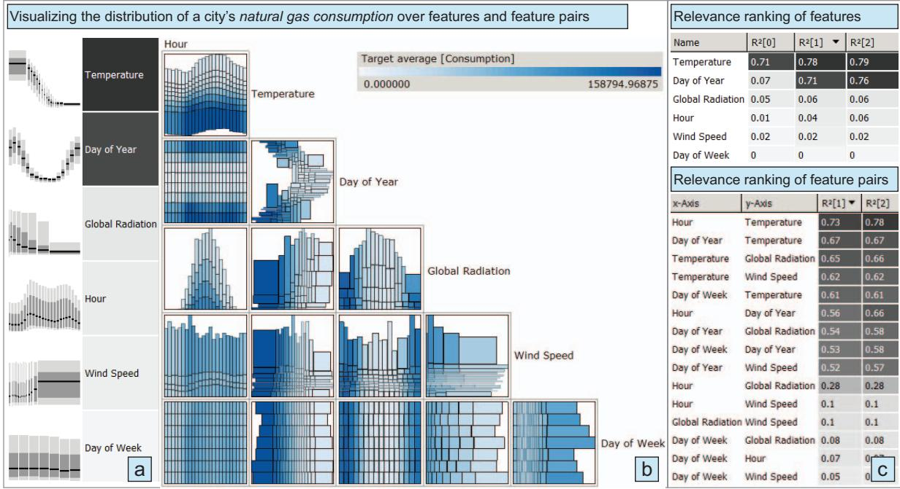
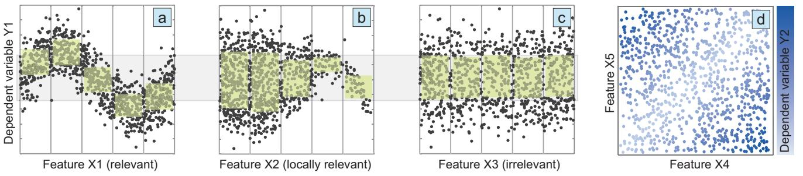
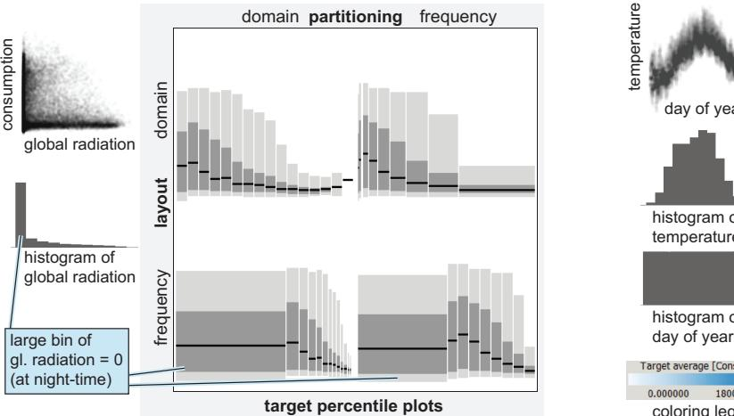
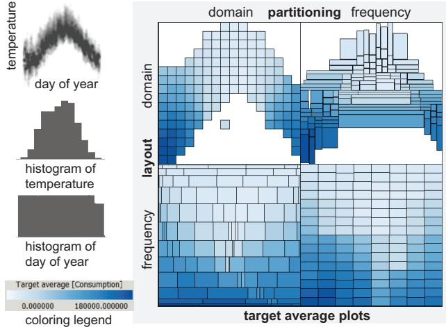
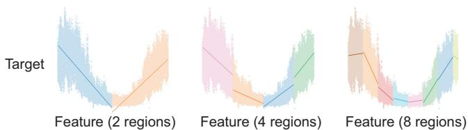
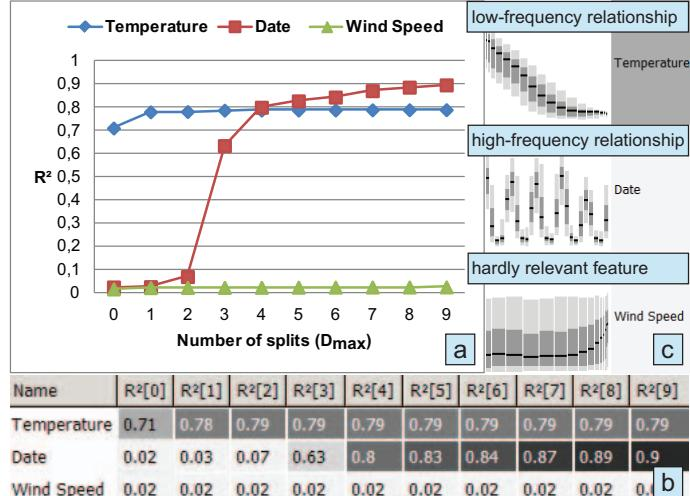
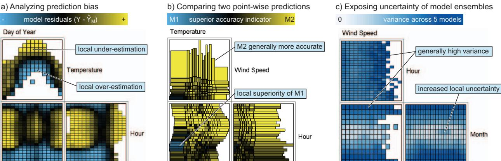
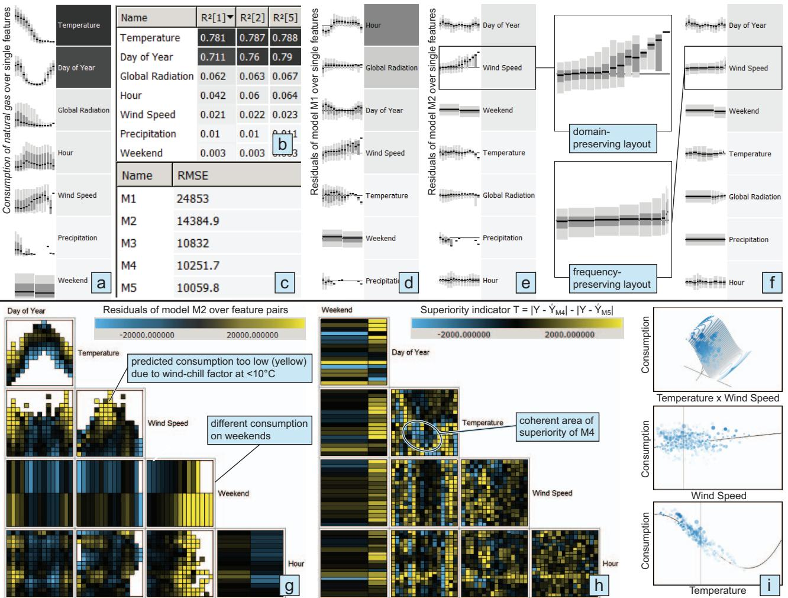

# A Partition-Based Framework for Building and Validating Regression Models

# Thomas M ¨uhlbacher and Harald Piringer

Fig. 1. Analyzing relationships using our framework: The conditional distribution of the dependent variable *natural gas consumption* is visualized over partitioned input features (a) and feature pairs (b), which are ranked by measures quantifying their relevance (c).

**Abstract**—Regression models play a key role in many application domains for analyzing or predicting a quantitative dependent variable based on one or more independent variables. Automated approaches for building regression models are typically limited with respect to incorporating domain knowledge in the process of selecting input variables (also known as feature subset selection). Other limitations include the identification of local structures, transformations, and interactions between variables. The contribution of this paper is a framework for building regression models addressing these limitations. The framework combines a qualitative analysis of relationship structures by visualization and a quantification of relevance for ranking any number of features and pairs of features which may be categorical or continuous. A central aspect is the local approximation of the conditional target distribution by partitioning 1D and 2D feature domains into disjoint regions. This enables a visual investigation of local patterns and largely avoids structural assumptions for the quantitative ranking. We describe how the framework supports different tasks in model building (e.g., validation and comparison), and we present an interactive workflow for feature subset selection. A real-world case study illustrates the step-wise identification of a five-dimensional model for natural gas consumption. We also report feedback from domain experts after two months of deployment in the energy sector, indicating a significant effort reduction for building and improving regression models.

**Index Terms**—Regression, model building, visual knowledge discovery, feature selection, data partitioning, guided visualization

### **1 INTRODUCTION**

Regression analysis is a statistical technique for modeling a quantitative dependent variable *Y* as a function of one or more continuous or categorical independent variables *X*1 to *Xn*. Common applications of regression models include prediction and sensitivity analysis of *Y* with respect to changes of independent variables. The field of sta-

• *Thomas M¨uhlbacher is with the VRVis Research Center. E-Mail: tm@vrvis.at.*

*Manuscript received 31 March 2013; accepted 1 August 2013; posted online 13 October 2013; mailed on 4 October 2013.*

*For information on obtaining reprints of this article, please send e-mail to: tvcg@computer.org.*

tistical learning has developed many types of regression models and techniques supporting the process of model selection [21]. This process comprises identifying suitable values for model-specific parameters as well as selecting a minimal descriptive subset of independent variables, also known as *feature subset selection* [19] (we use the term *feature* as a synonym for *independent variable* in this paper). Benefits of having a minimal number of features include an improved model interpretability, reduced training times, and a reduced probability of overfitting while still providing an accurate fit [21].

In general, the trade-off between model complexity and accuracy explains one challenge in building regression models. Another challenge arises from the inability of incorporating domain knowledge into common automatic feature selection techniques (e.g., step-wise regression [13]). As different techniques may yield different results and often reflect aspects of the training data rather than domain knowledge,

• *Harald Piringer is with the VRVis Research Center. E-Mail: hp@vrvis.at.*

Fig. 2. Synthetic examples motivating goals of our framework. (a - c) Local variations of the conditional distribution of a dependent variable *Y*1 explain *X*1 as relevant due to a non-monotonic relationship with *Y*1, *X*2 as locally relevant, and *X*3 as irrelevant. Green rectangles indicate local dispersion and gray rectangles show global dispersion of *Y*1 as measured by interquartile ranges. (d) Another dependent variable *Y*2 is explained by the interaction of two features *X*4 and *X*5.

"automated variable selection procedures are no substitute for careful thought" [1]. Additionally, many types of regression models imply structural assumptions (e.g., linear relationships). Knowledge about complex or local relationships (see Fig. 2a and b) as well as about interactions of variables (see Fig. 2d) is thus crucial for selecting an appropriate model type and for identifying suitable transformations of variables such as the logarithm, polynomial basis expansions (e.g., *X*2 = *X*2 1 ) or binary operations (e.g., *X*3 = *X*1 ·*X*2). According to recent studies of Kandel et al. [24], feature selection and transformation are two of the most time-consuming challenges in data analysis.

This paper proposes an interactive framework for building regression models addressing these challenges. The approach combines a visualization of relationships between features and a quantitative target and a quantification of these relationships for ranking them by relevance. Using derived quantities like residuals as target supports different tasks of model building including feature subset selection, model validation, and model comparison. A central goal is to enable the identification of complex relationships (e.g., having discontinuities or local extrema) and local relationships (i.e., features explaining the target across a part of their domain, see Fig. 2b). To achieve this goal, a key idea is *partitioning* the feature space into disjoint regions for visualization and for quantification, providing an adjustable level of detail between a point-wise and a global analysis [29]. The framework supports inspecting individual features as well as *pairs of features* in order to enable the discovery of arbitrary bivariate interactions (see Fig. 1).

The application background motivating this work is the need for accurate prediction models in the energy sector. Most figures of this paper and an exemplary case study (Sec. 5.1) refer to predicting the consumption of natural gas in a large city. In this domain, a precise knowledge of the combined effects of meteorological and other factors on the consumption is crucial for minimizing costs and guaranteeing supply. Operating on generic continuous or categorical data, however, the proposed framework is not limited to any domain but addresses very general issues of regression analysis and knowledge discovery. Specifically, the contributions of this paper include:

- techniques for ranking variables and pairs of variables by their usefulness in predicting a quantitative target.
- a design space of partition-based visualizations showing local structures in the target distribution over one or two variables.
- applications of the framework for model validation and comparison, and an interactive workflow for feature selection.
- an evaluation of the framework based on a case study of a realworld modeling task and user feedback after two months of deployment in the energy sector.

#### **2 RELATED WORK**

Interactive pattern discovery and model building are key issues of Visual Analytics. Examples include clustering [30], classification [47], and learning distance functions [8]. This paper focuses on *regressionrelated tasks*, such as feature selection and model validation.

Regression has traditionally been a key issue in statistics, resulting in a variety of model types [21] as well as methods supporting model selection [19], model comparison [27], and model validation [43]. Numerous measures have been proposed for quantifying relationships, many of them being limited to certain classes such as linear or monotonic relationships (e.g., Pearson correlation). As a more general indicator, the Maximum Information Coefficient (MIC) measures the mutual information of two features based on partitioning them at multiple resolutions [37]. Similar to our approach, the partitioning of MIC largely avoids structural assumptions, but we do not require a categorization of the dependent variable. More importantly, quantifying a relationship by a single value incurs a loss of information which may hide important structural aspects, e.g., due to data quality issues. For this reason, a comparison of multiple measures is advisable [1].

The Rank-by-Feature Framework (RbFF) [39] has been proposed as an interactive approach to support a comparison of statistical measures in combination with a visualization of qualitative aspects. The ability to handle univariate and bivariate measures and the good scalability for high-dimensional data motivated us to adopt the layout of the RbFF for our framework. However, the RbFF was neither designed to support regression-related tasks in general, nor the detection of relationships to a quantitative target in particular. The same is true for other techniques supporting an exploration of high-dimensional data by ranking visualizations based on screen-space metrics [50], class consistency measures [41], and the interestingness of point clouds [44].

A variety of approaches addresses the identification of multidimensional relationships in a more general sense. Besides common multivariate visualization techniques like scatterplot matrices [11] and parallel coordinates [23], some approaches explicitly denote a quantitative dependent variable. Guo et al. [18] support the discovery of multivariate trends. An interactive visualization of the model parameter space enables to detect multiple trends but is limited to linear models. Barlowe et al. [3] display distributions of partial derivatives for an identification of multi-dimensional relationships. The authors describe an interactive workflow for model construction, dimension reduction, and knowledge discovery. However, the interpretation of the visualizations may require significant training and it remains unclear in how far distributions of partial derivatives convey complex local structures. Other approaches support an exploration of relationships based on visualizing high-dimensional scalar functions by showing topological structures [16] or projections based on slicing [48, 45]. While useful for understanding an existing model, most tasks related to model building are not directly supported by such visualizations.

While some approaches address sensitivity analysis [17, 9], providing dedicated support for regression-related tasks has received little attention in Visual Analytics so far. Friendly uses shaded mosaic displays [15] to visualize averaged model residuals or target values across combinations of categorical dimensions. Described as a static diagram, this approach does not address aspects of high-dimensional data such as ranking and iterative feature selection. Moreover, handling continuous variables is not discussed. Berger et al. [6] use regression models for a continuous exploration of sampled parameter spaces, but do not cover model building. HyperMoVal [32] addresses the validation of regression models by relating validation data to function graphs of models based on slicing. However, this point-wise level of detail is inappropriate to provide an overview over local structures.

Partition-based visualization techniques address this shortcoming by providing an intermediate level of detail. Converting continuous data to a frequency-based representation is often referred to as binning [40]. The goal is reducing complexity and ensuring the scalability for many data samples while preserving local structures to some degree. Variable binned scatterplots adapt bin size to the characteristics of the data for visualizing large data without overlapping [20]. Slingsby et al. [42] explored the effects of alternative layouts in spacefilling hierarchical displays to show multiple aspects of large multivariate datasets. We provide a discussion of different layouts for partition-based visualizations of 1D and 2D domains in the context of regression.

Using partitioning for iterative feature subset selection, the work by May et al. [29] is most similar to ours. Mutual information measures between a target and partitioned features are visualized individually for each partition to show the local relevance while global aggregates rank features by relevance. Operating on a categorical target, their approach also supports classification while the required categorization of continuous targets introduces a problematic loss of detail for regression. In contrast, our framework does not categorize the target. This enables the visualization of local distributions as required for many tasks in regression. Moreover, our framework supports pairs of features as needed for detecting interactions between features.

#### **3 APARTITION-BASED FRAMEWORK FOR REGRESSION**

This section introduces our framework for regression-related tasks. The approach is to support an exploration of relationships between a feature space *X* of continuous or categorical independent variables *X*1 to *Xn* and a quantitative target *T*. As shown in Fig. 1, the main layout elements of our framework comprise tables of measures quantifying the relevance for individual features (1D) and pairs of features (2D) with respect to *T* as well as corresponding small-multiple visualizations conveying structural details of relationships. These visualizations include a list of plots (1D) and a half-diagonal matrix of plots showing all pair-wise combinations of features (2D). Ordering a table by a measure also ranks the corresponding small-multiple visualization as a guidance to potentially relevant plots (inferring an ordering for the matrix is discussed in previous work [31]).

The basis of visualization and ranking is the fact that relationships between a feature *Xi* or a pair of features *Xi*,*Xj* (henceforth abbreviated as *Xi*[,*Xj*]) and *T* manifest in local variations of the conditional distribution *P*(*T*|*Xi*[,*Xj*]) (see Fig. 2). Expressing the local mean values of the conditional distribution as a function is the fundamental concept of regression [21]. The key idea of our framework is approximating *P*(*T*|*Xi*[,*Xj*]) by *partitioning* the one- or two-dimensional domains into disjoint regions. Inspired by May et al. [29], the rationale is to provide an adjustable and computationally efficient level of intermediate detail between a point-wise and a global analysis.

The subsequent sections describe different aspects of partitionbased exploration of relationships: Section 3.1 discusses general considerations and approaches to partitioning *Xi*[,*Xj*]. Section 3.2 describes partition-based visualizations that approximate the conditional distribution of *T*. Section 3.3 discusses a partition-based quantification of relevance. In addition to exploring relationships between *X* and a user-selected dependent variable *Y* (i.e., *T* = *Y*), Section 3.4 describes the application of our framework to common tasks in statistical modeling by using various derived quantities as *T*. Details on how to perform the partitioning, the visualization, the ranking, and the application are to a large degree independent of each other and can be extended separately, which is the motivation for us to refer to our approach as a framework. Section 3.5 then extends this framework to support an interactive workflow for feature subset selection.

## **3.1 Partitioning** *Xi*[,*Xj*]

This section discusses general aspects of partitioning *Xi*[,*Xj*] which are the basis for partition-based visualization and ranking in subsequent sections. In computer science, subdivision is a key concept to reduce a complex problem to a set of more simple ones. In the context of multidimensional data, examples of hierarchical subdivision include search algorithms [12] and image processing [38]. In statistics, treebased methods in general [21] and regression trees in particular have received substantial attention in literature due to their ability to flexibly capture relationships of complex structure [7, 14].

Our approach to approximate *P*(*T*|*Xi*[,*Xj*]) is inspired by regression trees in that an adaptation to complex structures is based on considering disjoint regions of *Xi*[,*Xj*] separately from each other. However, we have different goals and constraints than most approaches to building regression trees. Rather than building an accurate regression tree for prediction, the goal of our approach is to locally approximate *P*(*T*|*Xi*[,*Xj*]) for a potentially large number of features. Due to this goal, an individual partitioning is required for each *Xi*[,*Xj*], as opposed to applying the same partitioning to all features [34]. The result of partitioning *Xi*[,*Xj*] is a set of disjoint regions where any data sample is contained in one region. For one-dimensional partitioning, each region is described by either a category if *Xi* is categorical or an interval if *Xi* is continuous. For two-dimensional partitioning, these restrictions independently apply to *Xi* and *Xj*, i.e., a region of two continuous features is an axis-aligned rectangle. Besides simplicity, the main reason for these restrictions is to enable a flexible visualization (see Sec. 3.2).

We identified three requirements for partitioning *Xi*[,*Xj*]: 1) *General applicability:* Assumptions about the distribution of *Xi*[,*Xj*] should be avoided. 2) *Fast computation:* In the sense of Visual Analytics, the ultimate goal is to provide an interactive framework enabling workflows which tightly couple user-centric and computation-centric steps (see Sec. 3.5). Significant delays should thus be avoided when users change *T*, *X* or partition-specific parameters. Therefore, partitioning all *Xi*[,*Xj*] should be feasible within at most a few seconds also in case of a large number of features for 1D and especially 2D analysis. 3) *Adjustability:* The degree of detail should be adjustable intuitively. This implies that regions should have a similar size in some sense in order to make regions comparable for a given distribution of data.

Concerning adjustability, the size of a region can be interpreted in different ways, i.e., as the size in the *domain* of *Xi*[,*Xj*], or as the size with respect to the *number of data samples*. As a consequence, our framework supports two different approaches for partitioning *Xi*[,*Xj*]. Domain-uniform partitioning. This approach subdivides each continuous feature *Xi* into *N* intervals of equal domain size between the minimum and the maximum of *Xi*. The parameter *N* thus adjusts the degree of detail of the partitioning. For categorical features, the categorization is taken as subdivision. For feature pairs, the regions are the Cartesian product of the individual subdivisions of *Xi* and *Xj*. Domainuniform partitioning has linear effort and is very fast. However, the distribution of data samples within *Xi*[,*Xj*] is ignored. While this may be desirable, it is generally a problem in the presence of outliers and non-uniform distributions. Specifically, many resulting regions may be empty or contain a statistically insignificant number of samples.

Frequency-uniform partitioning. The goal of this approach is to define regions containing an identical (or at least similar) number of data samples, i.e., having a same relative frequency. Inspired by Kdtrees [5], the key concept is based on a binary hierarchical subdivision of continuous features by recursively splitting the data at the median of the respective subset of samples. In order to be also applicable to ordinal data, our consideration is that data samples having identical values in *Xi*[,*Xj*] must be assigned to the same region. In this case, we shift the splitting location into the direction that generates more equally-sized subsets. For nominal data, the categorization is taken as the subdivision even for differently sized categories. For feature pairs, the subdivisions of *Xi* and *Xj* are interleaved, starting with the feature where the median is closer to the center of the domain. In case of a categorical feature *Xi* and a continuous *Xj*, the approach splits *Xj* separately for each category of *Xi*, i.e., the subdivision of *Xi* is done first. The recursion stops if either (1) the entire subset of data samples has identical values in *Xi*[,*Xj*] or (2) a split would create at least one region having less than a user-defined minimal significance *Smin* of data samples, or (3) the recursion of any dimension has reached a maximal depth *Dmax*. The reason for criterion 3 is to enforce a comparable degree of detail for any feature *Xi* in different pair-wise combinations *Xi*,*Xj* and *Xi*,*Xk* which is largely independent of *Xj* and *Xk*.

# **2D avg. consumption (color) / day (x-axis) and temperature (y-axis)**

Fig. 3. Our design space of partition-based visualizations of relationships. While domain-preserving layouts are more intuitive to interpret, frequency-preserving layouts compensate for non-uniform distributions of *Xi*[,*Xj* ].

Without criterion 3, *Xj* being categorical could lead to a much more fine-grained subdivision of *Xi* than achieved for *Xk* being continuous. In general, *Dmax* is the key parameter for adjusting the degree of detail while *Smin* ensures the significance for subsequent processing independently of the number of data samples.

An alternative to domain-uniform and frequency-uniform partitioning could be to maximize homogeneity of a region with respect to the structure of *P*(*T*|*Xi*[,*Xj*]), as done for building regression trees [7]. However, finding optimal positions for splitting involves more computational effort, contradicting our requirement of fast computation. Moreover, changing *T* in the course of a workflow also requires a complete re-computation of the partitioning, which is not the case for domain- and frequency-uniform partitioning. For these reasons, our implementation of the framework currently does not support partitioning approaches that depend on the structure of *P*(*T*|*Xi*[,*Xj*]). Conceptually, however, supporting these approaches would be compatible with the visualization and ranking mechanisms described below, provided that the shape of the resulting regions complies with the requirements stated above.

#### **3.2 Partition-Based Visualization of Relationships**

As motivated above, the key idea of our framework is to support an analysis of local variations of the conditional distribution *P*(*T*|*Xi*[,*Xj*]) by partitioning *Xi*[,*Xj*] into disjoint regions. This section discusses considerations regarding the representation of this partitioning for visualization. As opposed to quantitative relevance measures (see Sec. 3.3), the goal of the visualization is to convey qualitative aspects of relationships such as location, shape, and significance of structures. In addition to considerations regarding the partitioning itself as discussed in Sec. 3.1, we identified two central design issues regarding partition-based visualizations of *P*(*T*|*Xi*[,*Xj*]): How to *layout* regions within a plot, and how to visually *represent P*(*T*|*Xi*[,*Xj*]).

#### 3.2.1 Layout

As for partitioning, the size of each region *Rk* can either be interpreted as the covered part of the domain *Xi*[,*Xj*] or as the number of contained samples, i.e., the relative frequency of *Rk*. Our framework consequently discriminates two options for using the visual attribute *space* in order to assign a size and a location to each *Rk*. As will be discussed below, these layout options affect the X-axis for 1D domains and both axes for 2D domains (see Fig. 3).

Domain-preserving layout. Space is used to linearly represent the domain *Xi*[,*Xj*] between the minimal and maximal values of data samples in *Xi*[,*Xj*]. As for traditional function plots, extents of structures in *Xi*[,*Xj*] are thus directly perceptible.

Frequency-preserving layout. Space is used to represent the relative frequency of each region, i.e., the X-axis in the 1D case or the entire plot in the 2D case represent 100% of the data. This layout thus generates a space-filling visualization as discussed extensively in the literature [4]. In 2D, the layout depends on how the data has been partitioned. For frequency-uniform partitioning, we directly represent the hierarchical structure of the subdivision, i.e., at each hierarchy level, the split of the respective axis is proportional to the frequency of the hierarchy nodes. For domain-uniform partitioning, we first subdivide the visual space in proportion to the feature being distributed more uniformly, and then to the other one (compare to Mosaic plots [15]). The benefit of a frequency-preserving layout is the optimal utilization of visual space and the direct perception of the significance of regions. The main drawback is a difficult interpretation regarding the extents and relative positions of regions in *Xi*[,*Xj*].

In our framework, options for partitioning *Xi*[,*Xj*] and for layout can be chosen independently from each other. This defines a design space of partition-based visualizations where each combination has different advantages and disadvantages (see Fig. 3). In general, a suitable partitioning for visualization depends on the distribution of data samples. Less uniform distributions typically increase the necessity of distortion by frequency-uniform partitioning in order to guarantee a significant degree of detail for dense areas. To ensure flexibility, the partitioning granularity is controlled by the user. As a commonly used choice, we set the default number of splits per dimension to √4 *n* for domain-uniform mode, with *n* being the number of samples. For frequency-uniform mode, we use *Dmax* = 4 and *Smin* = 10 as default subdivision limits. A suitable layout depends on the task. In context of model building, for example, detecting transformations benefits from a domain-preserving layout, while assessing the significance of local structures requires a frequency-preserving layout. We briefly discuss each combination individually:

Domain-uniform partitioning / domain-preserving layout. In our experience, this combination is the easiest to interpret. While particularly useful if large parts of *Xi*[,*Xj*] are uniformly distributed, entirely disregarding the frequency of regions introduces a visual bias for non-uniform distributions and makes it very sensitive to outliers.

Frequency-uniform partitioning / domain-preserving layout. This combination may be a suitable compromise to avoid distortion for non-uniform distributions. It is less sensitive to outliers which are included in outer regions. As a non-intuitive aspect, however, the different size of regions may falsely suggest a different significance and makes very dense regions difficult to perceive.

Domain-uniform partitioning / frequency-preserving layout. This combination is suitable if domain-uniform partitioning is required for application-specific reasons, but the significance must be visualized due to a non-uniform distribution of *Xi*[,*Xj*]. However, the partitioning may provide an insufficient resolution for dense regions.

Fig. 4. The goodness-of-fit varies with the number of recursive subdivisions performed by a piece-wise linear ranking model *QXi* .

Frequency-uniform partitioning / frequency-preserving layout. This is the most effective combination to compensate for non-uniform distributions and outliers. A sufficient degree of detail is provided also for very dense regions. The layout ensures a sufficient size for perceiving the result at the cost of introducing a potentially significant distortion regarding the location of regions in *Xi*[,*Xj*].

#### 3.2.2 Representation

After assigning a size and location to each region *Rk*, a key design issue concerns the visualization of the distribution *P*(*T*|*Xi*[,*Xj*]). We distinguish between visualizing features and pairs of features (Fig. 3).

Visualization of *P*(*T*|*Xi*). While the X-axis is used to represent the domain or the relative frequencies, the Y-axis depicts *P*(*T*|*Xi*). Many options have been proposed in literature to visualize univariate distributions, e.g., variants of box plots [46, 35] and color-based histograms [28]. Very similar to box plots, our approach displays the median (black line), the quartiles (dark gray) and the 0.05 and 0.95 percentiles (light gray). As the main benefit, visualizing the median along multiple regions resembles familiar function graphs and the local dispersion is directly readable. The main drawback concerns the inability to adequately visualize multi-modal distributions.

Visualization of *P*(*T*|*Xi*,*Xj*). In this case, the layout defines both axes and the visual proportions of each region may vary significantly, making a direct representation of *P*(*T*|*Xi*,*Xj*) difficult. In order to limit the visual complexity, our current implementation visualizes a single distribution measure at a time by color, i.e., the average, the median, the variance, or the interquartile range. Depending on the task, the user may choose between a linear and a diverging transfer function (see Sec. 3.4) and may adjust its scaling. In future work, we intend to experiment with techniques for displaying multiple aspects of *P*(*T*|*Xi*,*Xj*) at the same time, e.g., using saliency to display variance.

#### **3.3 Partition-Based Relevance Ranking of Features**

While the visualization of relationships provides qualitative information, many applications also require quantitative measures. In particular, a purely visual inspection of a high-dimensional feature space *X* is impractical especially for a pair-wise analysis. This section thus discusses methods for ranking *Xi*[,*Xj*] by quantitative measures that express the relevance for *P*(*T*|*Xi*[,*Xj*]). In statistics, a common approach to automated feature selection is based on fitting a regression model for each candidate and ranking respective goodness-of-fit measures (also known as wrapper approach to feature ranking [27]). We adapt this approach by building a separate model *QXi*[,*Xj*] for each *Xi*[,*Xj*] in a way that flexibly adapts to the structure of *P*(*T*|*Xi*[,*Xj*]). As discussed in Sec. 3.1, regression trees comply with this requirement [7, 21] and are used as the model type of *QXi*[,*Xj*]. More specifically, we build piece-wise linear regression trees in order to exploit local linearity [36]. The hierarchical subdivision of *QXi*[,*Xj*] (i.e., the tree) is based on frequency-uniform partitioning in order to enable an adaptation to non-uniform distributions. Conceptually, however, piece-wise linear models in our framework may be based on any subdivision approach, including domain-uniform partitioning or hierarchical subdivision approaches seeking optimal splits (see Sec. 3.1). The partitioning can be chosen independently for the visualization and the ranking, as they address different goals and face different constraints.

In automated approaches to model building, feature ranking is often used to incrementally refine an existing model *M* by adding or removing features (known as forward- or backward step-wise selection) [21]. This typically involves fitting variants of *M* that differ by the added or removed feature. In contrast, our ranking quantifies the relevance of

Fig. 5. The effect of increasing the complexity of *QXi* on the measure *R*2 for three features. (a, b) Goodness-of-fit curves as common in statistics are indicated by grayscales in our framework. They show the complexity of *QXi* required to capture relationships of different frequencies (c).

*Xi*[,*Xj*] for *P*(*T*|*Xi*[,*Xj*]) without making assumptions about the source of *T* (see Sec. 3.4). If used for interactively building a model *M* (Sec. 3.5), the models *QXi*[,*Xj*] are independent from *M* with respect to the model type and complexity. Being used for an approximation of relevance rather than for prediction, *QXi*[,*Xj*] also has a different purpose. For this reason, shortcomings of our type of regression trees are less problematic in our case, including discontinuities and a suboptimal choice of split-points by frequency-uniform partitioning.

After fitting *QXi*[,*Xj*], the quantification of relevance is based on the goodness-of-fit measure *R*2 which is well-known and can be computed with linear effort [1]. Conceptually, integrating additional measures into our framework is straightforward (e.g., correlation measures).

As a general issue of statistical learning, model selection faces a trade-off between maximizing accuracy and minimizing model complexity, also known as the bias – variance trade-off [21]. In our case, the ability of *QXi*[,*Xj*] to adapt to high-frequency structures depends on the number of splits which is determined by the parameter *Dmax* as introduced in Sec. 3.1 (see Fig. 4). While a coarse subdivision is less prone to noise, the detection of complex structures may require a fine-grained subdivision. An appropriate model complexity thus depends on *P*(*T*|*Xi*[,*Xj*]) and on domain knowledge about the features. In statistics, a common approach to analyze the effect of increasing model complexities is by plotting them against error metrics as curves (see Fig. 5a). Motivated by this approach, we compute a sequence *Seq*{*QXi*[,*Xj*]} of models *QXi*[,*Xj*] for each *Xi*[,*Xj*] for increasing values of *Dmax*, and we compute *R*2 measures for all variants of *QXi*[,*Xj*].

As shown in Fig. 5, detecting high-frequency relationships requires more splits while the number of splits has hardly any effect on lowfrequency relationships and irrelevant features. This holds as long as each leaf contains a significant number of samples, as ensured by the parameter *Smin* of frequency-preserving partitioning. For this reason, the ability to detect complex structures depends on the overall number of data samples, which is true in general for statistical learning [21].

The result of the quantification is shown as a table where columns represent increasing complexities of *QXi*[,*Xj*] and rows correspond to the features or pairs of features *Xi*[,*Xj*] (see Fig. 5c). Each row thus represents a goodness-of-fit curve which is visually indicated by the background color of cells (see Fig. 5b). Vertically, each column can be considered a cut through the curves that can be used for ordering the table and for ranking the coordinated small-multiple display.

#### **3.4 Applying the Framework to Model Building Tasks**

The previous sections focused on task-independent concepts for ranking and visualizing relationships between features and a general quan-

Fig. 6. Derived quantities as target *T* support different tasks in building regression models. (a) Residuals show the local prediction bias of a model, i.e., a tendency towards over- or under-estimation. (b) The difference of residual magnitudes indicates local superiority for a pair of models. (c) The point-wise variance of predictions by multiple models represents their local uncertainty.

titative target *T*. This section describes the application of the framework to common tasks in statistical modeling. The key idea is using different derived quantities as *T*. Henceforth, *Y* denotes actual observations of a dependent variable and *Y*ˆ *M* denotes corresponding predictions of *Y* by a model *M*. We identified the following set of tasks:

- Identification of explaining features (*T* = *Y*). Relating feature candidates to actual observations of *Y* helps in determining the features or pair-wise combinations of features having the strongest explanatory power (see Fig. 1). The direct visualization of *P*(*Y*|*Xi*[,*Xj*]) resembles 1D and 2D function plots which typically makes the interpretation straightforward for domain experts. However, dominating relationships tend to obscure less distinct relationships for ranking and visualization (e.g., the effect of *Temperature* is dominating in Fig. 1).
- Analysis of prediction bias (*T* =*Y* −*Y*ˆ *M*). Visualizing the residuals of *M* reveals areas of over- or underestimation, i.e., the local bias of *M*. An appropriate scaling of *T* should be symmetric around the neutral value 0. In 2D, we use a diverging transfer function as suggested for this purpose [49] (see Fig. 6a). The prediction bias provides important information for detecting effects currently not captured by *M*. This includes relevant features being not yet part of *M*, in which case the prediction bias supports incremental feature selection (see Sec. 3.5). Another application is detecting an insufficient model complexity. For instance, modeling a non-linear effect of *Xi* by a linear term will show distinct areas of over- and underestimation in plots of *Xi*. In general, consulting the shape and size of areas comprising visually similar regions may facilitate identifying suitable transformations of features for model building. Conversely, small and incoherent areas often indicate noise rather than real effects.
- Assessment of prediction accuracy (*T* = |*Y* −*Y*ˆ *M*|). Visualizing the distribution of residual magnitudes of *M* reveals local differences in the prediction quality, exposing badly fitted areas.
- Comparison of two models (*T* = |*Y* −*Y*ˆ *M*1|−|*Y* −*Y*ˆ *M*2|). Visualizing the point-wise difference of residual magnitudes of the models *M*1 and *M*2 provides an overview of local model superiority (see Fig. 6b). The sign of the regional average of *T* indicates which model tends to be locally better (negative for *M*1, positive for *M*2), while the magnitude indicates by how much. The scaling of *T* is symmetric around 0, suggesting a diverging transfer function. Typical applications include model selection and the identification of composite models. In this case, ranking supports the selection of useful classifiers and the visualization may suggest decision boundaries.
- Exposing uncertainty of model ensembles (*T* = *Var*(*Y*ˆ *M*1 ... *Y*ˆ *Mn*)). In this case, *T* is the point-wise variance of predictions of *Y* by the models *M*1 to *Mn*. In other

words, for the *kth* record of the dataset, the *n* predictions ˆ*ykM*1 to ˆ*ykMn* are aggregated by their variance or other measures of dispersion. Sources of model ensembles include different training data sets, variation of model-specific parameters, and different types of prediction models. A common application of ensemble data is analyzing the uncertainty of a prediction [22]. Our framework supports the identification of areas in 1D or 2D feature sub-spaces causing uncertainty (see Fig. 6c).

It should be noted that the tasks involving models operate solely on point-wise predictions of these models. They neither make assumptions about *M*, nor is access to an evaluable representation of *M* required. This makes the framework applicable to the validation and comparison of any type of quantitative prediction from any source. In the context of renewable energy, assessing and comparing forecasts of meteorological quantities from different providers is of great practical importance (e.g., day-ahead forecasts of temperature at a specific location). In this case, the prediction is based on physical rather than statistical models. Analysts in the energy sector do not have access to such models themselves, but still, the framework has successfully been applied for assessment and (composite) selection of providers.

#### **3.5 Interactive Feature Subset Selection**

This section describes extensions to the framework supporting an interactive workflow for feature selection (Sec. 5.1 illustrates an example). The principle of the workflow is based on forward selection of features in step-wise regression [1]. The key idea is to iteratively add features and transformations thereof to a model predicting a dependent variable *Y*. Each iteration seeks to reduce the remaining variance while ensuring that the selection is reasonable according to the domain knowledge of the user. In contrast to previous sections, this workflow requires the ability to create an evaluable regression model *M* for any number of features by fitting *M* to existing training data. A prerequisite of the workflow is thus the availability of training data *DT* . In order to avoid overfitting, we also support the discrimination of separate validation data *DV* for visualization, goodness-of-fit quantification and ranking. Both *DT* and *DV* must contain known values of *Y* .

We distinguish between two stages: During initial model identification, *M* does not yet exist and the framework shows the actual observations (i.e., *T* = *Y*). The goal of this stage is to verify the existence of useful features, potentially inferring a particular regression model *type* from the structure of relationships, and building an initial model *M*1 based on a relevant feature or pair of features. The subsequent model refinement stage analyzes the local bias of a current version *Mi* of the model (i.e., *T* = *Y* −*Y*ˆ *Mi* ). The goal of this stage is to identify relevant additional (transformations of) features for fitting *Mi*+1 by extending the independent variables of *Mi* and continuing with model refinement, or to quit the workflow.

Our framework supports both stages, e.g., comparing different measures for ranking (pairs of) features with respect to *T* and partitioning

the data for visualization depending on the distribution of samples. Features can be added to *Mi* by clicking on their visual representation. This triggers the fitting of *Mi*+1 which is set as the current model variant after completion, updating the ranking and visualization to consider the residuals of *Mi*+1. As a desirable effect, including a feature in *Mi*+1 reduces the explanatory power of redundantly correlated features which are ranked lower in the next iteration as well. During model refinement, a list called *Quantitative Model Overview* (QMO) displays the root-mean-square-error (RMSE) and optionally also the global bias (i.e., the average of *Y* −*Y*ˆ *Mi* ) for all variants of *M*. The QMO thus quantifies the gained accuracy for each iteration. Being computed on *DV* , increasing model complexities may cause increasing values of the RMSE, which is a typical stopping criterion [21].

Additional feature candidates can be added to the investigation at any time, as well as transformations of features. An example offered by our implementation is a user-defined categorization of continuous values. This can facilitate the modeling of differently structured areas by fitting separate models for different parts of the data (i.e., building treed models, see Sec. 5.1). Other examples include bivariate feature transformations like multiplication in order to model interactions, as well as simple transformations like squaring and taking the logarithm. However, the interactive specification of transformations is a topic in its own right and details are beyond the scope of this paper.

There are several options for extending the workflow. First, visualizing *Mi* as a high-dimensional function during model refinement provides additional means for validation. Our implementation of the framework offers an interactive visualization based on hyperslices [32] for this purpose (see Sec. 4). Second, multivariate visualizations like *parallel coordinates* help to relate the distribution of residuals across multiple variants of *M*. Third, it may often be reasonable to return to previous variants of *M* and to try out and compare different choices of features, e.g., if the QMO shows only modest gains of accuracy. Our implementation preserves previous model variants and supports back-ward steps. However, providing an adequate visual support for hierarchical branching of models is up to future work.

A limitation of assessing single *Xi*[,*Xj*] for step-wise model refinement is that useful higher-dimensional interactions of individually weak features might not get noticed. In contrast to best-subset selection methods (e.g. see Hastie [21]), manual step-wise selection is not guaranteed to produce feature subsets yielding a minimal RMSE, especially in the context of high-dimensional data (|*X*| 10). However, a model with the minimal RMSE is not necessarily the best choice in a given application context. Additional reasons for choosing a step-wise approach are a superior run-time performance, comprehensibility and straightforward incorporation of expert knowledge. While identifying two-dimensional interactions is supported directly, a detection of higher-dimensional interactions is left for future work (see Section 6).

An application by real users (Sec. 5) has shown that this workflow supports two tasks. First, it supports interactive feature selection for building interpretable regression models. Conceptually, the workflow is applicable to any type of regression model. However, training times of at most several seconds are beneficial for smooth working. As the second task, the workflow supports the detection of more subtle relationships which are otherwise masked by more dominating effects. In this case, the model itself is of less interest, as it is rather used to subtract dominating effects from the data, exposing more subtle ones.

#### **4 SYSTEM INTEGRATION AND IMPLEMENTATION**

Our framework has been implemented as part of Visplore, a system for visual exploration and model building. Additional views of Visplore like histograms, scatterplots, and parallel coordinates support a flexible analysis of multivariate data by linked ad-hoc selections and derived data columns. In context of model building, they enable an interactive specification of training and validation data for ensuring an appropriate data quality (e.g., by removing outliers). Regression models can be identified and managed by the user. Supported types of models currently include generalized linear models, support vector regression based on the library LIBSVM [10], and piece-wise linear regression trees. Internally, a common interface for fitting and evaluation enables an integration of additional model types. An implementation of HyperMoVal [32] supports a detailed point-wise validation of identified regression models (see Fig. 7i). All parts of Visplore implement a multi-threading architecture [33] to maintain interactivity regardless of the data size and the effort of involved computations. In case of the proposed framework, multi-threading is used for computing the relevance measures and the visualization. Intermediate results such as subsets of plots or ranking measures are displayed as soon as they become available in order to minimize delays. All parts are written in C++ and use OpenGL for rendering.

Regarding the performance of frequency-uniform partitioning, storing the order of values for each feature as a re-usable index enables an efficient implementation also for analyzing feature pairs. Specifically, computing the indices of 35 continuous features and 42869 data samples took 0.03 seconds in our implementation (recorded on an Intel i7-2600k CPU @ 3,4 Ghz). Computing the partitioning with *Dmax* set to 10 and *Smin* set to 8 took another 0.19 seconds for the 35 features (1D) and 3.30 seconds for all 630 feature pairs (2D). Regarding the performance of ranking, computing the measures took additionally 0.38 seconds in 1D and 11.8 seconds in 2D. As a computationally cheaper yet less accurate alternative to fitting a linear model per region, fitting a constant model (i.e., the median value of each region) only took 0.15 seconds in 1D and 4.44 seconds in 2D. In general, computing percentiles of the distribution *P*(*T*,*Xi*[,*Xj*]) as also required for visualization benefits from storing the order of T as an index, enabling linear effort and re-usage across all *Xi*[,*Xj*].

#### **5 EVALUATION**

For evaluating our framework, Sec. 5.1 demonstrates a case study of interactive feature selection in the energy sector. Sec. 5.2 then reports user feedback by 11 analysts after two months of deployment.

#### **5.1 Case Study: Modeling Natural Gas Consumption**

This section demonstrates our framework by building a regression model predicting the natural gas consumption of a large city as the dependent variable *Y*. Based on real data, this case study has been conducted by an analyst in the energy sector to investigate the influence of meteorological and calendric aspects as the independent variables *X*. This represents a direct application of the workflow described in Sec. 3.5. The data comprise hourly measurements for approximately five years (42869 samples) which are split into three years of training data *DT* and two years of validation data *DV* (annually interleaved).

For initial model identification, the 1D overview shows the conditional distribution of the consumption for each feature, i.e. *T* = *Y* (Fig. 7a). Ranking the features by relevance immediately identifies *Temperature* and *Day of Year* as having a dominant effect on the target. Comparing their measures shows a slightly higher relevance of *Temperature* for coarse subdivisions while the relevance of Day of Year increases with the level of detail and exceeds Temperature for *Dmax* = 5 (Fig. 7b). Knowing that the data only comprises 5 years, the analyst considers *Temperature* as the more useful feature for an initial model *M*1. Since the visualization suggests a non-linear relationship with at least one point of inflection, *M*1 is fitted based on *DT* as a third degree polynomial, i.e., a linear model including squared and cubic basis expansions. The Quantitative Model Overview shows an RMSE of 24853 units for *DV* (Fig. 7c), confirming the information gain by *M*1 as compared to the standard deviation of *Y* (52812 units).

Building *M*1 updates the 1D overview for an analysis of its residuals for *DV* in order to identify effects explaining the remaining variance, i.e., *T* = *Y* −*Y*ˆ *M*1 (Fig. 7d). *Temperature* now ranks much lower as well as *Day of Year*, whose effect is partly captured by *M*1 due to correlation with *Temperature*. In contrast, the ranking now identifies *Hour* as most relevant for the target. The visualization of the conditional distribution shows a consumption profile as a function having multiple local extrema (e.g., a distinct rise to a morning peak). This complex structure precludes simple low-degree polynomial basis expansions as before. Instead, the analyst categorizes *Hour* into *morning* [0am,6am), *day* [6am,8pm) and *evening* [8pm-0am) in order to build *M*2 as a treed linear model. For each identified category of *Hour*, *M*2 thus comprises a separate function including linear, squared, and cubic

Fig. 7. A case study for model building. (a, b) Ranked overviews suggest *Temperature* as most relevant for predicting the target *Natural Gas Consumption* by a model *M*1. (c, d) Analyzing the local prediction bias suggests *Hour* as additional feature for reducing the error measure RMSE. (e, f) Frequency-preserving layout reveals the insignificance of a trend caused by a non-uniform distribution of *Wind Speed*. (g) Analyzing the local prediction bias for feature pairs reveals multiple interactions that inform further model refinements (c). (h) Comparing two model variants enables an assessment of local model superiority. (i) Additional views support an application of the final model for sensitivity analysis.

terms for Temperature as well as linear and squared terms for *Hour*. This enables a substantial reduction of the RMSE to 14384 units.

Another update of the 1D overview to analyze the residuals of *M*2 (*T* =*Y* −*Y*ˆ *M*2) shows that the effect of *Hour* is captured well (Fig. 7e). Being correlated with *Hour*, the relevance of the feature *Global Radiation* is also reduced while *Day of Year*, *Wind Speed*, and a classification of days into weekends and working days lead the ranking. The visualization of *Wind Speed* suggests a strong effect which seemingly contradicts its ranking below *Day of Year*. However, switching the layout to frequency-preserving reveals the low significance of high wind speeds due to the sparsity of the data (Fig. 7f). Since no single feature seems to explain the remaining variance well, the analyst now turns to inspecting pair-wise interactions of features in the 2D overview.

Considering the average local prediction bias (*T* = *Y* −*Y*ˆ *M*2) for visualization and ranking in fact suggests useful pair-wise interactions of *Day of Year*, *Temperature* and *Wind Speed* (Fig. 7g shows the matrix for the five top-ranking features). The top-ranking pair reveals that the effect of *Temperature* significantly depends on the time of the year. Another plot shows a substantial underestimation for high wind speeds at low temperatures. The analyst hypothesizes that the reason might be a meteorological effect known as "wind-chill factor". While previous 1D overviews indicated a general tendency of increased consumption at high wind speed, the analysis of interactions enables a more comprehensive understanding of the influence of Wind Speed. Furthermore, 1D and 2D views suggest a general overestimation of the consumption on weekends, e.g., due to the different consumption by industry. Capturing these effects by refining *M*2 enables a further reduction of the RMSE for *DV* (Fig. 7c): *M*3 extends *M*2 by adding cubic, squared and linear terms for *Day of Year* and refines the regression tree by a discrimination of *summer* (April to Sept.) and *winter* (remaining months). *M*4 further refines the tree based on *Weekend*. Finally, *M*5 extends *M*4 by adding linear, squared, and cubic terms for *Wind Speed* plus interactions of the form *A*·*B*, *A*2 ·*B* and *A*·*B*2 between *Wind Speed* and *Temperature* to account for the wind-chill factor.

Compared to *M*4, however, the significant additional complexity of *M*5 only reflects in a modest reduction of the RMSE. In order to validate the superiority of *M*5, assigning the difference of residual magnitudes as target of the 2D overview enables a local comparison of *M*4 and *M*5 (*T* = |*Y* −*Y*ˆ *M*4|−|*Y* −*Y*ˆ *M*5|). In order to compensate for non-uniform distributions of features like *Temperature* and *Wind Speed*, the analyst applies the frequency-based partitioning and the frequency-preserving layout (Fig. 7h). While the dominance of yellow tones confirms the superiority of *M*5 for large parts of the domain, the visualization also indicates areas where *M*4 is superior. The analyst is surprised that considering *Wind Speed* increased the prediction accuracy especially for weekends while a coherent blue area in the combination of *Day of Year* and *Temperature* indicates a negative effect for certain temperatures especially during spring and summer. In general, however, the analyst is satisfied with *M*5 as the final result of the workflow. An implementation of HyperMoVal [32] as an additional view of the system enables a detailed follow-up analysis of *M*5, e.g. regarding a sensitivity analysis of natural gas consumption and a model-based detection of outlying data samples (Fig. 7i).

#### **5.2 User Feedback**

Our framework has been deployed to 11 experts of two companies in the energy sector, i.e., an IT-service provider and a national power grid operator. The growing share of renewable energy and the advent of smart grids increasingly necessitate accurate prediction for risk management in this field. The experts have been dealing with prediction models for years and use MARS [14] as the prevailing model type. They have been using our framework on a daily basis for two months. While operational models are still built using external software, the experts employ our framework for the identification of useful features, interactions, and transformations of features as well as for the validation and comparison of identified (MARS-)models.

Before using our framework, these tasks were based on the inspection of data tables, static graphics, and correlation coefficients in tools like Excel and Matlab. They reported that generating, validating and comparing models was intransparent and required extensive trial-anderror. Establishing and validating hypotheses for new data or new models required approximately *the work of one day*.

According to the experts, our framework enables them to obtain the same insights within *half an hour*. A formerly empirical process of knowledge acquisition has been turned into a systematic one, saving substantial amounts of time. They consider the involved visualization as intuitive and fast to interpret and also suitable for a presentation to decision-makers and other stake holders. One expert stated that the process of communicating findings and arguing model deficiencies to end customers in the energy sector has been sped up from hours or even days to minutes using our visualizations.

Technologically, one analyst claimed that our ranking mechanism is more helpful in analyzing relationships than previously used correlation metrics, as it unveils non-linear structures of arbitrary shape. The 1D- and 2D-visualizations are consulted at a ratio of around 30:70 percent during the analysis, as interactions of two or more features generally play a very important role. The analysts generally prefer domainuniform partitioning and -layout for their superior interpretability, but they usually employ the frequency-preserving approaches to check the significance of unexpected findings. In conclusion, the interviewed domain experts envision a high relevance of our framework for the energy sector. Their key suggestion for future work concerned a direct integration of the model type MARS in our framework.

#### **6 DISCUSSION AND FUTURE WORK**

As the key idea of Visual Analytics, our framework tightly integrates visualization, computation, and interaction at three levels. First, quantitative measures based on regression trees rank visualizations by relevance. Second, visualizing derived quantities supports diverse tasks in model building. Third, tightly coupling model visualization with model training enables an efficient loop of incremental discovery, refinement, and validation. Our framework thus supports all elements of the Visual Analytics Process as described by Keim et al. [26].

Furthermore, our framework addresses all six high-level tasks of visualization-based knowledge discovery as defined by Amar and Stasko [2]: 1) It *exposes uncertainty* of single models by showing the local variance of their residuals and of model ensembles by visualizing their point-wise variance. 2) It *concretizes relationships* by depicting and quantifying the conditional distribution of targets over domains of features and pairs of features. 3) It supports to *formulate cause and effect* by explicitly distinguishing between dependent and independent variables and expressing their relationship as regression model for investigation. 4) It directly addresses the *determination of domain parameters* by the workflow for step-wise feature selection. 5) It enables a *multivariate explanation* by considering pair-wise interactions between features as well as via the identification of multidimensional regression models. 6) It *confirms hypotheses* which are formulated as target dimensions or prediction models by visualizing the local structure of their conditional distribution.

Regarding scalability, a key benefit of partitioning is to avoid clutter for any number of data samples. The goal to enable interactive workflows restricts the computational complexity of methods for partitioning and ranking, which informed several design decisions as discussed in previous sections. The achieved performance supports tens of thousands of data samples and dozens of features even for a pairwise analysis (see the measurements in Sec. 4) and can further be increased by using piece-wise constant rather than linear regression trees for ranking. In fact, sparse data is much more limiting the detection of significant relationships than large data which is a general problem of statistical learning [21]. Due to ranking features by relevance, the framework scales well for an individual inspection of truly highdimensional data (i.e., hundreds of dimensions). A pair-wise analysis is inherently more challenging due to a quadratic growth of combinations. However, ranking also supports this case and enables to show only the most relevant part of the matrix.

Operating on generic categorical and continuous data, the approach is generally applicable to regression tasks in any domain. While the examples and the evaluation in this paper refer to the energy sector, preliminary tests also indicated a direct applicability to regression tasks in engineering, process optimization, and clinical trial analysis.

We see many directions for future work. 1) Partition-based ranking is conceptually also applicable to higher-order interactions but faces challenges regarding the exponential growth of combinations and the visualization. We intend to address these aspects for triples of features involving volume visualization for representation. 2) We intend to design and evaluate concepts to simultaneously visualize bias and variance of distributions in 2D. 3) While the current workflow supports a rather linear process for model building, we intend to design concepts for addressing a hierarchical process, i.e., supporting multiple model variants as refinements of a common base model. 4) The identification of feature transformations is currently solely based on the interpretation of the visualization by the user. An automated suggestion of suitable transformations could be an important help. 5) As suggested by the experts evaluating our approach, we intend to integrate additional types of regression models (e.g., MARS [14]) or even support a direct integration with statistics software such as R [25]. 6) While explicitly designed for regression, we intend to investigate an adaptation of the framework for classification.

#### **7 CONCLUSION**

This paper proposed a partition-based framework to support multiple tasks related to building regression models. As a key benefit, the framework provides a global overview over local relationships of any structure for features and pairs of features. We described a model-based method for quantifying relationships that provides guidance by ranking relationships for an efficient investigation of highdimensional feature spaces. Both ranking and visualization flexibly adapt to non-uniform distributions as well as categorical features, and are computationally sufficiently inexpensive to scale for large and high-dimensional data. We discussed the application to a variety of tasks in building and validating regression models. A workflow for interactive model building enables a seamless integration of domain knowledge in the selection of features and transformations, and it supports a discovery of subtle relationships by compensating for dominant effects using regression. A real-world case study illustrated the application for building a complex model, and feedback by analysts in the energy sector suggested a significant effort reduction for model building. Motivated by these results, we believe that our framework will have a positive impact on regression in many fields.

#### **ACKNOWLEDGMENTS**

This work has been supported by the Austrian Funding Agency (FFG) within the scope of the COMET K1 program. Thanks go to all project participants of Hakom and Austrian Power Grid AG, and to E. Gr¨oller, M. Buchetics, S. Pajer, and J. Kehrer for valuable comments.

#### **REFERENCES**

- [1] A. Agresti and B. Finlay. *Statistical Methods for the Social Sciences*. Pearson, fourth edition, 2007.
- [2] R. A. Amar and J. T. Stasko. A knowledge task-based framework for design and evaluation of information visualizations. In *Proc. IEEE Symp. on Information Visualization 2004 (InfoVis 2004)*, pages 143–150, 2004.
- [3] S. Barlowe, T. Zhang, Y. Liu, J. Yang, and D. J. Jacobs. Multivariate visual explanation for high dimensional datasets. In *Proc. of the 3rd IEEE Symp. on Visual Analytics Science and Technology (VAST 2008)*, pages 147–154, 2008.
- [4] T. Baudel and B. Broeskema. Capturing the design space of sequential space-filling layouts. *IEEE Trans. on Visualization and Computer Graphics*, 18(12):2593–2602, Dec. 2012.
- [5] J. L. Bentley. Multidimensional binary search trees used for associative searching. *Commun. ACM*, 18(9):509–517, 1975.
- [6] W. Berger, H. Piringer, P. Filzmoser, and E. Gr ¨oller. Uncertainty-aware exploration of continuous parameter spaces using multivariate prediction. *Comput. Graph. Forum*, 30(3):911–920, 2011.
- [7] L. Breiman, J. Friedman, R. Olshen, and C. Stone. *Classification and Regression Trees*. Wadsworth and Brooks, 1984.
- [8] E. T. Brown, J. Liu, C. E. Brodley, and R. Chang. Dis-function: Learning distance functions interactively. In *Proc. of the IEEE Conf. on Visual Analytics Science and Technology (VAST 2012)*, pages 83–92, 2012.
- [9] Y.-H. Chan, C. Correa, and K.-L. Ma. Flow-based scatterplots for sensitivity analysis. In *Proc. of the IEEE Conf. on Visual Analytics Science and Technology (VAST 2010)*, pages 43–50, 2010.
- [10] C. Chang and C. Lin. LIB-SVM. http://www.csie.ntu.edu.tw/ cjlin/libsvm/, Last visited 2013-03-04.
- [11] S. Cleveland and M. E. McGill, editors. *Dynamic Graphics for Statistics*. Wadsworth and Brooks/Cole, 1988.
- [12] T. H. Cormen, C. Stein, R. L. Rivest, and C. E. Leiserson. *Introduction to Algorithms*. McGraw-Hill Higher Education, 2nd edition, 2001.
- [13] M. A. Effroymson. Multiple regression analysis. In A. Ralston and H. S. Wilf, editors, *Mathematical Models for Digital Computers*, pages 191– 203. 1960.
- [14] J. H. Friedman. Multivariate adaptive regression splines. *The Annals of Statistics*, 19(1):1–67, 1991.
- [15] M. Friendly. Extending mosaic displays: Marginal, conditional, and partial views of categorical data. *Journal of Computational and Graphical Statistics*, 8:373–395, 1999.
- [16] S. Gerber, P. Bremer, V. Pascucci, and R. Whitaker. Visual Exploration of High Dimensional Scalar Functions. *IEEE Trans. on Visualization and Computer Graphics*, 16(6):1271–1280, 2010.
- [17] Z. Guo, M. Ward, E. Rundensteiner, and C. Ruiz. Pointwise local pattern exploration for sensitivity analysis. In *Proc. of the IEEE Conf. on Visual Analytics Science and Technology (VAST 2011)*, pages 131–140, 2011.
- [18] Z. Guo, M. O. Ward, and E. A. Rundensteiner. Model space visualization for multivariate linear trend discovery. In *Proc. of the 4th IEEE Symp. on Visual Analytics Science and Technology (VAST 2009)*, pages 75–82, 2009.
- [19] I. Guyon and A. Elisseeff. An introduction to variable and feature selection. *Journal of Machine Learning Research*, 3:1157–1182, Mar. 2003.
- [20] M. C. Hao, U. Dayal, R. Sharma, D. Keim, and H. Janetzko. Variable Binned Scatter Plots. *Information Visualization*, 9(3):194 – 203, 2010.
- [21] T. Hastie, R. Tibshirani, and J. Friedman. *The Elements of Statistical Learning, Second Edition*. Springer New York Inc., 2009.
- [22] J. C. Helton. Uncertainty and sensitivity analysis for models of complex systems. In F. Graziani, editor, *Computational Methods in Transport: Verification and Validation, Vol. 62*, pages 207–228. Springer, 2008.
- [23] A. Inselberg and B. Dimsdale. Parallel coordinates for visualizing multidimensional geometry. In *Computer Graphics 1987 (Proc. of CG International '87)*, pages 25–44, 1987.
- [24] S. Kandel, A. Paepcke, J. Hellerstein, and J. Heer. Enterprise data analysis and visualization: An interview study. *IEEE Trans. on Visualization and Computer Graphics*, 18(12):2917–2926, 2012.
- [25] J. Kehrer, R. N. Boubela, P. Filzmoser, and H. Piringer. A generic model for the integration of interactive visualization and statistical computing using R. In *Proc. of the IEEE Conf. on Visual Analytics Science and Technology (VAST 2012)*, pages 233–234, 2012.
- [26] D. A. Keim, F. Mansmann, J. Schneidewind, J. Thomas, and H. Ziegler. Visual analytics: Scope and challenges. In S. J. Simoff, M. H. B ¨ohlen, and A. Mazeika, editors, *Visual Data Mining*, pages 76–90. Springer,

2008.

- [27] R. Kohavi and G. H. John. Wrappers for feature subset selection. *Artificial Intelligence*, 97(1):273–324, 1997.
- [28] R. Kosara, F. Bendix, and H. Hauser. Time histograms for large, timedependent data. In *Proc. of the 6th Joint IEEE TCVG - EUROGRAPHICS Symp. on Visualization (VisSym 2004)*, pages 45–54, 2004.
- [29] T. May, A. Bannach, J. Davey, T. Ruppert, and J. Kohlhammer. Guiding feature subset selection with an interactive visualization. In *Proc. of the IEEE Conf. on Visual Analytics Science and Technology (VAST 2011)*, pages 111–120, 2011.
- [30] E. J. Nam, Y. Han, K. Mueller, A. Zelenyuk, and D. Imre. Clustersculptor: A visual analytics tool for high-dimensional data. In *Proc. of the 2nd IEEE Symp. on Visual Analytics Science and Technology (VAST 2007)*, pages 75–82, 2007.
- [31] H. Piringer, W. Berger, and H. Hauser. Quantifying and comparing features in high-dimensional datasets. In *Proc. of the 6th International Conf. on Coordinated & Multiple Views in Exploratory Visualization (CMV2008)*, pages 240–245, 2008.
- [32] H. Piringer, W. Berger, and J. Krasser. Hypermoval: Interactive visual validation of regression models for real-time simulation. *Comput. Graph. Forum*, 29(3):983–992, 2010.
- [33] H. Piringer, C. Tominski, P. Muigg, and W. Berger. A multi-threading architecture to support interactive visual exploration. *IEEE Trans. on Visualization and Computer Graphics*, 15(6):1113–1120, Nov. 2009.
- [34] M. A. Pitt, W. Kim, D. J. Navarro, and J. I. Myung. Global model analysis by parameter space partitioning. *Psychological Review*, 113:57–83, 2006.
- [35] K. Potter, J. Kniss, R. F. Riesenfeld, and C. R. Johnson. Visualizing summary statistics and uncertainty. *Comput. Graph. Forum*, 29(3):823– 832, 2010.
- [36] J. R. Quinlan. Learning with continuous classes. In *Proc. of the 5th Australian Joint Conf. on Artificial Intelligence*, pages 343–348. World Scientific, 1992.
- [37] D. N. Reshef, Y. A. Reshef, H. K. Finucane, S. R. Grossman, G. McVean, P. J. Turnbaugh, E. S. Lander, M. Mitzenmacher, and P. C. Sabeti. Detecting novel associations in large data sets. *Science*, 334(6062):1518–1524, 2011.
- [38] H. Samet. The quadtree and related hierarchical data structures. *ACM Computing Surveys*, 16(2):187–260, 1984.
- [39] J. Seo and B. Shneiderman. A rank-by-feature framework for unsupervised multidimensional data exploration using low dimensional projections. In *Proc. IEEE Symp. on Information Visualization 2004 (Info-Vis 2004)*, pages 65–72, 2004.
- [40] B. W. Silverman. *Density Estimation for Statistics and Data Analysis*. Chapman and Hall, 1986.
- [41] M. Sips, B. Neubert, J. P. Lewis, and P. Hanrahan. Selecting good views of high-dimensional data using class consistency. *Comput. Graph. Forum*, 28(3):831–838, 2009.
- [42] A. Slingsby, J. Dykes, and J. Wood. Configuring Hierarchical Layouts to Address Research Questions. *IEEE Trans. on Visualization and Computer Graphics*, 15(6):977–984, 2009.
- [43] R. Snee. Validation of regression models: Methods and examples. *Technometrics*, 19(4):415–428, November 1977.
- [44] A. Tatu, G. Albuquerque, M. Eisemann, J. Schneidewind, H. Theisel, M. Magnor, and D. Keim. Combining automated analysis and visualization techniques for effective exploration of high-dimensional data. In *Proc. of the 4th IEEE Symp. on Visual Analytics Science and Technology (VAST 2009)*, pages 59–66, 2009.
- [45] T. Torsney-Weir, A. Saad, T. M ¨oller, H.-C. Hege, B. Weber, and J.-M. Verbavatz. Tuner: Principled parameter finding for image segmentation algorithms using visual response surface exploration. *IEEE Trans. on Visualization and Computer Graphics*, 17(12):1892–1901, 2011.
- [46] J. W. Tukey. *Exploratory Data Analysis*. Addison-Wesley, 1977.
- [47] S. van den Elzen and J. J. van Wijk. Baobabview: Interactive construction and analysis of decision trees. In *Proc. of the IEEE Conf. on Visual Analytics Science and Technology (VAST 2011)*, pages 151–160, 2011.
- [48] J. van Wijk and R. van Liere. HyperSlice: Visualization of Scalar Functions of Many Variables. In *Proc. of the 4th Conf. on Visualization*, pages 119–125, 1993.
- [49] C. Ware. *Information Visualization: Perception for Design*. Morgan Kaufmann Publishers Inc., 2004.
- [50] L. Wilkinson, A. Anand, and R. Grossman. Graph-Theoretic Scagnostics. In *Proc. IEEE Symp. on Information Visualization 2005 (InfoVis 2005)*, pages 21–28, 2005.