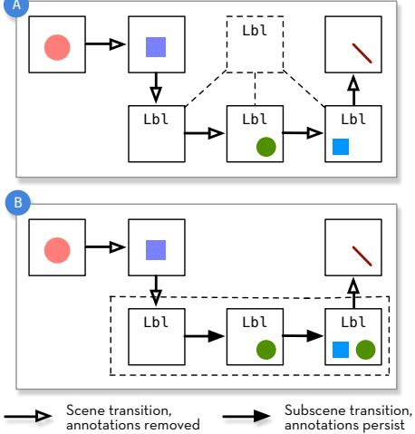
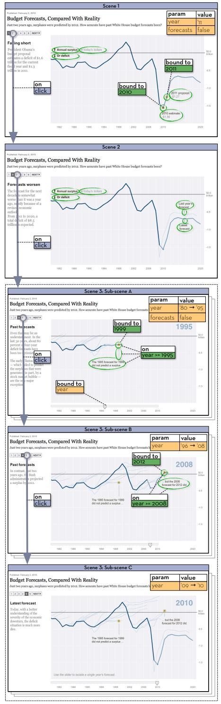
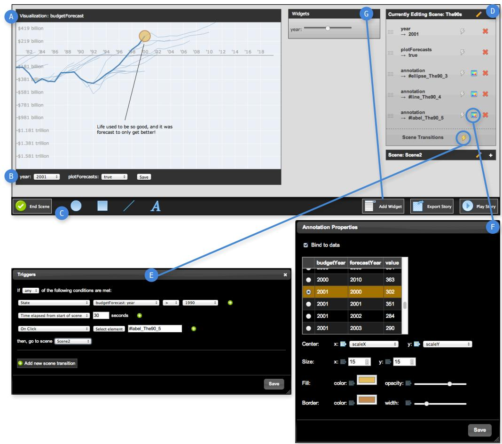
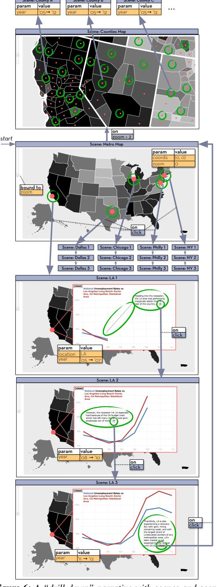
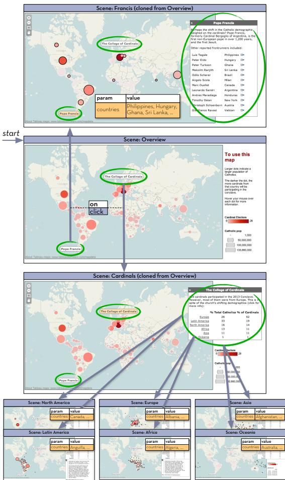

# Authoring Narrative Visualizations with Ellipsis

Arvind Satyanarayan1 and Jeffrey Heer2

1Stanford University 2University of Washington

# Abstract

*Data visualization is now a popular medium for journalistic storytelling. However, current visualization tools either lack support for storytelling or require significant technical expertise. Informed by interviews with journalists, we introduce a model of storytelling abstractions that includes state-based scene structure, dynamic annotations and decoupled coordination of multiple visualization components. We instantiate our model in Ellipsis: a system that combines a domain-specific language (DSL) for storytelling with a graphical interface for story authoring. User interactions are automatically translated into statements in the Ellipsis DSL. By enabling storytelling without programming, the Ellipsis interface lowers the threshold for authoring narrative visualizations. We evaluate Ellipsis through example applications and user studies with award-winning journalists. Study participants find Ellipsis to be a valuable prototyping tool that can empower journalists in the creation of interactive narratives.*

Categories and Subject Descriptors (according to ACM CCS): H.5.2 [Information Interfaces]: User Interfaces—GUI

# 1. Introduction

Stories are a pervasive aspect of human culture; they convey information in a memorable form that can engage and establish causal links [GP01]. Journalists, policy makers and others use stories to convey complex issues including elections, the economy and global health. For stories grounded in data, storytellers are turning to interactive narrative visualizations that combine an author-driven narrative [SH10] with interactive exploration by users. Interactive exploration can facilitate understanding by encouraging readers to actively construct and test their own questions [THL∗07,TMB02].

To understand the process of authoring narrative visualizations, we first interviewed four journalists. Our respondents emphasized that popular visualization applications provide little support for narratives, and suitably expressive tools require significant programming ability. Our interviews also revealed that authoring is often divided among team members with distinct skills. This can leave journalists feeling disenfranchised: they are responsible for initial designs, but then pass their content to a developer who controls the production phase. Design tools for narrative visualization that support this process could improve efficiency and empower journalists to collaborate with developers.

In this paper, we contribute a model and system for authoring both linear and non-linear data stories. Through interviews and reimplementations of existing narrative visualizations, we identify a set of requisite storytelling abstractions, including state-based scene structure, coordinated visualizations, dynamic annotations and interactive triggers. We implement these abstractions in *Ellipsis*, a system for authoring narrative visualizations. Ellipsis consists of two

 c 2014 The Author(s) Computer Graphics Forum c 2014 The Eurographics Association and John Wiley & Sons Ltd. Published by John Wiley & Sons Ltd.

components: a JavaScript-based *domain-specific language* (DSL) provides a runtime for interactive narratives, and a web-based interface enables direct-manipulation authoring of scenes, annotations and user interactions. The interface translates user interactions into statements in the underlying DSL. The resulting story "program" can then be exported and published on the web.

Our model of visualization coordination *decouples* narrative structure from visualizations, such that the two can be developed in a more independent fashion. Although narrative and visualization are tightly integrated in a user's experience, a decoupled implementation can facilitate authoring. As we demonstrate, our model allows authors to incorporate independent, pre-existing visualizations into their stories.

To evaluate Ellipsis, we conducted user studies with eight professional journalists, including two Pulitzer Prize winners. Participants validated our storytelling model and stated that Ellipsis can be a valuable aid for collaborative story design and for teaching journalism classes.

# 2. Related Work

Research on narrative visualization has focused on how storytelling techniques augment visualization as a communication medium. Examining a hypothetical command-andcontrol exercise, Gershon & Page [GP01] list methods such as setting the mood and place in time, and using redundant messaging to reinforce information. Segel & Heer [SH10] analyze 58 narrative visualizations, identifying distinct genres and effective narrative devices such as *tacit tutorials*, *semantic consistency* and *matching on content*. With Ellipsis, we seek to provide tools to support these narrative devices.

Hullman & Diakopoulos [HD11] examine how narrative devices affect reader interpretation. After analyzing 51 online visualizations, they posit that rhetorical decisions occur at four editorial layers: data, visual representation, textual annotations, and interaction. We build on this work in Ellipsis by treating visualization and narrative as layered yet independently editable components. Through an analysis of 42 narrative visualizations and subsequent experiments, Hullman et al. [HDR∗13] formulate a graph-based state model of narrative visualization, and provide guidance for designing transitions between states. We introduce a compatible model in which scene and scene transitions are first-class entities.

Most existing narrative visualizations are hardcoded to a single storyline. However, deployments of social data analysis systems such as NameVoyager [WK06], Many Eyes [VWvH∗07] and others [HVW07,WHA12,WHHA11] indicate that some users are eager to explore datasets and share their own data stories. Unfortunately, most collaborative visualization tools provide minimal support for reusing visualizations and instead feature simple text comments on a single visualization. With Ellipsis we aim to provide rich annotation and control structures sufficient for authoring compelling stories with pre-existing visualizations.

Decoupled narratives must be able to modify visualization parameters, ideally without recourse to internal implementation details. The P-Set Model [JKMG07] and sense.us [HVW07] demonstrate how visualizations can be parametrized formally and made stateful. Dynamic property binding (as in Improvise's "live variables" [Wea04]) provide a means to make these parameters responsive to external changes: when a property value changes, the new value automatically propagates to all bound controls.

In other related work, the potential benefits of interactive narrative tools are demonstrated by GeoTime Stories [EKHW07], in which a text-editing story interface increased analysts' descriptive capability and the clarity of their reports. We also draw inspiration from existing research on multimedia authoring tools [ADJ∗10, BH05, TEF∗11], which suggest potential storytelling abstractions and interface paradigms. We extend this prior work by introducing toolkit support for narrative devices for data visualization.

#### 3. Current Narrative Visualization Practices

To understand how authors craft narrative visualizations, we conducted hour-long semi-structured interviews with two journalism graduate students and two Knight Journalism Fellows†. All respondents had significant experience authoring data-driven stories; their self-reported web development knowledge ranged from beginner to intermediate levels.

Despite different working styles and expertise, all four respondents described a three-phase design process: *exploration* to uncover interesting stories in data sets, *drafting* to prototype ways of communicating the stories they found, and *production* to develop the final interactive. Each stage of the process relies on different tools. In the exploratory phase, our respondents use tools such as Microsoft Excel, Tableau or R/ggplot2 [Wic09] to build static visualizations and discover compelling stories. During prototyping, they use presentation software such as Microsoft Powerpoint or Apple Keynote, which permit experimentation with annotations, animation and narrative sequencing. In the production phase, our respondents favor tools that allow them to publish *webbased* visualizations. These tools include Google Fusion Tables, Tableau Public, Adobe Flash and D3.js [BOH11].

Each of these tools presents challenges. Respondents noted that Fusion Tables and Tableau Public provide little support for storytelling devices such as scenes or animation. On the other hand, expressive tools such as Adobe Flash and D3.js require significant technical expertise. To construct non-linear narratives in Adobe Flash, storytellers must use ActionScript code to break out of Flash's global timeline.

We learned that the authoring process is regularly distributed among team members with distinct skills. In larger media companies, journalists may be responsible for exploratory and drafting phases, but then hand off content to visualization developers for production. With existing tools, the narrative and visualization are typically implemented as one tightly integrated component. Journalists are unable to iterate the narrative design without delving into implementation details. As a result, they described feeling locked out of the production phase. In smaller companies, there may not be a visualization developer, leaving journalists little recourse beyond Fusion Tables and Tableau Public. Our respondents expressed a strong need for tools that support structured storytelling with minimal programming.

#### 4. A Model for Narrative Visualizations

In this section, we present a set of storytelling abstractions for authoring narrative visualizations. Our model stems from an iterative process in which we reviewed prior work, interviewed representative users, and reimplemented existing narrative visualizations. In particular, reimplementing narrative visualizations allowed us to identify recurring elements, and to explore the boundary between "narrative" and "visualization" to gauge how much control a storyteller needs over the visualization to author compelling stories.

We define a *narrative visualization* as a set of visualization components, control widgets and annotations that are coordinated by a narrative state machine. The core abstractions in this model are state-based *scenes*, visualization *parameters*, dynamic graphical & textual *annotations*, and interaction *triggers*. We first describe these elements, then show how they can be combined to construct narratives.

<sup>†</sup> Knight Fellows are professionals awarded a fellowship to "foster journalistic innovation, entrepreneurship, and leadership."

# 4.1. Parameters: Coordinating Visualizations

Storytelling and visualization often appear tightly interwoven; manipulating the visualization can affect the narrative elements shown, and vice-versa. However, decoupling the implementation of the visualization from the narrative structure offers several advantages to the author while maintaining an integrated experience for a reader. First, decoupling enables a single storyline to coordinate independent visualizations and control widgets. Second, decoupling allows reuse of a visualization to tell multiple stories. Perhaps most importantly, decoupling allows authors to experiment with different narrative sequences without modifying the implementation of the underlying visualizations.

*Parameters* are name-value pairs that set visualization state and provide a means for decoupled control. Parameter values can include constants (e.g., chart width and height), variables (e.g., boolean flags or filter ranges to determine mark visibility), or encoding functions (e.g., scale transforms). When a parameter value changes the visualization is re-drawn. Parameters can be *bound* to widgets such as sliders or drop-down menus. Manipulating a bound control updates the corresponding parameter value and triggers redraw. Parameters can also be used to trigger the display of annotations or scene transitions. By manipulating parameter values, a narrative can coordinate a visualization directly or delegate coordination to the reader through bound controls.

#### 4.2. Textual and Graphical Annotations

Narrative visualizations often include textual and graphical *annotations* to highlight important information and draw readers' attention. Our model includes annotations as firstclass entities, which can be associated with a given visualization. Base-level annotations consist of simple shapes (rectangles, ellipses, arrows, *etc.*) and text with configurable properties such as position, color, size and text content.

By default, authors position annotations statically. Annotations can be made dynamic by binding them to data points. Bound data can be used to parametrize an annotation's content, position, or style properties; if a bound data value changes, the annotation automatically updates. Reusable, custom annotations are defined via annotation *templates* that combine basic annotations or execute custom drawing code.

#### 4.3. Triggers: Defining Reactive and Interactive Stories

*Triggers* advance a narrative in response to parameter changes or user input. When a trigger *fires*, it can cause an annotation to appear, or a scene transition to occur. Our model includes three trigger types: *parameter*, *timer*, and *event* triggers. A parameter trigger is bound to a visualization parameter, and defines a predicate that must be met in order for the trigger to fire. These triggers are especially useful when readers are given the flexibility to manipulate parameter values through control widgets. A timer trigger fires



Figure 1: *Subscenes and scene templates. (a) With scene templates, each scene inherits the same annotations from a template; the annotations are removed when transitioning between scenes. (b) With subscenes, annotations are not removed when moving between sibling subscenes.*

after a designated amount of time has elapsed, and is useful for simple animation and linear narratives. Finally, event triggers map to browser events such as *click* or *hover* and allow authors to make their stories respond to user input.

#### 4.4. Scenes: Providing Narrative Structure

*Scenes* are the basic building blocks of narrative structure. A scene consists of a collection of annotations and visualization parameter settings. Our notion of a scene is analogous to a "slide" in tools like Powerpoint or Keynote, but can include dynamic and interactive behaviors. A single scene can coordinate multiple visualizations and control widgets.

Storytellers can sequence a narrative by organizing items within a scene or across scene transitions. Within standard timeline-based models (e.g., Adobe Flash), scenes are placed linearly along a global timeline and indexed by time [BH05]. Authoring a non-linear narrative with this model is difficult: the author must explicitly break out of the timeline, then reenter it. These steps often require programming. Our model inverts this timeline approach. We represent scenes as individual states within the narrative, forming a finite state machine. Each scene contains its own internal timeline. Authors must explicitly define paths through the narrative using *scene transitions* that describe the behavior when moving from one scene to another. Compared to the timeline model, our formulation naturally supports both simple linear progressions and branching, non-linear narrative structures. Our approach is thus a hybrid of timeline-based and graph-based multimedia authoring approaches [BH05].

Our conversations with journalists also revealed two common design patterns (see Figure 1). The first is the use of *scene templates* that define a set of recurring annotations or parameter settings. Scene templates are analogous to abstract classes in object-oriented programming: a class can inherit an abstract class much as a scene inherits a template. Templates serve as a foundation for new scenes and facilitate reuse and modification of common narrative elements. The second design pattern is the use of *subscenes*. In our model, all annotations are removed upon a scene transition. In contrast, subscene transitions preserve annotations, enabling an accretive build-up of narrative elements. As a result, a larger narrative point can be made through a sequence of subscenes without losing the structural affordances of a scene.

## 4.5. Example: Budget forecasts, compared with reality

The New York Times' *Budget Forecasts, Compared with Reality* [Cox10] is an example of an "interactive slideshow" [SH10] narrative. It presents U.S. budget surpluses and deficits over time, alongside predictions from each Presidential administration. Each slide features annotations on the visualization, and a caption on the left-hand side. A stepper widget encourages readers to move through the story in a linear fashion. Slides three and four introduce a slider that controls the years plotted on the visualization, which in turn determines the annotations shown. By the fifth slide, the reader is explicitly encouraged to interact with this slider. This style of storytelling—beginning as a linear, author-driven narrative but then opening up for reader-driven exploration—is an example of a *martini glass* narrative [SH10].

Figure 2 depicts how this narrative can be constructed with our model. Each slide is a scene that determines the text of the caption on the left. Slides 3-5 consist of three subscenes (3a-c). As a result, annotations are removed when moving from Scene 2 to Scene 3, but persist and build up when moving from Scene 3a to 3b, and then from 3b to 3c.

Our implementation of the underlying chart exposes two primary visualization parameters: year, which determines what data is shown, and forecasts, which toggles the visibility of budget forecast line plots. Figure 2 illustrates how these parameters, shown in yellow, are changed from scene to scene. In Scene 3's subscenes, year is bound to the slider control. Manipulating the slider updates the parameter value and re-renders the visualization in response. A reader can freely manipulate the value of year in these scenes; parameter triggers reveal per-year annotations as appropriate.

As shown in green in Figure 2, *Budget Forecasts* makes extensive use of annotations. Lines and text are used to identify important data points and add context. A highlighted point (a fixed-size blue circle within an orange circle) is an annotation that is reused throughout the narrative. Rather than manually define these properties with each use, the annotation can be defined using a custom annotation template. The circle radius, color and opacity are defined once as part of the template. Upon instantiation, these annotations are bound to data points to dynamically set their positions.



Figure 2: *Budget Forecasts by the New York Times, deconstructed into scenes and scene transitions (purple), parameter changes (yellow), and annotations (green).*

*Budget Forecasts* uses all three trigger types. Parameter triggers determine which annotations to show in Scene 3. Timer triggers provide animation by stepping through individual parameter values in Scene 3. Event (*click*) triggers on the stepper navigation widget allow readers to move between scenes. Additional event triggers, not shown in Figure 2, define a hover interaction for details-on-demand: when a reader mouses over a data point, they are shown a tooltip with more information about that year's budget forecast.

# 5. The Ellipsis Domain-Specific Language

The Ellipsis domain-specific language (DSL) directly instantiates the storytelling model described in the previous section. It is a declarative, *embedded* DSL, allowing the use of familiar JavaScript syntax and programming conventions. Each of the elements in our model is implemented as its own component within the language.

Ellipsis was designed to tell stories with existing visualizations. As such, to maximize compatibility with existing web-based visualizations, the Ellipsis DSL provides an API (Fig. 3) which encapsulates an existing visualization, gives it a unique identifier, and exposes its data store, HTML "stage" element which contains the rendered visualization, and a rendering function to signal updates. Through the API, visualization parameters can be enumerated, constrained to valid values and bound to control widgets.

Ellipsis includes basic annotations such as ellipses, lines, arrows, rectangles and text labels. These annotations can be customized by specifying position, size and other style rules. Annotations can be bound to data to determine annotation properties. For example, an ellipse's radii can be calculated by scale functions based on bound data values.

```
var vis = el.vis('budgetForecast') 
.data(fullDataObj)
.stage('#stage', 700, 400)

.state('year', d3.range(1980, 2011))
.state('plotForecasts', [true, false])

.const('minYear', 1980)
.const('scaleX', function() {...})

.render(function() { /* Draw vis */ });
```
Figure 3: *Wrapping an existing visualization within Ellipsis to expose its data and states.*

```
el.scene('scene_1')
.set('budgetForecast', 'year', 2010)
.set('dowJones', 'year', 2010)
.add('budgetForecast', 
el.annotation('circle')
.radius(10)
.center([625, 30])
.style('fill', 'firebrick'))
.add('dowJones', function() { ... })
```
Figure 4: *Defining a scene that coordinates two visualizations:* budgetForecast *and* dowJones

The annotation library can be extended using annotation templates. Each template must define *enter* and *exit* functions that respectively handle adding and removing the annotation from a visualization's stage. As with the built-in annotations, annotation templates can be bound to data values. Additional parameters may be provided on instantiation, and are then passed as arguments to the enter and exit functions.

The DSL implements scenes and triggers as described in our storytelling model. Scenes contain an ordered collection of *members*: parameter changes or annotations (Fig. 4). Each member must specify the visualization they act on, referenced by their identifier. This allows the storyteller to coordinate multiple visualizations as part of a single scene. Each member can also specify a trigger which must fire in order for the member to be evaluated or added to a visualization.

The Ellipsis DSL supports parameter, timer, and event triggers. Trigger predicates can be defined using standard comparison operators (e.g., equal, less-than, greater-than, *etc.*). Triggers can also be combined using a logical OR, such that the member is added if *any* trigger fires, or a logical AND, such that *all* triggers must fire in order for the member to be added. Triggers need not fire together: as triggers fire asynchronously, the Ellipsis DSL checks visualization parameter values to determine if an AND trigger is satisfied.

In the supplementary material, we provide additional Ellipsis DSL code examples and describe the DSL syntax.

### 6. The Ellipsis Graphical User Interface

To minimize programming, Ellipsis includes a directmanipulation interface. Once visualizations are registered within the DSL, the other components of the storytelling model can be instantiated through the UI. User interactions, such as drawing an annotation, are translated into DSL statements. The resulting stories can be exported and published, and the underlying code inspected and modified.

The GUI creates a stage for each visualization (Fig. 5a) and populates its parameter selectors (Fig. 5b). Authors build stories by creating scenes, adjusting parameters and drawing annotations (Fig. 5c). These interactions populate the corresponding scene in the right-hand sidebar (Fig. 5d). Authors can drag-and-drop scene members to reorder them.

Authors structure the narrative by defining scene transitions. Triggers and scene transitions are defined using an "if this, then that" syntax (Fig. 5e), and triggers can be combined into logical OR or logical AND predicates. The annotation inspector (Fig. 5f) allows the storyteller to modify an annotation's visual properties, with changes reflected in real time. Such visual properties can be determined by binding the annotation to a particular data value, and then using a visualization parameter (for example, a scale transform as shown in the figure). Standard HTML form widgets (radio buttons, range sliders, drop-down menus, *etc*.) can also be instantiated and bound to a visualization parameter (Fig. 5g).



Figure 5: *The Ellipsis interface. (a) Ellipsis creates a stage element for each visualization. (b) The GUI inspects visualization parameters and creates controls for them. (c) Creating a new scene prompts the storyteller for a scene name; scenes can be built by changing visualization parameters or drawing annotations. (d) The sidebar lists reorderable scenes and members. (e) Triggers and scene transitions are defined using an "if this, then that" syntax. (f) Annotation properties and data binding can be modified, triggering real-time updates. (g) Standard form widgets can be instantiated and bound to visualization parameters.*

At any time during the authoring process, a user can preview their story by clicking the *Play Story* button. The interface generates the necessary DSL code, and launches a new window. The generated code is evaluated to produce a live preview of the story, complete with triggers and reader interaction. Once the author is satisfied, they can *Export* their story. Exported stories take the form of Ellipsis DSL code that can be copied and pasted into an HTML document.

# 7. Example Ellipsis Narratives

We now present representative examples of narrative visualizations built with Ellipsis. By both interacting with the GUI and programmatically crafting stories with the DSL, we demonstrate that Ellipsis is sufficiently expressive to support a wide variety of narrative structures and can be used to tell new stories with existing visualization components.

## 7.1. Budget Forecasts, Compared with Reality

To implement *Budget Forecasts*, we first rebuilt the forecast chart using D3.js [BOH11], and then wrapped it within the Ellipsis DSL to expose year and forecasts as visualization parameters (Figure 3). We can craft the story by building scenes, drawing annotations and binding them to data, adding a slider to control the year parameter, and adding triggers and scene transitions as described in Figure 2.

## 7.2. Metro & County Unemployment, 2004–2012

Figure 6 shows a narrative visualization that explores how the 2008 recession affected unemployment in different areas of the United States. It is an example of a "drill-down" [SH10] narrative, and coordinates multiple underlying visualizations that span a continuous parameter space.

Scene: County A

Scene: County B

Scene: County C

The first visualization is a choropleth map of the U.S. showing unemployment in 2012: darker areas have higher unemployment, and lighter areas less. The map visualization exposes parameters for pan (coords) and zoom (zoom) settings. Semantic zooming is triggered when zoom exceeds a given threshold: states split into constituent counties, and the map displays unemployment rates for each county. The second visualization is a line chart of national and regional unemployment levels, superimposed to facilitate comparison. The visualization exposes two parameters: year determines the maximum year for which data is plotted, and location determines which region's data is shown.

The narrative begins by presenting a view of the entire country, with five circle annotations for the five largest metropolitan areas: the New York Tri-State area, Los Angeles, Chicago, Dallas-Fort Worth, and Philadelphia. Clicking a circle triggers a distinct three-scene story which comments on the unemployment levels before, during, and after the 2008 recession. Closing this embedded story returns the viewer to the default view, where they can choose to drill-down into another story. If semantic zoom is triggered, the metropolitan circles are replaced with similar annotations for each county. Clicking any of these triggers a simple single-scene story that cycles through all years but, unlike the metropolitan stories, provides no additional commentary.

We use the Ellipsis GUI to build the metropolitan narratives. After loading the visualizations, we draw circle annotations for the five metropolitan areas, build scenes for embedded stories (including text and line annotations), and define each narrative path using triggers and scene transitions.

As there are over 3,000 counties in the U.S., we export the metropolitan storylines and author the remaining countylevel narratives by modifying the generated Ellipsis DSL code. We create a new scene, Counties Map, and define a scene transition that is triggered by semantic zooming (i.e., if the zoom parameter is above or below a defined threshold). We then iterate through the list of counties to programmatically define a scene for each county that plots county unemployment against national rates. We also create each county's corresponding circle annotation. Clicking a circle transitions to the county-scene through an *onclick* trigger. This example highlights the tradeoff between the GUI's ease of use, and the power and expressivity of the DSL. It can be beneficial to move between the two as needed.

## 7.3. Habemus Papam: We Have a Pope!

The previous examples use visualizations that we implemented in code. Here, we demonstrate integration with a pre-existing visualization created with Tableau. After Pope Francis was elected, CBC News published *Map: Catholics, cardinals by country* [Can13], a map visualizing Catholic populations by country and the number of cardinals that represented them in the Conclave. A caption accompanies the



Figure 6: *A "drill-down" narrative with scenes and scene transitions (purple), parameter changes (yellow) and annotations (green). A representative story is shown for Los Angeles. Selecting a U.S. county triggers a single-scene story that cycles through all years.*

map, and the reader is left to explore the data. Tooltips display the number of Catholics in the country and the number of eligible cardinals. We now extend this visualization with a "partitioned poster" [SH10] style of narrative.

The visualization was created using Tableau Public, which provides a JavaScript-based API with filtering and picking functions. To author an Ellipsis narrative, we first wrap the visualization. We expose a country-level picker as a parameter, and simply pass this value back to the Tableau Public API. After loading the visualization into the Ellipsis GUI, we can author the narrative shown in Figure 7.

The reader begins at the *Overview* scene and is presented with two buttons labeled *The College of Cardinals* and *Pope Francis*. Clicking a button takes the reader to the corresponding scene. In the *Cardinals* scene, we extend the original visualization with a numeric breakdown of Catholics and cardinal percentages by continent. Clicking a continent sets the countries parameter to highlight all corresponding country bubbles, and displays an additional text annotation to further describe the Catholic demographics of the area. The *Francis* scene contains an entirely new narrative. It details the significance of Pope Francis' election and lists other frontrunners in the election, highlighting their countries and providing links to additional information.

This example demonstrates how a pre-existing visualization can serve as the foundation for a new Ellipsis story. By decoupling narrative and visualization through parameters, authors can tell any number of stories around existing visualizations. Going forward, these features could enable the creation of interactive stories with existing visualizations as a way of contributing to social data analysis systems [HVW07,VWvH∗07,WK06].

# 8. Evaluation with Professional Journalists

To evaluate Ellipsis and our storytelling model, we conducted a first-use study with eight professional journalists, including two Pulitzer Prize winners, two Knight Journalism Fellows, and others from prominent newspapers and journalism schools. All participants had multi-year experience telling data-driven stories, but comfort with JavaScript varied significantly. The goal of our study was not to collect performance data, but rather to elicit qualitative insights on how Ellipsis fits the needs and workflow of journalists.

## 8.1. Methods

We began each session by introducing participants to our storytelling model. We walked them through the Ellipsis GUI, pre-loaded with a version of *Budget Forecasts* stripped of narrative elements. Participants were shown how to manipulate visualization parameters, add annotations, define interactions, manage scenes and play their stories. After giving subjects a few minutes to familiarize themselves, we tasked



Figure 7: *A "partitioned poster" narrative visualization implemented using Ellipsis. Scenes and scene transitions (purple); parameter changes (yellow); annotations (green).*

them with authoring a short story. We encouraged them to think-aloud and share feedback. We captured a screen recording of their interactions and recorded their think-aloud process. We concluded each session with an exit interview. Each session lasted roughly 45 minutes.

## 8.2. Results

*Successes*. All participants built narratives without significant guidance: they authored stories composed of 2-3 scenes, added annotations to highlight and label points of interest, added timer triggers to animate these annotations, and click event triggers to navigate between scenes. Participants appreciated the visual cues that Ellipsis borrows from presentation software. All participants successfully defined interactions through the "if this, then that" interface, and especially liked being able to select a trigger's target element by simply clicking it. Two participants, who were comfortable with JavaScript, were eager to export and customize their stories to match their organization's narrative style.

Four participants stated that they found Ellipsis to be a promising collaborative design tool. They felt that the interface would enable them to quickly prototype ideas and share them with their team. One participant envisioned simultaneously editing a narrative visualization during a team meeting, akin to collaboratively editing in Google Docs.

Two participants compared Ellipsis' separation of narrative and visualization to the processes of reporters and visualization developers in the newsroom. They said that Ellipsis would encourage an iterative process between groups; one subject commented that Ellipsis can *"give reporters more of a sense of ownership over the final visualization."* One journalism instructor expressed a desire to use Ellipsis as a teaching aid. He noted that students find authoring visualizations intimidating, as many don't possess the requisite programming skills. Using Ellipsis, students could focus on crafting a compelling narrative.

*Shortcomings*. Half the participants noted that the scene listing sidebar could better facilitate higher-level story planning—for example, the linear listing of scenes is not conducive for non-linear storytelling, and as stories grow, it can be difficult to recall scene content from the listing alone. However, opinions on how to improve the interface varied. Instead of a scene list, some participants prefered a "filmstrip" view of the storyline, providing fine-grained control and the ability to scrub back-and-forth without launching a preview. However, others balked at a filmstrip as being too limiting, and instead requested a node-link visualization of scenes and narrative paths. How might we best represent narrative paths and interactions through a story?

Although users found annotations useful for drawing readers' attention, two participants commented that adding new shapes can be heavy-handed. Instead, they wanted to highlight existing content in the visualization, for example by changing the color of the line segments in *Budget Forecasts*. For HTML or SVG-based graphics, one option is to modify the browser's Document Object Model (DOM) directly; however, even this may be limited by the underlying implementation. For example, the *Budget Forecasts* line graph is one continuous SVG element, such that one can not modify individual segments in isolation. Moreover, this solution is incompatible with raster-based visualizations.

An alternative approach is to provide a richer set of visualization parameters through the Ellipsis API. For example, if the Tableau Public API included facilities for highlighting individual marks, Ellipsis could expose this functionality as parameters. More generally, visualization frameworks that generate parameterized visualization components can be integrated for use with Ellipsis. For hand-coded visualizations lacking automatic parameterization, a developer must either anticipate the likely ways an author may wish to re-style a visualization, or update the implementation as needed.

# 9. Conclusion and Future Work

We contribute a model for narrative visualization, including decoupled coordination of visualization components. We implement this model in Ellipsis: a domain-specific language (DSL) and direct manipulation interface for authoring narrative visualizations. In our evaluation, eight professional journalists found Ellipsis to be a useful tool for rapid prototyping that can foster improved newsroom collaboration. We now conclude with directions for future work.

At present, the Ellipsis interface is not as expressive as the DSL. In particular, custom annotation templates can only be created using JavaScript DSL code. Improving the expressivity of the GUI poses a challenge that relates to larger issues of specifying visualizations without programming. Future work might examine ways of authoring reusable, custom annotations through direct manipulation.

Our user studies suggest several potential applications. Four participants suggested that Ellipsis would be a useful collaborative prototyping tool, and it is interesting to consider how the system could be extended to better support this use case. For example, how might a team member track the revision history for a narrative visualization? Further integrating Ellipsis with a hosted web service, such as Many Eyes [VWvH∗07] or Tableau Public, might also facilitate collaborative storytelling. Users would be able to create new or browse existing visualizations, and then use them to craft narratives. Narrative repositories and design tools might support an ecology in which users publish, share and remix custom annotation types and novel narrative structures.

To effectively craft narrative visualizations, a storyteller must exercise visual design and communication skills. As our understanding of the factors underlying effective narrative visualization matures, a question for future work is to consider how narrative visualization design tools might encourage *good* design. How might we codify best practices for narrative design? How might the resulting principles enable automated design assistance or enhanced interaction techniques? Meanwhile, by lowering the threshold for authoring, tools such as Ellipsis can help facilitate exploration of the narrative visualization design space and the dissemination of effective narrative devices. Ellipsis is available as open-source software at http://idl.cs. washington.edu/projects/ellipsis/.

## Acknowledgements

We thank our study participants for their helpful insights and for accommodating us in their deadline-driven schedules. We also thank Jerry Talton and Ranjitha Kumar for their help. This work was supported by an SAP Stanford Graduate Fellowship and by DARPA XDATA.

370

#### References

- [ADJ∗10] ADABALA N., DATHA N., JOY J., KULKARNI C., MANCHEPALLI A., SANKAR A., WALTON R.: An interactive multimedia framework for digital heritage narratives. In *ACM Multimedia* (2010), pp. 1445–1448. 2
- [BH05] BULTERMAN D. C. A., HARDMAN L.: Structured multimedia authoring. *ACM Trans. on Multimedia Comput. Commun. Appl. 1*, 1 (Feb. 2005), 89–109. URL: http:// doi.acm.org/10.1145/1047936.1047943, doi:10. 1145/1047936.1047943. 2, 3
- [BOH11] BOSTOCK M., OGIEVETSKY V., HEER J.: D3: Datadriven documents. *IEEE Trans. on Visualization and Computer Graphics 17*, 12 (2011), 2301–2309. 2, 6
- [Can13] CANADIAN BROADCASTING COMPANY: Map: Catholics, cardinals by country. http://www.cbc.ca/ news/interactives/catholics-cardinals/, 2013. 7
- [Cox10] COX A.: Budget Forecasts vs. Reality. http://www.nytimes.com/ interactive/2010/02/02/us/politics/ 20100201-budget-porcupine-graphic.html, 2010. 4
- [EKHW07] ECCLES R., KAPLER T., HARPER R., WRIGHT W.: Stories in GeoTime. In *IEEE Visual Analytics Science & Technology (VAST)* (2007), pp. 19–26. 2
- [GP01] GERSHON N., PAGE W.: What storytelling can do for information visualization. *Communications of the ACM 44*, 8 (2001), 31–37. 1
- [HD11] HULLMAN J., DIAKOPOULOS N.: Visualization rhetoric: Framing effects in narrative visualization. *IEEE Trans. on Visualization and Computer Graphics 17*, 12 (2011), 2231– 2240. 2
- [HDR∗13] HULLMAN J., DRUCKER S., RICHE N., LEE B., FISHER D., ADAR E.: A deeper understanding of sequence in narrative visualization. *IEEE Trans. on Visualization and Computer Graphics 19*, 12 (2013), 2406–2415. 2
- [HVW07] HEER J., VIÉGAS F. B., WATTENBERG M.: Voyager and voyeurs: Supporting asynchronous collaborative information visualization. In *ACM Human Factors in Computing Systems (CHI)* (2007), pp. 1029–1038. 2, 8
- [JKMG07] JANKUN-KELLY T., MA K.-L., GERTZ M.: A model and framework for visualization exploration. *IEEE Trans. on Visualization and Computer Graphics 13*, 2 (2007), 357–369. 2
- [SH10] SEGEL E., HEER J.: Narrative visualization: Telling stories with data. *IEEE Trans. on Visualization and Computer Graphics 16*, 6 (2010), 1139–1148. 1, 4, 6, 8
- [TEF∗11] TAKEDA K., EARL G., FREY J. G., KEAY S., WADE A.: Enhancing research publication using rich interactive narratives. *Microsoft Tech Report* (2011). 2
- [THL∗07] TVERSKY B., HEISER J., LOZANO S., MACKENZIE R., MORRISON J.: Enriching animations. In *Learning with Animation* (2007), Lowe R., Schnotz W., (Eds.), Cambridge University Press. 1
- [TMB02] TVERSKY B., MORRISON J. B., BETRANCOURT M.: Animation: Can it facilitate? *International Journal of Human-Computer Studies 57*, 4 (2002), 247 – 262. URL: http://www.sciencedirect.com/ science/article/pii/S1071581902910177, doi:10.1006/ijhc.2002.1017. 1
- [VWvH∗07] VIÉGAS F. B., WATTENBERG M., VAN HAM F., KRISS J., MCKEON M.: Many Eyes: a site for visualization

at internet scale. *IEEE Trans. on Visualization and Computer Graphics 13*, 6 (2007), 1121–1128. 2, 8, 9

- [Wea04] WEAVER C.: Building highly-coordinated visualizations in Improvise. In *IEEE Information Visualization* (2004), pp. 159–166. 2
- [WHA12] WILLETT W., HEER J., AGRAWALA M.: Strategies for crowdsourcing social data analysis. In *ACM Human Factors in Computing Systems (CHI)* (2012). URL: http://vis. stanford.edu/papers/crowd-analytics. 2
- [WHHA11] WILLETT W., HEER J., HELLERSTEIN J., AGRAWALA M.: CommentSpace: Structured support for collaborative visual analysis. In *ACM Human Factors in Computing Systems (CHI)* (2011). URL: http: //vis.stanford.edu/papers/commentspace. 2
- [Wic09] WICKHAM H.: *ggplot2: Elegant graphics for data analysis*. Springer, 2009. 2
- [WK06] WATTENBERG M., KRISS J.: Designing for social data analysis. *IEEE Trans. on Visualization and Computer Graphics 12*, 4 (2006), 549–557. 2, 8