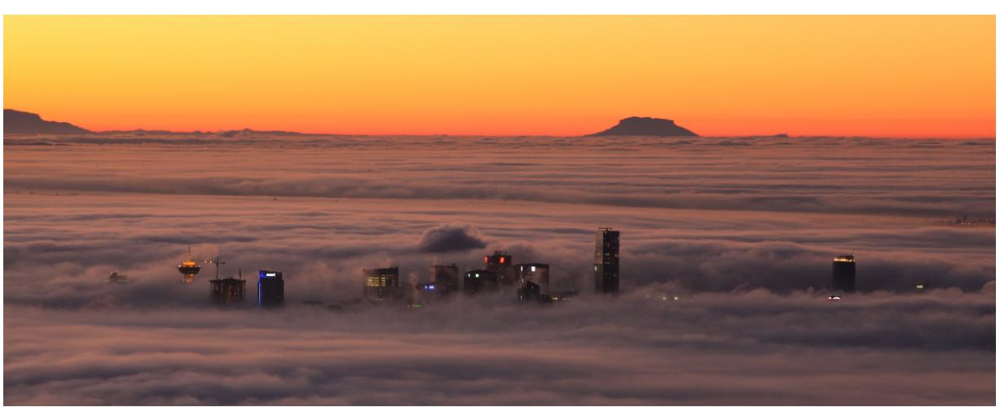
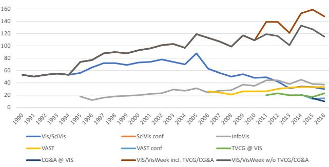

# **Artificial reference paper 1**

Han Solo Obi-Wan Kenobi

Figure 1: In the Clouds: Vancouver from Cypress Mountain.

# **ABSTRACT**

Lorem ipsum dolor sit amet, consectetuer adipiscing elit. Ut purus elit, vestibulum ut, placerat ac, adipiscing vitae, felis. Curabitur dictum gravida mauris. Nam arcu libero, nonummy eget, consectetuer id, vulputate a, magna. Donec vehicula augue eu neque. Pellentesque habitant morbi tristique senectus et netus et malesuada fames ac turpis egestas. Mauris ut leo. Cras viverra metus rhoncus sem. Nulla et lectus vestibulum urna fringilla ultrices. Phasellus eu tellus sit amet tortor gravida placerat. Integer sapien est, iaculis in, pretium quis, viverra ac, nunc. Praesent eget sem vel leo ultrices bibendum. Aenean faucibus. Morbi dolor nulla, malesuada eu, pulvinar at, mollis ac, nulla. Curabitur auctor semper nulla. Donec varius orci eget risus. Duis nibh mi, congue eu, accumsan eleifend, sagittis quis, diam. Duis eget orci sit amet orci dignissim rutrum.

Index Terms: Radiosity, global illumination, constant time.

## **1 INTRODUCTION**

This template is for papers of VGTC-sponsored conferences which are *not* published in a special issue of TVCG.

## **2 USING THIS TEMPLATE**

- If you receive compilation errors along the lines of "Package ifpdf Error: Name clash, \ifpdf is already defined" then please add a new line "\let\ifpdf\relax" right after the "\documentclass[journal]{vgtc}" call. Note that your error is due to packages you use that define "\ifpdf" which is obsolete (the result is that \ifpdf is defined twice); these packages should be changed to use ifpdf package instead.
- The style uses the hyperref package, thus turns references into internal links. We thus recommend to make use of the "\cref{reference}" call (instead

of "Figure˜\ref{reference}" or similar) since "\cref{reference}" turns the entire reference into an internal link, not just the number. Examples: Fig. 2

- The style automatically looks for image files with the correct extension (eps for regular LATEX; pdf, png, and jpg for pdfLATEX), in a set of given subfolders (figures/, pictures/, images/). It is thus sufficient to use "\includegraphics{CypressView}" (instead of "\includegraphics{pictures/CypressView.jpg}").
- For adding hyperlinks and DOIs to the list of references, you can use "\bibliographystyle{abbrv-doi-hyperref-narrow}" (instead of "\bibliographystyle{abbrv}"). It uses the doi and url fields in a bibTEX entry and turns the entire reference into a link, giving priority to the doi. The doi can be entered with or without the "http://dx.doi.org/" url part. See the examples in the bibTEX file and the bibliography at the end of this template.

Note 1: occasionally (for some LATEX distributions) this hyper-linked bibTEX style may lead to compilation errors ("pdfendlink ended up in different nesting level ...") if a reference entry is broken across two pages (due to a bug in hyperref). In this case make sure you have the latest version of the hyperref package (i. e., update your LATEX installation/packages) or, alternatively, revert back to "\bibliographystyle{abbrv-doi-narrow}" (at the expense of removing hyperlinks from the bibliography) and try "\bibliographystyle{abbrv-doi-hyperref-narrow}" again after some more editing.

Note 2: the "-narrow" versions of the bibliography style use the font "PTSansNarrow-TLF" for typesetting the DOIs in a compact way. This font needs to be available on your LATEX system. It is part of the "paratype" package, and many distributions (such as MikTeX) have it automatically installed. If you do not have this package yet and want to use

a "-narrow" bibliography style then use your LATEX system's package installer to add it. If this is not possible you can also revert to the respective bibliography styles without the "-narrow" in the file name.

DVI-based processes to compile the template apparently cannot handle the different font so, by default, the template file uses the abbrv-doi bibliography style but the compiled PDF shows you the effect of the abbrv-doi-hyperref-narrow style.

## **3 BIBLIOGRAPHY INSTRUCTIONS**

- Sort all bibliographic entries alphabetically but the last name of the first author. This LATEX/bibTEX template takes care of this sorting automatically.
- Merge multiple references into one; e. g., use [2]. Within each set of multiple references, the references should be sorted in ascending order. This LATEX/bibTEX template takes care of both the merging and the sorting automatically.
- Verify all data obtained from digital libraries, even ACM's DL and IEEE Xplore etc. are sometimes wrong or incomplete.
- Do not trust bibliographic data from other services such as Mendeley.com, Google Scholar, or similar; these are even more likely to be incorrect or incomplete.
- Articles in journal—items to include:
	- author names
	- title
	- journal name
	- year
	- volume
	- number
	- month of publication as variable name (i. e., {jan} for January, etc.; month ranges using {jan #{/}# feb} or {jan #{--}# feb})
- use journal names in proper style: correct: "IEEE Transactions on Visualization and Computer Graphics", incorrect: "Visualization and Computer Graphics, IEEE Transactions on"
- Papers in proceedings—items to include:
	- author names
	- title
	- abbreviated proceedings name: e. g., "Proc.\ CONF ACRONYNM" without the year; example: "Proc.\ CHI", "Proc.\ 3DUI", "Proc.\ Eurographics", "Proc.\ EuroVis"
	- year
	- publisher
	- town with country of publisher (the town can be abbreviated for well-known towns such as New York or Berlin)
- article/paper title convention: refrain from using curly brackets, except for acronyms/proper names/words following dashes/question marks etc.; example:
	- paper "Marching Cubes: A High Resolution 3D Surface Construction Algorithm"
- should be entered as "{M}arching {C}ubes: A High Resolution {3D} Surface Construction Algorithm" or "{M}arching {C}ubes: A high resolution {3D} surface construction algorithm"
- will be typeset as "Marching Cubes: A high resolution 3D surface construction algorithm"
- for all entries
	- DOI can be entered in the DOI field as plain DOI number or as DOI url; alternative: a url in the URL field
	- provide full page ranges AA--BB

## **4 SUPPLEMENTAL MATERIAL INSTRUCTIONS**

In support of transparent research practices and long-term open science goals, you are encouraged to make your supplemental materials available on a publicly-accessible repository. Please describe the available supplemental materials in the Supplemental Materials section. These details could include (1) what materials are available, (2) where they are hosted, and (3) any necessary omissions.

## **5 FIGURE CREDITS**

In the Figure Credits section at the end of the paper, you should credit the original sources of any figures that were reproduced or modified. Include any license details necessary, as well as links to the original materials whenever possible. For credits to figures from academic papers, include a citation that is listed in the References section. An example is provided below.

## **6 EXPOSITION**

Duis autem vel eum iriure dolor in hendrerit in vulputate velit esse molestie consequat, vel illum dolore eu feugiat nulla facilisis at vero eros et accumsan et iusto odio dignissim qui blandit praesent luptatum zzril delenit augue duis dolore te feugait nulla facilisi. Lorem ipsum dolor sit amet, consectetuer adipiscing elit, sed diam nonummy nibh euismod tincidunt ut laoreet dolore magna aliquam erat volutpat [4].

$$\sum_{j=1}^{z} j = \frac{z(z+1)}{2} \tag{1}$$

# **6.1 Lorem ipsum**

Lorem ipsum dolor sit amet, consetetur sadipscing elitr, sed diam nonumy eirmod tempor invidunt ut labore et dolore magna aliquyam erat, sed diam voluptua. At vero eos et accusam et justo duo dolores et ea rebum. Stet clita kasd gubergren, no sea takimata sanctus est Lorem ipsum dolor sit amet. Lorem ipsum dolor sit amet, consetetur sadipscing elitr, sed diam nonumy eirmod tempor invidunt ut labore et dolore magna aliquyam erat, sed diam voluptua. At vero eos et accusam et justo duo dolores et ea rebum. Stet clita kasd gubergren, no sea takimata sanctus est Lorem ipsum dolor sit amet. Lorem ipsum dolor sit amet, consetetur sadipscing elitr, sed diam nonumy eirmod tempor invidunt ut labore et dolore magna aliquyam erat, sed diam voluptua. At vero eos et accusam et justo duo dolores et ea rebum.

## **6.2 Filler Subsection to Flush Out the Paper**

Lorem ipsum dolor sit amet (see Fig. 2), consetetur sadipscing elitr, sed diam nonumy eirmod tempor invidunt ut labore et dolore magna aliquyam erat, sed diam voluptua. At vero eos et accusam et justo duo dolores et ea rebum. Stet clita kasd gubergren, no sea takimata sanctus est Lorem ipsum dolor sit amet. Lorem ipsum dolor sit amet, consetetur sadipscing elitr, sed diam nonumy eirmod tempor invidunt ut labore et dolore magna aliquyam erat, sed diam voluptua. At vero eos et accusam et justo duo dolores et ea rebum. Stet

Figure 2: A visualization of the 1990–2016 data from, recreated based on Fig. 1 from [1] and is in the public domain.

clita kasd gubergren, no sea takimata sanctus est Lorem ipsum dolor sit amet.

# 6.2.1 Filler Subsubsection to Flush Out the Paper

Lorem ipsum dolor sit amet, consectetuer adipiscing elit. Ut purus elit, vestibulum ut, placerat ac, adipiscing vitae, felis. Curabitur dictum gravida mauris. Nam arcu libero, nonummy eget, consectetuer id, vulputate a, magna. Donec vehicula augue eu neque. Pellentesque habitant morbi tristique senectus et netus et malesuada fames ac turpis egestas. Mauris ut leo. Cras viverra metus rhoncus sem. Nulla et lectus vestibulum urna fringilla ultrices. Phasellus eu tellus sit amet tortor gravida placerat. Integer sapien est, iaculis in, pretium quis, viverra ac, nunc. Praesent eget sem vel leo ultrices bibendum. Aenean faucibus. Morbi dolor nulla, malesuada eu, pulvinar at, mollis ac, nulla. Curabitur auctor semper nulla. Donec varius orci eget risus. Duis nibh mi, congue eu, accumsan eleifend, sagittis quis, diam. Duis eget orci sit amet orci dignissim rutrum.

Nam dui ligula, fringilla a, euismod sodales, sollicitudin vel, wisi. Morbi auctor lorem non justo. Nam lacus libero, pretium at, lobortis vitae, ultricies et, tellus. Donec aliquet, tortor sed accumsan bibendum, erat ligula aliquet magna, vitae ornare odio metus a mi. Morbi ac orci et nisl hendrerit mollis. Suspendisse ut massa. Cras nec ante. Pellentesque a nulla. Cum sociis natoque penatibus et magnis dis parturient montes, nascetur ridiculus mus. Aliquam tincidunt urna. Nulla ullamcorper vestibulum turpis. Pellentesque cursus luctus mauris.

### 6.2.2 Filler Subsubsection to Flush Out the Paper

Duis autem [2] 1 vel eum iriure dolor in hendrerit in vulputate velit esse molestie consequat.

## **7 CONCLUSION**

Lorem ipsum dolor sit amet, consectetuer adipiscing elit. Ut purus elit, vestibulum ut, placerat ac, adipiscing vitae, felis. Curabitur dictum gravida mauris. Nam arcu libero, nonummy eget, consectetuer id, vulputate a, magna. Donec vehicula augue eu neque. Pellentesque habitant morbi tristique senectus et netus et malesuada fames ac turpis egestas. Mauris ut leo. Cras viverra metus rhoncus sem. Nulla et lectus vestibulum urna fringilla ultrices. Phasellus eu tellus sit amet tortor gravida placerat. Integer sapien est, iaculis in, pretium quis, viverra ac, nunc. Praesent eget sem vel leo ultrices bibendum. Aenean faucibus. Morbi dolor nulla, malesuada eu, pulvinar at, mollis ac, nulla. Curabitur auctor semper nulla. Donec varius orci eget risus. Duis nibh mi, congue eu, accumsan eleifend, sagittis quis, diam. Duis eget orci sit amet orci dignissim rutrum.

### **SUPPLEMENTAL MATERIALS**

Refer to the instructions for this section (Sec. 4). Below is an example you can follow that includes the actual supplemental material for this template:

All supplemental materials are available on OSF at https: //doi.org/10.17605/OSF.IO/2NBSG, released under a CC BY 4.0 license. In particular, they include (1) Excel files containing the data for and analyses for creating and Fig. 2, (2) figure images in multiple formats, and (3) a full version of this paper with all appendices. Our other code is intellectual property of a corporation— Starbucks Research—and there is no feasible way to share it publicly.

### **FIGURE CREDITS**

Refer to the instructions for this section (Sec. 5). Here are the actual figure credits for this template:

Figure 1 image credit: Scott Miller / Special to the Vancouver Sun, January 22, 2009, page A6.

Figure 2 is a partial recreation of Fig. 1 from [1], which is in the public domain.

### **ACKNOWLEDGMENTS**

The authors wish to thank A, B, and C. This work was supported in part by a grant from XYZ.

### **REFERENCES**

- [1] P. Isenberg and F. Heimerl. vispubdata.org: A Metadata Collection about IEEE Visualization (VIS) Publications. *IEEE Transactions on Visualization and Computer Graphics*, 23, 2017. To appear. doi: 10. 1109/TVCG.2016.2615308 3
- [2] O.-W. Kenobi and Q.-G. Jinn. Artificial reference paper hop-2 no.1. *Fake Journal 1*, 10(2):1–4, 2025. doi: 10.1080/13658816.2020. 1720692 2, 3
- [3] W. E. Lorensen and H. E. Cline. Marching cubes: A high resolution 3D surface construction algorithm. *SIGGRAPH Computer Graphics*, 21(4):163–169, Aug. 1987. doi: 10.1145/37402.37422 3
- [4] A. Skywalker and Q.-G. Jinn. Artificial reference paper hop-2 no.2. *Fake Journal 2*, 10(2):1–4, 2025. doi: 10.1080/13658816.2020. 1720692 2
- [5] G. Wyvill and C. McPheeters. Data structure for *soft* objects. *The Visual Computer*, 2(4):227–234, Aug. 1986. doi: 10.1007/BF01900346 3

1The algorithm behind Marching Cubes [3] had already been described by Wyvill et al. [5] a year earlier.